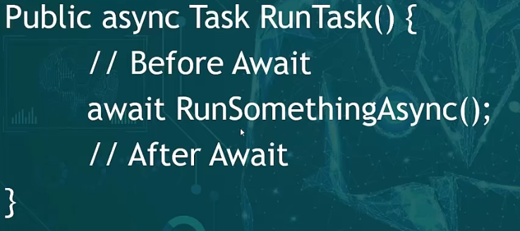

```cs
ConfigureAwait(IAsyncDisposable, Boolean)
```

配置如何执行从异步可处置项返回的任务的等待。




> 当执行`await`时，<font color="red">当前thread会被释放（即返回）</font>，并不会被阻塞在当前位置。

- 若布尔值传入true：

  执行`After Await`代码的线程，与`Before Await`的线程相同。

- 若为false：

  从线程池中获取一个线程执行。


