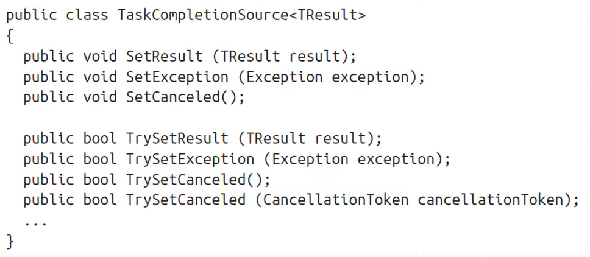

# Task类

- Task类，是一种相对高级的抽象：

  它代表了一个并发操作。

  > 该操作可能由Thread支持，也可能不是。

- Task是可组合的，可使用`Continuation`将他们串成链。
- Tasks，可以使用线程池来减少启动延迟。
- 使用`TaskCompletionSource`，Task可以利用回调的方式，在等待I/O绑定操作时完全避免Thread。

- Task类的Status属性，可用于追踪Task的执行状态。

> 总而言之，Task类，也是对任务动作的抽象。


- Task类，在`System.Threading.Tasks`名称空间下。


# Task.Run()

传入一个委托即可：

```CS
namespace Test;
class Progrm
{
    static void Main(string[] args)
    {
        Task.Run(() =>
        {
            Console.WriteLine("hello,Task");
        });
    }
}
```

>Task默认使用线程池（即<font color="red">后台线程</font>）。


`Task.Run()`，返回一个Task对象，可以用它来监视其过程。


# task.Wait()

调用Task对象的Wait()方法，将阻塞至任务完成。


# Long-running Task

- 默认情况下，CLR在线程池中运行Task，这适合于短时间运行的Compute-Bound任务。

- 针对于长时间运行的任务，或阻塞操作，<font color="Red">可以不采用线程池</font>：

  - `TaskCreationOptions.LongRunning`：

    ```cs
    namespace Test;
    class Progrm
    {
        static async Task Main(string[] args)
        {
            Task task = Task.Factory.StartNew(() =>
            {
                Thread.Sleep(3000);
                Console.WriteLine("Foo");
            },TaskCreationOptions.LongRunning);
        }
    }
    ```

  - 对于IO-Bound任务，使用`TaskCompletionSource和异步函数`，用回调代替线程：

    ```cs
    
    ```

  - 对于Compute-Bound，使用生产者、消费者队列，对任务的并发性进行限流，避免饿死其他线程和进程。

  

# Task的返回值

- Task有一个泛型子类：`Task<TResult>`，其允许一个返回值。

- 获取`Task<TResult>`:在向`Task.Run()`传递参数时：

  - 使用`Func<TResult>`委托：

    ```cs
    namespace Test;
    class Progrm
    {
        static async Task Main(string[] args)
        {
            Func<int> foo = delegate ()
            {
                return 1;
            };
            Task.Run(foo);
        }
    }
    ```

  - 使用兼容的Lambda表达式

    

- 通过`Task<TResult>`对象的Result属性，可阻塞获取返回值。


# Task的异常

- Thread中的异常，不能捕获其他线程中抛出的异常

  

- 在Task中， 异常传播很方便。在Task中抛出的异常，将传递给：

  - 调用`Wait()`的地方
  - 访问`Task<TResult>`的Result属性的地方

- 也可以选择通过`Task<T>`的IsFaulted和IsCanceled属性检测是否发生了异常，而不抛出。


# Continuation

- 用于为Task指定，在其结束的时候再进行其他的任务。
- Continuation，通常是通过回调的方式实现的。


```cs

```


## Awaiter对象

- 在Task对象上，调用GetAwaiter()会返回一个Awaiter对象。

- Awaiter对象的，`OnCompleted()`方法，会在Task对象结束或发生故障时执行委托。

  ```cs
  namespace Test;
  class Progrm
  {
      static async Task Main(string[] args)
      {
          Task<int> primeNumberTask = Task.Run(() =>
              Enumerable.Range(2, 300000).Count(n =>
                   Enumerable.Range(2, (int)Math.Sqrt(n) - 1)
                  .All(i => n % i > 0)
              )
          );
  
          var awaiter = primeNumberTask.GetAwaiter();
          awaiter.OnCompleted(() =>
          {
              int res = awaiter.GetResult();
              Console.WriteLine(res);
          });
  
          Console.WriteLine("done!");
          Console.ReadLine();
      }
  }
  ```

- 还有一种方式，使用Task对象的`ContinueWith()`：

  ```cs
  class Progrm
  {
      static async Task Main(string[] args)
      {
          Task<int> primeNumberTask = Task.Run(() =>
              Enumerable.Range(2, 300000).Count(n =>
                   Enumerable.Range(2, (int)Math.Sqrt(n) - 1)
                  .All(i => n % i > 0)
              )
          );
  
          primeNumberTask.ContinueWith(task =>
          {
              int res = task.Result;
              Console.WriteLine(res);
          });
  
          Console.WriteLine("done!");
          Console.ReadLine();
      }
  }
  ```

  

# TaskCompletionSource

- 对IO-Bound类型工作比较理想。
- 它创建的Task，并不创建线程。

- 使用`TaskCompletionSource`，也可以创建Task

  > 另一种方式是`Task.Run()`

  1. 初始化一个`TaskCompletionSource`实例

  2. 调用其Task属性，返回一个Task对象

     > 该Task对象完全被T.C.S对象控制

  3. 调用T.C.S对象的任意一个方法，将对Task对象发送一个信号

     


```cs
namespace Test;
class Progrm
{
    static async Task Main(string[] args)
    {
        var tcs = new TaskCompletionSource<int>();

        new Thread(() =>
        {
            Thread.Sleep(5000);
            tcs.SetResult(42);
        })
        {
            IsBackground = true
        }.Start();

        Task<int> task = tcs.Task;
        Console.WriteLine(task.Result);
    }
}
```


