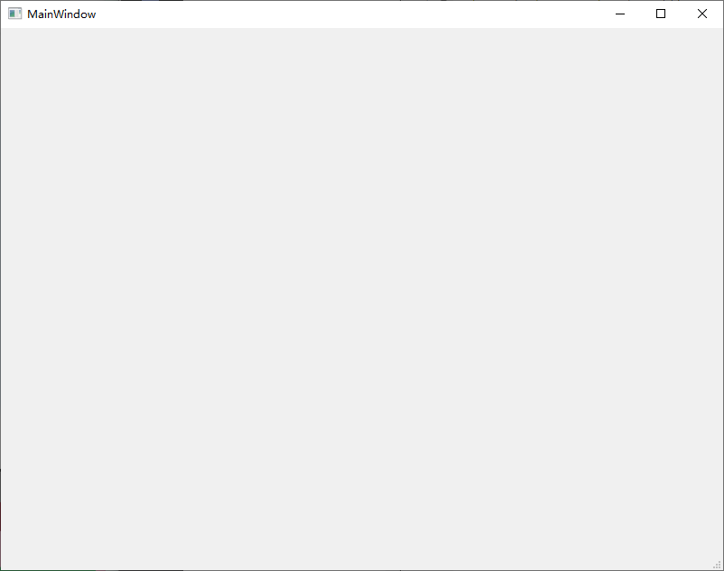

# QMainWindow

- `QMainWindow`，是 Qt 框架带来的一个预定义好的主窗口类。

  >主窗口的通常组成：
  >
  >- 标题栏
  >- 菜单栏
  >- 若干工具类
  >- 任务栏
  >- 工作区
  >
  >例如：
  >
  >

  

- 窗口的结构：

  

  - Window Title：标题栏，通常显示：

    - 标题
    - 控制按钮，如最大化、最小化、关闭

    >- 通常，各个图形界面框架都会使用操作系统本地代码来生成一个窗口。
    >- 如果你不喜欢本地样式，比如 QQ 这种，它其实是自己将标题栏绘制出来，这种技术称为 DirectUI，也就是无句柄绘制。

  - Menu Bar：菜单栏，用于菜单

  - Status Bar：

    当我们鼠标滑过某些组件时，可以在状态栏显示某些信息。比如浏览器中，鼠标滑过带有链接的文字，你会在底部看到链接的实际 URL。

  > 以上三个，是横向的栏。

  - Tool Bar **Area**：
    - 用于显示工具条区域。
    - Qt 的主窗口支持多个工具条。你可以将工具条拖放到不同的位置，因此这里说是 Area
  - Dock Widget Area：
    - 停靠窗口的显示区域

  - Central Widget：
    - 程序的工作区

- 对于一般的QT应用程序，主要是编写**主窗口代码**：

  向其添加各种组件（如菜单、工具类等）

- 通常我们的程序主窗口，会继承自`QMainWidnow`，从而获得各种便利的函数。