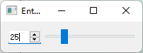

# 绝对定位

- 绝对定位就是使用最原始的定位方法，给出这个组件的坐标和长宽值。
- 但是，如果用户改变了窗口大小（如点击最大化或者拖动窗口边缘），需要：
  - 编写相应的函数来响应这些变化，以避免那些组件还只是静静地呆在一个角落
  - 或直接禁止用户改变大小


# 布局

Qt 提供了另外的一种机制，就是布局，来解决这个问题。你只要把组件放入某一种布局之中，当需要调整大小或者位置的时候，Qt 就知道该怎样进行调整。


Qt一共有三种主要的layout：

- QHBoxLayout：按照水平方向从左到右布局；
- QVBoxLayout：按照竖直方向从上到下布局；
- QGridLayout：在一个网格中进行布局，类似于HTML 的 table。


layout对象，可以：

- 使用addWidget()添加组件
- 使用addLayout添加子布局


## QHBoxLayout Demo

```C++
#include <QApplication>

#include<QWidget>
#include<QSpinBox>
#include<QSlider>
#include<QHBoxLayout>

int main(int argc, char *argv[])
{
    QApplication a(argc, argv);

    QWidget* window = new QWidget();
    window->setWindowTitle("Enter your age");

    QSpinBox* spinBox = new QSpinBox();
    QSlider* slider= new QSlider(Qt::Horizontal);
    spinBox->setRange(0,130);
    slider->setRange(0,130);

    QObject::connect(spinBox,SIGNAL(valueChanged(int)),slider,SLOT(setValue(int)));
    QObject::connect(slider,SIGNAL(valueChanged(int)),spinBox,SLOT(setValue(int)));

    spinBox->setValue(35);

    QHBoxLayout* layout = new QHBoxLayout();
    layout->addWidget(spinBox);
    layout->addWidget(slider);

    window->setLayout(layout);
    window->show();

    return a.exec();
}
```

> valueChanged()，仅会在新值与旧值不同时发出信号。
>
> 因此避免了无限递归的情况。

说明：

- QWidget：顶级窗口用
- QSpinBox：由上下箭头的微调器
- QSlider：滑动杆



- QHBoxLayout：

  水平布局，按照从左往右的顺序添加。

