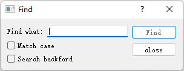

# Demo-查找对话框

> 创建工程时，Base Class选择QDialog，无需form。


效果图：



FindDialog.h如下：

```C++
#ifndef FIND_DIALOG_H
#define FIND_DIALOG_H

#include <QDialog>
class QCheckBox;
class QLabel;
class QLineEdit;
class QPushButton;

class FindDialog : public QDialog
{
    Q_OBJECT

public:
    FindDialog(QWidget* parent=0);
    ~FindDialog();

signals:
    void findNext(const QString& str, Qt::CaseSensitivity cs);
    void findPrevious(const QString& str, Qt::CaseSensitivity cs);

private slots:
    void findClicked();
    void enabledFindButton(const QString& text);

private:
    QLabel* label;
    QLineEdit* lineEdit;
    QCheckBox* caseCheckBox;
    QCheckBox* backwardCheckBox;
    QPushButton* findButton;
    QPushButton* closeButton;
};
#endif // FIND_DIALOG_H
```

说明：

- Q_OBJECT：

  一个宏。凡是定义信号槽的类，都必须声明这个宏。

- signals：

  >为Qt的关键字，Qt对C++进行了拓展，这是它独有的关键字。

  此示例中定义了两个public的信号：

  - 当用户点击了 Find 按钮，并且选中了 Search backward，就会发出 findPrevious()
  - 否则发出 findNext()

- private slots：

  定义了两个私有的槽


FindDialog.cpp如下：

```C++
#include<QtGui>
#include<QLabel>
#include<QLineEdit>
#include<QCheckBox>
#include<QPushButton>
#include<QHBoxLayout>

#include "FindDialog.h"

FindDialog::FindDialog(QWidget* parent)
    :QDialog(parent)
{
    this->label = new QLabel(tr("Find &what:"));
    this->lineEdit = new QLineEdit();
    label->setBuddy(lineEdit);

    this->caseCheckBox = new QCheckBox(tr("Match &case"));
    this->backwardCheckBox = new QCheckBox(tr("Search &backford"));

    this->findButton = new QPushButton(tr("&Find"));
    findButton->setDefault(true);
    findButton->setEnabled(false);

    this->closeButton = new QPushButton(tr("close"));

    connect(lineEdit,SIGNAL(textChanged(const QString&)),
            this,SLOT(enableFindButton(const QString&)));
    connect(findButton,SIGNAL(clicked()),this,SLOT(findClicked()));
    connect(closeButton,SIGNAL(clicked()),this,SLOT(close()));

    QHBoxLayout* topLeftLayout = new QHBoxLayout;
    topLeftLayout->addWidget(label);
    topLeftLayout->addWidget(lineEdit);

    QVBoxLayout* leftLayout = new QVBoxLayout;
    leftLayout->addLayout(topLeftLayout);
    leftLayout->addWidget(caseCheckBox);
    leftLayout->addWidget(backwardCheckBox);

    QVBoxLayout* rightLayout = new QVBoxLayout;
    rightLayout->addWidget(findButton);
    rightLayout->addWidget(closeButton);
    rightLayout->addStretch();

    QHBoxLayout* mainLayout = new QHBoxLayout;
    mainLayout->addLayout(leftLayout);
    mainLayout->addLayout(rightLayout);

    this->setWindowTitle(tr("Find"));
    this->setLayout(mainLayout);
    this->setFixedHeight(sizeHint().height());
}

FindDialog::~FindDialog(){

}

void FindDialog::findClicked(){
    QString text = lineEdit->text();
    Qt::CaseSensitivity cs = caseCheckBox->isChecked()?
                Qt::CaseInsensitive:
                Qt::CaseSensitive;

    if(backwardCheckBox->isChecked()){
        emit findPrevious(text,cs);
    }else{
        emit findNext(text,cs);
    }
}

void FindDialog::enableFindButton(const QString& text){
    findButton->setEnabled(!text.isEmpty());
}
```

说明：

- tr()

  全名是 QObject::tr()，被它处理的字符串可以使用工具提取出来翻译成其他语言，也就是做<u>国际化使用</u>。

  >所有使用了 Q_OBJECT 宏的类都自动具有 tr()函数

- 字符串中的&代表快捷键，按下快捷键后该元素获取焦点：

  - QLabel的快捷键：Alt+W
  - QButton的快捷键：Alt+F

- setBuddy()函数：

  `label->setBuddy(lineEdit);`，意味着当label获取焦点时，它的焦点会自动传递给它的buddy（伙伴）lineEdit

- 关于布局：

  

- setFixedHeight()：

  设置成固定的高度，其参数值 sizeHint()返回“最理想”的大小，这里我们使用的是 height()函数去到“最理想”的高度。

  

- 说明findClicked()函数：

  首先取出 lineEdit的输入值；然后判断 caseCheckBox是不是选中，如果选中就返回 Qt::CaseInsensitive，否则返回 Qt::CaseSensitive，用于判断是不是大小写敏感的查找；最后，如果 backwardCheckBox被选中，就 emit(发出)信号 findPrevious()，否则 emit信号 findNext。


main.cpp：

```C++
#include <QApplication>

#include "FindDialog.h"

int main(int argc, char *argv[])
{
    QApplication a(argc, argv);
    FindDialog* dialog = new FindDialog;
    dialog->show();
    return a.exec();
}
```

