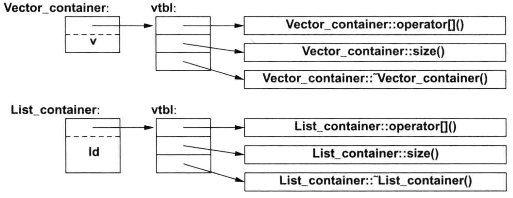

# 具体类

想对于使用独立的多个变量，类允许我们：

- 把具体类型的对象，置于栈、静态分配的内存或者其他对象中
- 直接引用对象（**而非仅仅通过指针或引用**）
- 创建对象后，立即进行完整的初始化（如构造函数）
- 拷贝对象


## std::initializer_list

通常用于定义 初始化器 构造函数。

编译器可以辨识它：当我们使用`{}`列表时，如`{1, 2, 3, 4}`，编译器会创建一个initializer_list类的对象并及将其提供给程序。

因此，我们可以书写：

```C++
Vector::Vector(std::initializer_list<double> lst)
	:elem(new double[lst.size()]),sz{lst.size()}
{
    copy(lst.begin(),lst.end(),elem);
}

Vector v1 = {1,2,3,4,5};
```


# RAII

Resource Acquisition Is Initialization（资源获取即初始化）：

- 在构造函数中请求资源
- 在析构函数中释放它们


# 抽象类

- 形如complex和vector等类型，之所被称为具体类型，是因为它们的表现形式，属于定义的一部分。

- 而抽象类型，则将使用者于类的实现部分完全隔离开来。

  **不允许，存在抽象类的实例。只能通过引用或指针，访问子类实例**。


## 虚函数

使用虚函数的类，其对象必须包含一些有助于它**在运行时**选择正确函数的信息。

常见的做法是，让编译器将虚函数的名字，转换成函数指针表中对应的索引值。

> 这张表，即为所谓的虚函数表(virutal function table, vtbl)

每个含有虚函数的类，都由它自己的vtbl，用于辨识虚函数。





调用函数的实现，只需知道vtbl，以及每个虚函数对应的索引就可以正确调用。


虚函数的空间开销：

- 若类中含有虚函数，该类的每个对象需要一个额外的vptr
- 若类中含有虚函数，该类需要一个vtbl。


# 类层次

类层次，即为通过派生创建的一组类。


类层次，提供了两种便利：

- 接口继承：

  派生类对象，可以被用在任何需要基类对象的地方。

- 实现继承：

  基类负责提供可以简化派生类实现的函数或数据。


