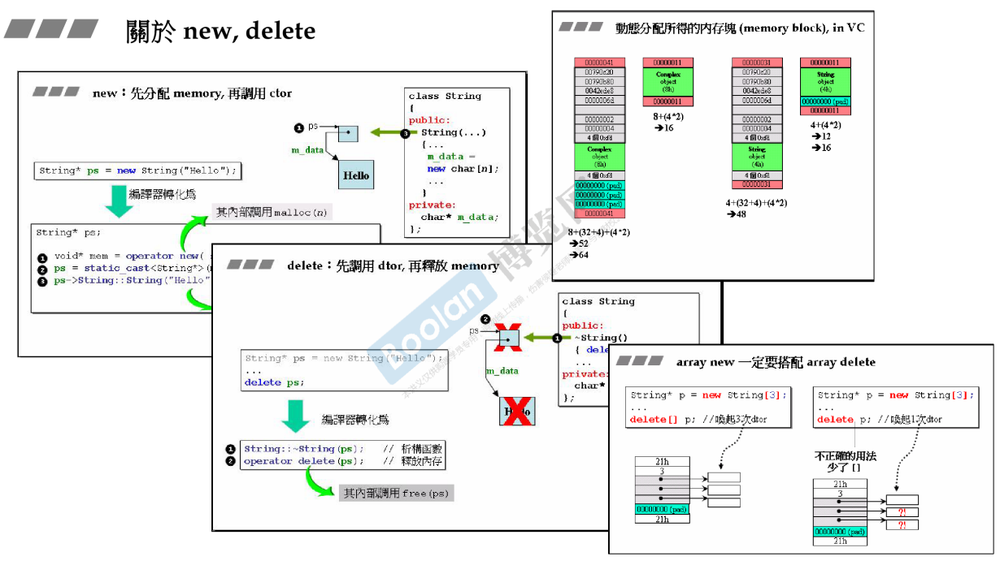
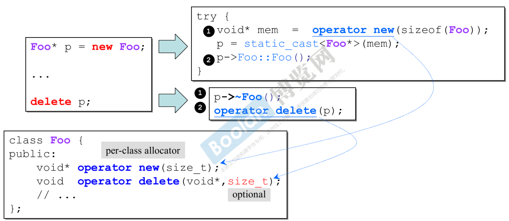
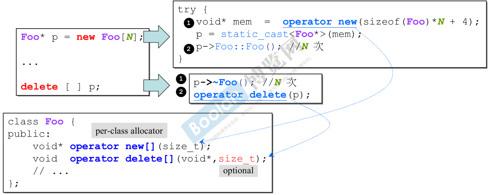

# new expression 与 operator new

程序员使用的是new expression，而表达式将被分解为三部分：

1. 使用operator new分配空间，得到void*类型指针
2. 对指针进行static_cast转型
3. 调用初始化方法

同理，delete expression，将被分解为：

1. 调用析构函数
2. 使用operator delete释放空间

# 重载operator new/delete

> 可以对operator new 进行重载。
>
> 但该函数是为编译器准备的。

# 重载member operator new/delete

# 重载的案例

