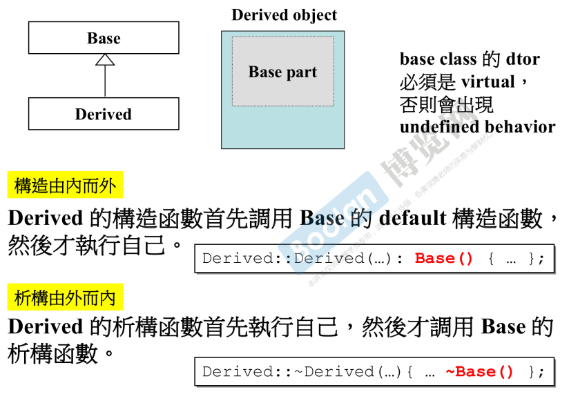
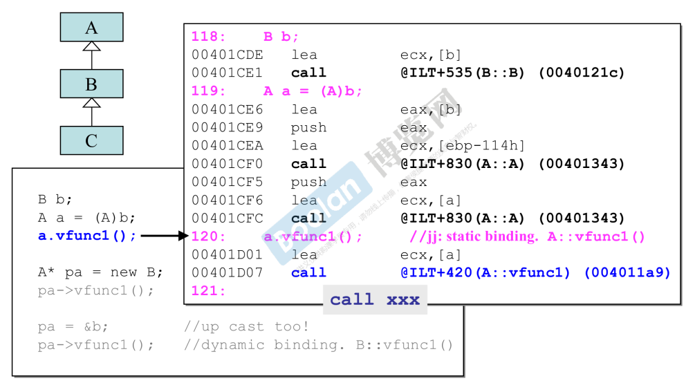

# 构造与析构的执行顺序

## Composition（复合）关系下


> 红色代码，为编译器所添加内容


## Inheritance（继承）关系下




## Inheritance+Composition


# vptr和vtbl

>- vptr：虚指针
>- vtbl：虚表
>
>> 都是代码层面所观察不到的，由编译器为实现对象模型而添加的


当**类中存在虚函数时**，该类的对象需要存储：

- 数据部分

- **还需要存储一个指针vptr**，指向该类的虚表vtbl。

  > 在tbl中，存储着该类的虚函数，对应的地址。

  > 在Java中，类的方法都是虚函数。
  >
  > 而在C++中，需要使用关键字virtual指明。


💡总结：关于方法：

- 非虚方法：
  - 子类有该方法（考虑继承权限）
  - **通过静态绑定调用**
- 虚方法：
  - 子类有该方法（考虑继承权限）
  - **通过动态绑定调用**，利用vptr和vtbl实现

例如：

```C++
base* b = new derived();
b->vfun();
b->fun();
```

其中：

- vfun()
  - 是一个虚函数，方法的调用通过动态绑定确定
  - 将调用derived类的vfun()方法，若derived类未重写该方法，将使用从base类继承下来的方法。
- fun()
  - 是一个非虚函数，方法的调用通过静态绑定
  - 将调用指针b所对应类型base的fun()方法。


# dynamic binding三要素

> 多态的三要素：
>
> - 通过指针调用
>
>   > 反例： A a = (A)B，将使用静态绑定
>
> - 父类型指针，指向子元素
>
> - 被调用方法为虚函数





# 关于this


> 注意考虑：
>
> - 方法调用时，传入的this实参类型；
> - 与方法声明的形参类型