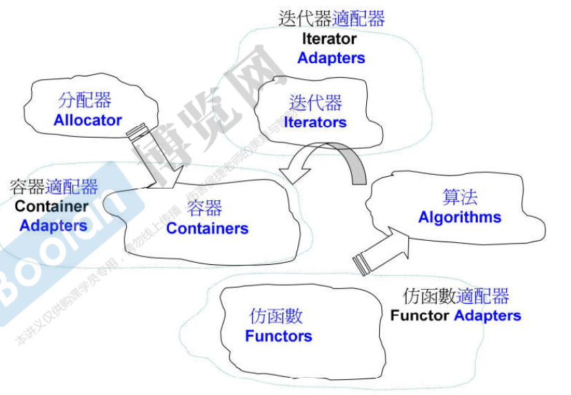
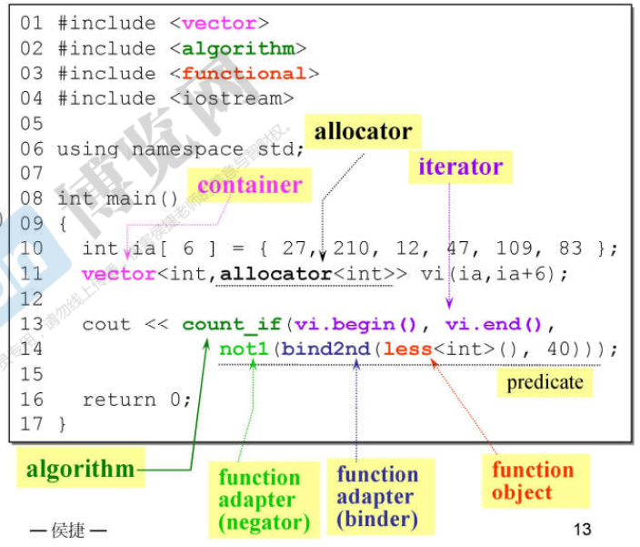
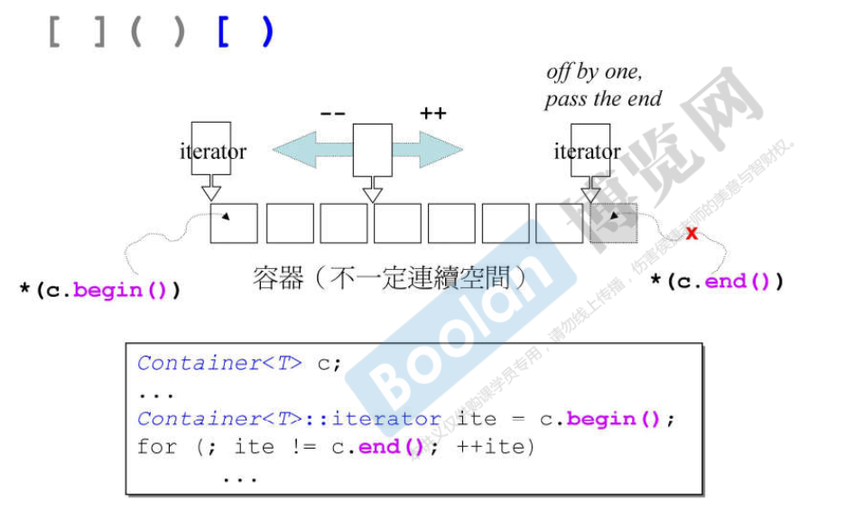
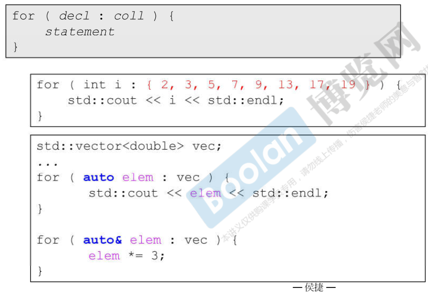

> 即Stand Template Library，C++标准库（Stand Library）的主要、核心部分。


# STL六大组件

- 容器（Containers）
- 分配器（Allocators）
- 算法（Algorithms）
- 迭代器（Iterators）
- 适配器（Adapters）
- 仿函数（Functors）





## Demo



```C++
#include <iostream>
#include <vector>
#include <algorithm>
#include <functional>

using namespace std;

int main() {
	int ia[6] = { 27,210,12,47,109,83 };
	vector<int, allocator<int>> vi(ia, ia + 6);

    // 大于等于40的数量
	cout << count_if(vi.begin(), vi.end(),
			not1(bind2nd(less<int>(), 40)));

	return 0;
}
```


# 迭代器

## 前闭后开区间



容器的最后一个元素，充当**哨兵作用**。


## 使用范围for循环

