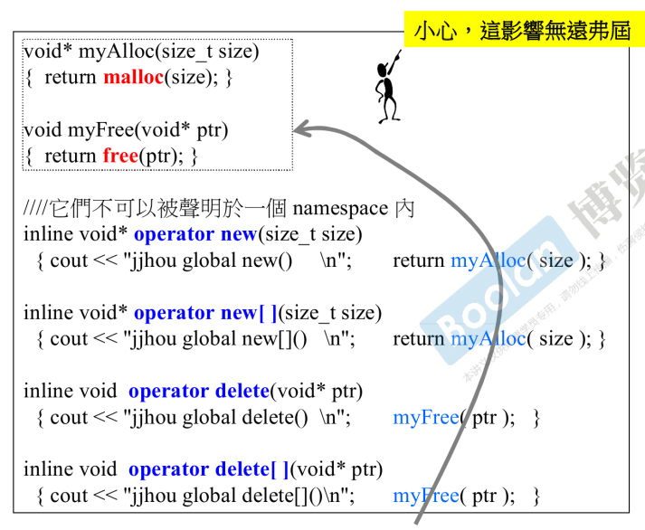
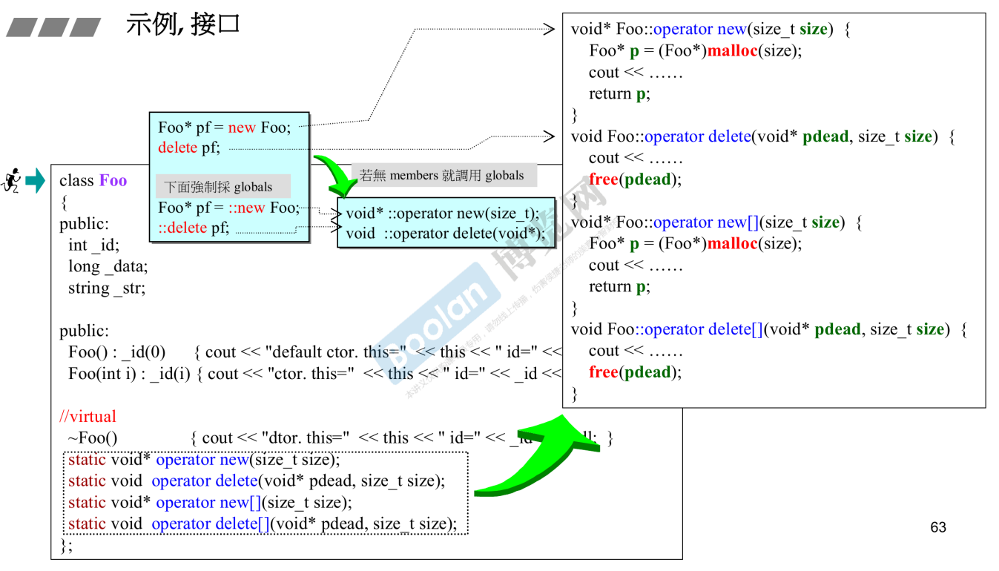
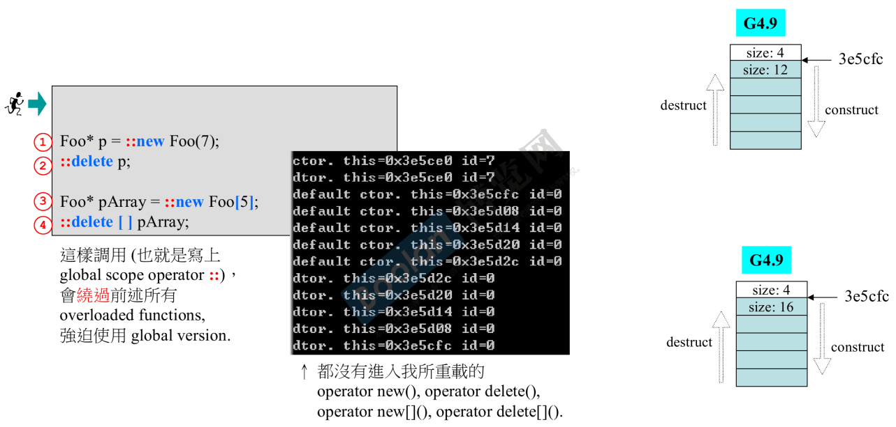
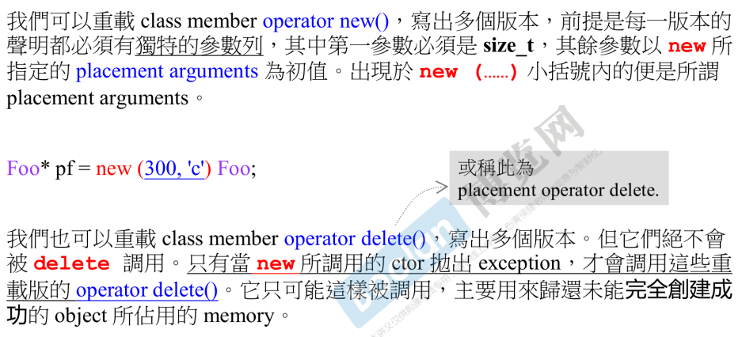
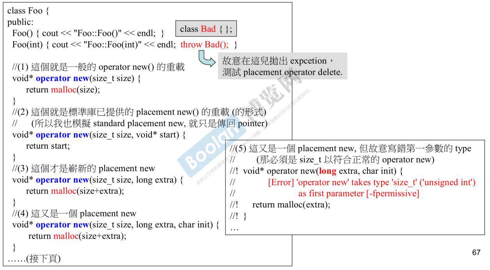

# new expression 与 operator new

程序员使用的是new expression，而表达式将被分解为三部分：

1. 使用operator new分配空间，得到void*类型指针
2. 对指针进行static_cast转型
3. 调用初始化方法

同理，delete expression，将被分解为：

1. 调用析构函数
2. 使用operator delete释放空间

# 重载operator new/delete

> 可以对operator new 进行重载。
>
> 但该函数是为编译器准备的。

# 重载member operator new/delete

# 重载的案例

使用`::new`，可强制使用global域的operator new

# 重载operator new与placement arguments

总结：

- new 和 delete，都可以有附带placement arguments的重载形式

  - 可以通过new(xxx) obj()的方式手动调用

  - 但不允许手动调用delete(xxx) ptr。

    > operator new后会调用构造函数，若构造函数抛出异常，则调用对应此operator new的operator delete

- 如果某个operator new(...)没有对应的operator delete(...)也不会报错，这意味着你放弃对ctor抛出的异常进行处理

# basic_string使用new(*extra*)扩充申请量

