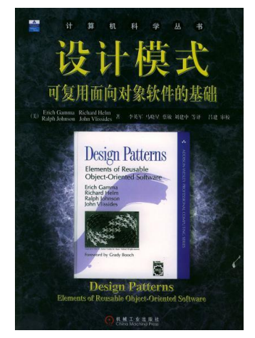
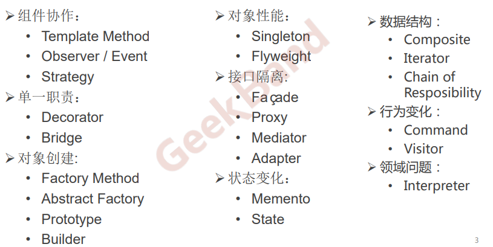
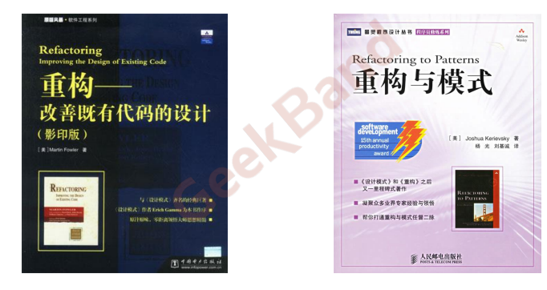

# 目标

- 理解松耦合设计思想
- 掌握面向对象设计原则
- 掌握重构技法改善设计
- 掌握GOF 核心设计模式

# 推荐书籍

# 软件设计的变化

- 客户需求的变化
- 技术平台的变化
- 开发团队的变化
- 市场环境的变化
- ...

# 如何应对变更带来的复杂性

- 分解：

  **分而治之**（大量的分支选择），将大问题分 解为多个小问题，将复杂问题分解为多个简单问题。

- 抽象：

  更高层次来讲，人们处理复杂性有一个**通用的技术**，即抽象。

  由于不能掌握全部的复杂对象，我们选择忽视它的非本质细节， 而去处理泛化和理想化了的对象模型。

# 软件设计的目标

**提高代码的复用性**，降低修改

# 设计模式分类

从目的上看：

- 创建型（Creational）模式：

  将对象的部分创建工作延迟到子类或者其他对象，从而应对**需求变化为对象创建时**具体类型实现引来的冲击。

- 结构型（Structural）模式：

  通过类继承或者对象组合获得更灵活的结构，从而应对**需求变化为对象的结构**带来的冲击。

- 行为型（Behavioral）模式：

  通过类继承或者对象组合来划分 类与对象间的职责，从而应对**需求变化为多个交互的对象**带来的冲击。

从范围（或实现角度）上看：

- 类模式处理类与子类的静态关系。（偏向继承关系）
- 对象模式处理对象间的动态关系。（偏向组合关系）

从封装变化角度看：

# 重构

## 推荐书籍

## 技法

- 静态绑定 -> 动态绑定
- 早绑定 -> 晚绑定
- 继承 -> 组合
- 编译时依赖 -> 运行时依赖
- 紧耦合 -> 松耦合