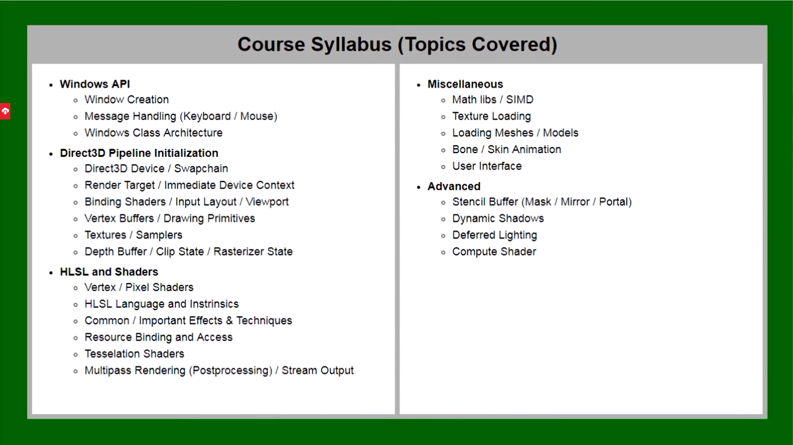

# 相关资料

- [C++ 3D DirectX Tutorial Introduction\] 0 - YouTube](https://www.youtube.com/watch?v=_4FArgOX1I4&list=PLqCJpWy5Fohd3S7ICFXwUomYW0Wv67pDD)

- [【人工听译】Directx3D11入门详细教程_哔哩哔哩_bilibili](https://www.bilibili.com/video/BV1KC4y1Y7tc?spm_id_from=333.337.search-card.all.click&vd_source=be746efb77e979ca275e4f65f2d8cda3)

- github仓库名：hw3d


- [Win32 和 C++ 入门 - Win32 apps | Microsoft Docs](https://docs.microsoft.com/zh-cn/windows/win32/learnwin32/learn-to-program-for-windows)





# VS项目设置

- C/C++ -> 常规 -> 启用多处理器编译
- 优化 -> 优选速度优先
- C/C++ -> 代码生成 -> 浮点类型：快

- 链接器 -> 系统 -> 子系统：窗口


# 关于EntryPoint

```cpp
#include <Windows.h>

int CALLBACK WinMain(
	HINSTANCE	hInstance,
	HINSTANCE	hPrevInstance,
	LPSTR		lpCmdLine,
	int			nCmdShow) 
{

}
```

