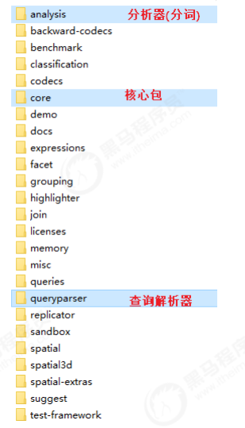
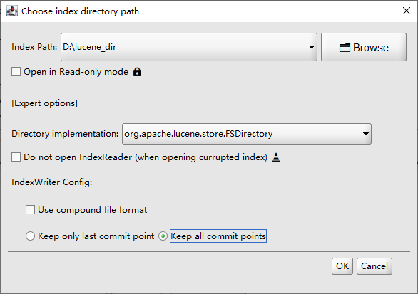

# 相关资料

- [链接](https://www.bilibili.com/video/BV1eJ411q7nw?p=7)


# Lucene入门

## 准备

- 资料：lucene.zip

- 核心文件：

  


## 创建项目

maven项目，pom.xml如下：
```xml
<parent>
    <groupId>org.springframework.boot</groupId>
    <artifactId>spring-boot-starter-parent</artifactId>
    <version>2.1.4.RELEASE</version>
</parent>
<dependencies>
    <dependency>
        <groupId>commons-io</groupId>
        <artifactId>commons-io</artifactId>
        <version>2.6</version>
    </dependency>
    <dependency>
        <groupId>org.apache.lucene</groupId>
        <artifactId>lucene-core</artifactId>
        <version>7.7.2</version>
    </dependency>
    <dependency>
        <groupId>org.apache.lucene</groupId>
        <artifactId>lucene-analyzers-common</artifactId>
        <version>7.7.2</version>
    </dependency>
    <dependency>
    <groupId>org.apache.lucene</groupId>
    <artifactId>lucene-queryparser</artifactId>

    </dependency>
    <!-- 测试 -->
    <dependency>
        <groupId>junit</groupId>
        <artifactId>junit</artifactId>
        <version>4.12</version>
        <scope>test</scope>
    </dependency>
    <!-- mysql数据库驱动 -->
    <dependency>
        <groupId>mysql</groupId>
        <artifactId>mysql-connector-java</artifactId>
        <version>5.1.48</version>
    </dependency>
    <!-- IK中文分词器 -->
    <dependency>
        <groupId>org.wltea.ik-analyzer</groupId>
        <artifactId>ik-analyzer</artifactId>
        <version>8.1.0</version>
    </dependency>
    <!--web起步依赖-->
    <dependency>
        <groupId>org.springframework.boot</groupId>
        <artifactId>spring-boot-starter-web</artifactId>
    </dependency>
    <!-- 引入thymeleaf -->
    <dependency>
        <groupId>org.springframework.boot</groupId>
        <artifactId>spring-boot-starter-thymeleaf</artifactId>
    </dependency>
    <!-- Json转换工具 -->
    <dependency>
        <groupId>com.alibaba</groupId>
        <artifactId>fastjson</artifactId>
        <version>1.2.51</version>
    </dependency>
</dependencies>
```


## 创建索引库

1. 采集数据
2. 创建文档对象
3. 创建分词器对象
4. 创建Directory对象（用于表示索引库位置）
5. 创建IndexWriterConfig对象（用于指定切分词使用的分词器）
6. 创建IndexWriter输出流对象（用于指定输出的位置和使用的Config初始化对象）
7. 写入文档到索引库
8. 释放资源


```java
import org.apache.lucene.analysis.Analyzer;
import org.apache.lucene.analysis.standard.StandardAnalyzer;
import org.apache.lucene.document.Document;
import org.apache.lucene.document.Field;
import org.apache.lucene.document.TextField;
import org.apache.lucene.index.IndexWriter;
import org.apache.lucene.index.IndexWriterConfig;
import org.apache.lucene.store.Directory;
import org.apache.lucene.store.FSDirectory;
import org.example.dao.SkuDao;
import org.example.dao.SkuDaoImpl;
import org.example.pojo.Sku;
import org.junit.Test;

import java.io.IOException;
import java.nio.file.Paths;
import java.util.ArrayList;
import java.util.List;

public class TestIndexManager {

    /*
     * 创建索引库：
     * 1. 采集数据
     * 2. 创建文档对象
     * 3. 创建分词器对象
     * 4. 创建Directory对象（用于表示索引库位置）
     * 5. 创建IndexWriterConfig对象（用于指定切分词使用的分词器）
     * 6. 创建IndexWriter输出流对象（用于指定输出的位置和使用的Config初始化对象）
     * 7. 写入文档到索引库
     * 8. 释放资源
     * */
    @Test
    public void createIndexTest() throws IOException {
        SkuDao skuDao = new SkuDaoImpl();
        List<Sku> skuList = skuDao.querySkuList();

        List<Document> docList = new ArrayList<>();
        skuList.forEach(sku -> {
            Document document = new Document();

            //创建域对象
            document.add(new TextField("id", sku.getId(), Field.Store.YES));
            document.add(new TextField("name", sku.getName(), Field.Store.YES));
            document.add(new TextField("price", String.valueOf(sku.getPrice()), Field.Store.YES));
            document.add(new TextField("image", sku.getImage(), Field.Store.YES));
            document.add(new TextField("categoryName", sku.getCategoryName(), Field.Store.YES));
            document.add(new TextField("brandName", sku.getBrandName(), Field.Store.YES));

            docList.add(document);
        });

        // 标准分词器，对中文按单字分词
        Analyzer analyzer = new StandardAnalyzer();
        Directory dir = FSDirectory.open(Paths.get("D:\\lucene_dir"));
        IndexWriterConfig config = new IndexWriterConfig(analyzer);
        IndexWriter indexWriter = new IndexWriter(dir, config);

        docList.forEach(doc -> {
            try {
                indexWriter.addDocument(doc);
            } catch (IOException e) {
                e.printStackTrace();
            }
        });

        indexWriter.close();
    }
}
```


## 查看索引库文件内容

使用Luke查看




## 搜索过程

```java
import org.apache.lucene.analysis.Analyzer;
import org.apache.lucene.analysis.standard.StandardAnalyzer;
import org.apache.lucene.document.Document;
import org.apache.lucene.index.DirectoryReader;
import org.apache.lucene.index.IndexReader;
import org.apache.lucene.queryparser.classic.ParseException;
import org.apache.lucene.queryparser.classic.QueryParser;
import org.apache.lucene.search.IndexSearcher;
import org.apache.lucene.search.Query;
import org.apache.lucene.search.ScoreDoc;
import org.apache.lucene.search.TopDocs;
import org.apache.lucene.store.Directory;
import org.apache.lucene.store.FSDirectory;
import org.junit.Test;

import java.io.IOException;
import java.nio.file.Paths;

public class TestSearch {


    /*
     * 测试搜索过程：
     * 1. 创建分词器（对搜索关键词进行分词）
     * 2. 创建查询对象
     * 3. 设置搜索关键词
     * 4. 创建Directory对象（指定索引库位置）
     * 5. 创建输入流对象
     * 6. 创建搜索对象
     * 7. 搜索，并返回结果
     * 8. 获取结果集
     * 9. 关闭资源
     * */
    @Test
    public void testIndexSearch() throws ParseException, IOException {
        Analyzer analyzer = new StandardAnalyzer();

        QueryParser queryParser = new QueryParser("name", analyzer); // 默认查询域
        Query query = queryParser.parse("华为手机");//设置查询条件

        Directory dir = FSDirectory.open(Paths.get("D:\\lucene_dir"));
        IndexReader indexReader = DirectoryReader.open(dir);
        IndexSearcher indexSearcher = new IndexSearcher(indexReader);
        TopDocs topDocs = indexSearcher.search(query, 10);// 分页返回10条数据

        // 处理结果集
        for (ScoreDoc scoreDoc : topDocs.scoreDocs) {
            int docID = scoreDoc.doc;
            Document doc = indexSearcher.doc(docID);
            System.out.println("-------------------------------------------------------------");
            System.out.println("id:"+doc.get("id"));
            System.out.println("name:"+doc.get("name"));
            System.out.println("price:"+doc.get("price"));
            System.out.println("image:"+doc.get("image"));
            System.out.println("brandName:"+doc.get("brandName"));
            System.out.println("categoryName:"+doc.get("categoryName"));
        }

        long totalHits = topDocs.totalHits; //结果集总数
    }
}
```


# Field域

[黑马程序员Lucene全文检索技术，从底层到实战应用Lucene全套教程_哔哩哔哩_bilibili](https://www.bilibili.com/video/BV1eJ411q7nw?p=16&spm_id_from=pageDriver)