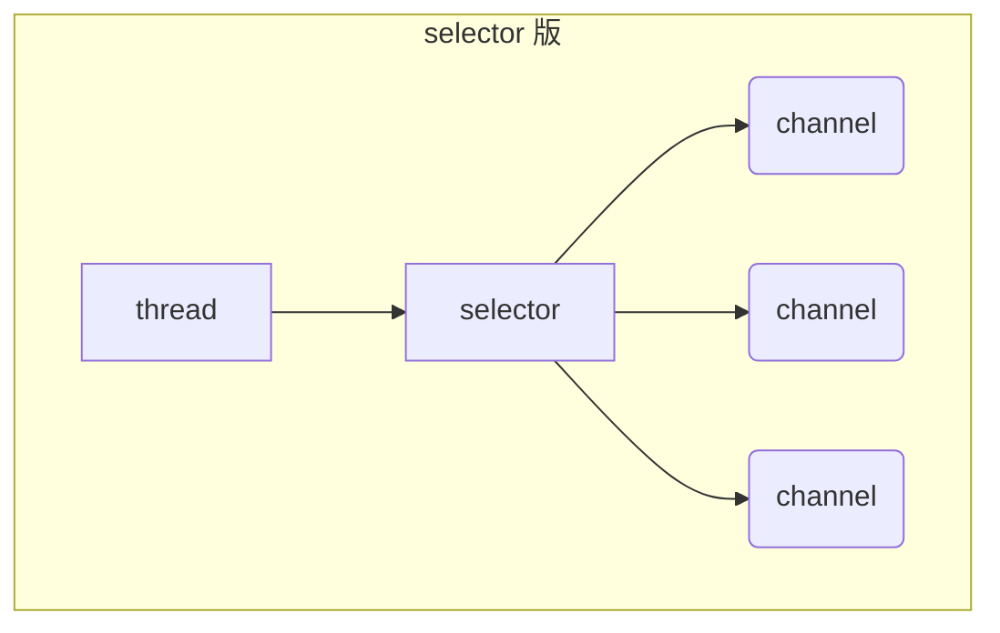
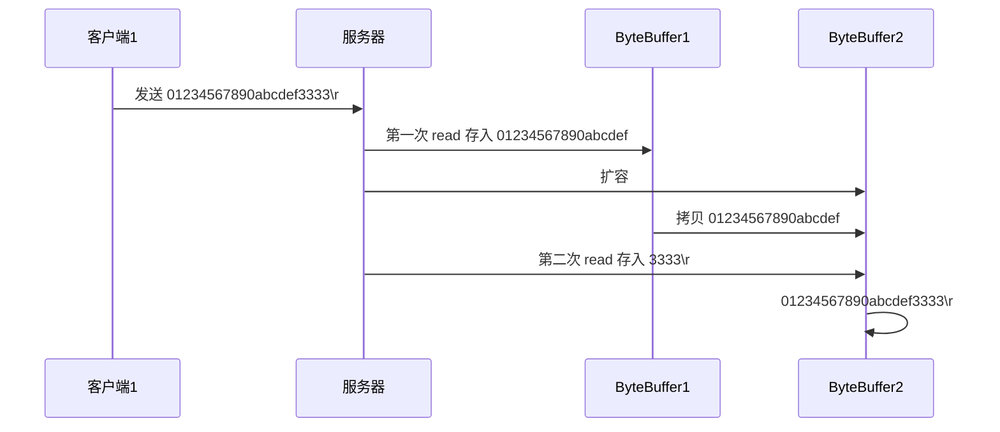

# NIO

> non-blocking io：即非阻塞 IO


# 三大组件

## Channel & Buffer

Channel类似于Stream（流），但***Channel是读写数据的双向通道***。

- 可以从Channel将数据读入Buffer
- 也可以从Buffer读出数据到Channel

> - InputStream 和 OutputStream 是***单向***的
> - Channel 比 Stream 更为底层


常见的Channel，有：

- FileChannel
- DatagramChannel：UDP网络编程时使用的通道
- SocketChannel：TCP，客户端和服务器端都可
- ServerSocketChannel：TCP，专用于服务器端


Buffer 则***用来缓冲Channel的读写数据***，常见的 buffer 有：

- **ByteBuffer**（抽象类）
  * MappedByteBuffer
  * DirectByteBuffer
  * HeapByteBuffer
- ShortBuffer
- IntBuffer
- LongBuffer
- FloatBuffer
- DoubleBuffer
- CharBuffer


## Selector

selector 单从字面意思不好理解，需要结合服务器的设计演化来理解它的用途

1. 多线程的设计：

   ```mermaid
   graph TD
   subgraph 多线程版
   t1(thread) --> s1(socket1)
   t2(thread) --> s2(socket2)
   t3(thread) --> s3(socket3)
   end
   ```

   - 说明：每个客户端和服务器端分别建立一条socket连接，服务器端同时新建对应的线程从对应的socket中进行读写
   - 缺点：
     - 内存占用高
     - 线程上下文切换成本高
     - 只适合连接数少的场景

2. 线程池版的设计：

   ```mermaid
   graph TD
   subgraph 线程池版
   t4(thread) --> s4(socket1)
   t5(thread) --> s5(socket2)
   t4(thread) -.-> s6(socket3)
   t5(thread) -.-> s7(socket4)
   end
   ```

   - 说明：对线程进行复用。

   - 缺点：

     - socker API阻塞模式下，一个线程仅能同时处理一个 socket 连接

       也就是说，只有当socket1断开连接后，socket3才能被线程服务。

       ***导致线程的利用率不高***（一个socket可以占用一个线程，但却不做事）

     - 仅适合<u>短连接</u>的场景

3. selector 版的设计：

   ```mermaid
   graph TD
   subgraph selector 版
   thread --> selector
   selector --> c1(channel)
   selector --> c2(channel)
   selector --> c3(channel)
   end
   ```

   ***selector 的作用就是配合一个线程来管理多个 channel***，获取这些 channel 上发生的事件(分为可连接、可读、可写），这些 channel 工作在<u>***非阻塞模式***</u>下，不会让线程吊死在一个 channel 上。<u>适合连接数特别多，但流量低的场景</u>（low traffic）


   ***调用 selector 的 select() 会阻塞直到 channel 发生了读写就绪事件，这些事件发生，select 方法就会返回这些事件交给 thread 来处理***


# 项目依赖

```xml
<dependencies>
    <dependency>
        <groupId>io.netty</groupId>
        <artifactId>netty-all</artifactId>
        <version>4.1.39.Final</version>
    </dependency>

    <dependency>
        <groupId>org.projectlombok</groupId>
        <artifactId>lombok</artifactId>
        <version>1.18.10</version>
    </dependency>
    <dependency>
        <groupId>com.google.code.gson</groupId>
        <artifactId>gson</artifactId>
        <version>2.8.5</version>
    </dependency>

    <dependency>
        <groupId>com.google.guava</groupId>
        <artifactId>guava</artifactId>
        <version>19.0</version>
    </dependency>
    <dependency>
        <groupId>ch.qos.logback</groupId>
        <artifactId>logback-classic</artifactId>
        <version>1.2.3</version>
    </dependency>
</dependencies>
```


# logback配置文件

> 位于resource目录下

```xml
<?xml version="1.0" encoding="UTF-8"?>
<configuration
        xmlns="http://ch.qos.logback/xml/ns/logback"
        xmlns:xsi="http://www.w3.org/2001/XMLSchema-instance"
        xsi:schemaLocation="http://ch.qos.logback/xml/ns/logback logback.xsd">
    <!-- 输出控制，格式控制-->
    <appender name="STDOUT" class="ch.qos.logback.core.ConsoleAppender">
        <encoder>
            <pattern>%date{HH:mm:ss} [%-5level] [%thread] %logger{17} - %m%n </pattern>
        </encoder>
    </appender>
    <appender name="FILE" class="ch.qos.logback.core.rolling.RollingFileAppender">
        <!-- 日志文件名称 -->
        <file>logFile.log</file>
        <rollingPolicy class="ch.qos.logback.core.rolling.TimeBasedRollingPolicy">
            <!-- 每天产生一个新的日志文件 -->
            <fileNamePattern>logFile.%d{yyyy-MM-dd}.log</fileNamePattern>
            <!-- 保留 15 天的日志 -->
            <maxHistory>15</maxHistory>
        </rollingPolicy>
        <encoder>
            <pattern>%date{HH:mm:ss} [%-5level] [%thread] %logger{17} - %m%n </pattern>
        </encoder>
    </appender>

    <!-- 用来控制查看那个类的日志内容（对mybatis name 代表命名空间） -->
    <logger name="org.example" level="DEBUG" additivity="false">
        <appender-ref ref="STDOUT"/>
    </logger>

    <logger name="io.netty.handler.logging.LoggingHandler" level="DEBUG" additivity="false">
        <appender-ref ref="STDOUT"/>
    </logger>

    <root level="ERROR">
        <appender-ref ref="STDOUT"/>
    </root>
</configuration>
```


# ByteBuffer

## ByteBuffer与Channel的使用入门

```java
@Slf4j
public class TestByteBuffer {
    public static void main(String[] args) {

        try (FileChannel channel = new FileInputStream("data.txt").getChannel()) {
            //准备缓冲区，即ByteBuffer
            ByteBuffer buffer = ByteBuffer.allocate(10);

            while (true) {
                //从 channel 中读取数据；写入到 buffer 中
                int len = channel.read(buffer); //返回值-1，表示已读取到文件末尾
                log.debug("本次读取到的字节数：{}", len);
                if (len == -1) {
                    break;
                }

                buffer.flip();      //将buffer切换到 读模式
                while (buffer.hasRemaining()) {
                    byte b = buffer.get();
                    log.debug("\t本次获取的字节为：{}", (char) b);
                }

                buffer.clear();     //将buffer切换到 写模式
            }
        } catch (IOException e) {}
    }
}
```


## ByteBuffer的正确使用套路

1. 向 buffer 写入数据，例如调用 channel.read(buffer)
2. 调用 flip() 切换至**读模式**
3. 从 buffer 读取数据，例如调用 buffer.get()
4. 调用 clear() 或 compact() 切换至**写模式**
5. 重复 1~4 步骤


## ByteBuffer的内部结构

ByteBuffer 有以下重要属性：

* capacity
* position：***读写指针***
* limit


1. 一开始（刚创建时）

   

2. 写模式下，position 是写入位置，limit 等于容量，下图表示写入了 4 个字节后的状态

   > ByteBuffer创建后，默认处于写模式

   

3. ***flip 动作发生后，position 切换为读取位置，limit 切换为读取限制***

   

4. 读取 4 个字节后，状态

   

5. clear 动作发生后，状态

   

6. compact 方法，是把未读完的部分向前压缩，然后切换至写模式

   

   

> clear和compat都会切换到写模式，但：
>
> - clear：将从头开始写，未读取的数据将丢失
> - compat：保留未读的数据，在其位置后继续写入


### flip、clear、compat总结

flip和clear、compat都可以将读写状态翻转，但：

- flip：翻转为读状态

- clear、compat翻转为写状态

  但：clear会清空剩余数据；compat会保留剩余数据

  > 默认状态为写状态

- 


### ByteBuffer调试工具类

```java
import io.netty.util.internal.StringUtil;

import java.nio.ByteBuffer;

import static io.netty.util.internal.MathUtil.isOutOfBounds;
import static io.netty.util.internal.StringUtil.NEWLINE;

public class ByteBufferUtil {
    private static final char[] BYTE2CHAR = new char[256];
    private static final char[] HEXDUMP_TABLE = new char[256 * 4];
    private static final String[] HEXPADDING = new String[16];
    private static final String[] HEXDUMP_ROWPREFIXES = new String[65536 >>> 4];
    private static final String[] BYTE2HEX = new String[256];
    private static final String[] BYTEPADDING = new String[16];

    static {
        final char[] DIGITS = "0123456789abcdef".toCharArray();
        for (int i = 0; i < 256; i++) {
            HEXDUMP_TABLE[i << 1] = DIGITS[i >>> 4 & 0x0F];
            HEXDUMP_TABLE[(i << 1) + 1] = DIGITS[i & 0x0F];
        }

        int i;

        // Generate the lookup table for hex dump paddings
        for (i = 0; i < HEXPADDING.length; i++) {
            int padding = HEXPADDING.length - i;
            StringBuilder buf = new StringBuilder(padding * 3);
            for (int j = 0; j < padding; j++) {
                buf.append("   ");
            }
            HEXPADDING[i] = buf.toString();
        }

        // Generate the lookup table for the start-offset header in each row (up to 64KiB).
        for (i = 0; i < HEXDUMP_ROWPREFIXES.length; i++) {
            StringBuilder buf = new StringBuilder(12);
            buf.append(NEWLINE);
            buf.append(Long.toHexString(i << 4 & 0xFFFFFFFFL | 0x100000000L));
            buf.setCharAt(buf.length() - 9, '|');
            buf.append('|');
            HEXDUMP_ROWPREFIXES[i] = buf.toString();
        }

        // Generate the lookup table for byte-to-hex-dump conversion
        for (i = 0; i < BYTE2HEX.length; i++) {
            BYTE2HEX[i] = ' ' + StringUtil.byteToHexStringPadded(i);
        }

        // Generate the lookup table for byte dump paddings
        for (i = 0; i < BYTEPADDING.length; i++) {
            int padding = BYTEPADDING.length - i;
            StringBuilder buf = new StringBuilder(padding);
            for (int j = 0; j < padding; j++) {
                buf.append(' ');
            }
            BYTEPADDING[i] = buf.toString();
        }

        // Generate the lookup table for byte-to-char conversion
        for (i = 0; i < BYTE2CHAR.length; i++) {
            if (i <= 0x1f || i >= 0x7f) {
                BYTE2CHAR[i] = '.';
            } else {
                BYTE2CHAR[i] = (char) i;
            }
        }
    }

    /**
     * 打印所有内容
     * @param buffer
     */
    public static void debugAll(ByteBuffer buffer) {
        int oldlimit = buffer.limit();
        buffer.limit(buffer.capacity());
        StringBuilder origin = new StringBuilder(256);
        appendPrettyHexDump(origin, buffer, 0, buffer.capacity());
        System.out.println("+--------+-------------------- all ------------------------+----------------+");
        System.out.printf("position: [%d], limit: [%d]\n", buffer.position(), oldlimit);
        System.out.println(origin);
        buffer.limit(oldlimit);
    }

    /**
     * 打印可读取内容
     * @param buffer
     */
    public static void debugRead(ByteBuffer buffer) {
        StringBuilder builder = new StringBuilder(256);
        appendPrettyHexDump(builder, buffer, buffer.position(), buffer.limit() - buffer.position());
        System.out.println("+--------+-------------------- read -----------------------+----------------+");
        System.out.printf("position: [%d], limit: [%d]\n", buffer.position(), buffer.limit());
        System.out.println(builder);
    }

    private static void appendPrettyHexDump(StringBuilder dump, ByteBuffer buf, int offset, int length) {
        if (isOutOfBounds(offset, length, buf.capacity())) {
            throw new IndexOutOfBoundsException(
                    "expected: " + "0 <= offset(" + offset + ") <= offset + length(" + length
                            + ") <= " + "buf.capacity(" + buf.capacity() + ')');
        }
        if (length == 0) {
            return;
        }
        dump.append(
                "         +-------------------------------------------------+" +
                        NEWLINE + "         |  0  1  2  3  4  5  6  7  8  9  a  b  c  d  e  f |" +
                        NEWLINE + "+--------+-------------------------------------------------+----------------+");

        final int startIndex = offset;
        final int fullRows = length >>> 4;
        final int remainder = length & 0xF;

        // Dump the rows which have 16 bytes.
        for (int row = 0; row < fullRows; row++) {
            int rowStartIndex = (row << 4) + startIndex;

            // Per-row prefix.
            appendHexDumpRowPrefix(dump, row, rowStartIndex);

            // Hex dump
            int rowEndIndex = rowStartIndex + 16;
            for (int j = rowStartIndex; j < rowEndIndex; j++) {
                dump.append(BYTE2HEX[getUnsignedByte(buf, j)]);
            }
            dump.append(" |");

            // ASCII dump
            for (int j = rowStartIndex; j < rowEndIndex; j++) {
                dump.append(BYTE2CHAR[getUnsignedByte(buf, j)]);
            }
            dump.append('|');
        }

        // Dump the last row which has less than 16 bytes.
        if (remainder != 0) {
            int rowStartIndex = (fullRows << 4) + startIndex;
            appendHexDumpRowPrefix(dump, fullRows, rowStartIndex);

            // Hex dump
            int rowEndIndex = rowStartIndex + remainder;
            for (int j = rowStartIndex; j < rowEndIndex; j++) {
                dump.append(BYTE2HEX[getUnsignedByte(buf, j)]);
            }
            dump.append(HEXPADDING[remainder]);
            dump.append(" |");

            // Ascii dump
            for (int j = rowStartIndex; j < rowEndIndex; j++) {
                dump.append(BYTE2CHAR[getUnsignedByte(buf, j)]);
            }
            dump.append(BYTEPADDING[remainder]);
            dump.append('|');
        }

        dump.append(NEWLINE +
                "+--------+-------------------------------------------------+----------------+");
    }

    private static void appendHexDumpRowPrefix(StringBuilder dump, int row, int rowStartIndex) {
        if (row < HEXDUMP_ROWPREFIXES.length) {
            dump.append(HEXDUMP_ROWPREFIXES[row]);
        } else {
            dump.append(NEWLINE);
            dump.append(Long.toHexString(rowStartIndex & 0xFFFFFFFFL | 0x100000000L));
            dump.setCharAt(dump.length() - 9, '|');
            dump.append('|');
        }
    }

    public static short getUnsignedByte(ByteBuffer buffer, int index) {
        return (short) (buffer.get(index) & 0xFF);
    }
}
```


### ByteBuffer的内部结构测试

测试put()，read()，flip()，compact()：

```java
public class TestByteBufferReadWrite {
    public static void testPut() {
        ByteBuffer buffer = ByteBuffer.allocate(10);

        buffer.put((byte) 0x61);    //'a'
        debugAll(buffer);

        buffer.put(new byte[]{0x62, 0x63, 0x64});
        debugAll(buffer);
    }

    //flip切换为读状态
    public static void testGetAndFlip() {
        ByteBuffer buffer = ByteBuffer.allocate(10);
        buffer.put(new byte[]{0x61, 0x62, 0x63, 0x64});

//        byte b = buffer.get();  //从pos位置读取，也就是第5个
//        System.out.println(b);  //输出0

        buffer.flip();
        System.out.println(buffer.get());
        debugAll(buffer);
    }

    //Compact切换为写状态
    public static void testCompact(){
        ByteBuffer buffer = ByteBuffer.allocate(10);
        buffer.put(new byte[]{0x61, 0x62, 0x63, 0x64});

        debugAll(buffer);

        buffer.flip();
        buffer.get();
        buffer.get();

        buffer.compact();
        debugAll(buffer);

    }
    
    public static void main(String[] args) {
//        testWrite();

//        testGetAndFlip();

        testCompact();
    }
}
```


## ByteBuffer的常见方法

### 分配空间

可以使用 allocate 方法为 ByteBuffer 分配空间，其它 buffer 类也有该方法

```java
public class ByteBufferAllocateTest {

    public static void main(String[] args) {
        //class java.nio.HeapByteBuffer
        System.out.println(ByteBuffer.allocate(16).getClass()); 
        
        //class java.nio.DirectByteBuffer
        System.out.println(ByteBuffer.allocateDirect(16).getClass());
    }
}
```

- HeapByteBuffer：使用JVM的堆内存

  - 读写效率低
  - 能受到 GC 影响
  - 分配速度快

- DirectByteBuffer：使用系统的直接内存

  - 读写效率高（少一次拷贝）

  - 不会受到 GC 影响。 

    > 因此，DirectByteBuffer需要释放，否则将造成内存泄漏

  - 分配速度慢


### 向 buffer 写入数据

- 调用 channel 的 read 方法

  ```java
  int readBytes = channel.read(buf);
  ```

- 调用 buffer 自己的 put 方法

  ```
  buf.put((byte)127);
  ```


### 从 buffer 读取数据

同样有两种办法

* 调用 channel 的 write 方法

  ```java
  int writeBytes = channel.write(buf);
  ```

* 调用 buffer 自己的 get 方法

  ```java
  byte b = buf.get();
  ```

  

***get 方法会让 position 读指针向后走***，如果想重复读取数据

- 可以调用 rewind 方法将 position 重新置为 0
- 或者调用 ***get(int i) 方法获取索引 i 的内容，它不会移动读指针***

```java
public class ByteBufferReadTest {

    public static void testRewind(){
        ByteBuffer buffer = ByteBuffer.allocate(10);
        buffer.put(new byte[]{'a','b','c','d'});
        buffer.flip();  //切换到读模式

        buffer.get(new byte[4]);
        debugAll(buffer);

        buffer.rewind();
        debugAll(buffer);
    }

    public static void testGetI(){
        ByteBuffer buffer = ByteBuffer.allocate(10);
        buffer.put(new byte[]{'a','b','c','d'});
        buffer.flip();  //切换到读模式

        debugAll(buffer);
        buffer.get(0);
        debugAll(buffer);
    }
}

```


### mark 和 reset

- mark会记录下当前的position指针的位置
- reset会重置position指针的位置

>**注意**：rewind 和 flip 都会清除 mark 位置


### 字符串与 ByteBuffer 互转

```java
public class ByteBufferAndStringTest {

    public static void stringToByteBuffer1() {
        //字符串直接转Byte数组
        ByteBuffer buffer = ByteBuffer.allocate(16);
        //此时buffer仍处于 写模式
        buffer.put("hello".getBytes());     //使用操作系统的默认编码

        debugAll(buffer);           
    }

    public static void stringToByteBuffer2() {
        //使用CharSet类
        Charset utf8 = StandardCharsets.UTF_8;
        //此时buffer处于 读模式
        ByteBuffer buffer = utf8.encode("hello");   

        debugAll(buffer);
    }

    public static void stringToByteBuffer3() {
        //使用wrap方法
        //此时buffer处于 读模式
        ByteBuffer buffer = ByteBuffer.wrap("hello".getBytes());    

        debugAll(buffer);
    }


    public static void ByteBufferToString() {
        ByteBuffer buffer = ByteBuffer.wrap("hello".getBytes());

        //decode之前，ByteBuffer要处于读模式
        CharBuffer charBuffer = StandardCharsets.UTF_8.decode(buffer);
        String str = charBuffer.toString();
        System.out.println(str);
    }

    public static void main(String[] args) {
//        stringToByteBuffer1();
//        stringToByteBuffer2();
//        stringToByteBuffer3();

        ByteBufferToString();
    }
}
```


### Buffer的线程安全性

> Buffer 是**非线程安全的**


## Scattering Reads

> 即***将读入的字节，分散到多个ByteBuffer中***


假设现在存在一文本文件 3parts.txt，其内容如下：

```
onetwothree
```

 由于三个ByteBuffer的长度已知，可以做到在读取时就将其分散：

```java
public class ScatteringReadsTest {

    public static void main(String[] args) {
        try (FileChannel channel = new RandomAccessFile("3parts.txt", "r").getChannel()) {

            ByteBuffer one = ByteBuffer.allocate(3);
            ByteBuffer two = ByteBuffer.allocate(3);
            ByteBuffer three = ByteBuffer.allocate(5);

            channel.read(new ByteBuffer[]{one, two, three});

            one.flip();
            two.flip();
            three.flip();

            debugAll(one);
            debugAll(two);
            debugAll(three);

        } catch (IOException e) {}
    }
}
```


## Gathering Writes

> 集中写出，即：将多个ByteBuffer，写出到一个文件

```java
public class GatheringWritesTest{

    public static void main(String[] args) {
        ByteBuffer b1 = StandardCharsets.UTF_8.encode("hello");
        ByteBuffer b2 = StandardCharsets.UTF_8.encode(",");
        ByteBuffer b3 = StandardCharsets.UTF_8.encode("world");

        try (FileChannel channel = new RandomAccessFile("words.txt", "rw").getChannel()) {
            channel.write(new ByteBuffer[]{b1,b2,b3});
        } catch (IOException e) {}
    }
}
```


## 黏包、半包问题

网络上有多条数据发送给服务端，数据之间使用 \n 进行分隔
但由于某种原因这些数据在接收时，被进行了重新组合。

例如原始数据有3条（即预期发送3条消息）为：

* Hello,world\n
* I'm zhangsan\n
* How are you?\n

变成了下面的两个 byteBuffer：

* Hello,world\nI'm zhangsan\nHo

  >黏包：两条消息被合为一条

* w are you?\n

  >半包：一条消息被截断为两条


- 黏包的原因：出于传输效率考虑
- 半包的原因：服务器的ByteBuffer容量有限


如下代码，可将数据还原为3条：

```java
public class ReorganizeByteBufferTest {

    public static void main(String[] args) {
        ByteBuffer source = ByteBuffer.allocate(32);
        source.put("Hello,world\nI'm zhangsan\nHo".getBytes());

        spilt(source);
        source.put("w are you?".getBytes());
        spilt(source);
    }

    private static void spilt(ByteBuffer source) {
        source.flip();

        for (int i = 0; i < source.limit(); i++) {
            if (source.get(i) == '\n') {
                int length = i + 1 - source.position();

                //将一条完整的消息，存入新的ByteBuffer
                ByteBuffer target = ByteBuffer.allocate(length);
                for (int j = 0; j < length; j++) {
                    target.put(source.get());
                }
                target.flip();
                System.out.println(StandardCharsets.UTF_8.decode(target));
            }
        }

        source.compact();   //保证source回到写模式
    }
}
```


# 文件编程

## FileChannel

### FileChannel的工作模式

> FileChannel 只能工作在阻塞模式下。
>
> 这意味着 FileChannel 不能配合 Selector 一起使用 


### FileChannel的获取

不能直接打开 FileChannel，必须通过 FileInputStream、FileOutputStream 或者 RandomAccessFile 来获取 FileChannel，它们都有 getChannel 方法

* 通过 FileInputStream 获取的 channel 只能读
* 通过 FileOutputStream 获取的 channel 只能写
* 通过 RandomAccessFile 是否能读写根据构造 RandomAccessFile 时的读写模式决定

> 虽然FileChannel代表的双向通道，但其获取的源头，决定了其是否可读可写


### 从FileChannel读数据

- 调用其 read() 方法：

  会从 channel 读取数据填充 ByteBuffer，返回值表示读到了多少字节，***-1 表示到达了文件的末尾***

```java
int readBytes = channel.read(buffer);
```


### 向FileChannel写数据

应按照如下套路：

```java
ByteBuffer buffer = ...;
buffer.put(...); // 存入数据
buffer.flip();   // 切换读模式

while(buffer.hasRemaining()) {
    channel.write(buffer);
}
```

> 因为常用的SocketChannel，不能保证一次性将Buffer的数据全部写入到Channel中


### 关闭FileChannel

channel 必须关闭，不过调用了 FileInputStream、FileOutputStream 或者 RandomAccessFile 的 close 方法会间接地调用 channel 的 close 方法

> 即：关闭Stream或RandomAccessFile，就能关闭Channel


### FileChannel的Position

类似与ByteBuffer的position属性。

- 获取当前位置

  ```java
  long pos = channel.position();
  ```

- 设置当前位置

  ```java
  long newPos = ...;
  channel.position(newPos);
  ```

  如果将当前位置设置为文件的末尾：

  - 这时读取会返回 -1 
  - 这时写入，会追加内容，但要注意如果 position 超过了文件末尾，再写入时在新内容和原末尾之间会有空洞（00）


### 大小

使用 size 方法获取文件的大小


### 强制写入

操作系统出于性能的考虑，会将数据缓存，不是立刻写入磁盘。可以调用 force(true)  方法将文件内容和元数据（文件的权限等信息）立刻写入磁盘

> 即：操作系统会将数据缓存，直到关闭FileChannel后将才数据真正写入磁盘


### 两个 Channel 传输数据

FileChannel的transferTo方法：

```java
public class TestFileChannelTransferTo {

    public static void main(String[] args) {
        try (FileChannel from = new FileInputStream("data.txt").getChannel();
             FileChannel to = new FileOutputStream("to.txt").getChannel();
        ) {
            left -= from.transferTo(0, from.size(), to);
        } catch (IOException e) {
            e.printStackTrace();
        }
    }
}
```

> 相比于使用输入输出流，tansferTo的效率更高。
>
> 因为其在底层使用了操作系统的零拷贝进行优化


***但要注意，调用一次transferTo()方法，仅会传递2G数据***。多余内容不会传递。

做如下改进：

```java
public static void main(String[] args) {
    try (FileChannel from = new FileInputStream("data.txt").getChannel();
         FileChannel to = new FileOutputStream("to.txt").getChannel();
        ) {
        long size = from.size();

        // left表示未传输的字节数
        for (long left = size; left > 0; ) {
            left -= from.transferTo(size - left, left, to);
        }
    } catch (IOException e) {
        e.printStackTrace();
    }
}
```


## Path类

jdk7 引入了 Path 和 Paths 类：

- Path 用来表示文件路径
- Paths 是工具类，用来获取 Path 实例


- ***从==用户工作目录"user.dir"==定位***：

  ```java
  Path source = Paths.get("1.txt"); // 相对路径 使用 user.dir 环境变量来定位 1.txt
  ```

- 使用绝对路径定位：

  ```java
  Path source = Paths.get("d:\\1.txt"); // 使用反斜杠/需要转义
  
  Path source = Paths.get("d:/1.txt"); // 使用正斜杠则不用
  ```

- 多个路径拼接：

  ```java
  Path projects = Paths.get("d:\\data", "projects"); // 代表了  d:\data\projects
  ```

>注意：
>
>- 使用`/`需要转义
>- 使用`\`则无需转义


Path类的normalize()方法，能将路径精简：

```java
Path path = Paths.get("d:\\data\\projects\\a\\..\\b");
System.out.println(path);				  //d:\data\projects\a\..\b
System.out.println(path.normalize()); 		//d:\data\projects\b
```


## Files工具类

### 基础使用

检查文件（或文件夹）是否存在

```java
Path path = Paths.get("helloword/data.txt");
System.out.println(Files.exists(path));
```


创建一级目录

```java
Path path = Paths.get("helloword/d1");
Files.createDirectory(path);
```

* 如果目录已存在，会抛异常 FileAlreadyExistsException
* 不能一次创建多级目录，否则会抛异常 NoSuchFileException


创建多级目录用

```java
Path path = Paths.get("helloword/d1/d2");
Files.createDirectories(path);
```


拷贝文件

```java
Path source = Paths.get("helloword/data.txt");
Path target = Paths.get("helloword/target.txt");

Files.copy(source, target);
```

* 如果文件已存在，会抛异常 FileAlreadyExistsException

如果希望用 source 覆盖掉 target，需要用 StandardCopyOption 来控制

```java
Files.copy(source, target, StandardCopyOption.REPLACE_EXISTING);
```

> 使用的操纵系统底层的文件拷贝，与FileChannel的transferTo()效率相近


移动文件

```java
Path source = Paths.get("helloword/data.txt");
Path target = Paths.get("helloword/data.txt");

Files.move(source, target, StandardCopyOption.ATOMIC_MOVE);
```

* StandardCopyOption.ATOMIC_MOVE 保证文件移动的原子性


删除文件

```java
Path target = Paths.get("helloword/target.txt");

Files.delete(target);
```

* 如果文件不存在，会抛异常 NoSuchFileException


删除目录

```java
Path target = Paths.get("helloword/d1");

Files.delete(target);
```

* 如果目录还有内容，会抛异常 DirectoryNotEmptyException


### walkFileTree()方法

遍历目录文件：Files类的walkFileTree()

```java
public static void main(String[] args) throws IOException {
    Path path = Paths.get("C:\\Program Files\\Java\\jdk1.8.0_91");
    AtomicInteger dirCount = new AtomicInteger();
    AtomicInteger fileCount = new AtomicInteger();
    
    //该匿名内部类，决定了对遍历到的文件做何种操作
    Files.walkFileTree(path, new SimpleFileVisitor<Path>(){
        @Override
        public FileVisitResult preVisitDirectory(Path dir, BasicFileAttributes attrs) 
            throws IOException {
            System.out.println(dir);
            dirCount.incrementAndGet();
            return super.preVisitDirectory(dir, attrs);
        }

        @Override
        public FileVisitResult visitFile(Path file, BasicFileAttributes attrs) 
            throws IOException {
            System.out.println(file);
            fileCount.incrementAndGet();
            return super.visitFile(file, attrs);
        }
    });
    System.out.println(dirCount); // 133
    System.out.println(fileCount); // 1479
}
```

> 使用了 ***访问者设计模式***


统计 jar 的数目

```java
Path path = Paths.get("C:\\Program Files\\Java\\jdk1.8.0_91");
AtomicInteger fileCount = new AtomicInteger();
Files.walkFileTree(path, new SimpleFileVisitor<Path>(){
    @Override
    public FileVisitResult visitFile(Path file, BasicFileAttributes attrs) 
        throws IOException {
        if (file.toFile().getName().endsWith(".jar")) {
            fileCount.incrementAndGet();
        }
        return super.visitFile(file, attrs);
    }
});
System.out.println(fileCount); // 724
```


删除多级目录

```java
Path path = Paths.get("d:\\a");
Files.walkFileTree(path, new SimpleFileVisitor<Path>(){
    @Override
    public FileVisitResult visitFile(Path file, BasicFileAttributes attrs) 
        throws IOException {
        Files.delete(file);
        return super.visitFile(file, attrs);
    }

    @Override
    public FileVisitResult postVisitDirectory(Path dir, IOException exc) 
        throws IOException {
        Files.delete(dir);
        return super.postVisitDirectory(dir, exc);
    }
});
```


> #### ⚠️ 删除很危险
>
> 删除是危险操作，确保要递归删除的文件夹没有重要内容


拷贝多级目录

```java
long start = System.currentTimeMillis();
String source = "D:\\Snipaste-1.16.2-x64";
String target = "D:\\Snipaste-1.16.2-x64aaa";

Files.walk(Paths.get(source)).forEach(path -> {
    try {
        String targetName = path.toString().replace(source, target);
        // 是目录
        if (Files.isDirectory(path)) {
            Files.createDirectory(Paths.get(targetName));
        }
        // 是普通文件
        else if (Files.isRegularFile(path)) {
            Files.copy(path, Paths.get(targetName));
        }
    } catch (IOException e) {
        e.printStackTrace();
    }
});
long end = System.currentTimeMillis();
System.out.println(end - start);
```


# 网络编程

## 阻塞 vs 非阻塞

### 阻塞

服务器端：

```java
@Slf4j
public class Server {

    public static void main(String[] args) throws IOException {
        // 使用 nio 理解阻塞模式 <单线程>

        // 1.创建服务器
        ServerSocketChannel ssc = ServerSocketChannel.open();

        // 2.绑定监听端口
        ssc.bind(new InetSocketAddress(8080));

        List<SocketChannel> channels = new ArrayList<>();
        ByteBuffer buffer = ByteBuffer.allocate(16);

        while (true) {
            // 3.accept建立与客户端的连接，SocketChannel用于和客户端通信

            log.debug("connecting");
            // accept为阻塞方法，线程停止运行。连接建立后，线程恢复运行
            SocketChannel sc = ssc.accept();
            log.debug("connected,{}", sc);
            channels.add(sc);

            // 4.接收客户端发送的数据
            for (SocketChannel channel : channels) {
                log.debug("before read,{}", channel);
                // read方法也为阻塞方法。接收到客户端的数据后恢复运行
                channel.read(buffer);
                buffer.flip();
                debugRead(buffer);
                buffer.clear();
                log.debug("after read,{}", channel);
            }
        }
    }
```


客户端：
```java
public class Client {

    public static void main(String[] args) throws IOException {
        SocketChannel sc = SocketChannel.open();
        sc.connect(new InetSocketAddress("localhost",8080));

        // 在此打断点,执行sc.write(Charset.defaultCharset().encode("hello"));
        System.out.println("waiting");
    }
}
```


* ***阻塞模式下，相关方法都会导致线程暂停***

  * ServerSocketChannel.accept 会在没有连接建立时让线程暂停
  * SocketChannel.read 会在没有数据可读时让线程暂停
  * ***阻塞的表现其实就是线程暂停了，暂停期间不会占用 cpu，但线程相当于闲置***

  > 简而言之，阻塞模式下，会阻塞等待事件发生。

* 单线程下，阻塞方法之间相互影响，几乎不能正常工作，需要多线程支持
* 但多线程下，有新的问题，体现在以下方面
  * 32 位 jvm 一个线程 320k，64 位 jvm 一个线程 1024k，如果连接数过多，必然导致 OOM，并且线程太多，反而会因为频繁上下文切换导致性能降低
  * 可以采用线程池技术来减少线程数和线程上下文切换，但治标不治本，如果有很多连接建立，但长时间 inactive，会阻塞线程池中所有线程，因此不适合长连接，只适合短连接


### 非阻塞模式

服务器端：

```java
@Slf4j
public class Server {

    public static void main(String[] args) throws IOException {
        //单线程，非阻塞模式

        ServerSocketChannel ssc = ServerSocketChannel.open();
        /*
         * 默认true，即阻塞模式
         * 影响的是accept()方法
         * */
        ssc.configureBlocking(false);
        ssc.bind(new InetSocketAddress(8080));

        List<SocketChannel> channels = new ArrayList<>();
        ByteBuffer buffer = ByteBuffer.allocate(16);

        while (true) {

            /*
             * accept变为非阻塞模式
             * 如果没有连接建立，则accept()返回null，继续向下执行，而非阻塞线程
             * */
            SocketChannel sc = ssc.accept();
            if (sc != null) {
                log.debug("connected,{}", sc);

                /*
                 * 将SocketChannel设置为非阻塞模式，影响的是read方法
                 * */
                sc.configureBlocking(false);
                channels.add(sc);
            }

            for (SocketChannel channel : channels) {

                /*
                 * read变为非阻塞模式
                 * 若未获取数据，则返回0；而非阻塞线程
                 * */
                int read = channel.read(buffer);
                if (read > 0) {
                    buffer.flip();
                    debugRead(buffer);
                    buffer.clear();
                    log.debug("after read,{}", channel);
                }
            }
        }
    }
}
```


客户端如上。


* 非阻塞模式下，相关方法都会不会让线程暂停
  * 在 ServerSocketChannel.accept 在没有连接建立时，会返回 null，继续运行
  * SocketChannel.read 在没有数据可读时，会返回 0，但线程不必阻塞，可以去执行其它 SocketChannel 的 read 或是去执行 ServerSocketChannel.accept 
  * 写数据时，线程只是等待数据写入 Channel 即可，无需等 Channel 通过网络把数据发送出去
* ***但非阻塞模式下，即使没有连接建立，和可读数据，线程仍然在不断运行，白白浪费了 cpu***
* 数据复制过程中，线程实际还是阻塞的（AIO 改进的地方）


### 多路复用(selector)

**单线程可以配合 Selector 完成对多个 Channel 可读写事件的监控，这称之为<u>多路复用</u>**

* 多路复用仅针对网络 IO、普通文件 IO 没法利用多路复用

* 如果是未采用 Selector 的非阻塞模式，线程大部分时间都在做无用功

* 而 Selector 能够保证：

  * 有可连接事件时才去连接

  * 有可读事件才去读取

  * 有可写事件才去写入

    >限于网络传输能力，Channel 未必时时可写，一旦 Channel 可写，会触发 Selector 的可写事件


## Selector



Selector的好处在于：

* ***一个线程配合 selector 就可以监控多个 channel 的事件，事件发生线程才去处理***。避免非阻塞模式下所做无用功
* 让这个线程能够被充分利用
* 节约了线程的数量
* 减少了线程上下文切换


### Selector的结构

```java
public abstract class Selector implements Closeable {
    /**
     * Returns this selector's key set.
     *
     * <p> The key set is not directly modifiable.  A key is removed only after
     * it has been cancelled and its channel has been deregistered.  Any
     * attempt to modify the key set will cause an {@link
     * UnsupportedOperationException} to be thrown.
     *
     * <p> The set is <a href="#ksc">safe</a> for use by multiple concurrent
     * threads.  </p>
     *
     * @return  This selector's key set
     *
     * @throws  ClosedSelectorException
     *          If this selector is closed
     */
    public abstract Set<SelectionKey> keys();

    /**
     * Returns this selector's selected-key set.
     *
     * <p> Keys may be removed from, but not directly added to, the
     * selected-key set.  Any attempt to add an object to the key set will
     * cause an {@link UnsupportedOperationException} to be thrown.
     *
     * <p> The selected-key set is <a href="#sksc">not thread-safe</a>.  </p>
     *
     * @return  This selector's selected-key set
     *
     * @throws  ClosedSelectorException
     *          If this selector is closed
     */
    public abstract Set<SelectionKey> selectedKeys();
}
```

也就说是，一个Selector对象，其内部有两种重要的属性：

- Set\<SelectionKey>类型的 keys 属性

  当Channel对象调用register()方法时，例如：

  ```java
  Selector selector = Selector.open();
  
  ServerSocketChannel ssc = ServerSocketChannel.open();
  ssc.configureBlocking(false);
  ssc.bind(new InetSocketAddress(8080));
  SelectionKey sscKey = ssc.register(selector, SelectionKey.OP_ACCEPT);
  ```

  1. 将创建一个SelectionKey对象(sscKey)
  2. sscKey将与ssc绑定
  3. sscKey将被放入keys集合

- Set\<SelectionKey>类型的 selectedkeys 属性

  当调用Selector对象的selectedKeys()方法时，例如：

  ```java
  selector.select();
  
  Set<SelectionKey> selectionKeys = selector.selectedKeys();
  ```

  selectionKeys集合中，将存放发生事件的所有SelectionKey对象。

  可以对事件进行处理（处理完必须从selectedkeys中移除。因为此集合只会默认添加）；或者不再监听此事件（即cancel方法）。

  ```java
  Iterator<SelectionKey> iter = selectionKeys.iterator();
  while (iter.hasNext()) {
      SelectionKey key = iter.next();
      if (key.isAcceptable()) {
          ServerSocketChannel channel = (ServerSocketChannel) key.channel();
          SocketChannel sc = channel.accept();
          iter.remove();
      }else{
          key.cancel();
      }
  }
  ```

  >- 事件处理完，要从selectedkeys中移除
  >
  >- 但如果调用key.cancel()方法，此key对象将被从keys集合中移除。
  >
  >  这意味着不再监听此key绑定的channel发生的事件


### 创建Selector

```java
Selector selector = Selector.open();
```


### 绑定Channel事件

- 也称之为注册事件，selector只会关心绑定的事件。

- ***Channel必须工作在非阻塞模式***

  FileChannel 没有非阻塞模式，因此不能配合 selector 一起使用

- 绑定的事件类型可以有：

  - accept：在有连接请求时，在服务器端触发（ServerSockerChannel独有）
  - connect：服务器端成功接受连接时，在客户端触发
  - read：数据可读入时触发，有因为接收能力弱，数据暂不能读入的情况
  - write：数据可写出时触发，有因为发送能力弱，数据暂不能写出的情况

```java
channel.configureBlocking(false);
SelectionKey key = channel.register(selector, 绑定事件);
```


### 监听 Channel 事件

可以通过下面三种方法来监听是否有事件发生：

- 阻塞直到绑定事件发生

  ```java
  int count = selector.select();
  ```

- 阻塞直到绑定事件发生，或是超时（时间单位为 ms）

  ```java
  int count = selector.select(long timeout);
  ```

- 不会阻塞，也就是不管有没有事件，立刻返回，自己根据返回值检查是否有事件

  ```java
  int count = selector.selectNow();
  ```

方法的返回值代表有多少 channel 发生了事件


> #### 💡 select 何时结束阻塞：
>
> * 事件发生时
>   * 客户端发起连接请求，会触发 accept 事件
>   * 客户端发送数据过来，客户端正常、异常关闭时，都会触发 read 事件，另外如果发送的数据大于 buffer 缓冲区，会触发多次读取事件
>   * channel 可写，会触发 write 事件
>   * 在 linux 下 nio bug 发生时
> * 调用 selector.wakeup()
> * 调用 selector.close()
> * selector 所在线程 interrupt


### 处理 accept 事件

客户端：
```java
public class Client {
    public static void main(String[] args) {
        try (Socket socket = new Socket("localhost", 8080)) {
            System.out.println(socket);
            socket.getOutputStream().write("world".getBytes());
            System.in.read();
        } catch (IOException e) {
            e.printStackTrace();
        }
    }
}
```

服务端：

```java
@Slf4j
public class ChannelDemo6 {
    public static void main(String[] args) {
        try (ServerSocketChannel channel = ServerSocketChannel.open()) {
            channel.bind(new InetSocketAddress(8080));
            System.out.println(channel);
            Selector selector = Selector.open();
            channel.configureBlocking(false);
            channel.register(selector, SelectionKey.OP_ACCEPT);

            while (true) {
                int count = selector.select();
//                int count = selector.selectNow();
                log.debug("select count: {}", count);
//                if(count <= 0) {
//                    continue;
//                }

                // 获取所有事件
                Set<SelectionKey> keys = selector.selectedKeys();

                // 遍历所有事件，逐一处理
                Iterator<SelectionKey> iter = keys.iterator();
                while (iter.hasNext()) {
                    SelectionKey key = iter.next();
                    // 判断事件类型
                    if (key.isAcceptable()) {
                        ServerSocketChannel c = (ServerSocketChannel) key.channel();
                        // 必须处理
                        SocketChannel sc = c.accept();
                        log.debug("{}", sc);
                    }
                    // 处理完毕，必须将事件移除
                    iter.remove();
                }
            }
        } catch (IOException e) {
            e.printStackTrace();
        }
    }
}
```


>#### 💡 事件发生后能否不处理
>
>事件发生后，要么处理，要么取消（cancel），不能什么都不做，否则下次该事件仍会触发，这是因为 nio 底层使用的是水平触发


### 处理 read 事件

```java
@Slf4j
public class ChannelDemo6 {
    public static void main(String[] args) {
        try (ServerSocketChannel channel = ServerSocketChannel.open()) {
            channel.bind(new InetSocketAddress(8080));
            System.out.println(channel);
            Selector selector = Selector.open();
            channel.configureBlocking(false);
            channel.register(selector, SelectionKey.OP_ACCEPT);

            while (true) {
                int count = selector.select();
//                int count = selector.selectNow();
                log.debug("select count: {}", count);
//                if(count <= 0) {
//                    continue;
//                }

                // 获取所有事件
                Set<SelectionKey> keys = selector.selectedKeys();

                // 遍历所有事件，逐一处理
                Iterator<SelectionKey> iter = keys.iterator();
                while (iter.hasNext()) {
                    SelectionKey key = iter.next();
                    // 判断事件类型
                    if (key.isAcceptable()) {
                        ServerSocketChannel c = (ServerSocketChannel) key.channel();
                        // 必须处理
                        SocketChannel sc = c.accept();
                        sc.configureBlocking(false);
                        sc.register(selector, SelectionKey.OP_READ);
                        log.debug("连接已建立: {}", sc);
                    } else if (key.isReadable()) {
                        SocketChannel sc = (SocketChannel) key.channel();
                        ByteBuffer buffer = ByteBuffer.allocate(128);
                        int read = sc.read(buffer);
                        if(read == -1) {
                            key.cancel();
                            sc.close();
                        } else {
                            buffer.flip();
                            debug(buffer);
                        }
                    }
                    // 处理完毕，必须将事件移除
                    iter.remove();
                }
            }
        } catch (IOException e) {
            e.printStackTrace();
        }
    }
}
```


>#### 💡 为何要 iter.remove()
>
>因为 select 在事件发生后，就会将相关的 key 放入 selectedKeys 集合，但不会在处理完后从 selectedKeys 集合中移除，需要我们自己编码删除。例如
>
>* 第一次触发了 ssckey 上的 accept 事件，没有移除 ssckey 
>* 第二次触发了 sckey 上的 read 事件，但这时 selectedKeys 中还有上次的 ssckey ，在处理时因为没有真正的 serverSocket 连上了，就会导致空指针异常


>#### 💡 cancel 的作用
>
>cancel 会取消注册在 selector 上的 channel，并从 keys 集合中删除 key 后续不会再监听事件


#### 处理 accept和read 总结（未处理边界问题）

客户端：

```java
public class Client {

    public static void main(String[] args) throws IOException {
        SocketChannel sc = SocketChannel.open();
        sc.connect(new InetSocketAddress("localhost",8080));

        // 在此打断点,执行sc.write(Charset.defaultCharset().encode("hello"));
        System.out.println("waiting");
        sc.close();
    }
}
```


服务端：
```java
@Slf4j
public class Server {

    public static void main(String[] args) throws IOException {
        // 1.创建Selector，管理多个channel
        Selector selector = Selector.open();

        ServerSocketChannel ssc = ServerSocketChannel.open();
        ssc.configureBlocking(false);
        ssc.bind(new InetSocketAddress(8080));

        // 2.建立 Selector 和 Channel 之间的联系，即注册
        // 将来事件发生后，通过 SelectionKey 可以知道哪个 Channel 发生了什么事件
        // 关注于 accept 事件
        SelectionKey sscKey = ssc.register(selector, SelectionKey.OP_ACCEPT);

        while (true) {
            // 3.调用select方法。
            // 当没有事件发生时，调用线程将阻塞等待，直至事件发生
            selector.select();

            // 4.处理（accept）事件，返回值包含了所有发生的事件
            Set<SelectionKey> selectionKeys = selector.selectedKeys();
            // 在迭代时删除元素，只能使用迭代器，而不能用增强For
            Iterator<SelectionKey> iter = selectionKeys.iterator();
            while (iter.hasNext()) {
                SelectionKey key = iter.next();
                log.debug("key:{}", key);

                // 5.区分事件类型
                if (key.isAcceptable()) {
                    // 是哪个Channel触发的事件（其实就是上面的sscKey）。真正着手处理事件
                    // 或者取消事件 key.cancel();
                    ServerSocketChannel channel = (ServerSocketChannel) key.channel();
                    SocketChannel sc = channel.accept();
                    /*
                     * 若不调用 iter.remove()方法，下面的代码将抛出空指针异常
                     * 原因：selectionKeys中的元素，只会添加而不会自动删除。
                     * 在上一轮循环中处理了accept事件，因此在此轮循环中accept()方法可能返回null
                     * （因为事实上可能没有accept事件）
                     * */
                    sc.configureBlocking(false);
                    log.debug("accept:{}", sc);
                    sc.register(selector, SelectionKey.OP_READ);
                } else if (key.isReadable()) {
                    try {
                        SocketChannel channel = (SocketChannel) key.channel();
                        log.debug("read:{}", channel);
                        ByteBuffer buffer = ByteBuffer.allocate(16);
                        int read = channel.read(buffer);
                        if(read == -1){
                            //服务器正常断开时，将触发read事件。此次read方法将返回0
                            key.cancel();
                        }else {
                            buffer.flip();
                            debugRead(buffer);
                        }
                    } catch (IOException e) {
                        //客户端强制断开将触发一个read事件。此次read方法将抛出IO异常

                        e.printStackTrace();
                        key.cancel();   //cancel将反注册
                    }
                }

                // 处理完毕，必须移除
                iter.remove();
            }
        }
    }
}
```


#### 经典的边界问题

客户端：

```java
public class Client {
    public static void main(String[] args) throws IOException {
        Socket max = new Socket("localhost", 9000);
        OutputStream out = max.getOutputStream();
        out.write("hello".getBytes());
        out.write("world".getBytes());
        out.write("你好".getBytes());
        max.close();
    }
}
```

服务端：

```java
public class Server {
    public static void main(String[] args) throws IOException {
        ServerSocket ss=new ServerSocket(9000);
        while (true) {
            Socket s = ss.accept();
            InputStream in = s.getInputStream();
            // 这里这么写，有没有问题
            byte[] arr = new byte[4];
            while(true) {
                int read = in.read(arr);
                // 这里这么写，有没有问题
                if(read == -1) {
                    break;
                }
                System.out.println(new String(arr, 0, read));
            }
        }
    }
}
```

将输出：

```java
hell
owor
ld�
�好
```


#### 处理消息的边界


> 时刻2，对应着半包
>
> 时刻3，对应着黏包


解决方案有以下几种：

* 一种思路是固定消息长度，数据包大小一样，服务器按预定长度读取，缺点是浪费带宽（因为需要填充空字节）
* 另一种思路是按分隔符拆分，缺点是处理效率低
* TLV 格式，即 Type 类型、Length 长度、Value 数据，类型和长度已知的情况下，就可以方便获取消息大小，分配合适的 buffer，缺点是 buffer 需要提前分配，如果内容过大，则影响 server 吞吐量
  * Http 1.1 是 TLV 格式
  * Http 2.0 是 LTV 格式


以第二种方案为例：



服务器端：

```java
private static void split(ByteBuffer source) {
    source.flip();
    for (int i = 0; i < source.limit(); i++) {
        // 找到一条完整消息
        if (source.get(i) == '\n') {
            int length = i + 1 - source.position();
            // 把这条完整消息存入新的 ByteBuffer
            ByteBuffer target = ByteBuffer.allocate(length);
            // 从 source 读，向 target 写
            for (int j = 0; j < length; j++) {
                target.put(source.get());
            }
            debugAll(target);
        }
    }
    source.compact(); // 0123456789abcdef  position 16 limit 16
}

public static void main(String[] args) throws IOException {
    // 1. 创建 selector, 管理多个 channel
    Selector selector = Selector.open();
    ServerSocketChannel ssc = ServerSocketChannel.open();
    ssc.configureBlocking(false);
    // 2. 建立 selector 和 channel 的联系（注册）
    // SelectionKey 就是将来事件发生后，通过它可以知道事件和哪个channel的事件
    SelectionKey sscKey = ssc.register(selector, 0, null);
    // key 只关注 accept 事件
    sscKey.interestOps(SelectionKey.OP_ACCEPT);
    log.debug("sscKey:{}", sscKey);
    ssc.bind(new InetSocketAddress(8080));
    while (true) {
        // 3. select 方法, 没有事件发生，线程阻塞，有事件，线程才会恢复运行
        // select 在事件未处理时，它不会阻塞, 事件发生后要么处理，要么取消，不能置之不理
        selector.select();
        // 4. 处理事件, selectedKeys 内部包含了所有发生的事件
        Iterator<SelectionKey> iter = selector.selectedKeys().iterator(); // accept, read
        while (iter.hasNext()) {
            SelectionKey key = iter.next();
            // 处理key 时，要从 selectedKeys 集合中删除，否则下次处理就会有问题
            iter.remove();
            log.debug("key: {}", key);
            // 5. 区分事件类型
            if (key.isAcceptable()) { // 如果是 accept
                ServerSocketChannel channel = (ServerSocketChannel) key.channel();
                SocketChannel sc = channel.accept();
                sc.configureBlocking(false);
                ByteBuffer buffer = ByteBuffer.allocate(16); // attachment
                // 将一个 byteBuffer 作为附件关联到 selectionKey 上
                SelectionKey scKey = sc.register(selector, 0, buffer);
                scKey.interestOps(SelectionKey.OP_READ);
                log.debug("{}", sc);
                log.debug("scKey:{}", scKey);
            } else if (key.isReadable()) { // 如果是 read
                try {
                    SocketChannel channel = (SocketChannel) key.channel(); // 拿到触发事件的channel
                    // 获取 selectionKey 上关联的附件
                    ByteBuffer buffer = (ByteBuffer) key.attachment();
                    int read = channel.read(buffer); // 如果是正常断开，read 的方法的返回值是 -1
                    if(read == -1) {
                        key.cancel();
                    } else {
                        split(buffer);
                        // 需要扩容
                        if (buffer.position() == buffer.limit()) {
                            ByteBuffer newBuffer = ByteBuffer.allocate(buffer.capacity() * 2);
                            buffer.flip();
                            newBuffer.put(buffer); // 0123456789abcdef3333\n
                            key.attach(newBuffer);
                        }
                    }

                } catch (IOException e) {
                    e.printStackTrace();
                    key.cancel();  // 因为客户端断开了,因此需要将 key 取消（从 selector 的 keys 集合中真正删除 key）
                }
            }
        }
    }
}
```

> register的第三个参数，用于传递一个ByteBuffer，即attachment


客户端：

```java
SocketChannel sc = SocketChannel.open();
sc.connect(new InetSocketAddress("localhost", 8080));
SocketAddress address = sc.getLocalAddress();
// sc.write(Charset.defaultCharset().encode("hello\nworld\n"));
sc.write(Charset.defaultCharset().encode("0123\n456789abcdef"));
sc.write(Charset.defaultCharset().encode("0123456789abcdef3333\n"));
System.in.read();
```


#### ByteBuffer 大小分配

* 每个 channel 都需要记录可能被切分的消息，因为 ByteBuffer 不能被多个 channel 共同使用，因此需要为每个 channel 维护一个独立的 ByteBuffer
* ByteBuffer 不能太大，比如一个 ByteBuffer 1Mb 的话，要支持百万连接就要 1Tb 内存，因此需要设计大小可变的 ByteBuffer
  * 一种思路是首先分配一个较小的 buffer，例如 4k，如果发现数据不够，再分配 8k 的 buffer，将 4k buffer 内容拷贝至 8k buffer，优点是消息连续容易处理，缺点是数据拷贝耗费性能，参考实现 [http://tutorials.jenkov.com/java-performance/resizable-array.html](http://tutorials.jenkov.com/java-performance/resizable-array.html)
  * 另一种思路是用多个数组组成 buffer，一个数组不够，把多出来的内容写入新的数组，与前面的区别是消息存储不连续解析复杂，优点是避免了拷贝引起的性能损耗


### 处理 write 事件

#### 一次无法写完的例子(改进前)

服务器端：

```java
@Slf4j
public class WriteServer {

    public static void main(String[] args) throws IOException {
        ServerSocketChannel ssc = ServerSocketChannel.open();
        ssc.configureBlocking(false);
        ssc.bind(new InetSocketAddress(8080));

        Selector selector = Selector.open();
        ssc.register(selector, SelectionKey.OP_ACCEPT);

        while (true){
            selector.select();

            Iterator<SelectionKey> iter = selector.selectedKeys().iterator();
            while (iter.hasNext()) {
                SelectionKey key = iter.next();
                iter.remove();

                if(key.isAcceptable()){
                    SocketChannel sc = ssc.accept();    //key.channel();
                    sc.configureBlocking(false);

                    // 1.向客户端发送大量请求
                    StringBuilder sb = new StringBuilder();
                    for (int i =0; i<30000000;i++)
                        sb.append("a");
                    ByteBuffer buffer = Charset.defaultCharset().encode(sb.toString());

                    // 2.返回值代表服务端实际写入了多少字节
                    while (buffer.hasRemaining()){
                        int write = sc.write(buffer);
                        log.debug("本次写入字节数：{}",write);
                    }
                }
            }
        }
    }
}
```

客户端：

```java
@Slf4j
public class WriteClient {

    public static void main(String[] args) throws IOException {
        SocketChannel sc = SocketChannel.open();
        sc.connect(new InetSocketAddress("localhost",8080));
        
        int count = 0;
        // 3.客户端接收数据
        while (true){
            ByteBuffer buffer = ByteBuffer.allocate(1024*1024);
            count += sc.read(buffer);
            log.debug("目前累计读入的字节数：{}",count);
        }
    }
}
```


存在的问题：

即便发送缓冲区已满，服务端仍尝试进行write()


#### 一次无法写完的例子(改进后)

服务端：

```java
@Slf4j
public class WriteServer {

    public static void main(String[] args) throws IOException {
        ServerSocketChannel ssc = ServerSocketChannel.open();
        ssc.configureBlocking(false);
        ssc.bind(new InetSocketAddress(8080));

        Selector selector = Selector.open();
        ssc.register(selector, SelectionKey.OP_ACCEPT);

        while (true){
            selector.select();

            Iterator<SelectionKey> iter = selector.selectedKeys().iterator();
            while (iter.hasNext()) {
                SelectionKey key = iter.next();
                iter.remove();

                if(key.isAcceptable()){
                    SocketChannel sc = ssc.accept();    //key.channel();
                    sc.configureBlocking(false);
                    SelectionKey scKey = sc.register(selector, 0, null);

                    // 1.向客户端发送大量请求
                    StringBuilder sb = new StringBuilder();
                    for (int i =0; i<5000000;i++)
                        sb.append("a");
                    ByteBuffer buffer = Charset.defaultCharset().encode(sb.toString());

                    // 2.返回值代表服务端实际写入了多少字节
                    int write = sc.write(buffer);
                    log.debug("本次写入字节数：{}，剩余字节数：{}",write,buffer.limit() - buffer.position());

                    // 3.判断是否有剩余内容
                    if (buffer.hasRemaining()) {
                        // 4.关注可写事件（触发于发送缓冲区可写时）,且不破坏原有事件
                        scKey.interestOps(scKey.interestOps() + SelectionKey.OP_WRITE);

                        // 5.将未写完的数据作为附件
                        scKey.attach(buffer);
                    }
                }
                else if(key.isWritable()){
                    ByteBuffer buffer = (ByteBuffer) key.attachment();
                    SocketChannel sc = (SocketChannel) key.channel();

                    // 6.继续写
                    int write = sc.write(buffer);
                    log.debug("本次写入字节数：{}，剩余字节数：{}",write,buffer.limit() - buffer.position());

                    // 7.善后
                    if (!buffer.hasRemaining()){
                        // 清理ByteBuffer
                        key.attach(null);
                        // 不再关注此channel的可写事件
                        key.interestOps(key.interestOps() - SelectionKey.OP_WRITE);
                    }
                }
            }
        }
    }
}
```

客户端：

```java
@Slf4j
public class WriteClient {

    public static void main(String[] args) throws IOException {
        SocketChannel sc = SocketChannel.open();
        sc.connect(new InetSocketAddress("localhost",8080));

        int count = 0;
        // 3.客户端接收数据
        while (true){
            ByteBuffer buffer = ByteBuffer.allocate(1024*1024);
            count += sc.read(buffer);
            log.debug("目前累计读入的字节数：{}",count);
        }
    }
}
```


* 非阻塞模式下，无法保证把 buffer 中所有数据都写入 channel，因此需要追踪 write 方法的返回值（代表实际写入字节数）
* 用 selector 监听所有 channel 的可写事件，每个 channel 都需要一个 key 来跟踪 buffer，但这样又会导致占用内存过多，就有两阶段策略
  * 当消息处理器第一次写入消息时，才将 channel 注册到 selector 上
  * selector 检查 channel 上的可写事件，如果所有的数据写完了，就取消 channel 的注册
  * 如果不取消，会每次可写均会触发 write 事件


## 多线程优化的服务端

前面的代码只有一个选择器，没有充分利用多核 cpu，如何改进呢？

分两组选择器：

* 单线程配一个选择器，专门处理 accept 事件
* 创建 cpu 核心数的线程，每个线程配一个选择器，轮流处理 read 事件


服务端：
```java
import lombok.extern.slf4j.Slf4j;

import java.io.IOException;
import java.net.InetSocketAddress;
import java.nio.ByteBuffer;
import java.nio.channels.*;
import java.nio.charset.Charset;
import java.util.Iterator;
import java.util.concurrent.ConcurrentLinkedQueue;
import java.util.concurrent.atomic.AtomicInteger;

@Slf4j
public class MultiThreadServer {

    public static void main(String[] args) throws IOException {
        Thread.currentThread().setName("boss");

        ServerSocketChannel ssc = ServerSocketChannel.open();
        ssc.configureBlocking(false);

        Selector boss = Selector.open();
        ssc.register(boss, SelectionKey.OP_ACCEPT, null);
        ssc.bind(new InetSocketAddress(8080));

        int processors = Runtime.getRuntime().availableProcessors();
        Worker[] workers = new Worker[processors];
        for (int i = 0; i < workers.length; i++) {
            workers[i] = new Worker("worker-" + i);
        }

        AtomicInteger index = new AtomicInteger();
        while (true) {
            boss.select();

            Iterator<SelectionKey> iter = boss.selectedKeys().iterator();
            while (iter.hasNext()) {
                SelectionKey key = iter.next();
                iter.remove();

                if (key.isAcceptable()) {
                    SocketChannel sc = ssc.accept();
                    log.debug("connected:{}", sc.getRemoteAddress());
                    sc.configureBlocking(false);

                    log.debug("before register:{}", sc.getRemoteAddress());
                    /*
                     * 这里存在一个多线程问题。考虑如下的执行序列：
                     * 1. Worker线程先执行selector.select()了，导致selector对象阻塞
                     * 2. 主线程使用了worker.selector,导致主线程阻塞
                     *    即sc.register(worker.selector, SelectionKey.OP_READ, null);
                     * 解决方案：由worker线程处理register和select的逻辑
                     * */

                    // 轮询
                    workers[index.getAndIncrement() % workers.length].start(sc);
                    log.debug("after register:{}", sc.getRemoteAddress());
                }
            }
        }
    }

    static class Worker implements Runnable {
        private Thread thread;
        private Selector selector;
        private String name;
        private volatile boolean started = false;
        private ConcurrentLinkedQueue<Runnable> queue = new ConcurrentLinkedQueue<>();

        public Worker(String name) {
            this.name = name;
        }

        // 初始化 Thread 与 Selector
        public void start(SocketChannel sc) throws IOException {
            if (!started) {
                // 即第一次调用start
                thread = new Thread(this, this.name);
                selector = Selector.open();
                thread.start();

                started = true;
            }
            queue.add(() -> {
                try {
                    sc.register(selector, SelectionKey.OP_READ, null);
                } catch (ClosedChannelException e) {
                    e.printStackTrace();
                }
            });

            // 此行代码，将由Boss线程执行
            selector.wakeup();
        }

        @Override
        public void run() {
            while (true) {
                try {
                    // 第一次将被Boss线程唤醒
                    selector.select();

                    // 使用队列解耦
                    while (!queue.isEmpty()) {
                        Runnable task = queue.poll();
                        if (task != null)
                            task.run();
                    }

                    Iterator<SelectionKey> iter = selector.selectedKeys().iterator();
                    while (iter.hasNext()) {
                        SelectionKey key = iter.next();
                        iter.remove();

                        if (key.isReadable()) {
                            ByteBuffer buffer = ByteBuffer.allocate(16);
                            SocketChannel channel = (SocketChannel) key.channel();
                            log.debug("before read:{}", channel.getRemoteAddress());

                            // 黏包、半包问题忽略
                            // 客户端正常、异常断开情况忽略
                            channel.read(buffer);
                            buffer.flip();
                            log.debug("本次接收到数据：{}", Charset.defaultCharset().decode(buffer));
                        }
                    }
                } catch (IOException e) {
                    e.printStackTrace();
                }
            }
        }
    }
}
```


客户端：

```java
import java.io.IOException;
import java.net.InetSocketAddress;
import java.nio.channels.SocketChannel;
import java.nio.charset.Charset;

public class MultiThreadClientTest {

    public static void main(String[] args) throws IOException {
        SocketChannel sc = SocketChannel.open();
        sc.connect(new InetSocketAddress("localhost",8080));

        sc.write(Charset.defaultCharset().encode("1234567890abcdef"));

        System.in.read();
    }
}
```


>#### 💡 关于如何拿到 cpu 个数
>
>* Runtime.getRuntime().availableProcessors() 如果工作在 docker 容器下，因为容器不是物理隔离的，会拿到物理 cpu 个数，而不是容器申请时的个数
>* 这个问题直到 jdk 10 才修复，使用 jvm 参数 UseContainerSupport 配置， 默认开启


## UDP

* UDP 是无连接的，client 发送数据不会管 server 是否开启
* server 这边的 receive 方法会将接收到的数据存入 byte buffer，但如果数据报文超过 buffer 大小，多出来的数据会被默默抛弃


首先启动服务器端

```java
public class UdpServer {
    public static void main(String[] args) {
        try (DatagramChannel channel = DatagramChannel.open()) {
            channel.socket().bind(new InetSocketAddress(9999));
            System.out.println("waiting...");
            ByteBuffer buffer = ByteBuffer.allocate(32);
            channel.receive(buffer);
            buffer.flip();
            debug(buffer);
        } catch (IOException e) {
            e.printStackTrace();
        }
    }
}
```

输出

```
waiting...
```


运行客户端

```java
public class UdpClient {
    public static void main(String[] args) {
        try (DatagramChannel channel = DatagramChannel.open()) {
            ByteBuffer buffer = StandardCharsets.UTF_8.encode("hello");
            InetSocketAddress address = new InetSocketAddress("localhost", 9999);
            channel.send(buffer, address);
        } catch (Exception e) {
            e.printStackTrace();
        }
    }
}
```

接下来服务器端输出

```
         +-------------------------------------------------+
         |  0  1  2  3  4  5  6  7  8  9  a  b  c  d  e  f |
+--------+-------------------------------------------------+----------------+
|00000000| 68 65 6c 6c 6f                                  |hello           |
+--------+-------------------------------------------------+----------------+
```


# NIO vs BIO

[黑马程序员Netty全套教程，全网最全Netty深入浅出教程，Java网络编程的王者_哔哩哔哩_bilibili](https://www.bilibili.com/video/BV1py4y1E7oA?p=47&spm_id_from=pageDriver)