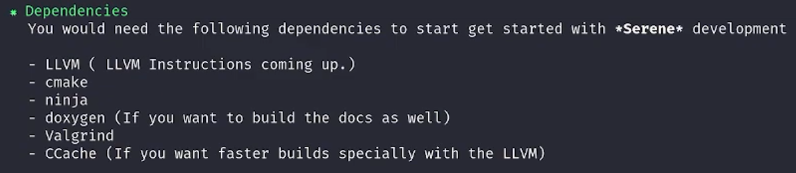

# Reference

- [(150) How to build a compiler with LLVM and MLIR - 01 Introduction - YouTube](https://www.youtube.com/watch?v=Ij4LswX1tZU&list=PLlONLmJCfHTo9WYfsoQvwjsa5ZB6hjOG5)

- Repository: [https://devheroes.codes/Serene/Serene](https://www.youtube.com/redirect?event=video_description&redir_token=QUFFLUhqbGpFMUp2UUdHQzJZSVVGMnNfb082X1E4S25ud3xBQ3Jtc0trYXE4akI5UWFvemVDMFRWQ28yMGtNSDZENUgyY0VJTXY5Q3ZmM2tOc2VvWFpXNHNEeVgtMEZueEljc3k3MENFNjdhRTdONlptWFlvTmVfRGdVemJqV2Rpenkxdm56SU1MQ0MtZE8tbXF1OGxaUEZKaw&q=https%3A%2F%2Fdevheroes.codes%2FSerene%2FSerene&v=Ij4LswX1tZU)


# Dependencies



```cpp
cmake -G Ninja ../llvm \
        -DCMAKE_INSTALL_PREFIX=/your/target/path \
        -DLLVM_PARALLEL_COMPILE_JOBS=7 \
        -DLLVM_PARALLEL_LINK_JOBS=1 \
        -DLLVM_BUILD_EXAMPLES=ON \
        -DLLVM_TARGETS_TO_BUILD="X86" \
        -DCMAKE_BUILD_TYPE=Release \
        -DLLVM_EXTERNAL_PROJECTS=iwyu \
        -DLLVM_EXTERNAL_IWYU_SOURCE_DIR=/path/to/iwyu \
        -DLLVM_ENABLE_ASSERTIONS=ON \
        -DLLVM_CCACHE_BUILD=ON \
        -DCMAKE_EXPORT_COMPILE_COMMANDS=ON \
        -DLLVM_ENABLE_PROJECTS='clang;lldb;lld;mlir;clang-tools-extra;compiler-rt' \
        -DCMAKE_C_COMPILER=clang \
        -DCMAKE_CXX_COMPILER=clang++ \
        -DLLVM_ENABLE_LLD=ON

```

```cmake
cmake -G "Ninja" -DLLVM_ENABLE_PROJECTS="clang;lldb;lld;mlir;clang-tools-extra;compiler-rt" -DLLVM_TARGETS_TO_BUILD=X86 -DCMAKE_BUILD_TYPE="Release" -DLLVM_INCLUDE_TESTS=OFF -DCMAKE_INSTALL_PREFIX="/usr/local/llvm" ../llvm
```

