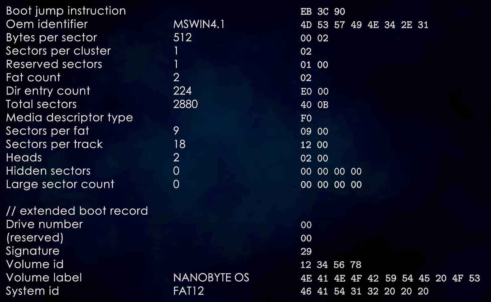
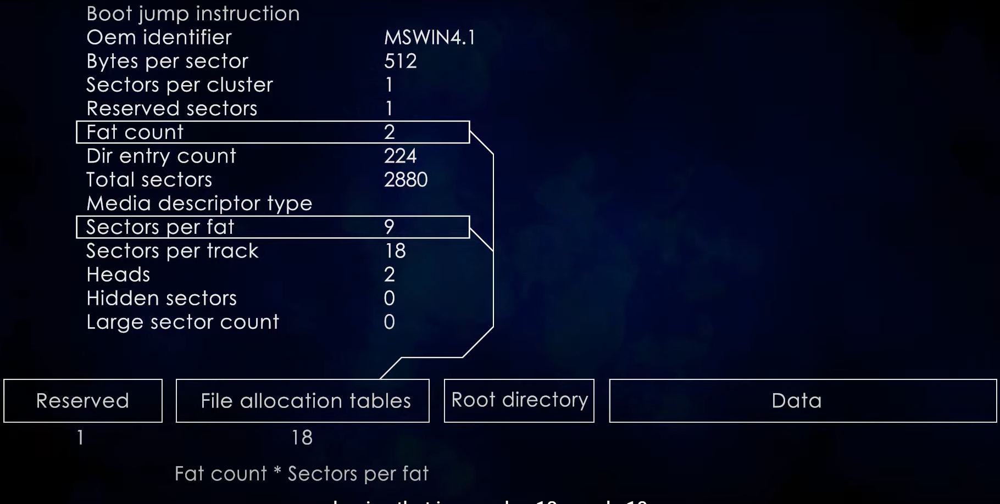
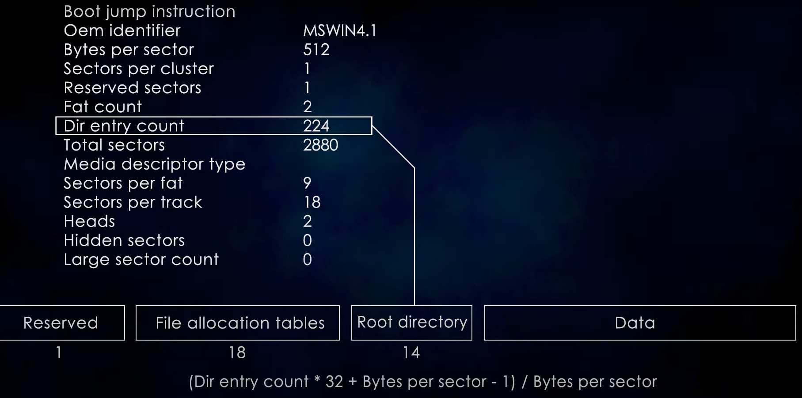
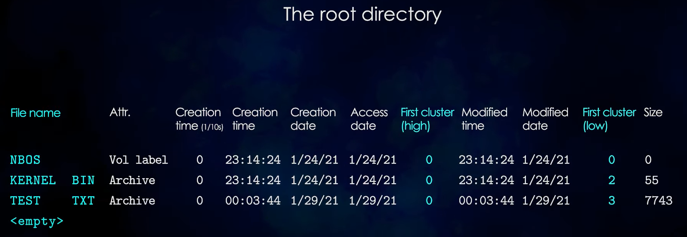
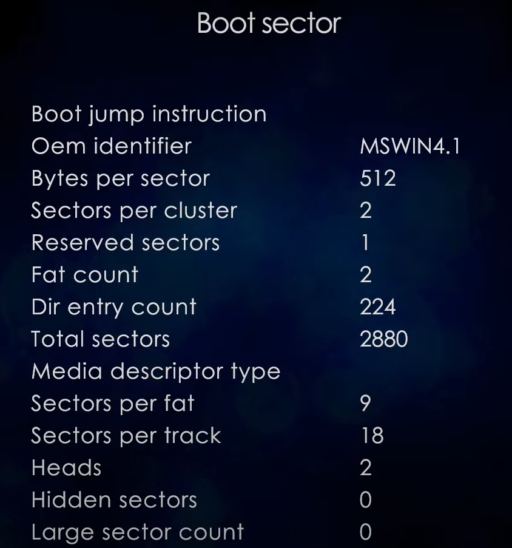
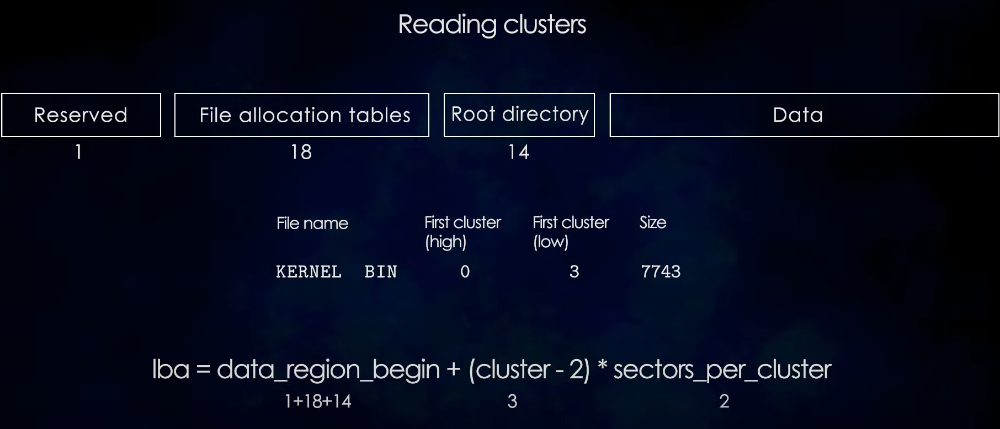
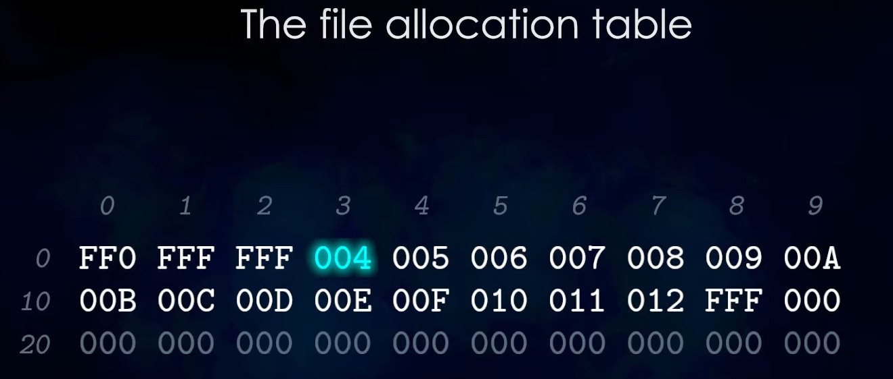

# 保留扇区

# Example：如何搜索特定的文件test.txt

## 解析FAT12文件系统

据此，可以计算出Root Directory在哪些扇区，==从而将整个Root Directory读入内存==。

## 解析Root Directory

Directory Entry如下：

> 两个First Cluster属性字段，共同组成了一个32位的簇号。
>
> > FAT12只需要低16位。

在本例中，第三条条目符合规则，因此==知道了目标文件所在的第一个Cluster的编号==。

### 关于Cluster

## 计算文件头所在扇区

> 目前已知了文件所在的第一个Cluster的编号。

从而读入了此文件的第一个簇。

## 计算文件后续内容所在扇区(利用file allocation table)

> FAT12文件系统下，allocation table的每个条目占用12bit。

==由于此文件的第一个Cluster编号为3，因此它的后续一个Cluster的编号，存在第12*3bit的位置，即004号 Cluster==。

==将持续此过程，知道Cluster的编号大于FF0，视作文件结束==。

