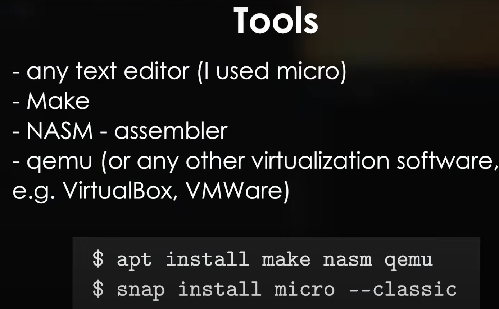

# Reference

- [(150) Regular Expressions - YouTube](https://www.youtube.com/watch?v=soQCkeBDOAY&list=PLHh55M_Kq4OAmzC6zR7NXhZT9z21NkRCa)

- [Mirror of: Into the Void: x86 Instruction Set Reference (c9x.me)](https://c9x.me/x86/)
- [int 13 (stanislavs.org)](https://www.stanislavs.org/helppc/int_13.html)


# Tools




- Bochs:

  ```sh
   sudo apt install bochs bochs-sdl bochsbios vgabios
  ```

  调试方式：https://youtu.be/srbnMNk7K7k?list=PLFjM7v6KGMpiH2G-kT781ByCNC_0pKpPN&t=1539

  
