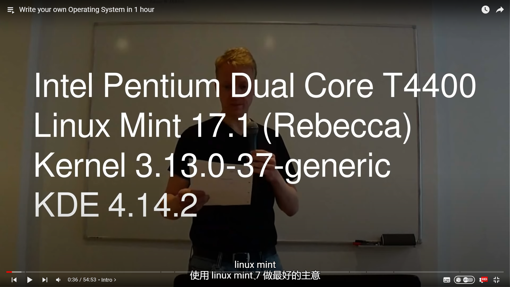
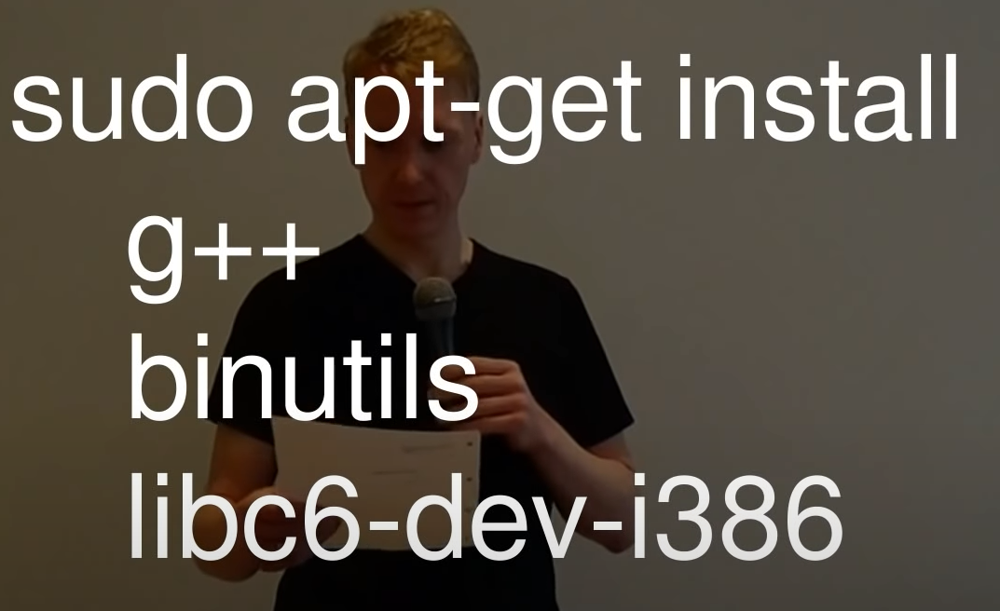

# Reference

- [(150) Write your own Operating System in 1 hour - YouTube](https://www.youtube.com/watch?v=1rnA6wpF0o4&list=PLHh55M_Kq4OApWScZyPl5HhgsTJS9MZ6M&index=1&t=1648s)

- https://wiki.osdev.org/

- [Lowlevel](http://www.lowlevel.eu/wiki/Hauptseite)

# Linux环境

# 开发环境

