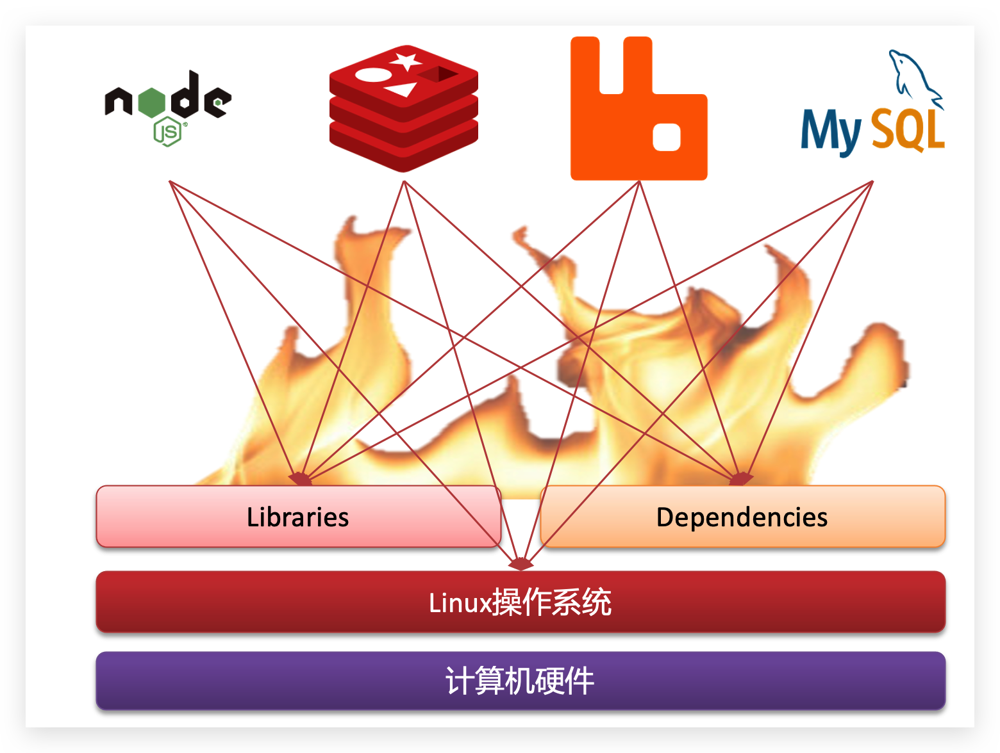
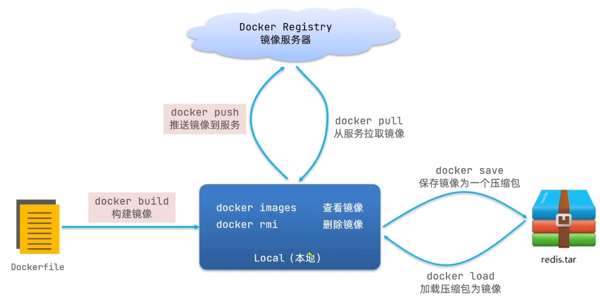
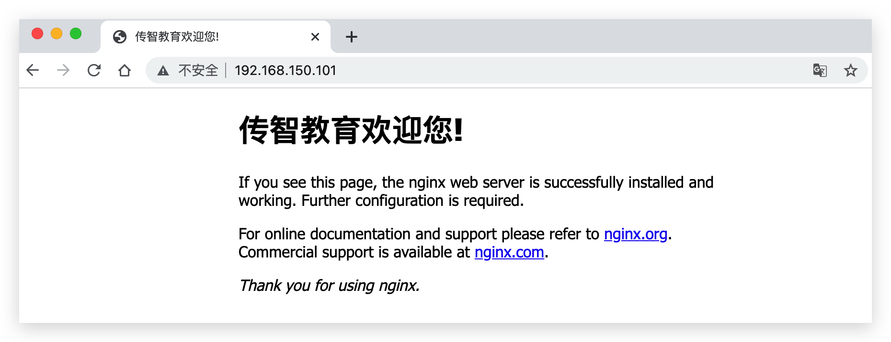
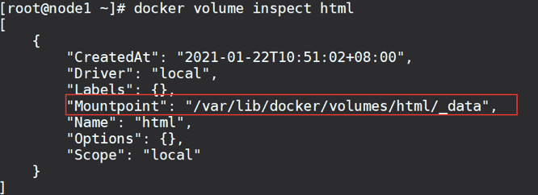

# 初识Docker

https://www.bilibili.com/video/BV1LQ4y127n4?p=43

## 应用部署时的环境问题

大型项目组件较多，运行环境也较为复杂，部署时会碰到一些问题：

- 依赖关系复杂，容易出现兼容性问题

- 开发、测试、生产环境有差异


例如一个项目中，部署时需要依赖于node.js、Redis、RabbitMQ、MySQL等，这些服务部署时所需要的函数库、依赖项各不相同，甚至会有冲突。给部署带来了极大的困难。



## Docker解决依赖兼容问题

Docker为了解决依赖的兼容问题的，采用了两个手段：

- 将应用的Libs（函数库）、Deps（依赖）、配置与应用一起打包
- 将每个应用放到一个隔离**容器**去运行，避免互相干扰


这样打包好的应用包中，既包含应用本身，也保护应用所需要的Libs、Deps，无需再操作系统上安装这些，自然就不存在不同应用之间的兼容问题了。


虽然解决了不同应用的兼容问题，但是开发、测试等环境会存在差异，操作系统版本也会有差异，怎么解决这些问题呢？

## Docker解决操作系统环境差异

### 操作系统的结构

要解决不同操作系统环境差异问题，必须先了解操作系统结构。以一个Ubuntu操作系统为例，结构如下：


结构包括：

- 计算机硬件：例如CPU、内存、磁盘等
- 系统内核：所有Linux发行版的内核都是Linux，例如CentOS、Ubuntu、Fedora等。内核可以与计算机硬件交互，对外提供**内核指令**，用于操作计算机硬件。
- 系统应用：操作系统本身提供的应用、函数库。这些函数库是对内核指令的封装，使用更加方便。


### 应用与计算机交互的流程

1）应用调用操作系统应用（函数库），实现各种功能

2）系统函数库是对内核指令集的封装，会调用内核指令

3）内核指令操作计算机硬件


Ubuntu和CentOS都是基于Linux内核，无非是系统应用不同，提供的函数库有差异。

此时，如果将一个Ubuntu版本的MySQL应用安装到CentOS系统，MySQL在调用Ubuntu函数库时，会发现找不到或者不匹配，就会报错了：


### Docker对系统函数库进行打包

Docker如何解决不同系统环境的问题？

- Docker将用户程序与所需要调用的==系统函数库==一起打包
- Docker运行到不同操作系统时，直接基于打包的函数库，借助于操作系统的Linux内核来运行


## 总结Docker的解决方案

Docker如何解决大型项目依赖关系复杂，不同组件依赖的兼容性问题：

- Docker允许开发中将应用、依赖、函数库、配置一起打包，形成==可移植镜像==
- Dock应用运行在容器中，使用沙箱机制，相互==隔离==


Docker如何解决开发、测试、生成环境有差异的问题：

- Docker镜像中==包含完整运行环境(包含系统函数库)==，	仅对系统的Linux内核进行依赖，可在任意Linux系统上运行

## Docker与虚拟机

- 虚拟机(Virtual Machine)：是在操作系统中==模拟硬件设备==，然后在模拟出的硬件设备上运行另一个系统。

- Docker仅对函数库进行了封装，没有对完整的操作系统进行模拟


对比来看：

| 特性     | Docker   | 虚拟机   |
| -------- | -------- | -------- |
| 性能     | 接近原生 | 性能较差 |
| 硬盘占用 | 一般为MB | 一般为GB |
| 启动     | 秒级     | 分钟级   |


总结：

- docker是一个==系统进程==，直接与操作系统内核交互；虚拟机是在操作系统中的操作系统
- docker体积小、启动速度快、性能好；虚拟机体积大、启动速度慢、性能一般


## Docker架构

### 镜像与容器

- **镜像（Image）**：Docker将应用程序及其所需的依赖、函数库、环境、配置等文件打包在一起，称为镜像。

- **容器（Container）**：镜像中的应用程序运行后形成的进程就是**容器**，只是Docker会给容器进程做隔离，对外不可见。

    

镜像，就是把一个应用在硬盘上的文件、及其运行环境、部分系统函数库文件一起打包形成的==文件包==。这个文件包是==只读==的。

容器，就是将这些文件中编写的程序、函数加载到内存中运行，形成进程，只不过要隔离起来。因此==一个镜像可以启动多次，形成多个容器进程==。

镜像中的数据可被拷贝到容器空间中，从而进行修改。


###Docker Registry

开源应用程序非常多，打包这些应用往往是重复的劳动。为了避免这些重复劳动，人们就会将自己打包的应用镜像，例如Redis、MySQL镜像放到网络上，共享使用，就像GitHub的代码共享一样。

- DockerHub：DockerHub是一个官方的Docker镜像的托管平台。这样的平台称为Docker Registry。
- 国内也有类似于DockerHub 的公开服务，比如 [网易云镜像服务](https://c.163yun.com/hub)、[阿里云镜像库](https://cr.console.aliyun.com/)等。


我们一方面可以将自己的镜像共享到DockerHub，另一方面也可以从DockerHub拉取镜像：


### Docker架构（C/S架构）

Docker是一个CS架构的程序，由两部分组成：

- 服务端(server)：Docker守护进程，==负责处理Docker指令==，管理镜像、容器等

- 客户端(client)：通过命令或RestAPI向Docker服务端==发送指令==。可以在本地或远程向服务端发送指令。


## Centos7安装Docker

[Centos7安装Docker](Centos7安装Docker.md)


# Docker的基本操作

## 镜像操作

### 镜像命名规范

格式为：`[repository]:[tag]`

> 在没有指定tag时，默认是latest，代表最新版本的镜像


如图：


这里的mysql就是repository，5.7就是tag，合一起就是镜像名称，代表5.7版本的MySQL镜像。


### 常用镜像命令



- docker bulid：由Dockerfile文件构建镜像
- docker pull：从镜像服务器拉取镜像

- docker push：将镜像推送到服务器


- docker images：查看镜像
- docker rmi：删除镜像


- docker save：将镜像保存为一个压缩包
- docker load：将压缩包加载为镜像


### 案例——拉取、查看镜像

需求：从DockerHub中拉取一个nginx镜像并查看


1. 首先去镜像仓库搜索nginx镜像，比如[DockerHub](https://hub.docker.com/)
2. 根据查看到的镜像名称，拉取自己需要的镜像，通过命令：`docker pull nginx`
3. 通过命令：`docker images` 查看拉取到的镜像


### 案例——保存、导入镜像

需求：利用docker save将nginx镜像导出磁盘，然后再通过load加载回来


1. 利用docker xx --help命令查看docker save和docker load的语法

    > 例docker save --help

2. 使用docker save导出镜像到磁盘 

    ```sh
    docker save -o nginx.tar nginx:latest
    ```

3. 使用docker load加载镜像

    1. 先删除本地的nginx镜像：

        ```sh
        docker rmi nginx:latest
        ```

    2. 然后运行命令，加载本地文件：

        ```sh
        docker load -i nginx.tar
        ```


## 容器操作

### 常用容器命令


容器保护三个状态：

- 运行：进程正常运行
- 暂停：进程暂停(挂起)，CPU不再运行，并不释放内存
- 停止：进程终止，回收进程占用的内存、CPU等资源


其中：

- `docker run`：创建并运行一个容器，处于运行状态

    > docker run [OPTIONS] IMAGE
    >
    > - --name：指定容器名称
    > - -p：指定端口映射（宿主机端口:Docker容器端口）
    > - -d：让容器后台运行

- docker pause：让一个运行的容器暂停

- docker unpause：让一个容器从暂停状态恢复运行

- docker stop：停止一个运行的容器

- docker start：让一个停止的容器再次运行

- docker rm：删除一个容器

- `docker ps`：查看所有容器状态，添加 -a 参数可查看到已停止的容器

- docker logs：查看日志。添加-f参数可以持续查看日志


### 案例——创建并与运行一个容器

如创建并运行nginx容器的命令：

```sh
docker run --name containerName -p 80:80 -d nginx
```

参数：

- docker run ：创建并运行一个容器
- --name : 给容器起一个名字，比如叫做mn
- -p ：将宿主机端口与容器端口映射，冒号左侧是宿主机端口，右侧是容器端口
- -d：后台运行容器
- nginx：镜像名称，例如nginx。未指明tag，将使用latest


> 其中`-p`参数，是将容器端口映射到宿主机端口

默认情况下，容器是隔离环境，我们直接访问宿主机的80端口，肯定访问不到容器中的nginx。

现在，将容器的80与宿主机的80关联起来，当我们访问宿主机的80端口时，就会被映射到容器的80，这样就能访问到nginx了：


### 案例——进入容器，修改文件

**需求**：进入Nginx容器，修改HTML文件内容，添加“传智教育欢迎您”


步骤如下：

1. 进入容器：

    ```sh
    docker exec -it mn bash
    ```

    命令解读：

    - docker exec ：进入容器内部，执行一个命令

    - -it : 给当前进入的容器创建一个标准输入、输出终端，允许我们与容器交互

    - mn ：要进入的容器的名称

    - bash：进入容器后执行的命令，bash是一个linux终端交互命令

        > 诸如cd,rm,mv等命令，都属于bash命令的一部分
        >
        > - pwd命令可显示当前工作目录的绝对路径

2. 进入nginx的HTML所在目录 /usr/share/nginx/html

    >容器内部会模拟一个独立的Linux文件系统，看起来如同一个linux。
    >查看DockerHub网站中的nginx页面，可以知道nginx的html目录位置在`/usr/share/nginx/html`

3. 修改index.html的内容：

    容器内没有vi命令，无法直接修改，我们用下面的命令来修改：

    ```sh
    sed -i -e 's#Welcome to nginx#传智教育欢迎您#g' -e 's#<head>#<head><meta charset="utf-8">#g' index.html
    ```


此时浏览器访问自己的虚拟机地址，例如：http://192.168.150.101，即可看到结果：




## 数据卷(Volume)（容器数据管理）

在之前的nginx案例中，修改nginx的html页面时，需要进入nginx内部。并且因为没有编辑器，修改文件也很麻烦。

这就是因为容器与数据（容器内文件）耦合带来的后果。


要解决这个问题，必须将数据与容器解耦，这就要用到数据卷了


### 什么是数据卷

**数据卷是一个虚拟目录，指向宿主机文件系统中的某个目录。


一旦完成数据卷挂载，==对容器的一切操作都会作用在数据卷对应的宿主机目录==了。

这样，我们操作宿主机的/var/lib/docker/volumes/html目录，就等于操作容器内的/usr/share/nginx/html目录了


### 数据卷操作命令

数据卷操作的基本语法如下：

```sh
docker volume [COMMAND]
```

- create 创建一个volume
- inspect 显示一个或多个volume的信息
- ls 列出所有的volume
- prune 删除未使用的volume
- rm 删除一个或多个指定的volume

> 例如：docker volume ls


### 案例——创建和查看数据卷

需求：创建一个数据卷，并查看数据卷在宿主机的目录位置

1.  创建数据卷

    ```shell
    docker volume create html
    ```

2. 查看所有数据

    ```sh
    docker volume ls
    ```

3. 查看数据卷详细信息卷

    ```html
    docker volume inspect html
    ```

    


## 挂载数据卷

在==创建容器时，可以通过 -v 参数来挂载一个数据卷==到某个容器内目录，命令格式如下：

```sh]
docker run \
  --name mn \
  -v html:***** \
  -p 8080:80
  nginx \
```

>`-v html:*****` ：把html数据卷挂载到容器内的\*\*\*\* 这个目录中


> `数据卷创建`时，不用指定路径会有一个默认路径/var/lib/docker/volumes/xxx/_data；
>
> 但`挂载数据卷`时，需要指定挂载到容器的哪个位置。


### 案例——给nginx挂载数据卷

**需求**：创建一个nginx容器，修改容器内的html目录内的index.html内容

> nginx的html目录所在位置/usr/share/nginx/html 


步骤：

1. 创建容器并挂载数据卷到容器内的HTML目录

    ```sh
    docker run --name mn -v html:/usr/share/nginx/html -p 80:80 -d nginx
    ```

    > 若此时数据卷不存在，会自动创建
    >
    > 

2. 进入html数据卷所在位置，并修改HTML内容

    ```sh
    # 查看html数据卷的位置
    docker volume inspect html
    # 进入该目录
    cd /var/lib/docker/volumes/html/_data
    # 修改文件
    vi index.html
    ```

## 直接挂载宿主机目录

> 事实上，可以挂载：
>
> - 数据卷：-v 数据卷名:容器内目录
> - 宿主机目录：-v 宿主机目录:容器内目录
> - 宿主机文件：-v 宿主机文件:容器内文件


### 案例-给MySQL挂载本地目录

创建并运行一个MySQL容器，将==宿主机目录==直接挂载到容器

实现思路如下：

1. 在将课前资料中的[mysql.tar](Docker.assets\mysql.tar)文件上传到虚拟机，通过load命令加载为镜像

    > 自己下也行

2. 创建目录/tmp/mysql/data

    > mkdir -p /tmp/mysql/data

2. 创建目录/tmp/mysql/conf，将课前资料提供的[hmy.cnf](Docker.assets\hmy.cnf)文件上传到/tmp/mysql/conf

3. 去DockerHub查阅资料，创建并运行MySQL容器，要求：
    1. 挂载/tmp/mysql/data到mysql容器内数据存储目录
    2. 挂载/tmp/mysql/conf/hmy.cnf到mysql容器的配置文件
    3. 设置MySQL密码
    
    ```sh
    docker run \
    --name mysql \
    -e MYSQL_ROOT_PASSWORD=gg12138. \
    -p 3306:3306 \
    -v /tmp/mysql/conf/hmy.cnf:/etc/mysql/conf.d/hmy.cnf \
    -v /tmp/mysql/data:/var/lib/mysql \
    -d \
     mysql:5.7.25
    ```
    
    


# Dockerfile自定义镜像

## 镜像结构

- 镜像：是将==应用程序==及其需要的==系统函数库、环境、配置、依赖==打包而成。


以MySQL为例，镜像的组成结构：


镜像是分层结构，每一层称为一个Layer：

- BaseImage层：包含基本的系统函数库、环境变量、文件系统
- EntryPoint层：入口，是镜像中应用程序启动的命令
- 其他：在BaseImage基础闪添加依赖、安装程序、完成整个应用的安装和配置


简单来说，镜像就是：

1. 在系统函数库、运行环境基础上，
2. 添加应用程序文件、配置文件、依赖文件等组合，
3. 然后编写好启动脚本，
4. 打包在一起形成的文件


## Dockfile语法

-  什么是==Dockfile==：

    一个文本文件，其中包含一个个的指令(Instruction)，用指令来说明要执行什么操作以构建镜像。==每一个执行，都会形成一层Layer==。

    


更新详细语法说明，请参考官网文档： https://docs.docker.com/engine/reference/builder


## 案例——基于Ubuntu构建Java项目

需求：基于Ubuntu镜像构建一个新镜像，运行一个java项目

- 步骤1：新建一个空文件夹docker-demo

    

- 步骤2：拷贝课前资料中的docker-demo.jar文件到docker-demo这个目录

    

- 步骤3：拷贝课前资料中的jdk8.tar.gz文件到docker-demo这个目录

    

- 步骤4：拷贝课前资料提供的Dockerfile到docker-demo这个目录

    

    其中的内容如下：

    ```dockerfile
    # 指定基础镜像
    FROM ubuntu:16.04
    # 配置环境变量，JDK的安装目录
    ENV JAVA_DIR=/usr/local
    
    # 拷贝jdk和java项目的包
    COPY ./jdk8.tar.gz $JAVA_DIR/
    COPY ./docker-demo.jar /tmp/app.jar
    
    # 安装JDK
    RUN cd $JAVA_DIR \
     && tar -xf ./jdk8.tar.gz \
     && mv ./jdk1.8.0_144 ./java8
    
    # 配置环境变量
    ENV JAVA_HOME=$JAVA_DIR/java8
    ENV PATH=$PATH:$JAVA_HOME/bin
    
    # 暴露端口
    EXPOSE 8090
    # 入口，java项目的启动命令
    ENTRYPOINT java -jar /tmp/app.jar
    ```

    > Dockfile的第一行必须是FROM，用于指定从一个基础镜像来构建，例如 FROM java:8-alpine

- 步骤5：进入docker-demo

    将准备好的docker-demo上传到虚拟机任意目录，然后进入docker-demo目录下

- 步骤6：运行命令：

    ```sh
    docker build -t javaweb:1.0 .
    ```

    > `.`用于说明Dockfile文件的位置

    

最后访问 http://192.168.150.101:8090/hello/count，其中的ip改成你的虚拟机ip


# DockerCompose

## 认识DockerCompose

Compose文件是一个文本文件，通过指令定义集群中的每个容器如何运行。格式如下：

```json
version: "3.8"
 services:
  mysql:
    image: mysql:5.7.25
    environment:
     MYSQL_ROOT_PASSWORD: 123 
    volumes:
     - "/tmp/mysql/data:/var/lib/mysql"
     - "/tmp/mysql/conf/hmy.cnf:/etc/mysql/conf.d/hmy.cnf"
  web:
    build: .
    ports:
     - "8090:8090"

```

上面的Compose文件就描述一个项目，其中包含两个容器：

- mysql：一个基于`mysql:5.7.25`镜像构建的容器，并且挂载了两个目录
- web：一个基于`docker build`临时构建的镜像容器，映射端口时8090


DockerCompose的详细语法参考官网：https://docs.docker.com/compose/compose-file/


>DockerCompose文件可以看做是将多个docker run命令写到一个文件，只是语法稍有差异


## 安装DockerCompose

见Centos7安装Docker.md


# 部署微服务集群

**需求**：将之前学习的cloud-demo微服务集群利用DockerCompose部署


**实现思路**：

① 查看课前资料提供的cloud-demo文件夹，里面已经编写好了docker-compose文件

② 修改自己的cloud-demo项目，将数据库、nacos地址都命名为docker-compose中的服务名

③ 使用maven打包工具，将项目中的每个微服务都打包为app.jar

④ 将打包好的app.jar拷贝到cloud-demo中的每一个对应的子目录中

⑤ 将cloud-demo上传至虚拟机，利用 docker-compose up -d 来部署


## compose文件

DockerCompose文件如下：

```yaml
version: "3.2"

services:
  nacos:
    image: nacos/nacos-server
    environment:
      MODE: standalone
    ports:
      - "8848:8848"
  mysql:
    image: mysql:5.7.25
    environment:
      MYSQL_ROOT_PASSWORD: 123
    volumes:
      - "$PWD/mysql/data:/var/lib/mysql"
      - "$PWD/mysql/conf:/etc/mysql/conf.d/"
  userservice:
    build: ./user-service
  orderservice:
    build: ./order-service
  gateway:
    build: ./gateway
    ports:
      - "10010:10010"

```

可以看到，其中包含5个service服务：

- `nacos`：作为注册中心和配置中心
    - `image: nacos/nacos-server`： 基于nacos/nacos-server镜像构建
    - `environment`：环境变量
        - `MODE: standalone`：单点模式启动
    - `ports`：端口映射，这里暴露了8848端口
- `mysql`：数据库
    - `image: mysql:5.7.25`：镜像版本是mysql:5.7.25
    - `environment`：环境变量
        - `MYSQL_ROOT_PASSWORD: 123`：设置数据库root账户的密码为123
    - `volumes`：数据卷挂载，这里挂载了mysql的data、conf目录，其中有我提前准备好的数据
- `userservice`、`orderservice`、`gateway`：都是基于Dockerfile临时构建的


## 修改微服务配置

因为微服务将来要部署为docker容器，而==容器之间互联不是通过IP地址，而是通过容器名==。这里我们将order-service、user-service、gateway服务的mysql、nacos地址都修改为基于容器名的访问。

> 用DockCompose部署时，所有的服务之间，可以使用容器名进行互相访问。


```yaml
spring:
  datasource:
  	#mysql:3306中的mysql为容器名
    url: jdbc:mysql://mysql:3306/cloud_order?useSSL=false
    username: root
    password: 123
    driver-class-name: com.mysql.jdbc.Driver
  application:
    name: orderservice
  cloud:
    nacos:
      server-addr: nacos:8848 # nacos:8848中的nacos为容器名
```


## 打包

接下来需要将我们的每个微服务都打包。因为之前查看到Dockerfile中的jar包名称都是app.jar，因此我们的每个微服务都需要用这个名称。


例如：gateway微服务的Dockerfile文件如下：

```dockerfile
FROM java:8-alpine
COPY ./app.jar /tmp/app.jar
ENTRYPOINT java -jar /tmp/app.jar
```

可以通过修改pom.xml中的打包名称来实现，每个微服务都需要修改：

```xml
<build>
  <!-- 服务打包的最终名称 -->
  <finalName>app</finalName>
  <plugins>
    <plugin>
      <groupId>org.springframework.boot</groupId>
      <artifactId>spring-boot-maven-plugin</artifactId>
    </plugin>
  </plugins>
</build>
```


## 拷贝jar包到部署目录

编译打包好的app.jar文件，需要放到Dockerfile的同级目录中。

user-service：


## 部署

最后，我们需要将文件整个cloud-demo文件夹上传到虚拟机中里，由DockerCompose部署。

上传到任意目录：


部署：

进入cloud-demo目录，然后运行下面的命令：

```sh
docker-compose up -d
```


> docker-compose logs -f  查看日志

> 由于Nacos启动速度较慢，其他服务将报错。重启即可：
>
> docker-compose restart gateway userservice orderservice

# Docker镜像服务

## 搭建私有镜像仓库

参考《CentOS7安装Docker.md》


## 推送、拉取镜像

推送镜像到私有镜像服务必须先tag，步骤如下：

① 重新tag本地镜像，名称前缀为私有仓库的地址：192.168.150.101:8080/

 ```sh
docker tag nginx:latest 192.168.150.101:8080/nginx:1.0 
 ```


② 推送镜像

```sh
docker push 192.168.150.101:8080/nginx:1.0 
```


③ 拉取镜像

```sh
docker pull 192.168.150.101:8080/nginx:1.0 
```

