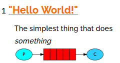
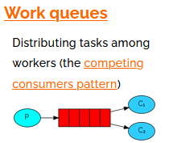
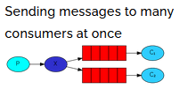
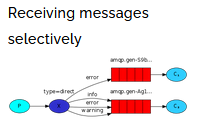
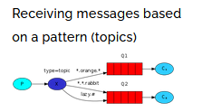

# 初识MQ

## 同步通讯

同步调用的优点：

- 时效性较强，可以立即得到结果

同步调用的问题：

- ==耦合度高==
- 性能和吞吐能力下降
- 有额外的资源消耗
- 有==级联失败==问题


## 异步通讯

> 异步调用的常见实现方式：事件驱动模式


以购买商品为例：

1. 用户支付
2. 调用订单服务完成订单状态修改
3. 调用物流服务，从仓库分配响应的库存并准备发货。


在事件模式中：

- 支付服务是==事件发布者（publisher）==，在支付完成后只需要发布一个支付成功的事件（event），事件中带上订单id。

- 订单服务和物流服务是==事件订阅者（Consumer）==，订阅支付成功的事件，监听到事件后完成自己业务即可。


- 为了解除事件发布者与订阅者之间的耦合，两者并不是直接通信，而是有一个==中间人（Broker）==。发布者发布事件到Broker，不关心谁来订阅事件。订阅者从Broker订阅事件，不关心谁发来的消息。


>Broker 是一个像==数据总线==一样的东西，所有的服务要接收数据和发送数据都发到这个总线上，这个总线就像协议一样，让服务间的通讯变得标准和可控。


好处：

- 吞吐量提升：无需等待订阅者处理完成，响应更快速

- 故障隔离：服务没有直接调用，不存在级联失败问题
- 调用间没有阻塞，不会造成无效的资源占用
- 耦合度极低，每个服务都可以灵活插拔，可替换
- 流量削峰：不管发布事件的流量波动多大，都由Broker接收，订阅者可以按照自己的速度去处理事件


缺点：

- 架构变复杂，业务没有明显的流程线，不好管理
- 需要==依赖于Broker的可靠==、安全、性能

## MQ(MessageQueue)的常见实现

> MQ，中文是消息队列（MessageQueue），字面来看就是存放消息的队列。也就是事件驱动架构中的Broker。


比较常见的MQ实现：

- ActiveMQ
- RabbitMQ
- RocketMQ
- Kafka


几种常见MQ的对比：

|            | **RabbitMQ**            | **ActiveMQ**                   | **RocketMQ** | **Kafka**  |
| ---------- | ----------------------- | ------------------------------ | ------------ | ---------- |
| 公司/社区  | Rabbit                  | Apache                         | 阿里         | Apache     |
| 开发语言   | Erlang                  | Java                           | Java         | Scala&Java |
| 协议支持   | AMQP，XMPP，SMTP，STOMP | OpenWire,STOMP，REST,XMPP,AMQP | 自定义协议   | 自定义协议 |
| 可用性     | 高                      | 一般                           | 高           | 高         |
| 单机吞吐量 | 一般                    | 差                             | 高           | 非常高     |
| 消息延迟   | 微秒级                  | 毫秒级                         | 毫秒级       | 毫秒以内   |
| 消息可靠性 | 高                      | 一般                           | 高           | 一般       |

追求服务可用性：Kafka、 RocketMQ 、RabbitMQ

追求消息可靠性：RabbitMQ、RocketMQ

追求吞吐能力：RocketMQ、Kafka

追求消息低延迟：RabbitMQ、Kafka


# RabbitMQ快速入门

## RabbitMQ简述

RabbitMQ是基于Erlang语言开发的开源消息通信中间件，官网地址：https://www.rabbitmq.com/

>Erlang语言是==面向并发==的编程语言

## RabbitMQ安装

[RabbitMQ安装](RabbitMQ部署指南.md)


## RabbitMQ的角色分配


RabbitMQ中的一些角色：

- virtualHost：虚拟主机，是对exchange、queue、消息等资源的==逻辑分组==

- publisher：生产者

- consumer：消费者

- queue：队列，存储消息

- channel：操作MQ的工具

- exchange：交换机，负责将消息路由队列

    

## RabbitMQ消息模型类别

RabbitMQ官方提供了7个不同的Demo示例，对应了不同的消息模型：

https://www.rabbitmq.com/getstarted.html

可以分为：

- 基本消息队列：

    

- 工作消息队列：

    

- 发布、订阅(Publish,Subscribe)，又根据交换机类型不同，分为：

    - 广播(Fanout Exchange)

        

    - 路由(Direct Exchange)

        

    - 主题(Topic Exchange)

        

## 基本消息队列


官方的HelloWorld是基于最基础的消息队列模型来实现的，只包括三个角色：

- publisher：消息发布者，将消息发送到队列queue
- queue：消息队列，负责接受并缓存消息
- consumer：订阅队列，处理队列中的消息


### 导入Demo

导入课前资料提供的Demo工程(mq-demo)：


包含三部分：

   - mq-demo：父工程，管理项目依赖
   - publisher：消息的发送者
   - consumer：消息的消费者

### 实现Publiser

步骤：

1. 建立连接
2. 创建Channel
3. 声明队列
4. 发送消息
5. 关闭连接和channel


```java
package cn.itcast.mq.helloworld;

import com.rabbitmq.client.Channel;
import com.rabbitmq.client.Connection;
import com.rabbitmq.client.ConnectionFactory;
import org.junit.Test;

import java.io.IOException;
import java.util.concurrent.TimeoutException;

public class PublisherTest {
    @Test
    public void testSendMessage() throws IOException, TimeoutException {
        // 1.建立连接
        ConnectionFactory factory = new ConnectionFactory();
        // 1.1.设置连接参数，分别是：主机名、端口号、vhost、用户名、密码
        factory.setHost("192.168.150.101");
        factory.setPort(5672);
        factory.setVirtualHost("/");
        factory.setUsername("itcast");
        factory.setPassword("123321");
        // 1.2.建立连接
        Connection connection = factory.newConnection();

        // 2.创建通道Channel
        Channel channel = connection.createChannel();

        // 3.创建队列
        String queueName = "simple.queue";
        channel.queueDeclare(queueName, false, false, false, null);

        // 4.发送消息
        String message = "hello, rabbitmq!";
        channel.basicPublish("", queueName, null, message.getBytes());
        System.out.println("发送消息成功：【" + message + "】");

        // 5.关闭通道和连接
        channel.close();
        connection.close();

    }
}
```

### 实现Consumer

步骤：

1. 建立连接
2. 创建Channel
3. 声明队列
4. 订阅消息


```java
package cn.itcast.mq.helloworld;

import com.rabbitmq.client.*;

import java.io.IOException;
import java.util.concurrent.TimeoutException;

public class ConsumerTest {

    public static void main(String[] args) throws IOException, TimeoutException {
        // 1.建立连接
        ConnectionFactory factory = new ConnectionFactory();
        // 1.1.设置连接参数，分别是：主机名、端口号、vhost、用户名、密码
        factory.setHost("192.168.150.101");
        factory.setPort(5672);
        factory.setVirtualHost("/");
        factory.setUsername("itcast");
        factory.setPassword("123321");
        // 1.2.建立连接
        Connection connection = factory.newConnection();

        // 2.创建通道Channel
        Channel channel = connection.createChannel();

        // 3.创建队列
        String queueName = "simple.queue";
        channel.queueDeclare(queueName, false, false, false, null);

        // 4.订阅消息
        channel.basicConsume(queueName, true, new DefaultConsumer(channel){
            @Override
            public void handleDelivery(String consumerTag, Envelope envelope,
                                       AMQP.BasicProperties properties, byte[] body) throws IOException {
                // 5.处理消息
                String message = new String(body);
                System.out.println("接收到消息：【" + message + "】");
            }
        });
        System.out.println("等待接收消息");
    }
}
```


> 1.通道可以重复声明
>
> 2.basicConsume方法只是将通道和消费消息的方法进行绑定，类似于js的回调函数。
>
> > 将先输出“等待接收消息”，再输出“接收到消息”

### 总结

基本消息队列的消息发送流程：

1. 建立connection

2. 创建channel

3. 利用channel声明队列

4. 利用channel向队列发送消息

基本消息队列的消息接收流程：

1. 建立connection

2. 创建channel

3. 利用channel声明队列

4. 定义consumer的消费行为handleDelivery()

5. 利用channel将消费者与队列绑定


# SpringAMQP

- AMQP：Advanced Message Queuing Protocol，是用于在应用程序之间传递业务信息的开发标准。

    该协议与语言和平台无关，更符合微服务中独立性的要求。

- Spring AMQP：基于AMQP协议定义的一套API规范，提供了模板来发送和接收消息。包含：

    - spring-amqp：基础API抽象
    - spring-rabbit：底层的默认实现

> SpringAMQP是==基于RabbitMQ封装的一套**模板**==，并且还==利用SpringBoot对其实现**自动装配**==，使用起来非常方便。

SpringAMQP的官方地址：https://spring.io/projects/spring-amqp


## SpringAMQP依赖

在父工程mq-demo中引入依赖

```xml
<!--AMQP依赖，包含RabbitMQ-->
<dependency>
    <groupId>org.springframework.boot</groupId>
    <artifactId>spring-boot-starter-amqp</artifactId>
</dependency>
```


## Basic Queue 简单队列模型

### 消息发送

1. 首先配置MQ地址，在publisher服务的application.yml中添加配置：

    ```yaml
    spring:
      rabbitmq:
        host: 192.168.150.101 # 主机名
        port: 5672 # 端口
        virtual-host: / # 虚拟主机
        username: itcast # 用户名
        password: 123321 # 密码
    ```

2. 在publisher服务中编写测试类SpringAmqpTest，并利用`RabbitTemplate`实现消息发送：

    ```java
    package cn.itcast.mq.spring;
    
    import org.junit.Test;
    import org.junit.runner.RunWith;
    import org.springframework.amqp.rabbit.core.RabbitTemplate;
    import org.springframework.beans.factory.annotation.Autowired;
    import org.springframework.boot.test.context.SpringBootTest;
    import org.springframework.test.context.junit4.SpringRunner;
    
    @RunWith(SpringRunner.class)
    @SpringBootTest
    public class SpringAmqpTest {
    
        @Autowired
        private RabbitTemplate rabbitTemplate;
    
        @Test
        public void testSimpleQueue() {
            // 队列名称
            String queueName = "simple.queue";
            // 消息
            String message = "hello, spring amqp!";
            // 发送消息
            rabbitTemplate.convertAndSend(queueName, message);
        }
    }
    ```

### 消息监听与接收

1. 配置MQ地址，在consumer服务的application.yml中添加配置：

    ```yaml
    spring:
      rabbitmq:
        host: 192.168.150.101 # 主机名
        port: 5672 # 端口
        virtual-host: / # 虚拟主机
        username: itcast # 用户名
        password: 123321 # 密码
    ```

2. 在consumer服务的cn.itcast.mq.listener包中新建一个类SpringRabbitListener，代码如下：

    ```java
    package cn.itcast.mq.listener;
    
    import org.springframework.amqp.rabbit.annotation.RabbitListener;
    import org.springframework.stereotype.Component;
    
    @Component
    public class SpringRabbitListener {
    
        @RabbitListener(queues = "simple.queue")
        public void listenSimpleQueueMessage(String msg) throws InterruptedException {
            System.out.println("spring 消费者接收到消息：【" + msg + "】");
        }
    }
    ```

    

### 测试

启动consumer服务，然后在publisher服务中运行测试代码，发送MQ消息

## WorkQueue

Work queues，也被称为（Task queues），任务模型。简单来说就是**让多个消费者绑定到一个队列，共同消费队列中的消息**。


当消息处理比较耗时的时候，可能生产消息的速度会远远大于消息的消费速度。长此以往，消息就会堆积越来越多，无法及时处理。

此时就可以使用work 模型，多个消费者共同处理消息处理，速度就能大大提高了。

### 消息发送

>进行循环发送，模拟大量消息堆积现象。


在publisher服务中的SpringAmqpTest类中添加一个测试方法：

```java
/**
     * workQueue
     * 向队列中不停发送消息，模拟消息堆积。
     */
@Test
public void testWorkQueue() throws InterruptedException {
    // 队列名称
    String queueName = "simple.queue";
    // 消息
    String message = "hello, message_";
    for (int i = 0; i < 50; i++) {
        // 发送消息
        rabbitTemplate.convertAndSend(queueName, message + i);
        Thread.sleep(20);
    }
}
```


### 消息接收

要模拟多个消费者绑定同一个队列，我们在consumer服务的SpringRabbitListener中添加2个新的方法：

```java
@RabbitListener(queues = "simple.queue")
public void listenWorkQueue1(String msg) throws InterruptedException {
    System.out.println("消费者1接收到消息：【" + msg + "】" + LocalTime.now());
    Thread.sleep(20);
}

@RabbitListener(queues = "simple.queue")
public void listenWorkQueue2(String msg) throws InterruptedException {
    System.err.println("消费者2........接收到消息：【" + msg + "】" + LocalTime.now());
    Thread.sleep(200);
}
```

> 结果是消息被平均分配给每个消费者，并没有考虑到消费者的处理能力。


#### 配置预读取消息数量

在spring中有一个简单的配置，可以解决这个问题。我们修改consumer服务的application.yml文件，添加配置：

```yaml
spring:
  rabbitmq:
    listener:
      simple:
        prefetch: 1 # 每次只能获取一条消息，处理完成才能获取下一个消息
```

> 默认值是无限，即尽可能的将消息拿到channel，然后慢慢消费

## 发布/订阅模型与交换机

发布订阅的模型如图：


可以看到，在订阅模型中，多了一个exchange角色，而且过程略有变化：

- Publisher：生产者，也就是要发送消息的程序，但是不再发送到队列中，而是发给X（交换机）
- Exchange：交换机，图中的X。一方面，接收生产者发送的消息。另一方面，知道如何处理消息，例如递交给某个特别队列、递交给所有队列、或是将消息丢弃。到底如何操作，取决于Exchange的类型。Exchange有以下3种类型：
    - Fanout：广播，将消息交给所有绑定到交换机的队列
    - Direct：定向，把消息交给符合指定routing key 的队列
    - Topic：通配符，把消息交给符合routing pattern（路由模式） 的队列
- Consumer：消费者，与以前一样，订阅队列，没有变化
- Queue：消息队列也与以前一样，接收消息、缓存消息。

> 总的来说：
>
> - 在发布订阅模型下，消息是发送给交换机的，由交换机发送到满足规则的Queue；订阅了该Queue的消费者将受到消息；
>
> - 而在简单队列模型下，消息是直接发送给Queue的；订阅了该Queue的消费者将受到消息


> **Exchange（交换机）只负责转发消息，不具备存储消息的能力**，因此如果没有任何队列与Exchange绑定，或者没有符合路由规则的队列，那么消息会丢失！


Spring提供了一个接口Exchange，来表示所有不同类型的交换机：


## Fanout Exchange(广播交换机)

>Fanout，英文翻译是扇出，但翻译为广播更合适。


在广播模式下，消息发送流程是这样的：

- 可以有多个队列

- ==每个队列都要绑定到Exchange（交换机）==

- 生产者发送的==消息只能发送到交换机==，==交换机来决定要发给哪个队列==，生产者无法决定

- 交换机把消息发送给绑定过的所有队列

- ==订阅队列的消费者都能拿到消息==

    > 一个消息，将被发送到多个queue；一个queue可以被多个消费者订阅

    

### Demo结构

- 创建一个交换机 itcast.fanout，类型是Fanout
- 创建两个队列fanout.queue1和fanout.queue2，绑定到交换机itcast.fanout


### 基于@Bean声明Queue与Exchange

在consumer中创建一个类，声明队列和交换机：

```java
package cn.itcast.mq.config;

import org.springframework.amqp.core.Binding;
import org.springframework.amqp.core.BindingBuilder;
import org.springframework.amqp.core.FanoutExchange;
import org.springframework.amqp.core.Queue;
import org.springframework.context.annotation.Bean;
import org.springframework.context.annotation.Configuration;

@Configuration
public class FanoutConfig {
    /**
     * 声明交换机
     * @return Fanout类型交换机
     */
    @Bean
    public FanoutExchange fanoutExchange(){
        return new FanoutExchange("itcast.fanout");
    }

    /**
     * 第1个队列
     */
    @Bean
    public Queue fanoutQueue1(){
        return new Queue("fanout.queue1");
    }

    /**
     * 绑定队列和交换机
     */
    @Bean
    public Binding bindingQueue1(Queue fanoutQueue1, FanoutExchange fanoutExchange){
        return BindingBuilder.bind(fanoutQueue1).to(fanoutExchange);
    }

    /**
     * 第2个队列
     */
    @Bean
    public Queue fanoutQueue2(){
        return new Queue("fanout.queue2");
    }

    /**
     * 绑定队列和交换机
     */
    @Bean
    public Binding bindingQueue2(Queue fanoutQueue2, FanoutExchange fanoutExchange){
        return BindingBuilder.bind(fanoutQueue2).to(fanoutExchange);
    }
}
```

### 消息发送

在publisher服务的SpringAmqpTest类中添加测试方法：

```java
@Test
public void testFanoutExchange() {
    // 队列名称（实际上的交换机名称）
    String exchangeName = "itcast.fanout";
    // 消息
    String message = "hello, everyone!";
    
    //void convertAndSend(String exchange, String routingKey, Object object)
    rabbitTemplate.convertAndSend(exchangeName, "", message);
}
```

> 此处的exchangeName实际上是交换机名称，交换机将把消息发送到与之绑定的队列


### 消息接收

在consumer服务的SpringRabbitListener中添加两个方法，作为消费者：

```java
@RabbitListener(queues = "fanout.queue1")
public void listenFanoutQueue1(String msg) {
    System.out.println("消费者1接收到Fanout消息：【" + msg + "】");
}

@RabbitListener(queues = "fanout.queue2")
public void listenFanoutQueue2(String msg) {
    System.out.println("消费者2接收到Fanout消息：【" + msg + "】");
}
```

> 只发送一次的消息，将被多个消费者受到


## Direct Exchange(路由交换机)


 在Direct模型下：

- 队列与交换机的绑定需要指定一个`RoutingKey`（路由key）

    > 一个Queue，可以绑定多个路由key

    > 广播模式下不需要绑定路由key

- 在发送消息时，也必须指定消息的 `RoutingKey`

- Exchange不再把消息交给每一个绑定的队列，而是根据消息的`Routing Key`进行判断，只有队列的`Routingkey`与消息的 `Routing key`完全一致，才会接收到消息


### Demo结构

案例需求如下：

1. 利用@RabbitListener声明Exchange、Queue、RoutingKey

2. 在consumer服务中，编写两个消费者方法，分别监听direct.queue1和direct.queue2

3. 在publisher中编写测试方法，向itcast. direct发送消息


### 基于@RabbitListener声明队列和交换机

### 消息接收

基于@Bean的方式声明队列和交换机比较麻烦，Spring还提供了基于注解方式来声明。

```java
package cn.itcast.mq.listener;

import org.springframework.amqp.core.ExchangeTypes;
import org.springframework.amqp.rabbit.annotation.Exchange;
import org.springframework.amqp.rabbit.annotation.Queue;
import org.springframework.amqp.rabbit.annotation.QueueBinding;
import org.springframework.amqp.rabbit.annotation.RabbitListener;
import org.springframework.stereotype.Component;


@Component
public class SpringRabbitListener {

    @RabbitListener(bindings = @QueueBinding(
            value = @Queue("direct.queue1"),
            exchange = @Exchange(value = "itcast.direct",type = ExchangeTypes.DIRECT),
            key = {"red","blue"}
    ))
    public void listenDirectQueue1(String msg){
        System.out.println(1+msg);
    }

    @RabbitListener(bindings = @QueueBinding(
            value = @Queue("direct.queue2"),
            exchange = @Exchange(value = "itcast.direct",type = ExchangeTypes.DIRECT),
            key = {"red","yellow"}
    ))
    public void listenDirectQueue2(String msg){
        System.out.println(2+msg);
    }
}
```


### 消息发送

在publisher服务的SpringAmqpTest类中添加测试方法：

```java
@Test
public void testSendDirectExchange() {
    // 交换机名称
    String exchangeName = "itcast.direct";
    // 消息
    String message = "红色警报！日本乱排核废水，导致海洋生物变异，惊现哥斯拉！";
    // 发送消息
    rabbitTemplate.convertAndSend(exchangeName, "red", message);
}
```


## Topic Exchange

Topic类型的Exchange与Direct相比，都是可以根据RoutingKey把消息路由到不同的队列。

> 区别在于：使用Topic，引入了通配符，routingKey必须以`.`进行分隔


- `Routingkey` 格式：

    一般都是有一个或多个单词组成，多个单词之间以”.”分割，例如： `item.insert`

- 通配符规则：

    - `#`：匹配0个或多个单词
    - `*`：匹配1个单词

    例如：

    - `item.#`：能够匹配`item.spu.insert` 或者 `item.spu`

    - `item.*`：只能匹配`item.spu`


### Demo结构

案例需求：

1. 并利用@RabbitListener声明Exchange、Queue、RoutingKey

2. 在consumer服务中，编写两个消费者方法，分别监听topic.queue1和topic.queue2

3. 在publisher中编写测试方法，向itcast. topic发送消息


### 消息发送

在publisher服务的SpringAmqpTest类中添加测试方法：

```java
/**
     * topicExchange
     */
@Test
public void testSendTopicExchange() {
    // 交换机名称
    String exchangeName = "itcast.topic";
    // 消息
    String message = "喜报！孙悟空大战哥斯拉，胜!";
    // 发送消息
    rabbitTemplate.convertAndSend(exchangeName, "china.news", message);
}
```


### 消息接收

在consumer服务的SpringRabbitListener中添加方法：

```java
@RabbitListener(bindings = @QueueBinding(
    value = @Queue(name = "topic.queue1"),
    exchange = @Exchange(name = "itcast.topic", type = ExchangeTypes.TOPIC),
    key = "china.#"
))
public void listenTopicQueue1(String msg){
    System.out.println("消费者接收到topic.queue1的消息：【" + msg + "】");
}

@RabbitListener(bindings = @QueueBinding(
    value = @Queue(name = "topic.queue2"),
    exchange = @Exchange(name = "itcast.topic", type = ExchangeTypes.TOPIC),
    key = "#.news"
))
public void listenTopicQueue2(String msg){
    System.out.println("消费者接收到topic.queue2的消息：【" + msg + "】");
}
```


## 消息转换器Message Converter

- 在发送消息时：Spring会将对象序列化为字节发送给MQ
- 在接收消息时：将字节反序列化为Java对象


>但默认情况下Spring采用的序列化方式是JDK序列化。
>
>而JDK序列化存在下列问题：
>
>- 数据体积过大
>- 有安全漏洞
>- 可读性差
>
>虽然默认的JDK序列化方式，但对于对象的序列化和反序列化是没有问题的。例如支持传入Object类型，再使用Object类型进行数据接收


### 配置JSON转换器

显然，JDK序列化方式并不合适。我们希望消息体的体积更小、可读性更高，因此可以使用JSON方式来做序列化和反序列化。

> 发送方和接收方，应使用同一种Message Converter

1. 在publisher和consumer两个服务中都引入依赖：

    ```xml
    <dependency>
        <groupId>com.fasterxml.jackson.dataformat</groupId>
        <artifactId>jackson-dataformat-xml</artifactId>
        <version>2.9.10</version>
    </dependency>
    ```

2. 配置消息转换器（添加Bean)：

    ```java
    @Bean
    public MessageConverter jsonMessageConverter(){
        return new Jackson2JsonMessageConverter();
    }
    ```

    

- 发送消息：

    ```java
    @RunWith(SpringRunner.class)
    @SpringBootTest
    public class SpringAmqpTest {
        @Autowired
        private RabbitTemplate rabbitTemplate;
        
        @Test
        public void testObject(){
            String queueName = "object.queue";
            Map<String,Object> msg = new HashMap<>();
            msg.put("name","xiaowang");
            msg.put("age",18);
    
            rabbitTemplate.convertAndSend(queueName,msg);
        }
    }
    ```

- 接收消息：

    ```java
    @Component
    public class SpringRabbitListener {
    
        @RabbitListener(queues = "object.queue")
        public void listenObjectQueue(Map<String,Object> msg){
            System.out.println(msg);
        }
    }
    ```

    
