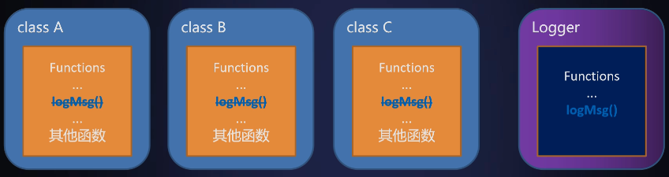
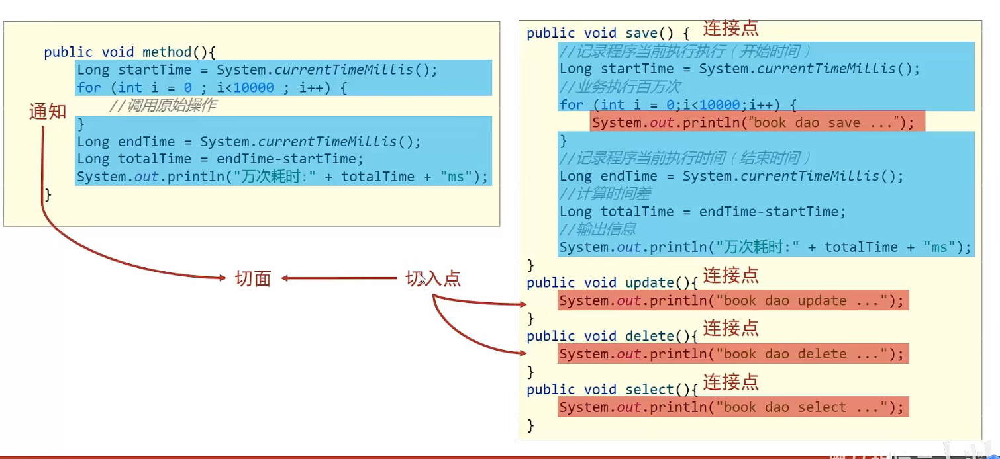

# 相关资料

- 视频链接：[Spring AOP 详解及示例_哔哩哔哩_bilibili](https://www.bilibili.com/video/BV1yK411M7hb?spm_id_from=333.337.search-card.all.click)


# AOP的基本理论与原理

## AOP的概念

- AOP（Aspect Oriented Programming），意为面向切面编程。

- 是一种***通过预编译方式和<u>运行期动态代理</u>***，实现不修改源代码的情况下，给程序动态统一添加功能的一种技术。

  例如：对于打印日志的需求，在没有AOP之前，每个类都需要聚合一个日志类对象

  

  Logger类的功能迭代升级，可能导致现有类出现问题

  

##  AOP的使用场景

- 日志记录
- 异常处理
- 权限验证
- 缓存处理
- 事务处理
- 数据持久化
- 效率检查
- 内容分发


# AOP基于注解相关

## 概念

- aspect：切面。切面由切点和通知组成，即包括横切逻辑的定义和连接点的定义。

  - pointcut：切点。每个类都拥有多个连接点，可以理解为***连接点的集合***。

    ***切点用于说明通知被增强的位置***。

    - joinpoint：连接点。***程序执行的特定位置***，如某个方法调用前后等

  - weaving：织入。将增强添加到目标类的具体连接点的***过程***。

  - advice：通知（增强）。是***织入到目标连接点的一段代码***。就是增强到什么地方？增强什么内容？

- target：目标对象。通知织入的目标类。

- aop Proxy：代理对象，即增强后产生的新对象。

  

Spring AOP的底层实现：

通过JDK动态代理或CGLib代理，在运行时期在对象初始化阶段，织入代码。

> - JDK动态代理，基于接口实现
> - CGLib动态代理，基于类的继承实现


## 通知的种类

- Before advice

  前置通知，即在目标方法调用之前执行。

- After returning advice

  后者通知，在目标方法执行后执行。

  > 前提是目标方法没有抛出异常，***若有异常则不执行通知***

- After throwing advice

  异常通知，在目标方法抛出异常时执行。可以用于捕获异常信息

- After finally advice

  最终通知，在目标方法执行后执行。

  > ***无论方法是否遇到异常都执行***

- Around advice

  环绕通知，<u>可以控制目标方法的执行</u>（通过调用ProceedingJoinPoint.proceed()），可以在目标执行全过程中执行。


## 相关依赖

```xml
<dependencies>
    <dependency>
        <groupId>org.springframework.boot</groupId>
        <artifactId>spring-boot-starter</artifactId>
    </dependency>

    <dependency>
        <groupId>org.springframework.boot</groupId>
        <artifactId>spring-boot-starter-test</artifactId>
        <scope>test</scope>
    </dependency>

    <dependency>
        <groupId>org.aspectj</groupId>
        <artifactId>aspectjweaver</artifactId>
    </dependency>

    <dependency>
        <groupId>org.springframework</groupId>
        <artifactId>spring-aop</artifactId>
    </dependency>
</dependencies>
```


## AOP的实现步骤

1. 定义一个切面类Aspect

   即在声明的类，增加注解`@Component`和`@Aspect`

   > SpringBoot中要引入spring-boot-starter-aop依赖包

2. 定义切点Pointcut

   定义切点，并定义切点在哪些地方执行，采用@Pointcut注解完成。

   如`@Pointcut(public * com.xxx.xxx.*.*(..))`

   > 规则：
   >
   > 修饰符（**<u>可以不写，但不能用*</u>**） + 返回类型 + 哪些包下的类 + 哪些方法 + 方法参数（类和方法可以用\*代替，代表不限；方法参数可用..代替，表示参数不限）

3. 定义通知Advice

   利用通知的5种注解`@Before`,`@After`,`@AfterReturning`,`@AfterThrowing`,`@Around`，来完成在某些切点的增强动作。如@Before("myPointcut()")，myPointcut为第二步定义的切点


```java
@Aspect
@Component
//切面
public class LoggerAdvice {

    private final Logger logger = LoggerFactory.getLogger(LoggerAdvice.class);

    //切点
    @Pointcut("execution(* com.example.application.controller.*.*(..))")
    public void myPointcut(){}

    //通知
    @Around("myPointcut()")
    public Object applicationLogger(ProceedingJoinPoint pjp) throws Throwable {
        String methodName = pjp.getSignature().getName();
        String className = pjp.getTarget().getClass().toString();
        Object[] args = pjp.getArgs();


        logger.info("调用前："+className+"："+methodName+"args="+ Arrays.toString(args));
        Object proceed = pjp.proceed();
        logger.info("调用前："+className+"："+methodName+"return："+ proceed);
        
        return proceed;
    }
}
```


> 注意，被增强的类，需要从容器中获取


logger的配置如下：

```properties
logging.level.root = warn
logging.level.com.example =debug
logging.pattern.console=%d{yyyy-MM-dd HH:mm:ss} %-5level %C.%M[%line] - %msg%n
```

