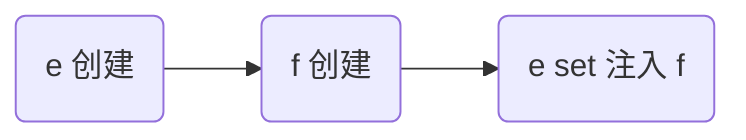

# 容器接口

- BeanFactory接口：

  - 典型功能：getBean()
  - 控制反转、基本的依赖注入、Bean的生命周期
  - 主要的 ApplicationContext 实现都【组合】了它的功能（即成员变量）

- ApplicationContext接口：

  - 是BeanFactory的子接口。

    ApplicationContext的实现类组合并扩展了 BeanFactory 的功能

  - 拓展了BeanFactory的功能，如：

    - 国际化
    - 通配符方式获取一组Resource资源
    - 整合Environment环境（能通过它获取各种来源的配置信息）
    - 事件发布与监听，实现组件之间的解耦合


# 容器实现类

## BeanFactory

### DefaultListableBeanFactory

- 可以通过调用`registerBeanDefinition()`方法，**注册BeanDefinition对象**：

  ```java
  public class MyTest {
  
      static class OneBean {}
  
      public static void main(String[] args) {
          DefaultListableBeanFactory beanFactory = new DefaultListableBeanFactory();
  
          AbstractBeanDefinition beanDefinition =
                  BeanDefinitionBuilder.genericBeanDefinition(OneBean.class).setScope("singleton").getBeanDefinition();
          beanFactory.registerBeanDefinition("oneBean", beanDefinition);
  
          OneBean bean = beanFactory.getBean(OneBean.class);
          System.out.println(bean);
      }
  }
  ```

  - 配置类、XML、组件扫描等的本质，即为生成BeanDefinition对象
  - BeanDefinition描述此Bean的创建蓝图：scope、用构造还是工厂创建、初始化销毁方法等

- BeanFactory，需要调用BeanFactory后处理器，对其进行增强：

  从而解析`@Bean`,`@ComponentScan`等，用于**补充BeanDefinition的注解**：

  ```java
  public class MyTest {
  
      static class OneBean {
      }
  
      @Configuration
      static class Config {
  
          @Bean
          public OneBean oneBean() {
              return new OneBean();
          }
      }
  
      public static void main(String[] args) {
          DefaultListableBeanFactory beanFactory = new DefaultListableBeanFactory();
  
          AbstractBeanDefinition beanDefinition = BeanDefinitionBuilder.genericBeanDefinition(Config.class).setScope("singleton").getBeanDefinition();
          beanFactory.registerBeanDefinition("config", beanDefinition);
  
          Arrays.stream(beanFactory.getBeanDefinitionNames()).forEach(System.out::println);   // only: "config"
  
          // 添加后处理器（包含BeanFactory后处理器和Bean后处理器）
          AnnotationConfigUtils.registerAnnotationConfigProcessors(beanFactory);
  
          beanFactory.getBeansOfType(BeanFactoryPostProcessor.class).values().forEach(
                  beanFactoryPostProcessor -> beanFactoryPostProcessor.postProcessBeanFactory(beanFactory));
  
          Arrays.stream(beanFactory.getBeanDefinitionNames()).forEach(System.out::println);   // have "oneBean"
      }
  }
  ```

- BeanFactory，需要调用Bean后处理器，对其进行增强：

  从而对后续 bean 的创建过程提供增强

  - 例如对`@Autowired`、`@Resource`等注解的支持：

    ```java
    public class MyTest {
    
        static class BeanA {
        }
    
        static class BeanB {
            @Autowired
            private BeanA beanA;
        }
    
    
        @Configuration
        static class Config {
            @Bean
            public BeanA beanA() {
                return new BeanA();
            }
    
            @Bean
            public BeanB beanB() {
                return new BeanB();
            }
        }
    
        public static void main(String[] args) {
            DefaultListableBeanFactory beanFactory = new DefaultListableBeanFactory();
    
            AbstractBeanDefinition beanDefinition = BeanDefinitionBuilder.genericBeanDefinition(Config.class).setScope("singleton").getBeanDefinition();
            beanFactory.registerBeanDefinition("config", beanDefinition);
    
            // 添加后处理器（包含BeanFactory后处理器和Bean后处理器）
            AnnotationConfigUtils.registerAnnotationConfigProcessors(beanFactory);
    
            beanFactory.getBeansOfType(BeanFactoryPostProcessor.class).values().forEach(
                    beanFactoryPostProcessor -> beanFactoryPostProcessor.postProcessBeanFactory(beanFactory)
            );  // 上述用于添加BeanDefinition
    
            beanFactory.getBeansOfType(BeanPostProcessor.class).values().forEach(
                    beanFactory::addBeanPostProcessor
            );
    
            System.out.println(beanFactory.getBean(BeanB.class).beanA); // not null
        }
    }
    ```

  - beanFactory需要手动调用方法来提前初始化单例对象（否则懒惰创建）

    ```java
    beanFactory.preInstantiateSingletons();
    ```

  - Bean后处理器的添加顺序，将影响注解的解析次序（例如同时注有@Resource和@Autowired的情况）。

  - beanFactory 需要额外设置才能解析 ${} 与 #{}


## ApplicationContext

[黑马程序员Spring视频教程，全面深度讲解spring5底层原理_哔哩哔哩_bilibili](https://www.bilibili.com/video/BV1P44y1N7QG?p=11&spm_id_from=pageDriver&vd_source=be746efb77e979ca275e4f65f2d8cda3)

用作准备：

- Bean1.java：

  ```java
  public class Bean1 {
  }
  ```

- Bean2.java：

  ```java
  @Getter
  @Setter
  public class Bean2 {
  
      private Bean1 bean1;
  }
  ```

- b01.xml：

  ```xml
  <?xml version="1.0" encoding="UTF-8"?>
  <beans xmlns="http://www.springframework.org/schema/beans"
         xmlns:xsi="http://www.w3.org/2001/XMLSchema-instance"
         xsi:schemaLocation="http://www.springframework.org/schema/beans http://www.springframework.org/schema/beans/spring-beans.xsd">
  
      <bean id="bean1" class="com.example.show.lecture2.Bean1"/>
      <bean id="bean2" class="com.example.show.lecture2.Bean2">
          <property name="bean1" ref="bean1"/>
      </bean>
  
  </beans>
  ```


### ClassPathXmlApplicationContext

作用：从类路径下，读取xml配置文件。


测试类：
```java
public class ClassPathXmlApplicationContextTest {

    public static void main(String[] args) {
        ClassPathXmlApplicationContext context = new ClassPathXmlApplicationContext("lecture2/b01.xml");

        Arrays.stream(context.getBeanDefinitionNames()).forEach(System.out::println);   // Bean1,Bean2

        System.out.println(context.getBean(Bean2.class).getBean1());    // com.example.show.lecture2.Bean1@58cbafc2
    }
}
```


### FileSystemXmlApplicationContext

从磁盘路径下，读取xml配置文件。


测试类：

```java
public class FileSystemXmlApplicationContextTest {

    public static void main(String[] args) {
        FileSystemXmlApplicationContext context = new FileSystemXmlApplicationContext("D:\\idea_workspace\\b01.xml");

        Arrays.stream(context.getBeanDefinitionNames()).forEach(System.out::println);   // Bean1,Bean2

        System.out.println(context.getBean(Bean2.class).getBean1());    // com.example.show.lecture2.Bean1@75d3a5e0
    }
}
```


#### 基于XML的ApplicationContenxt原理

```java
public class XMLApplicationContextPrinciple {

    public static void main(String[] args) {
        DefaultListableBeanFactory beanFactory = new DefaultListableBeanFactory();

        XmlBeanDefinitionReader reader = new XmlBeanDefinitionReader(beanFactory);
        reader.loadBeanDefinitions(new ClassPathResource("lecture2/b01.xml"));  // 或FileSystemResource
        
        Arrays.stream(beanFactory.getBeanDefinitionNames()).forEach(System.out::println);   // bean1,bean2
        System.out.println(beanFactory.getBean(Bean2.class).getBean1());    // com.example.show.lecture2.Bean1@41fecb8b
    }
}
```


> 注意：
>
> 基于XML的Spring容器，需要在配置文件中添加`<context:annotation-config />`标签，从而添加Bean后处理器和Bean工厂后处理器


### AnnotationConfigApplicationContext

测试类：

```java
public class AnnotationConfigApplicationContextTest {

    public static void main(String[] args) {
        AnnotationConfigApplicationContext context =
                new AnnotationConfigApplicationContext(Config.class);

        Arrays.stream(context.getBeanDefinitionNames()).forEach(System.out::println);   // Config,Bean1,Bean2

        System.out.println(context.getBean(Bean2.class).getBean1());    // com.example.show.lecture2.Bean1@25df00a0
    }

    @Configuration
    static class Config {
        @Bean
        public Bean1 bean1() {
            return new Bean1();
        }

        @Bean
        Bean2 bean2(Bean1 bean1) {
            Bean2 bean2 = new Bean2();
            bean2.setBean1(bean1);
            return bean2;
        }
    }
}
```


### AnnotationConfigServletWebServerApplicationContext

测试类：

```java
public class AnnotationConfigServletWebServerApplicationContextTest {

    public static void main(String[] args) {
        AnnotationConfigServletWebServerApplicationContext context =
                new AnnotationConfigServletWebServerApplicationContext(WebConfig.class);
    }

    @Configuration
    static class WebConfig {
        // 相较于单纯的注解容器，需要配置一些额外信息：
        // WebServer：配置它的工厂类
        // DispatcherServlet
        // 将DispatcherServlet注册到WebServer中
        @Bean
        public ServletWebServerFactory servletWebServerFactory() {
            return new TomcatServletWebServerFactory();
        }

        @Bean
        public DispatcherServlet dispatcherServlet() {
            return new DispatcherServlet();
        }

        @Bean
        public DispatcherServletRegistrationBean registrationBean(DispatcherServlet dispatcherServlet) {
            return new DispatcherServletRegistrationBean(dispatcherServlet, "/");
        }

        @Bean("/hello") // 控制器Demo，其访问路径为/hello
        public Controller controller1() {
            return (request, response) -> {
                response.getWriter().print("hello");
                return null;
            };
        }
    }
}
```


# Bean的生命周期

一个受 Spring 管理的 bean，生命周期主要阶段有：

1. 创建：

   根据 bean 的构造方法或者工厂方法来创建 bean 实例对象

2. 依赖注入：

   根据 @Autowired，@Value 或其它一些手段，**为 bean 的成员变量填充值、建立关系**

3. 初始化：

   回调各种 Aware 接口，调用对象的各种**初始化方法**

4. 销毁：

   在容器关闭时，会销毁所有单例对象（即调用它们的销毁方法）

   >prototype 对象也能够销毁，不过需要容器这边主动调用


## 演示生命周期的四个阶段

- Bean：

  ```java
  @Component
  public class LifeCycleBean {
  
      private static final Logger logger = LoggerFactory.getLogger(LifeCycleBean.class);
  
      public LifeCycleBean() {
          logger.debug("构造方法");       // 1
      }
  
      @Autowired
      public void autowire(@Value("${JAVA_HOME}") String javaHome) {
          logger.debug("依赖注入JAVA_HOME:{}", javaHome);     // 2
      }
  
      @PostConstruct
      public void init() {
          logger.debug("调用初始化方法");    // 3
      }
  
      @PreDestroy
      public void destroy() {
          logger.debug("调用销毁方法");     // 4
      }
  }
  ```

- 启动类：

  ```JAVA
  @SpringBootApplication
  public class A03Application {
  
      public static void main(String[] args) {
          ConfigurableApplicationContext context = SpringApplication.run(A03Application.class, args);
  
          context.close();
      }
  }
  ```

  

## Bean后处理器的作用

Bean后处理器，提供对Bean生命周期各个阶段的扩展：


```java
@Component
public class MyBeanPostProcessor implements InstantiationAwareBeanPostProcessor, DestructionAwareBeanPostProcessor {

    private static final Logger log = LoggerFactory.getLogger(MyBeanPostProcessor.class);

    @Override
    public void postProcessBeforeDestruction(Object bean, String beanName) throws BeansException {
        if (beanName.equals("lifeCycleBean"))
            log.debug("<<<<<< 销毁之前执行, 如 @PreDestroy");
    }

    @Override
    public Object postProcessBeforeInstantiation(Class<?> beanClass, String beanName) throws BeansException {
        if (beanName.equals("lifeCycleBean"))
            log.debug("<<<<<< 实例化之前执行, 若返回非null会替换掉原本的 bean");
        return null;
    }

    @Override
    public boolean postProcessAfterInstantiation(Object bean, String beanName) throws BeansException {
        if (beanName.equals("lifeCycleBean")) {
            log.debug("<<<<<< 实例化之后执行, 这里如果返回 false 会跳过依赖注入阶段");
//            return false;
        }
        return true;
    }

    @Override
    public PropertyValues postProcessProperties(PropertyValues pvs, Object bean, String beanName) throws BeansException {
        if (beanName.equals("lifeCycleBean"))
            log.debug("<<<<<< 依赖注入阶段执行, 如 @Autowired、@Value、@Resource");
        return pvs;
    }

    @Override
    public Object postProcessBeforeInitialization(Object bean, String beanName) throws BeansException {
        if (beanName.equals("lifeCycleBean"))
            log.debug("<<<<<< 初始化之前执行, 这里返回的对象会替换掉原本的 bean, 如 @PostConstruct、@ConfigurationProperties");
        return bean;
    }

    @Override
    public Object postProcessAfterInitialization(Object bean, String beanName) throws BeansException {
        if (beanName.equals("lifeCycleBean"))
            log.debug("<<<<<< 初始化之后执行, 这里返回的对象会替换掉原本的 bean, 如代理增强");
        return bean;
    }
}
```

Bean和启动类同上一节


## 设计模式——模板方法

作用：提高现有代码的拓展能力

```java
public class MethodTemplateDesignPatternTest {

    public static void main(String[] args) {

        MyBeanFactory beanFactory = new MyBeanFactory();
        beanFactory.addBeanPostProcessors(
                bean -> System.out.println("提供依赖注入阶段的拓展：" + bean)
        );
        beanFactory.getBean();
    }

    static class MyBeanFactory {

        private List<BeanPostProcessor> processors = new ArrayList<>();

        public void addBeanPostProcessors(BeanPostProcessor processor) {
            this.processors.add(processor);
        }

        public Object getBean() {
            Object bean = new Object();

            System.out.println("构造" + bean);
//            System.out.println("依赖注入" + bean);
            processors.forEach(processor -> processor.inject(bean));
            System.out.println("初始化" + bean);

            return bean;
        }
    }

    static interface BeanPostProcessor {
        public void inject(Object bean);   // 对依赖注入的拓展
    }
}
```


# Bean后处理器详解

> 回顾：
>
> - Bean后处理器的作用：对Bean生命周期各个阶段进行扩展


- Bean1.java：

  ```java
  @ToString
  public class Bean1 {
      private static final Logger log = LoggerFactory.getLogger(Bean1.class);
  
      private Bean2 bean2;
  
      @Autowired
      public void setBean2(Bean2 bean2) {
          log.debug("@Autowired生效，注入Bean2：{}", bean2);
          this.bean2 = bean2;
      }
  
      private Bean3 bean3;
  
      @Resource
      public void setBean3(Bean3 bean3) {
          log.debug("@Autowired生效，注入Bean3：{}", bean3);
          this.bean3 = bean3;
      }
  
      private String javaHome;
  
      @Autowired
      public void setJavaHome(@Value("${JAVA_HOME}") String javaHome) {
          log.debug("@Value生效，注入JAVA_HOME：{}", javaHome);
          this.javaHome = javaHome;
      }
  
      @PostConstruct
      public void init() {
          log.debug("@PostConstruct生效");
      }
  
      @PreDestroy
      public void destroy(){
          log.debug("@PreDestroy生效");
      }
  }
  ```

- Bean2.java：

  ```java
  public class Bean2 {
  }
  ```

- Bean3.java：

  ```java
  public class Bean3 {
  }
  ```


- 未添加任何后处理器的测试类：

  ```java
  public class A04Application {
  
      public static void main(String[] args) {
          // 是一个“干净“的容器：未添加BeanFactory后处理器和Bean后处理器
          GenericApplicationContext context = new GenericApplicationContext();
  
          // 添加BeanDefinition
          context.registerBean("bean1", Bean1.class);
          context.registerBean("bean2", Bean2.class);
          context.registerBean("bean3", Bean3.class);
  
          // 执行BeanFactory后处理器；添加Bean后处理器；初始化所有单例
          context.refresh();
  
          context.close();
      }
  }
  ```


## AutowiredAnnotationBeanPostProcessor

### 功能演示

在**依赖注入**阶段，提供拓展：

- `@Autowired`
- `@Value`


```java
public class A04Application {

    public static void main(String[] args) {
        // 是一个“干净“的容器：未添加BeanFactory后处理器和Bean后处理器
        GenericApplicationContext context = new GenericApplicationContext();

        // 添加BeanDefinition
        context.registerBean("bean1", Bean1.class);
        context.registerBean("bean2", Bean2.class);
        context.registerBean("bean3", Bean3.class);

        // 默认的解析器，不支持值注入
        context.getDefaultListableBeanFactory().setAutowireCandidateResolver(new ContextAnnotationAutowireCandidateResolver());
        context.registerBean(AutowiredAnnotationBeanPostProcessor.class);

        // 执行BeanFactory后处理器；添加Bean后处理器；初始化所有单例
        context.refresh();

        context.close();
    }
}
```


### 内部执行流程分析

核心代码：

```java
new AutowiredAnnotationBeanPostProcessor.postProcessProperties(...)
```

该方法的返回值类型：`InjectionMetadata`，其封装了如下信息：

- 被依赖注入的对象是谁
- 该对象哪些属性 & 方法上，注有`@Autowired`注解

> 后续的`metadata.inject(bean, beanName, pvs);`方法内部流程：见[视频讲解](https://www.bilibili.com/video/BV1P44y1N7QG?p=19)


```java
public class DigInAutowired {

    public static void main(String[] args) {
        DefaultListableBeanFactory beanFactory = new DefaultListableBeanFactory();

        // 注意：通过此方法注册的Bean，不会再经过构造、依赖注入、初始化的阶段
        beanFactory.registerSingleton("bean2", new Bean2());
        beanFactory.registerSingleton("bean3", new Bean3());

        // 解决@Value获取值的问题
        beanFactory.setAutowireCandidateResolver(new ContextAnnotationAutowireCandidateResolver());
        beanFactory.addEmbeddedValueResolver(new StringValueResolver() {
            @Override
            public String resolveStringValue(String text) {
                return  new StandardEnvironment().resolvePlaceholders(text);
            }
        }); // ${}的解析器

        AutowiredAnnotationBeanPostProcessor processor = new AutowiredAnnotationBeanPostProcessor();
        processor.setBeanFactory(beanFactory);

        Bean1 bean1 = new Bean1();
        processor.postProcessProperties(null, bean1, "bean1");  // 执行依赖注入：@Autowired & @Value

        System.out.println(bean1);
    }
}

```


## CommonAnnotationBeanPostProcessor

### 功能演示

在**依赖注入、初始化前、销毁前**提供拓展：

- `@Resource`
- `PostConstruct`
- `PreDestroy`


```java
public class A04Application {

    public static void main(String[] args) {
        // 是一个“干净“的容器：未添加BeanFactory后处理器和Bean后处理器
        GenericApplicationContext context = new GenericApplicationContext();

        // 添加BeanDefinition
        context.registerBean("bean1", Bean1.class);
        context.registerBean("bean2", Bean2.class);
        context.registerBean("bean3", Bean3.class);
        
        context.registerBean(CommonAnnotationBeanPostProcessor.class);

        // 执行BeanFactory后处理器；添加Bean后处理器；初始化所有单例
        context.refresh();

        context.close();
    }
}
```

> 回顾：后处理器的执行有顺序。`@Resource`先于`@Autowired`


## ConfigurationPropertiesBindingPostProcessor

### 功能演示

- 是SpringBoot提供的Bean后处理器

- 在**初始化前**提供拓展：

  `ConfigurationProperties`注解


- Bean4.java：

  ```java
  @ConfigurationProperties(prefix = "java")
  @Getter
  @Setter
  @ToString
  public class Bean4 {
  
      private String home;
      private String version;
  }
  
  ```

- 测试类：

  ```java
  public class A04Application {
  
      public static void main(String[] args) {
          GenericApplicationContext context = new GenericApplicationContext();
  		context.registerBean("bean4", Bean4.class);
  
          ConfigurationPropertiesBindingPostProcessor.register(context);
  
          context.refresh();
          System.out.println(context.getBean(Bean4.class));
          context.close();
      }
  }
  ```

  

# 常见BeanFactory后处理器详解

[黑马程序员Spring视频教程，全面深度讲解spring5底层原理_哔哩哔哩_bilibili](https://www.bilibili.com/video/BV1P44y1N7QG?p=20&spm_id_from=pageDriver&vd_source=be746efb77e979ca275e4f65f2d8cda3)

## ConfigurationClassPostProcessor

该BeanFactory后处理器，可以解析：

- `@ComponentScan`
- `@Bean`
- `@Import`
- `@ImportResource`


案例：

- 启动类：

  ```java
  public class A05Application {
  
      private static final Logger log = LoggerFactory.getLogger(A05Application.class);
  
      public static void main(String[] args) {
          GenericApplicationContext context = new GenericApplicationContext();
          context.registerBean("config", Config.class);
  
          // @Component, @Bean, @Import @ImportResource
          context.registerBean(ConfigurationClassPostProcessor.class);
  
          context.refresh();
  
          Arrays.stream(context.getBeanDefinitionNames()).forEach(System.out::println);
  
          context.close();
      }
  }
  ```

- Config.java：

  ```java
  @Configuration
  @ComponentScan("com.example.show.lecture5.component")
  public class Config {
  
      @Bean
      public Bean1 bean1() {
          return new Bean1();
      }
  
      @Bean(initMethod = "init")
      public DruidDataSource dataSource() {
          DruidDataSource dataSource = new DruidDataSource();
          dataSource.setUrl("jdbc:mysql://localhost:3306/test");
          dataSource.setUsername("root");
          dataSource.setPassword("gg12138.");
          return dataSource;
      }
  
      @Bean
      public SqlSessionFactoryBean sqlSessionFactoryBean(DataSource dataSource){
          SqlSessionFactoryBean sqlSessionFactoryBean = new SqlSessionFactoryBean();
          sqlSessionFactoryBean.setDataSource(dataSource);
          return sqlSessionFactoryBean;
      }
  }
  ```

- Bean1.java：

  ```java
  @Component
  public class Bean1 {
      private static final Logger log = LoggerFactory.getLogger(Bean1.class);
  
  
      public Bean1() {
          log.debug(this + "被Spring管理");
      }
  }
  ```

- Bean2.java：

  ```java
  package com.example.show.lecture5.component;
  
  @Component
  public class Bean2 {
  
      private static final Logger log = LoggerFactory.getLogger(Bean2.class);
  
      public Bean2() {
          log.debug(this + "被Spring管理");
      }
  }
  ```


### 模拟@ComponentScan解析流程

```java
public class ComponentScanTest {

    public static void main(String[] args) throws IOException {
        GenericApplicationContext context = new GenericApplicationContext();
        context.registerBean("config", Config.class);

        ComponentScan componentScan = AnnotationUtils.findAnnotation(Config.class, ComponentScan.class);
        if (componentScan != null) {
            for (String basePackage : componentScan.basePackages()) {
                // com.example.show.lecture5.component -> classpath*:com/example/show/lecture5/component/**/*.class
                String locationPattern = "classpath*:" + basePackage.replace(".", "/") + "/**/*.class";
                Resource[] resources = context.getResources(locationPattern);

                CachingMetadataReaderFactory factory = new CachingMetadataReaderFactory();
                BeanNameGenerator generator = new AnnotationBeanNameGenerator();

                for (Resource resource : resources) {
                    MetadataReader reader = factory.getMetadataReader(resource);

                    AnnotationMetadata annotationMetadata = reader.getAnnotationMetadata();
                    if (annotationMetadata.hasAnnotation(Component.class.getName())
                            || annotationMetadata.hasMetaAnnotation(Component.class.getName())) {    // 是否注有派生注解

                        AbstractBeanDefinition beanDefinition = BeanDefinitionBuilder
                                .genericBeanDefinition(reader.getClassMetadata().getClassName())
                                .getBeanDefinition();

                        DefaultListableBeanFactory beanFactory = context.getDefaultListableBeanFactory();
                        String beanName = generator.generateBeanName(beanDefinition, beanFactory);

                        beanFactory.registerBeanDefinition(beanName, beanDefinition);
                    }
                }
            }
        }

        Arrays.stream(context.getBeanDefinitionNames()).forEach(System.out::println);
    }
}
```


### 模拟@Bean解析流程

```java
public class BeanTest {

    public static void main(String[] args) throws IOException {
        GenericApplicationContext context = new GenericApplicationContext();
        context.registerBean("config", Config.class);

        CachingMetadataReaderFactory factory = new CachingMetadataReaderFactory();
        MetadataReader reader = factory.getMetadataReader(new ClassPathResource("com/example/show/lecture5/Config.class"));

        AnnotationMetadata annotationMetadata = reader.getAnnotationMetadata();
        Set<MethodMetadata> methods = annotationMetadata.getAnnotatedMethods(Bean.class.getName());

        methods.forEach(methodMetadata -> {
            Map<String, Object> attributes = methodMetadata.getAnnotationAttributes(Bean.class.getName());
            Object initMethod = attributes.get("initMethod");

            BeanDefinitionBuilder builder = BeanDefinitionBuilder.genericBeanDefinition();
            builder.setFactoryMethodOnBean(methodMetadata.getMethodName(), "config");   // 指定充当factory的Bean的name
            builder.setAutowireMode(AbstractBeanDefinition.AUTOWIRE_CONSTRUCTOR);       // 工厂方法和构造方法，使用该模式
            if (initMethod != null) {
                builder.setInitMethodName(initMethod.toString());
            }
            AbstractBeanDefinition beanDefinition = builder.getBeanDefinition();

            context.registerBeanDefinition(methodMetadata.getMethodName(), beanDefinition);
        });

        context.refresh();
        Arrays.stream(context.getBeanDefinitionNames()).forEach(System.out::println);
    }
}
```


## MapperScannerConfigurer(Mybatis)

扫描Mybatis的`@Mapper`


案例：

- 启动类：

  ```java
  public class A05Application {
  
      private static final Logger log = LoggerFactory.getLogger(A05Application.class);
  
      public static void main(String[] args) {
          GenericApplicationContext context = new GenericApplicationContext();
          context.registerBean("config", Config.class);
  
          // @Component, @Bean, @Import @ImportResource
          context.registerBean(ConfigurationClassPostProcessor.class);
  
          // 扫描Mybatis的@Mapper
          context.registerBean(MapperScannerConfigurer.class, bd -> {
              bd.getPropertyValues().add("basePackage", "com.example.show.lecture5.mapper");
          });
  
  
          context.refresh();
  
          Arrays.stream(context.getBeanDefinitionNames()).forEach(System.out::println);
          
          context.close();
      }
  }
  ```

- mapper：

  ```java
  package com.example.show.lecture5.mapper;
  
  @Mapper
  public interface Mapper1 {
  }
  ```

  

### 模拟@Mapper解析流程

```java
public class MapperTest {

    public static void main(String[] args) throws IOException {
        PathMatchingResourcePatternResolver resolver = new PathMatchingResourcePatternResolver();
        Resource[] resources = resolver.getResources("classpath*:com/example/show/lecture5/mapper/**/*.class");

        GenericApplicationContext context = new GenericApplicationContext();
        context.registerBean("config", Config.class);
        context.registerBean(ConfigurationClassPostProcessor.class);

        CachingMetadataReaderFactory factory = new CachingMetadataReaderFactory();
        AnnotationBeanNameGenerator generator = new AnnotationBeanNameGenerator();
        for (Resource resource : resources) {
            MetadataReader reader = factory.getMetadataReader(resource);
            ClassMetadata classMetadata = reader.getClassMetadata();

            if (classMetadata.isInterface()) {
                AbstractBeanDefinition beanDefinitionOfMapperFactoryBean = BeanDefinitionBuilder
                        .genericBeanDefinition(MapperFactoryBean.class)
                        .addConstructorArgValue(classMetadata.getClassName())
                        .setAutowireMode(AbstractBeanDefinition.AUTOWIRE_BY_TYPE)
                        .getBeanDefinition();

                AbstractBeanDefinition beanDefinitionOfMapperInterface = BeanDefinitionBuilder
                        .genericBeanDefinition(classMetadata.getClassName())
                        .getBeanDefinition();

                String beanName = generator.generateBeanName(beanDefinitionOfMapperInterface, context);
                context.registerBeanDefinition(beanName,beanDefinitionOfMapperFactoryBean);
            }
        }

        context.refresh();
        Arrays.stream(context.getBeanDefinitionNames()).forEach(System.out::println);
    }
}
```


# Aware接口

## Aware、InitializingBean接口的作用

- Aware 接口提供了一种【内置】 的注入手段，例如：

  * BeanNameAware 注入 bean 的名字
  * BeanFactoryAware 注入 BeanFactory 容器
  * ApplicationContextAware 注入 ApplicationContext 容器
  * EmbeddedValueResolverAware 注入 ${} 解析器

  > 实现同样的功能：
  >
  > - Bean实现Aware接口
  > - 容器添加后处理器，例如@Autowired

- InitializingBean 接口提供了一种【内置】的初始化手段：

  > 实现同样的功能：
  >
  > - Bean实现InitializingBean接口
  > - 容器添加后处理器，例如@PostConstruct


> 需要注意的是：
>
> - 令Bena实现接口的方式，是Spring内置提供的，不需要后处理器支持


- MyBean.class：

  ```java
  public class MyBean implements BeanNameAware, ApplicationContextAware, InitializingBean {
  
      private static final Logger logger = LoggerFactory.getLogger(MyBean.class);
  
      // 此方法，将在初始化方法之前被回调
      @Override
      public void setBeanName(String name) {
          logger.debug("{}的name为：{}", this, name);
      }
  
      @Override
      public void setApplicationContext(ApplicationContext applicationContext) throws BeansException {
          logger.debug("容器为:{}", applicationContext);
      }
  
  
      @Override
      public void afterPropertiesSet() throws Exception {
          logger.debug("{}执行初始化操作", this);
      }
  }
  ```

- 测试类：

  ```java
  public class A06Application {
  
      private static final Logger log = LoggerFactory.getLogger(A06Application.class);
  
      public static void main(String[] args) {
          GenericApplicationContext context = new GenericApplicationContext();
          context.registerBean("myBean", MyBean.class);
  
          context.refresh();
  
          context.close();
      }
  }
  ```

  

## @Autowired失效的情况

### 问题Demo

- MyConfig1.java：

  ```java
  @Configuration
  public class MyConfig1 {
  
      private static final Logger log = LoggerFactory.getLogger(MyConfig1.class);
  
      @Autowired		// 失效
      public void setApplicationContext(ApplicationContext context) {
          log.debug("注入：{}", context);
      }
  
      @PostConstruct	// 失效
      public void init() {
          log.debug("初始化");
      }
  
  
      // 当添加此Bean时，拓展功能都将失效
      @Bean
      public BeanFactoryPostProcessor processor1() {
          return beanFactory -> {
              log.debug("执行processor1");
          };
      }
  }
  ```

- 测试类：

  ```java
  public class A06Application {
  
      private static final Logger log = LoggerFactory.getLogger(A06Application.class);
  
      public static void main(String[] args) {
          GenericApplicationContext context = new GenericApplicationContext();
          context.registerBean("myConfig1", MyConfig1.class);
  
          context.registerBean(AutowiredAnnotationBeanPostProcessor.class);
          context.registerBean(CommonAnnotationBeanPostProcessor.class);
          context.registerBean(ConfigurationClassPostProcessor.class);
  
          context.refresh();
          /*
           * refresh()流程如下：
           * 1. 找到容器中的所有BeanFactoryProcessor，并执行
           * 2. 添加Bean后处理器
           * 3. 初始化单例
           * */
  
          context.close();
      }
  }
  
  ```


### 问题分析

- Java 配置类不包含 BeanFactoryPostProcessor 的情况

  ```mermaid
  sequenceDiagram 
  participant ac as ApplicationContext
  participant bfpp as BeanFactoryPostProcessor
  participant bpp as BeanPostProcessor
  participant config as Java配置类
  ac ->> bfpp : 1. 执行 BeanFactoryPostProcessor
  ac ->> bpp : 2. 注册 BeanPostProcessor
  ac ->> +config : 3. 创建和初始化
  bpp ->> config : 3.1 依赖注入扩展(如 @Value 和 @Autowired)
  bpp ->> config : 3.2 初始化扩展(如 @PostConstruct)
  ac ->> config : 3.3 执行 Aware 及 InitializingBean
  config -->> -ac : 3.4 创建成功
  ```


- Java 配置类包含 BeanFactoryPostProcessor 的情况，因此要创建其中的 BeanFactoryPostProcessor 必须提前创建 Java 配置类，而此时的 BeanPostProcessor 还未准备好，导致 @Autowired 等注解失效

  ```mermaid
  sequenceDiagram 
  participant ac as ApplicationContext
  participant bfpp as BeanFactoryPostProcessor
  participant bpp as BeanPostProcessor
  participant config as Java配置类
  ac ->> +config : 3. 创建和初始化
  ac ->> config : 3.1 执行 Aware 及 InitializingBean
  config -->> -ac : 3.2 创建成功
  
  ac ->> bfpp : 1. 执行 BeanFactoryPostProcessor
  ac ->> bpp : 2. 注册 BeanPostProcessor
  ```

  

### 解决方案

```java
@Configuration
public class MyConfig2 implements InitializingBean, ApplicationContextAware {

    private static final Logger log = LoggerFactory.getLogger(MyConfig2.class);

    @Override
    public void afterPropertiesSet() throws Exception {
        log.debug("初始化");
    }

    @Override
    public void setApplicationContext(ApplicationContext applicationContext) throws BeansException {
        log.debug("注入 ApplicationContext");
    }

    @Bean
    public BeanFactoryPostProcessor processor2() {
        return beanFactory -> {
            log.debug("执行 processor2");
        };
    }
}
```


# 初始化和销毁手段

Spring提供的初始化手段：

1. @PostConstruct 标注的初始化方法
2. InitializingBean 接口的初始化方法
3. @Bean(initMethod) 指定的初始化方法

> 如果同一个Bean声明了上述全部方法，则执行流程同上


Spring 也提供了多种销毁手段，执行顺序为

1. @PreDestroy 标注的销毁方法
2. DisposableBean 接口的销毁方法
3. @Bean(destroyMethod) 指定的销毁方法


# Scope

在当前版本的 Spring 和 Spring Boot 程序中，支持五种 Scope：

* singleton，容器启动时创建（未设置延迟），容器关闭时销毁
* prototype，每次使用时创建，不会自动销毁，需要调用 DefaultListableBeanFactory.destroyBean(bean) 销毁
* request，每次请求用到此 bean 时创建，请求结束时销毁
* session，每个会话用到此 bean 时创建，会话结束时销毁
* application，web 容器用到此 bean 时创建，容器停止时销毁


## 案例

- BeanForRequest：

  ```java
  @Scope("request")
  @Component
  public class BeanForRequest {
  
      private static final Logger log = LoggerFactory.getLogger(BeanForRequest.class);
  
      @PreDestroy
      public void destroy() {
          log.debug("destroy");
      }
  }
  ```

- BeanForSession：

  ```java
  @Scope("session")
  @Component
  public class BeanForSession {
  
      private static final Logger log = LoggerFactory.getLogger(BeanForSession.class);
  
      @PreDestroy
      public void destroy() {
          log.debug("destroy");
      }
  }
  ```

- BeanForApplication：

  ```java
  @Scope("application")
  @Component
  public class BeanForApplication {
  
      private static final Logger log = LoggerFactory.getLogger(BeanForApplication.class);
  
      @PreDestroy
      public void destroy() {
          log.debug("destroy");
      }
  }
  ```

- 启动类：

  ```java
  @SpringBootApplication
  public class A08Application {
      public static void main(String[] args) {
          SpringApplication.run(A08Application.class, args);
      }
  }
  ```

- Controller:

  ```JAVA
  @RestController
  public class MyController {
  
      @Lazy
      @Autowired
      private BeanForRequest beanForRequest;
  
      @Lazy
      @Autowired
      private BeanForSession beanForSession;
  
      @Lazy
      @Autowired
      private BeanForApplication beanForApplication;
  
      @GetMapping("/test")
      public String test() {
          return "<ul>" +
                  "<li>" + "request scope:" + beanForRequest + "</li>" +
                  "<li>" + "session scope:" + beanForSession + "</li>" +
                  "<li>" + "application scope:" + beanForApplication + "</li>" +
                  "</ul>";
      }
  }
  ```

  

## Scope失效的情况

**Singleton的Bean对象，在注入其他Scope的对象时，将出现问题**（即变成Singleton）。


对于单例对象来讲，依赖注入仅发生了一次，后续再没有用到多例的 F，因此 E 用的始终是第一次依赖注入的 F：




解决方案：

- 使用 `@Lazy` 生成代理：

  代理对象虽然还是只有一个不会变化，但每次调用代理对象的任意方法时，都会由代理对象创建新的f对象

- `@Scope(value = "prototype", proxyMode = ScopedProxyMode.TARGET_CLASS)`

  动态代理

- 依赖`ObjectFactory<>`对象

- 依赖`ApplicationContext`


# 总结

## Spring Bean的生命周期流程

- [参考教程](http://c.biancheng.net/spring/life-cycle.html#:~:text=%E5%85%B6%E7%94%9F%E5%91%BD%E5%91%A8%E6%9C%9F%E3%80%82-,Spring%20%E7%94%9F%E5%91%BD%E5%91%A8%E6%9C%9F%E6%B5%81%E7%A8%8B,-Spring%20Bean%20%E7%9A%84)


## 一些工具类

- 创建Bean Definition：

  `BeanDefinitionBuilder`

- ` CachingMetadataReaderFactory factory`

- `BeanNameGenerator`
