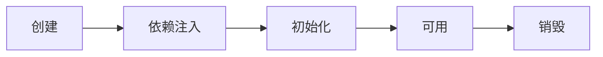

# 容器接口及其功能

Spring中比较重要的容器接口：

- BeanFactory接口
- ApplicationContext接口


事实上，SpringBoot启动类中的run方法，是有返回值的：

```java
@SpringBootApplication
public class ShowApplication {

    public static void main(String[] args) {
        ConfigurableApplicationContext run = SpringApplication.run(ShowApplication.class, args);
    }
}
```

其为ConfigurableApplicationContext类型


> IDEA查看类图快捷键：Ctrl+Alt+U


可见，***ApplicationContext接口，间接继承了BeanFactory接口***


## BeanFactory接口

### BeanFactoy与其他接口的关系

BeanFactory 接口：

- 它为 ApplicaitonContext 接口的父接口

- 它才是 Spring 的核心容器。主要的各种 ApplicationContext 实现，都“组合”了它的功能。

  > 也就是说，***BeanFactory是ApplicationContext的一个成员变量***。

  


### BeanFactory接口的功能

> Ctrl+F12：查看此类的所有方法

- 在表面上，只有getBean()方法，获取对应的Bean实例

- 但实际上，***控制反转、基本的依赖注入、 Bean生命周期的各种功能，都由它的实现类提供***

  > 实现类：DefaultListableBeanFactory。最主要的，该类继承了DefaultSingletonBeanRegistry类
  >
  > ```java
  > @SpringBootApplication
  > public class ShowApplication {
  > 
  >     public static void main(String[] args) throws NoSuchFieldException, IllegalAccessException {
  >         ConfigurableApplicationContext context = SpringApplication.run(ShowApplication.class, args);
  > 
  >         Field singletonObjects = DefaultSingletonBeanRegistry.class.getDeclaredField("singletonObjects");
  >         singletonObjects.setAccessible(true);
  > 
  >         ConfigurableListableBeanFactory beanFactory = context.getBeanFactory();
  >         Map<String, Object> objectMap = (Map<String, Object>) singletonObjects.get(beanFactory);
  >         objectMap.forEach((k, v) -> {
  >             System.out.println(k + "=" + v);
  >         });
  > 
  >     }
  > }
  > ```


## ApplicationContext接口

ApplicationContext接口，是BeanFactory接口的子接口


### 是对BeanFactory接口的拓展


主要拓展了以下功能（接口）：

- MessageSource接口：处理国际化资源
- ResourcePatternResolver接口：通配符匹配资源
- ApplicationEventPublisher接口：发布事件
- EnvironmentCapable接口：处理SpringBoot中的环境信息


#### 国际化功能

```java
public class TestMessageSource {
    public static void main(String[] args) {
        GenericApplicationContext context = new GenericApplicationContext();

        context.registerBean("messageSource", MessageSource.class, () -> {
            ResourceBundleMessageSource ms = new ResourceBundleMessageSource();
            ms.setDefaultEncoding("utf-8");
            ms.setBasename("messages");
            return ms;
        });

        context.refresh();

        System.out.println(context.getMessage("hi", null, Locale.ENGLISH));
        System.out.println(context.getMessage("hi", null, Locale.CHINESE));
        System.out.println(context.getMessage("hi", null, Locale.JAPANESE));
    }
}
```

国际化文件均在 src/resources 目录下：

- messages.properties（空）

- messages_en.properties

  ```properties
  hi=Hello
  ```

- messages_ja.properties

  ```pro
  hi=こんにちは

- messages_zh.properties

  ```properties
  hi=你好
  ```

>***注意***：
>
>* ApplicationContext 中 MessageSource bean 的名字固定为 messageSource
>* 使用 SpringBoot 时，国际化文件名固定为 messages
>* 空的 messages.properties 也必须存在


#### 通配符方式获取资源

```java
@SpringBootApplication
public class ShowApplication {

    public static void main(String[] args) throws IOException {
        ConfigurableApplicationContext context = SpringApplication.run(ShowApplication.class, args);

        Resource[] resources = context.getResources("classpath:application.properties");
        for (Resource resource : resources) {
            System.out.println(resource);
        }
    }
}
```


#### 获取配置信息

```java
@SpringBootApplication
public class ShowApplication {

    public static void main(String[] args) throws IOException {
        ConfigurableApplicationContext context = SpringApplication.run(ShowApplication.class, args);

        Map<String, Object> systemEnvironment = context.getEnvironment().getSystemEnvironment();
        System.out.println(systemEnvironment);
        System.out.println(context.getEnvironment().getProperty("JAVA_HOME"));
        //下面这个配置在application.properties文件中
        System.out.println(context.getEnvironment().getProperty("server.port"));
    }
}
```


#### 发布事件

> 事件，用于解耦

1. 定义事件对象

   ```java
   public class UserRegisteredEvent extends ApplicationEvent {
   
       //source为事件的发布源
       public UserRegisteredEvent(Object source) {
           super(source);
       }
   }
   ```

2. 发布事件

   ```java
   @SpringBootApplication
   public class ShowApplication {
   
       public static void main(String[] args) throws IOException {
           ConfigurableApplicationContext context = SpringApplication.run(ShowApplication.class, args);
   
           //发布事件
           context.publishEvent(new UserRegisteredEvent(context));
       }
   }
   ```

3. 接收事件

   ```java
   @Component
   public class ListenerComponent {
   
       @EventListener  //没有返回值，方法名任意，形参用于接收事件对象
       public void receive(UserRegisteredEvent event){
           System.out.println(event);
       }
   }
   ```

   

## 小结

1. ApplicationContext接口，并非只是简单继承自BeanFactory接口。而是组合并拓展了BeanFactory接口的功能。

2. 代码解耦的一种方式：ApplicationEventPublisher接口的publishEvent()方法

   即事件发布

   >事件发布还可以异步，查阅 @EnableAsync，@Async 的用法


# 容器的实现类

## BeanFactory的实现类

### DefaultListableBeanFactory类

> 总的来说，BeanFactory功能并不丰富；
>
> 其拓展功能，主要由后处理器提供。


#### 如何将一个类交给容器管理

1. 创建该类的 Definition 对象
2. 将该 Definition 对象，注册到 BeanFactory 中

> Definition 对象描述如下信息：
>
> - scope 是什么
> - 用构造还是工厂创建
> - 初始化方法
> - 销毁方法
> - ...

> ### 💡 注意
>
> 原始的BeanFactory，并没有解析注解的能力。（@Configuration，@Bean等）

```java
import org.slf4j.Logger;
import org.slf4j.LoggerFactory;
import org.springframework.beans.factory.annotation.Autowired;
import org.springframework.beans.factory.support.AbstractBeanDefinition;
import org.springframework.beans.factory.support.BeanDefinitionBuilder;
import org.springframework.beans.factory.support.DefaultListableBeanFactory;
import org.springframework.context.annotation.Bean;
import org.springframework.context.annotation.Configuration;

public class TestBeanFactory {

    public static void main(String[] args) {
        DefaultListableBeanFactory beanFactory = new DefaultListableBeanFactory();

        // 需要添加 Bean的定义：
        // 1. class
        // 2. scope：单例/多例
        // 3. 初始化方法
        // 4. 销毁方法


        // 创建Config类的 Definition
        AbstractBeanDefinition configDefinition = BeanDefinitionBuilder
                .genericBeanDefinition(Config.class).setScope("singleton").getBeanDefinition();
        beanFactory.registerBeanDefinition("config", configDefinition);

        for (String name : beanFactory.getBeanDefinitionNames()) {
            System.out.println(name);   //only：config1。也即@Configuration和@Bean注解未被解析
        }
    }


    @Configuration
    static class Config {

        @Bean
        public Bean1 bean1() {return new Bean1();}

        @Bean
        public Bean2 bean2() {return new Bean2();}
    }

    static class Bean1 {
        private static final Logger log = LoggerFactory.getLogger(Bean1.class);

        @Autowired
        private Bean2 bean2;

        public Bean1() {log.debug("构造 Bean1()");}

        public Bean2 getBean2() {return bean2;}
    }

    static class Bean2 {
        private static final Logger log = LoggerFactory.getLogger(Bean2.class);

        public Bean2() {log.debug("构造 Bean2()");}
    }
}
```


#### 如何解析注解(@Configuration 和 @Bean)

> ***主要由<u>Bean工厂后处理器</u>，提供对Bean Definition的补充***
>
> 例如通过解析 @Bean、@ComponentScan 等注解，来补充一些 bean definition


1. 将配置类（标记@Configuration）交给BeanFactory管理

   1. 创建配置类的 Definition 对象
   2. 将该 Definition 对象，注册到 BeanFactory 中

2. 为BeanFactory对象，注册***注解Bean工厂后处理器***(即：把处理器注册到容器)

   > ```java
   > AnnotationConfigUtils.registerAnnotationConfigProcessors(beanFactory);
   > ```
   >
   > 将添加如下5个处理器：
   >
   > - Bean工厂后处理器
   >
   >   - org.springframework.context.annotation.internalConfigurationAnnotationProcessor：用于处理@Configuration和@Bean
   >   - org.springframework.context.event.internalEventListenerProcessor
   >
   > - Bean后处理器：
   >
   >   - org.springframework.context.annotation.internalAutowiredAnnotationProcessor：@Autowired和@Value
   >
   >   - org.springframework.context.annotation.internalCommonAnnotationProcessor：@Resource
   >
   > - org.springframework.context.event.internalEventListenerFactory

3. 将注解配置处理器，应用于BeanFactory对象


```java
import org.slf4j.Logger;
import org.slf4j.LoggerFactory;
import org.springframework.beans.factory.annotation.Autowired;
import org.springframework.beans.factory.config.BeanFactoryPostProcessor;
import org.springframework.beans.factory.support.AbstractBeanDefinition;
import org.springframework.beans.factory.support.BeanDefinitionBuilder;
import org.springframework.beans.factory.support.DefaultListableBeanFactory;
import org.springframework.context.annotation.AnnotationConfigUtils;
import org.springframework.context.annotation.Bean;
import org.springframework.context.annotation.Configuration;

public class TestBeanFactory {

    public static void main(String[] args) {
        DefaultListableBeanFactory beanFactory = new DefaultListableBeanFactory();
        
        // 创建Config类的 Definition
        AbstractBeanDefinition configDefinition = BeanDefinitionBuilder
                .genericBeanDefinition(Config.class).setScope("singleton").getBeanDefinition();
        beanFactory.registerBeanDefinition("config", configDefinition);

        for (String name : beanFactory.getBeanDefinitionNames()) {
            System.out.println(name);   //only：config1。也即@Configuration和@Bean注解未被解析
        }

        // 将AnnotationConfigProcessors添加到容器
        AnnotationConfigUtils.registerAnnotationConfigProcessors(beanFactory);
        
        // 获取BeanFactoryPostProcessor,并执行它们
        beanFactory.getBeansOfType(BeanFactoryPostProcessor.class).values().forEach(beanFactoryPostProcessor -> {
             beanFactoryPostProcessor.postProcessBeanFactory(beanFactory);
        });

        System.out.println();
        for (String name : beanFactory.getBeanDefinitionNames()) {
            System.out.println(name);
        }
    }
    
    //Config、Bean1、Bean2定义同上
}
```


#### 如何注入属性

> 主要由***<u>Bean后处理器</u>***，对后续 bean 的生命周期（创建、依赖注入、初始化）提供增强
>
> * 例如 @Autowired，@Resource 等注解的解析都是 bean 后处理器完成的
> * bean 后处理的添加顺序会对解析结果有影响，见视频中同时加 @Autowired，@Resource 的例子

 

```java
public static void main(String[] args) {
    DefaultListableBeanFactory beanFactory = new DefaultListableBeanFactory();

    // 创建Config类的 Definition
    AbstractBeanDefinition configDefinition = BeanDefinitionBuilder
        .genericBeanDefinition(Config.class).setScope("singleton").getBeanDefinition();
    beanFactory.registerBeanDefinition("config", configDefinition);
    // 到目前为止，容器仅有config类

    // 将 AnnotationConfigProcessors 添加到容器
    AnnotationConfigUtils.registerAnnotationConfigProcessors(beanFactory);
    // 到目前为止，容器有：config类 和 五个AnnotationConfigProcessors

    // 获取BeanFactoryPostProcessor,并执行它们
    beanFactory.getBeansOfType(BeanFactoryPostProcessor.class).values().forEach(beanFactoryPostProcessor -> {
        beanFactoryPostProcessor.postProcessBeanFactory(beanFactory);
    });
    // 到目前为止，容器新增：Bean1 和 Bean2。 但未提供属性注入（@Autowired）

    // 执行Bean后处理器：针对 Bean 的生命周期各个阶段提供增强
    beanFactory.getBeansOfType(BeanPostProcessor.class).values().forEach((beanPostProcessor) -> {
        beanFactory.addBeanPostProcessor(beanPostProcessor);
    });

    // 默认情况下：在第一次使用Bean对象之前，BeanFactory中仅保留着描述信息
    // 预实例化单例对象
    beanFactory.preInstantiateSingletons();

    System.out.println("------------------------");
    Bean1 bean1 = beanFactory.getBean(Bean1.class);
    System.out.println(bean1.getBean2());       //not null
}

//Config、Bean1、Bean2定义同上
```


### 小结

- BeanFactory 不会主动做的事：

  1. 不会主动调用 BeanFactory后处理器
  2. 不会主动添加 Bean处理器
  3. 不会主动初始化单例对象（即默认延迟加载）
  4. 不会解析 ${} 和 #{}

  > 上述功能，由BeanFactory后处理器和Bean后处理器提供

- Bean后处理器，存在[排序的逻辑](https://www.bilibili.com/video/BV1P44y1N7QG?p=10&spm_id_from=pageDriver)【4:35】：

  先注册的后处理器，优先级更高


[BeanFactory实现类.xmind](C:\Users\G_xy\Documents\BeanFactory实现类.xmind) 


## ApplicationContext的实现类

提前定义一些类：

```java
public class Bean1 {
}
```

```java
public class Bean2 {
    private Bean1 bean1;

    public Bean1 getBean1() {
        return bean1;
    }

    public void setBean1(Bean1 bean1) {
        this.bean1 = bean1;
    }
}
```


### ClassPathXmlApplicationContext

根据从类路径下读取的xml配置文件，创建ApplicationContext容器


- b01.xml：

  ```xml
  <?xml version="1.0" encoding="UTF-8"?>
  <beans xmlns="http://www.springframework.org/schema/beans"
         xmlns:xsi="http://www.w3.org/2001/XMLSchema-instance"
         xsi:schemaLocation="http://www.springframework.org/schema/beans http://www.springframework.org/schema/beans/spring-beans.xsd">
  
      <!-- 定义Bean Definition -->
      <bean id="bean1" class="com.example.show.c2.Bean1"/>
  
      <bean id="bean2" class="com.example.show.c2.Bean2">
          <property name="bean1" ref="bean1"/>
      </bean>
  </beans>
  ```

- 测试代码如下：

  ```java
  public class TestClassPathXmlApplicationContext {
  
      private static final Logger log = LoggerFactory.getLogger(TestClassPathXmlApplicationContext.class);
  
      public static void main(String[] args) {
          ClassPathXmlApplicationContext context =
                  new ClassPathXmlApplicationContext("b01.xml");
  
          for (String name : context.getBeanDefinitionNames()) {
              log.debug("{}", name);
          }
  
          Bean2 bean2 = context.getBean("bean2", Bean2.class);
          log.debug("bean2:{}", bean2);
          log.debug("bean2的属性bean1:{}", bean2.getBean1());
      }
  }
  ```

- 输出如下：

  ```
  23:28:07.002 [main] DEBUG com.example.show.c2.TestClassPathXmlApplicationContext - bean1
  23:28:07.003 [main] DEBUG com.example.show.c2.TestClassPathXmlApplicationContext - bean2
  23:28:07.003 [main] DEBUG com.example.show.c2.TestClassPathXmlApplicationContext - bean2:com.example.show.c2.Bean2@1cf6d1be
  23:28:07.003 [main] DEBUG com.example.show.c2.TestClassPathXmlApplicationContext - bean2的属性bean1:com.example.show.c2.Bean1@663c9e7a
  ```

  

### FileSystemXmlApplicationContext

- xml文件同上

- 测试类：

  ```java
  public class TestFileSystemXmlApplicationContext {
  
      private static final Logger log = LoggerFactory.getLogger(TestFileSystemXmlApplicationContext.class);
  
      public static void main(String[] args) {
  
          System.out.println(System.getProperty("user.dir"));     //D:\idea_workspace\springSourceAnalysis
          FileSystemXmlApplicationContext context = new FileSystemXmlApplicationContext("./show/src/main/resources/b01.xml");
  
          for (String name : context.getBeanDefinitionNames()) {
              log.debug("{}", name);
          }
  
          Bean2 bean2 = context.getBean("bean2", Bean2.class);
          log.debug("bean2:{}", bean2);
          log.debug("bean2的属性bean1:{}", bean2.getBean1());
  
      }
  }
  ```

- 输出：

  ```
  D:\idea_workspace\springSourceAnalysis
  23:36:50.320 [main] DEBUG com.example.show.c2.TestFileSystemXmlApplicationContext - bean1
  23:36:50.321 [main] DEBUG com.example.show.c2.TestFileSystemXmlApplicationContext - bean2
  23:36:50.321 [main] DEBUG com.example.show.c2.TestFileSystemXmlApplicationContext - bean2:com.example.show.c2.Bean2@74e28667
  23:36:50.321 [main] DEBUG com.example.show.c2.TestFileSystemXmlApplicationContext - bean2的属性bean1:com.example.show.c2.Bean1@1cf6d1be
  ```

  

### 上面两个实现类的内部原理

```java
public class TestClassPathXmlApplicationContext {

    private static final Logger log = LoggerFactory.getLogger(TestClassPathXmlApplicationContext.class);

    public static void main(String[] args) {
        DefaultListableBeanFactory beanFactory = new DefaultListableBeanFactory();
        log.debug("before read Definition");
        for (String name : beanFactory.getBeanDefinitionNames()) {
            log.debug("bean name:{}", name);
        }

        // 若是FileSystemXmlApplicationContext类，则传入Resource对象
        XmlBeanDefinitionReader reader = new XmlBeanDefinitionReader(beanFactory);
        reader.loadBeanDefinitions(new ClassPathResource("b01.xml"));
        log.debug("after read Definition");
        for (String name : beanFactory.getBeanDefinitionNames()) {
            log.debug("bean name:{}", name);
        }
    }
}
```

```
23:49:00.679 [main] DEBUG com.example.show.c2.TestClassPathXmlApplicationContext - before read Definition
23:49:00.842 [main] DEBUG org.springframework.beans.factory.xml.XmlBeanDefinitionReader - Loaded 2 bean definitions from class path resource [b01.xml]
23:49:00.842 [main] DEBUG com.example.show.c2.TestClassPathXmlApplicationContext - after read Definition
23:49:00.843 [main] DEBUG com.example.show.c2.TestClassPathXmlApplicationContext - bean name:bean1
23:49:00.843 [main] DEBUG com.example.show.c2.TestClassPathXmlApplicationContext - bean name:bean2
```


### AnnotationConfigApplicationContext

- 测试类：

  ```java
  public class TestAnnotationConfigApplicationContext {
  
      private static Logger log = LoggerFactory.getLogger(TestAnnotationConfigApplicationContext.class);
  
      public static void main(String[] args) {
          AnnotationConfigApplicationContext context
                  = new AnnotationConfigApplicationContext(Config.class);
  
          for (String name : context.getBeanDefinitionNames()) {
              log.debug("bean name:{}", name);
          }
  
          log.debug("bean2对象的bean1属性：{}", context.getBean("bean2", Bean2.class).getBean1());
      }
  
      @Configuration
      static class Config {
          @Bean
          public Bean1 bean1() {
              return new Bean1();
          }
  
          @Bean
          public Bean2 bean2(Bean1 bean1) {
              Bean2 bean2 = new Bean2();
              bean2.setBean1(bean1);
              return bean2;
          }
      }
  }
  ```

- 输出：

  ```
  23:59:32.538 [main] DEBUG com.example.show.c2.TestAnnotationConfigApplicationContext - bean name:org.springframework.context.annotation.internalConfigurationAnnotationProcessor
  23:59:32.539 [main] DEBUG com.example.show.c2.TestAnnotationConfigApplicationContext - bean name:org.springframework.context.annotation.internalAutowiredAnnotationProcessor
  23:59:32.539 [main] DEBUG com.example.show.c2.TestAnnotationConfigApplicationContext - bean name:org.springframework.context.annotation.internalCommonAnnotationProcessor
  23:59:32.539 [main] DEBUG com.example.show.c2.TestAnnotationConfigApplicationContext - bean name:org.springframework.context.event.internalEventListenerProcessor
  23:59:32.539 [main] DEBUG com.example.show.c2.TestAnnotationConfigApplicationContext - bean name:org.springframework.context.event.internalEventListenerFactory
  23:59:32.539 [main] DEBUG com.example.show.c2.TestAnnotationConfigApplicationContext - bean name:testAnnotationConfigApplicationContext.Config
  23:59:32.540 [main] DEBUG com.example.show.c2.TestAnnotationConfigApplicationContext - bean name:bean1
  23:59:32.540 [main] DEBUG com.example.show.c2.TestAnnotationConfigApplicationContext - bean name:bean2
  23:59:32.540 [main] DEBUG com.example.show.c2.TestAnnotationConfigApplicationContext - bean2对象的bean1属性：com.example.show.c2.Bean1@30f842ca
  ```

> - 可见，***添加了Bean工厂后处理器和Bean后处理器***
>
> - 但如果用上面的两个实现类的话，则没有添加后处理器。需要手动在xml配置文件中，添加配置`<context:annotation-config/>`


### AnnotationConfigServletWebServerApplicationContext

- 特点：***既支持注解，又支持ServletWeb环境***


```java
import org.slf4j.Logger;
import org.slf4j.LoggerFactory;
import org.springframework.boot.autoconfigure.web.servlet.DispatcherServletRegistrationBean;
import org.springframework.boot.web.embedded.tomcat.TomcatServletWebServerFactory;
import org.springframework.boot.web.servlet.context.AnnotationConfigServletWebServerApplicationContext;
import org.springframework.boot.web.servlet.server.ServletWebServerFactory;
import org.springframework.context.annotation.Bean;
import org.springframework.context.annotation.Configuration;
import org.springframework.web.servlet.DispatcherServlet;
import org.springframework.web.servlet.ModelAndView;
import org.springframework.web.servlet.mvc.Controller;

import javax.servlet.http.HttpServletRequest;
import javax.servlet.http.HttpServletResponse;

public class TestAnnotationConfigServletWebServerApplicationContext {

    private static final Logger log = LoggerFactory.getLogger(TestAnnotationConfigServletWebServerApplicationContext.class);

    public static void main(String[] args) {
        AnnotationConfigServletWebServerApplicationContext context =
                new AnnotationConfigServletWebServerApplicationContext(WebConfig.class);
    }

    @Configuration
    static class WebConfig {
        // 添加Web环境支持
        // ServletWebServer：基于Servlet技术的Web容器
        @Bean
        public ServletWebServerFactory servletWebServerFactory() {
            return new TomcatServletWebServerFactory();
        }

        // DispatcherServlet：前控制器
        @Bean
        public DispatcherServlet dispatcherServlet() {
            return new DispatcherServlet();
        }

        // 注册DispatcherServlet到Tomcat服务器
        @Bean
        public DispatcherServletRegistrationBean registrationBean(DispatcherServlet dispatcherServlet) {
            //  除JSP外的所有请求都先进入DispatcherServlet，由其进行分发至控制器
            return new DispatcherServletRegistrationBean(dispatcherServlet, "/");
        }

        // 注意：是Spring提供的Controller接口。
        // 约定：若Bean以 / 开头，则将该Controller映射到该路径
        @Bean("/hello")
        public Controller controller1() {
            return new Controller() {
                @Override
                public ModelAndView handleRequest(HttpServletRequest request, HttpServletResponse response) throws Exception {
                    response.getWriter().print("hello");
                    return null;
                }
            };
        }
    }
}
```

访问localhost:8080/login即可

> 收获：
>
> - ServletWeb环境的三个必要组件
> - SpringBoot是如何内嵌Tomcat服务器的


### 小结

- ClassPathXmlApplicationContext和FileSystemXmlApplicationContext类似，都是从XML配置文件中读取Bean Definition。

  若配置文件中无`<context:annotation-config/>`注解，则Bean工厂中不会有BeanFactory和Bean后处理器

- 非web环境的SpringBoot程序，用的是AnnotationConfigApplicationContext，Web环境下则用的是最后一种。

- 简单Web环境的三个必要组件


# Bean的生命周期

## 生命周期的流程

一个受 Spring 管理的 bean，生命周期主要阶段有

1. 创建：根据 bean 的构造方法或者工厂方法来创建 bean 实例对象

2. 依赖注入：根据 @Autowired，@Value 或其它一些手段，为 bean 的成员变量填充值、建立关系

3. 初始化：回调各种 Aware 接口，调用对象的各种初始化方法

4. 销毁：在容器关闭时，会销毁所有单例对象（即调用它们的销毁方法）

   > prototype 对象也能够销毁，不过需要容器这边主动调用





- 启动类：

  ```java
  @SpringBootApplication
  public class A03Application {
      public static void main(String[] args) {
          ConfigurableApplicationContext context = SpringApplication.run(A03Application.class, args);
  
          context.close();
      }
  }
  ```

- 演示生命周期的Bean：

  ```java
  @Component
  public class LifeCircleBean {
  
      private static final Logger log = LoggerFactory.getLogger(LifeCircleBean.class);
  
      public LifeCircleBean() {
          log.debug("构造方法被调用");
      }
  
      @Autowired
      public void autowire(@Value("${JAVA_HOME}") String home) {
          log.debug("依赖注入：{}", home);
      }
  
      @PostConstruct
      public void init(){
          log.debug("初始化");
      }
  
      @PreDestroy
      public void destroy(){
          log.debug("销毁");
      }
  }
  ```

- 输出：

  ```
  2022-05-01 13:35:31.045 DEBUG 6248 --- [           main] com.example.show.c3.LifeCircleBean       : 构造方法被调用
  2022-05-01 13:35:31.048 DEBUG 6248 --- [           main] com.example.show.c3.LifeCircleBean       : 依赖注入：C:\Users\G_xy\.jdks\corretto-11.0.15
  2022-05-01 13:35:31.049 DEBUG 6248 --- [           main] com.example.show.c3.LifeCircleBean       : 初始化
  2022-05-01 13:35:31.334 DEBUG 6248 --- [           main] com.example.show.c3.LifeCircleBean       : 销毁
  ```

  


## Bean后处理器的六个扩展点

***Bean后处理器，为Bean生命周期的各个阶段提供拓展***：

- 实例化前后
- 依赖注入阶段
- 初始化前后
- 销毁之前

```java
@Component
public class MyBeanPostProcessor implements InstantiationAwareBeanPostProcessor, DestructionAwareBeanPostProcessor {

    private static final Logger log = LoggerFactory.getLogger(MyBeanPostProcessor.class);

    @Override
    public void postProcessBeforeDestruction(Object bean, String beanName) throws BeansException {
        if (beanName.equals("lifeCycleBean"))
            log.debug("<<<<<< 销毁之前执行, 如 @PreDestroy");
    }

    // 调用构造方法前执行
    @Override
    public Object postProcessBeforeInstantiation(Class<?> beanClass, String beanName) throws BeansException {
        if (beanName.equals("lifeCycleBean"))
            log.debug("<<<<<< 实例化之前执行, 这里返回的对象会替换掉原本的 bean");
        return null;    // 为null则不替换
    }

    @Override
    public boolean postProcessAfterInstantiation(Object bean, String beanName) throws BeansException {
        if (beanName.equals("lifeCycleBean")) {
            log.debug("<<<<<< 实例化之后执行, 这里如果返回 false 会跳过依赖注入阶段");
//             return false;
        }
        return true;
    }

    // 依赖注入阶段
    @Override
    public PropertyValues postProcessProperties(PropertyValues pvs, Object bean, String beanName) throws BeansException {
        if (beanName.equals("lifeCycleBean"))
            log.debug("<<<<<< 依赖注入阶段执行, 如 @Autowired、@Value、@Resource");
        return pvs;
    }

    @Override
    public Object postProcessBeforeInitialization(Object bean, String beanName) throws BeansException {
        if (beanName.equals("lifeCycleBean"))
            log.debug("<<<<<< 初始化之前执行, 这里返回的对象会替换掉原本的 bean, 如 @PostConstruct、@ConfigurationProperties");
        return bean;
    }

    @Override
    public Object postProcessAfterInitialization(Object bean, String beanName) throws BeansException {
        if (beanName.equals("lifeCycleBean"))
            log.debug("<<<<<< 初始化之后执行, 这里返回的对象会替换掉原本的 bean, 如代理增强");
        return bean;
    }
}
```


## 模板方法设计模式

***用于在不改写现有代码基础上，对其进行增强拓展***


例如：

```java
public class TestMethodTemplate {

    public static void main(String[] args) {
        MyBeanFactory beanFactory = new MyBeanFactory();

        beanFactory.addBeanPostProcessor(bean -> System.out.println("解析@Autowired"));
        beanFactory.addBeanPostProcessor(bean -> System.out.println("解析@Resource"));

        beanFactory.getBean();
    }

    // 模板方法 Template Method Pattern
    static class MyBeanFactory {
        public Object getBean() {
            Object bean = new Object();
            System.out.println("构造" + bean);
            System.out.println("依赖注入" + bean);

            processors.forEach(processor -> {
                processor.inject(bean);
            });

            System.out.println("初始化" + bean);
            System.out.println("销毁" + bean);
            return bean;
        }

        private List<BeanPostProcessor> processors = new ArrayList<>();

        public void addBeanPostProcessor(BeanPostProcessor beanPostProcessor) {
            processors.add(beanPostProcessor);
        }
    }

    static interface BeanPostProcessor {
        public void inject(Object bean);       // 对依赖注入阶段进行增强
    }
}
```


精髓在于：

- 对于方法中，不改动固定不变的步骤
- ***对于在设计时<u>不能确定的部分</u>（例如依赖注入的拓展），将其抽象为接口***。通过接口的回调，实现功能的增强。


# Bean后处理器

## 解析常用注解的后处理器

- `AutowiredAnnotationBeanPostProcessor`：解析@Autowired和@Value

  > 需要进行如下操作，以提供@Value的值获取：
  >
  > ```java
  > context.getDefaultListableBeanFactory().setAutowireCandidateResolver(new ContextAnnotationAutowireCandidateResolver());
  > ```

- `CommonAnnotationBeanPostProcessor`：解析@Resource、@PostConstruct 、@PreDestroy


测试代码如下：

- 实体类：(其中Bean2和Bean3是空定义)

  ```java
  public class Bean1 {
  
      private static final Logger log = LoggerFactory.getLogger(Bean1.class);
  
      private Bean2 bean2;
  
      private Bean3 bean3;
  
      private String home;
  
      @Autowired
      public void setBean2(Bean2 bean2) {
          log.debug("@Autowired注解生效");
          this.bean2 = bean2;
      }
  
      @Resource
      public void setBean3(Bean3 bean3) {
          log.debug("@Resource注解生效");
          this.bean3 = bean3;
      }
  
      @Autowired
      public void setHome(@Value("${JAVA_HOME}") String home) {
          log.debug("@Autowired + @Value 注解生效：{}", home);
          this.home = home;
      }
  
      @PostConstruct
      public void init() {
          log.debug("@PostConstruct 生效");
      }
  
      @PreDestroy
      public void destroy() {
          log.debug("@PreDestroy 生效");
      }
  
      @Override
      public String toString() {
          return "Bean1{" +
                  "bean2=" + bean2 +
                  ", bean3=" + bean3 +
                  ", home='" + home + '\'' +
                  '}';
      }
  }
  ```

- 测试类：

  ```java
  public class A04Application {
  
      private static final Logger log = LoggerFactory.getLogger(A04Application.class);
  
      public static void main(String[] args) {
          // 未添加Bean后处理器和BeanFactory后处理器
          GenericApplicationContext context = new GenericApplicationContext();
  
          context.registerBean("bean1", Bean1.class);
          context.registerBean("bean2", Bean2.class);
          context.registerBean("bean3", Bean3.class);     // 目前为止，注解都没有被解析
  
          context.getDefaultListableBeanFactory().setAutowireCandidateResolver(new ContextAnnotationAutowireCandidateResolver());     // 提供@Value的值获取
          context.registerBean(AutowiredAnnotationBeanPostProcessor.class);   // 解析@Autowired和@Value
  
          context.registerBean(CommonAnnotationBeanPostProcessor.class);  // 解析@Resource @PostConstruct @PreDestroy
  
  
          // 初始化容器：
          // 1. 执行容器内的BeanFactory后处理器；
          // 2. 关联容器内的Bean后处理器
          // 3. 构造所有的单例对象
          context.refresh();
  
  
          // 销毁容器
          context.close();
      }
  }
  ```

  

## 解析@ConfigurationProperties

- 实体类：

  ```java
  @ConfigurationProperties(prefix = "java")
  public class Bean4 {
      private String home;
  
      private String version;
  
      public String getHome() {
          return home;
      }
  
      public void setHome(String home) {
          this.home = home;
      }
  
      public String getVersion() {
          return version;
      }
  
      public void setVersion(String version) {
          this.version = version;
      }
  
      @Override
      public String toString() {
          return "Bean4{" +
                  "home='" + home + '\'' +
                  ", version='" + version + '\'' +
                  '}';
      }
  }
  ```

- 测试类：

  ```java
  public class A04Application {
  
      private static final Logger log = LoggerFactory.getLogger(A04Application.class);
  
      public static void main(String[] args) {
          // 未添加Bean后处理器和BeanFactory后处理器
          GenericApplicationContext context = new GenericApplicationContext();
  
          context.registerBean("bean1", Bean1.class);
          context.registerBean("bean2", Bean2.class);
          context.registerBean("bean3", Bean3.class);
          context.registerBean("bean4", Bean4.class);
  
  
          context.getDefaultListableBeanFactory().setAutowireCandidateResolver(new ContextAnnotationAutowireCandidateResolver());     // 提供@Value的值获取
          context.registerBean(AutowiredAnnotationBeanPostProcessor.class);   // 解析@Autowired和@Value
  
          context.registerBean(CommonAnnotationBeanPostProcessor.class);  // 解析@Resource @PostConstruct @PreDestroy
  
          ConfigurationPropertiesBindingPostProcessor
                  .register(context.getDefaultListableBeanFactory());  //解析@ConfigurationProperties
  
          // 初始化容器：
          // 1. 执行容器内的BeanFactory后处理器；
          // 2. 关联容器内的Bean后处理器
          // 3. 构造所有的单例对象
          context.refresh();
  
          System.out.println(context.getBean("bean4", Bean4.class));
  
  
          // 销毁容器
          context.close();
      }
  }
  ```


## AutowiredAnnotationBeanPostProcessor详解

- [视频链接](https://www.bilibili.com/video/BV1P44y1N7QG?p=18&spm_id_from=pageDriver)


`org.springframework.beans.factory.annotation.AutowiredAnnotationBeanPostProcessor#postProcessProperties`方法提供了对@Autowired和@Value注解的解析：（其中Bean1定义[同上](#解析常用注解的后处理器)）

```java
public class DigInAutoWired {

    public static void main(String[] args) throws Throwable {
        DefaultListableBeanFactory beanFactory = new DefaultListableBeanFactory();

        // 注意，用该方法注册的Bean，不再有：创建、依赖注入、初始化
        beanFactory.registerSingleton("bean2", new Bean2());
        beanFactory.registerSingleton("bean3", new Bean3());

        // 对@Value获取值提供支持
        beanFactory.setAutowireCandidateResolver(new ContextAnnotationAutowireCandidateResolver());

        // 对${}表达式提供解析
        beanFactory.addEmbeddedValueResolver(new StandardEnvironment()::resolvePlaceholders);

        AutowiredAnnotationBeanPostProcessor processor = new AutowiredAnnotationBeanPostProcessor();
        processor.setBeanFactory(beanFactory);

        Bean1 bean1 = new Bean1();
        // 演示postProcessProperties方法的作用。
        // System.out.println(bean1);
        // processor.postProcessProperties(null, bean1, "bean1");     // 执行依赖注入
        // System.out.println(bean1);

        // 模拟BeanFactory使用processor的流程
        // 1. 查找哪些属性和方法，添加了@Autowired注解。此过程称之为InjectionMetadata
        Method findAutowiringMetadata =
                AutowiredAnnotationBeanPostProcessor.class.getDeclaredMethod("findAutowiringMetadata", String.class, Class.class, PropertyValues.class);
        findAutowiringMetadata.setAccessible(true);
        // 返回的结果对象，封装了Bean1上添加@Value和@Autowired注解的成员变量和方法参数
        InjectionMetadata metadata = (InjectionMetadata) findAutowiringMetadata.invoke(processor, "bean1", Bean1.class, null);

        // 2.使用InjectionMetadata进行依赖注入（注入时按类型查找）
        metadata.inject(bean1, "bean1", null);
        System.out.println(bean1);
        
    }
}
```


再看inject()方法的更内部细节：

1. 在Bean1类中，将bean3属性改为用@Autowired注解注入

2. 测试代码如下：

   ```java
   public class DigInAutoWired {
   
       public static void main(String[] args) throws Throwable {
           DefaultListableBeanFactory beanFactory = new DefaultListableBeanFactory();
   
           // 注意，用该方法注册的Bean，不再有：创建、依赖注入、初始化
           beanFactory.registerSingleton("bean2", new Bean2());
           beanFactory.registerSingleton("bean3", new Bean3());
   
           // 对@Value获取值提供支持
           beanFactory.setAutowireCandidateResolver(new ContextAnnotationAutowireCandidateResolver());
   
           // 对${}表达式提供解析
           beanFactory.addEmbeddedValueResolver(new StandardEnvironment()::resolvePlaceholders);
   
           AutowiredAnnotationBeanPostProcessor processor = new AutowiredAnnotationBeanPostProcessor();
           processor.setBeanFactory(beanFactory);
   
   //        Bean1 bean1 = new Bean1();
           // 演示postProcessProperties方法的作用。
           // System.out.println(bean1);
           // processor.postProcessProperties(null, bean1, "bean1");     // 执行依赖注入
           // System.out.println(bean1);
   
           // 模拟BeanFactory使用processor的流程
           // 1. 查找哪些属性和方法，添加了@Autowired注解。此过程称之为InjectionMetadata
   //        Method findAutowiringMetadata =
   //                AutowiredAnnotationBeanPostProcessor.class.getDeclaredMethod("findAutowiringMetadata", String.class, Class.class, PropertyValues.class);
   //        findAutowiringMetadata.setAccessible(true);
   //        // 返回的结果对象，封装了Bean1上添加@Value和@Autowired注解的成员变量和方法参数
   //        InjectionMetadata metadata = (InjectionMetadata) findAutowiringMetadata.invoke(processor, "bean1", Bean1.class, null);
   
           // 2.使用InjectionMetadata进行依赖注入（注入时按类型查找）
   //        metadata.inject(bean1, "bean1", null);
   //        System.out.println(bean1);
   
           // 更深入的：
           // 注入属性的过程：
           Field bean3 = Bean1.class.getDeclaredField("bean3");
           DependencyDescriptor dd1 = new DependencyDescriptor(bean3, false);   //true意味着找不到就报错
           Object o = beanFactory.doResolveDependency(dd1, null, null, null);
           System.out.println(o);      // 在容器中找到了Bean3类型的对象，然后通过反射将其注入bean1对象
   
           // 注入方法的过程：
           Method setBean2 = Bean1.class.getDeclaredMethod("setBean2", Bean2.class);
           DependencyDescriptor dd2
                   = new DependencyDescriptor(new MethodParameter(setBean2, 0), false);
           Object o2 = beanFactory.doResolveDependency(dd2, null, null, null);
           System.out.println(o2);     // 在容器中找到了Bean2类型的对象，然后通过反射将其注入方法的参数
   
           // 注入Value
           Method setHome = Bean1.class.getDeclaredMethod("setHome", String.class);
           DependencyDescriptor dd3
                   = new DependencyDescriptor(new MethodParameter(setHome, 0), false);
           Object o3 = beanFactory.doResolveDependency(dd3, null, null, null);
           System.out.println(o3);
       }
   }
   ```

   

# BeanFactory后处理器

continue：[黑马程序员Spring视频教程，全面深度讲解spring5底层原理_哔哩哔哩_bilibili](https://www.bilibili.com/video/BV1P44y1N7QG?p=20&spm_id_from=pageDriver&vd_source=be746efb77e979ca275e4f65f2d8cda3)


## BeanFactory后处理器的作用

- @ComponentScan, @Bean, @Mapper 等注解的解析属于核心容器（即 BeanFactory）的扩展功能
- 这些扩展功能由不同的 BeanFactory 后处理器来完成，其实**主要就是补充了一些 bean 定义**


工厂后处理器的作用：

* ConfigurationClassPostProcessor 可以解析
  * @ComponentScan
  * @Bean
  * @Import
  * @ImportResource
* MapperScannerConfigurer 可以解析
  * Mapper 接口


## 模拟解析 @ComponentScan注解

