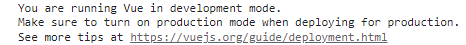

# 参考资料

- 视频链接：https://www.bilibili.com/video/BV1Zy4y1K7SH


- Vue官网：https://cn.vuejs.org/


# 插件

VS插件：

- Live Server：会将整个项目作为端口为5500的服务器的资源

  

  

- Vue 3 Snippets


# Javascript基础

- ES6语法规范
- ES6模块化
- 包管理器：如npm
- 原型、原型链模式
- 数组的常用方法
- axios
- promise


# 搭建Vue开发环境

## 安装Vue

https://cn.vuejs.org/v2/guide/installation.html

- 直接使用\<script>引入
  -   [开发版本](https://cn.vuejs.org/js/vue.js)包含完整的警告和调试模式
  -   [生产版本](https://cn.vuejs.org/js/vue.min.js)删除了警告
- NPM结合Vue-cli工具

> 当引入Vue后，***多了一个Vue的构造函数***


若想关闭此提示：设置[productionTip](https://cn.vuejs.org/v2/api/#productionTip)为false即可：



```html
<script>
    Vue.config.productionTip = false;	//阻止 vue 在启动时生成生产提示
</script>
```


## 安装Vue Devtools

即Vue开发者工具

https://github.com/vuejs/devtools#vue-devtools


# helloworld项目

1. 准备Vue容器

2. 根据传入的配置对象，创建Vue实例

   > 通常配置对象的名称固定，数据类型固定

   > 配置对象的el属性，用于绑定dom节点

3. 使用Vue插值语法，从Vue实例中获取数据

   > Vue容器中的Vue代码，称为***Vue模板***


```html
<!DOCTYPE html>
<html>

<head>
    <meta charset=UTF-8>
    <title>Hello World!</title>
    <script src="../js/vue.js"></script>
</head>

<body>
    <!-- 为Vue准备一个容器 -->
    <div id="root">

        <!-- Vue的插值语法 -->
        <h1>hello,{{name}}</h1>
    </div>

    <script type="text/javascript">
        Vue.config.productionTip = false;

        //根据配置对象，创建Vue对象实例
        new Vue({

            // el:document.getElementById("#root");
            el: "#root", //通常为CSS选择器的字符串

            data: {  //自定义数据对象
                name: 'zhangsan'
            },
        });

    </script>
</body>

</html>
```


## 细节问题

- Vue实例和Dom节点是一对一的关系（即第一个Dom节点）

  真实开发中只有一个Vue实例，同时配合多个Vue组件使用

- Vue插值`{{ }}`中，可以写JS表达式

  ***此处可以自动读取到data对象中定义的属性***，例如`{{name.toUpperCase()}}`


# 模板语法

## 插值语法`{{ }}`

插值语法，***用于标签体内容***


`{{ }}`中应为JS表达式。特别的，可以引用Vue实例的属性及Vue实例原型的属性

>Vue的data对象中定义的属性，将变成Vue实例的属性


## 指令语法

指令语法，***用于解析标签***，包括：

- 标签属性
- 标签体内容
- 绑定事件
- ....


### 例如v-bind指令

> 只要是标签的属性，就支持v-bind指令
>
> ```html
> <div v-bind:hh="hh"></div>
> ```


> 特别的，`v-bind:`指令可以简写为`:`


在使用v-bind指令后，`v-bind:href="url"`中的url，将***被当作JS表达式被执行***

```html
<!DOCTYPE html>
<html lang="en">
<head>
    <meta charset="UTF-8">
    <title>Document</title>
    
    <script src="../js/vue.js"></script>
</head>
<body>
    <div id="root">
        <a v-bind:href="url">点击跳转至百度</a>
    </div>

    <script>
        new Vue({
            el:"#root",
            data:{
                url:"https://www.baidu.com/",
            },
        });

    </script>
</body>
</html>
```


# 数据绑定

## 单向绑定（v-bind指令）

即***仅支持Vue实例中的数据流向HTML页面***


```html
<!DOCTYPE html>
<html lang="en">
<head>
    <meta charset="UTF-8">
    <title>Document</title>
    
    <script src="../js/vue.js"></script>
</head>
<body>
    <div id="root">
        单向数据绑定：<input type="text" v-bind:value="name">
    </div>


    <script>
        new Vue({
            el:"#root",
            data:{
                name:"尚硅谷",
            },
        });
    </script>
</body>
</html>
```


## 双向绑定（v-model指令）

注意，`v-model`指令仅可使用在表单类（输入类）元素[^1]上：

[^1]: 即具有value属性的元素

- input
- checkbox
- radio
- select
- ...


> `v-model:value`，可以简写为`v-model`，因为v-model默认收集的就是value值


```html
<!DOCTYPE html>
<html lang="en">
<head>
    <meta charset="UTF-8">
    <title>Document</title>
    
    <script src="../js/vue.js"></script>
</head>
<body>
    <div id="root">
        双向数据绑定：<input type="text" v-model:value="name">
    </div>


    <script>
        new Vue({
            el:"#root",
            data:{
                name:"尚硅谷",
            },
        });
    </script>
</body>
</html>
```


# el属性和data属性的两种写法

el属性：

- 方式一：

  ```html
  <script>
      new Vue({
          el: "#root",
          data: {
              name:'尚硅谷',
          },
      });
  </script>
  ```

- 方式二：

  > Vue对象的，以$开头的属性名，是给用户自定义的

  ```html
  <script>
      const v = new Vue({
          data: {
              name:'尚硅谷',
          },
      });
  
      v.$mount("#root");
  </script>
  ```

  


data属性：

- 对象式：

  ```html
  <script>
      new Vue({
          el: "#root",
          data: {
              name:'尚硅谷',
          },
      });
  </script>
  ```

- 函数式：

  > - 此函数必须返回一个对象
  > - 此函数不能是箭头函数

  ```html
  <script>
      new Vue({
          el: "#root",
          data:function(){
  
              //此处的this为Vue实例对象
              return {
                  name:"尚硅谷",
              };
          },
      });
  </script>
  ```

  


# MVVM模型

https://www.bilibili.com/video/BV1Zy4y1K7SH?p=10&spm_id_from=pageDriver


- M：模型（Model），一般JS对象，***对应Vue实例的data属性***

- V：视图（view），模板，***对应着HTML页面***

- VM：视图模型（ViewModel），***对应着Vue实例对象***

  > 因此往往用变量名vm，命名Vue实例


# 数据代理

## Object.defineproperty()方法的基本配置

通过使用`Object.defineproperty()`方法实现

```html
<script>
    let person = {
        name:'zhangsan',
        sex:'male',
    };


    Object.defineProperty(person,'age',{
        value:18,
        enumerable:true,
        writable:true,
        configurable:true,
    });
</script>
```


> 若配置项对象中无enumerable为true，则以这种方式添加的属性，***是不可被枚举的***
>
> ```html
> <script>
>  //以下两种方式不能获取到age属性
> 
>  console.log(Object.keys(person));
> 
>  for(let key in person){
>      console.log(person[key]);
>  }
> </script>
> ```

>若配置项对象中无writable为true，则以这种方式添加的属性，***是不可被修改的***

> 若配置项对象中无configurable为true，则以这种方式添加的属性，***是不可被删除的***
>
> ```html
> <script>
> 	delete person.age;
> </script>
> ```


##Object.defineproperty()方法的setter和getter

```html
<script>
    let age = 18;
    let person = {
        name:'zhangsan',
        sex:'male',
    };

    Object.defineProperty(person,'age',{
        //当有人读取person对象的age属性时，该方法被调用，返回值将成为age的值
        get:function(){
            return age;
        },

        //当有人修改Person对象的age属性时，该方法被调用，value即为待修改值
        set(value){
            console.log(value);
            age = value;	//注意，person对象的age属性来源于age变量
        },
    });
</script>
```


## 数据代理

数据代理：使用一个对象，代理另一个对象的读写操作

```html
<script>
    let obj1 = { x: 100 };
    let obj2 = { y: 100 };

    Object.defineProperty(obj2, 'x', {
        get() {
            return obj1.x;
        },

        set(value) {
            obj1.x = value;
        }
    });
</script>
```


## Vue中的数据代理

```html
<script>
    let data = {
        name : 'xiaowang'
    };

    let vm = new Vue({
        el:"#root",
        data
    });
</script>
```

> Vue实例的_data属性，即为传入的配置对象的data属性。即存在`vm._data === data`;


小总结：

1. 创建Vue实例时的配置对象，其data属性将被赋值给Vue实例的_data属性

2. 采用数据代理的方式，将Vue实例的_data属性，直接由Vue实例代理

   >***这一步的目的是简化编码***

   

   


# 事件处理

## v-on指令

- 使用`v-on:xxx`指令（简写为`@xxx`），其中xxx为事件名（如click）

- 事件的回调函数，需要配置在methods对象中，并且最终会出现在Vue实例上。

  > 回调函数也可以配置在data对象上，但会对其进行数据代理和数据劫持

- 若回调函数不是箭头函数，则函数中的this指向Vue实例

- 关于参数传递问题：

  - 使用`$event`占位符，以传递PointerEvent对象


```html
<div id="root">
    <button v-on:click="showInfo(100,$event)">click me to alert msg</button>
</div>

<script>
    const vm = new Vue({
        el:"#root",
        data:{},
        methods:{
            showInfo(a,$event){
                console.log(event);         //event为一个PointerEvent对象
                console.log(this === vm);   //this为此Vue实例
            }
        },
    });
</script>

```


## 事件修饰符

- prevent : 阻止事件的默认行为 event.preventDefault() 

  ```html
  <div id="root">
      <a href="https://www.baidu.com" @click.prevent="showInfo">click me</a>
  </div>
  
  
  <script>
      new Vue({
          el:"#root",
          methods:{
              showInfo(event){
                  alert("hello");
                  //event.preventDefault();
              }
          }
      });
  </script>
  ```

- stop : 停止事件冒泡 event.stopPropagation()

  ```html
  <div id="root">
      <div @click="showInfo">
          <button @click.stop="showInfo">click me</button>
      </div>
  </div>
  
  
  <script>
      new Vue({
          el: "#root",
          methods: {
              showInfo(event) {
                  alert("hello");
  
                  // event.stopPropagation();
              }
          }
      });
  </script>
  ```

- once：事件只触发一次

- capture：使用事件的捕获模式

- self：只要event.target是当前操作的元素时，才触发事件

- passive：事件的默认行为立即执行，无需等待事件回调执行完毕


## 按键修饰符

只有满足条件时，才触发回调函数

- 有别名的：

  - enter

  - delete：删除（删除和退格键）

  - esc

  - space

  - tab

    > tab键将在按下时切换焦点，因此要绑定tab键，使用keydown事件

  - up

  - down

  - left

  - right

- 无别名的：

  - 如caps-lock

  > ctrl, alt, shift, meta键为系统修饰键，比较特殊：
  >
  > - 配合keyup使用：按下修饰键的同时，再按下其他键，事件将触发于其他键抬起时
  > - 配合keydown使用：正常触发事件

- 使用键码：如@keyup.13（即回车）

- 使用键码，自定义别名：

  ```html
  <button @click.huiche="showInfo">click me</button>
  <script>
  	Vue.config.keyCodes.huiche = 13;
  </script>
  ```

  


```html
<div id="root">
    <input type="text" placeholder="请输入内容" @keyup.enter="showInfo">
</div>


<script>
    new Vue({
        el:"#root",
        methods:{
            showInfo(event){
                // 13是回车的ASCII编码
                // if (event.keyCode !== 13) return;

                console.log(event.target.value);
            }
        }
    });
</script>
```


# 计算属性与监视

## 计算属性

计算属性：`computed`

- 计算属性将***根据已有属性计算得来***

- 底层为Object.defineproperty()


> ***计算属性在使用时，不需要()***。
>
> 因为Vue使用数据代理，将计算属性对应的方法，转换成了Vue实例的属性


```html
<div id="root">
    姓：<input type="text" v-model="first"></br>
    名：<input type="text" v-model="second"></br>
    全名：<span>{{fullName}}</span>
</div>

<script>
    new Vue({
        el:"#root",
        data:{
            first:"张",
            second:"三",
        },
        computed:{
            fullName:{
                //当读取fullName属性时，调用该函数获取属性值
                get(){
                    return this.first + '-' + this.second;
                },

                set(value){
                    const arr = value.split('-');
                    this.first = arr[0];
                    this.second = arr[1];
                }
            }
        }
    });
</script>
```


关于getter被调用的时机：

- 初次读取fullName时
- 所依赖的数据，发生变化时

> 相较于methods的方式，计算属性能够提供缓存效果


计算属性的简写方式（必须保证只读不写）：

```html
<div id="root">
    姓：<input type="text" v-model="first"></br>
    名：<input type="text" v-model="second"></br>
    全名：<span>{{fullName}}</span>
</div>

<script>
    new Vue({
        el:"#root",
        data:{
            first:"张",
            second:"三",
        },
        computed:{
            fullName:{
                //相当于getter
                fullName:function(){
                    return this.first + '-' + this.second;
                }
            }
        }
    });
</script>
```


## 监视属性

通过 vm 对象的$watch()或 watch 配置来监视指定的属性。

***当属性变化时， 将使用新值和旧值自动调用回调函数***。

可以监视的属性：

- data属性
- computed属性


有两种写法：

- 初始化Vue实例时：

  ```html
  <script>
      const vm = new Vue({
          el: "#root",
          data: {
              isHot: true,
          },
          computed: {
              info() {
                  return this.isHot ? "炎热" : "凉爽";
              }
          },
          watch: {
              isHot:{
                  //若配置为true，则在初始化时就调用一次handler
                  //immediate:true,
  
                  //当isHot值被修改时，调用此函数
                  handler(newValue,oldValue){
                      console.log(oldValue,newValue)
                  }
              }
          },
          methods: {
              changeWeather() {
                  this.isHot = !this.isHot;
              }
          },
      });
  </script>
  ```

- 使用$watch：

  ```html
  <script>
      vm.$watch('isHot', {
          handler(newValue, oldValue) {
              console.log(oldValue, newValue)
          }
      });
  </script>
  ```

  

### 深度监视

Vue默认不进行深度监视，需要配置deep属性：

-  deep为false：只会监视numbers对象（即地址），并不会监视numbers对象内部

-  deep为true：会监视numbers对象内部的变化


```html
<body>
    <div id="root">
        <h1>a的值为：{{numbers.a}}</h1>
        <button @click="add_a">click me to add a</button>
    </div>


    <script>
        new Vue({
            el: "#root",
            data: {
                numbers: {
                    a: 1,
                    b: 2,
                },
            },
            methods: {
                add_a() {
                    this.numbers.a++;
                }
            },
            watch: {

                //监测多级结构中某个属性的变化
                'numbers.a':{
                    handler(newValue,oldValue){
                        console.log(newValue,oldValue);
                    },
                },

                //监视多级结构中所有属性的变化
                numbers:{
                    //deep为false：只会监视numbers对象（即地址），并不会监视numbers对象内部
                    //deep为true：会监视numbers对象内部的变化

                    deep:true,
                    handler(){},
                }
            },
        })
    </script>
</body>
```


### 监视的简写形式

仅配置handler函数时，可以使用简写形式

- 配置Vue实例方式：

  ```html
  <script>
      new Vue({
          el:"#root",
          data:{
              isHot:false,
          },
          watch:{
              isHot(newValue, oldValue){
                  //函数体
              },
          }
      });
  </script>
  ```

- $watch()方式：

  ```html
  <script>
      const vm = new Vue({
          el:"#root",
          data:{
              isHot:false,
          },
      });
  
      vm.$watch('isHot',function(newValue,oldValue){
          //函数体
      });
  </script>
  ```

  

## watch和computed对比

- watch和computed都可以完成功能
  - watch的特点是可以进行异步操作
  - computed的特点是实现功能比较便捷


# class 与 style 绑定

***class绑定与style绑定，需要使用`v-bind指令`***

## 绑定class

三种用法：

- 字符串写法
- 数组写法（样式名字符串组成的数组）
- 对象写法（对象的属性，为class名和布尔值）


```html
<body>
    <div id="root">
        <!-- v-bind:指令，简写为: -->
        <div class="basic" :class="mood" @click="changeMood">
            {{name}}
        </div>

        <div class="basic" :class="classArr">
            {{name}}
        </div>

        <div class="basic" :class="classObj">
            {{name}}
        </div>
    </div>


    <script>
        new Vue({
            el:"#root",
            data:{
                name:'xiaowang',
                
                //字符串写法
                mood:"normal",
                //数组写法
                classArr:['atguigu1','atguigu2','atguigu3'],
                //对象写法
                classObj:{
                    atguigu1:true,
                    atguigu2:true,
                }
            },
            methods: {
                changeMood(){
                    const arr = ["happy","sad","normal"];
                    const randomIndex = Math.floor(Math.random()*3);
                    this.mood = arr[randomIndex];
                }
            },
        });

    </script>
</body>
```


## 绑定style

两种用法：

- 对象写法（对象的属性，即为style名和样式值）
- 数组写法（数组内的每一个元素，是一个对象）


```html
<body>
    <div id="root">
        
        <div class="basic" :style="styleObj">{{name}}</div>
        <div class="basic" :style="styleArr">{{name}}</div>
    </div>
</body>

<script type="text/javascript">
    Vue.config.productionTip = false

    const vm = new Vue({
        el:'#root',
        data:{
            name:'尚硅谷',
            
            //对象写法
            styleObj:{
                backgroundColor:'orange'
            },
            //数组写法
            styleArr:[
                {
                    fontSize: '40px',
                    color:'blue',
                },
                {
                    backgroundColor:'gray'
                }
            ]
        }
    })
</script>
```


# 渲染相关

## 条件渲染

- `v-if`指令，`v-else-if`指令，`v-else`指令：

  若条件不满足，则该dom节点将不存在于html页面

- `v-show`指令：

  若条件不满足，则设置该节点的样式为：**display:none**

> v-show更适用于节点切换频繁的情况


```html
<div id="root">
    <button @click="a++">click me to add a</button>

    <div v-if="a === 1">1</div>
    <div v-else-if="a === 2">2</div>
    <div v-else>not 1 or 2</div>

    <div v-show="a === 1">this div is shown</div>
</div>

<script>
    new Vue({
        el:"#root",
        data:{
            a:0,
        },
    });
</script>
```


特别的，***可以使用\<template>元素，其不会破坏HTML结构***：

```html
<div id="root">
    <button @click="flag = !flag;">click me</button>

    <template v-if="flag">
        <h1>a</h1>
        <h1>b</h1>
    </template>
</div>


<script>
    new Vue({
        el:"#root",
        data:{
            flag : true,
        },
    });
</script>
```

> template元素，仅可配置v-if指令使用


## 列表渲染

列表渲染，使用`v-for`指令：

- 遍历数组
- 遍历对象
- 遍历字符串
- 遍历指定次数


```html
<div id="root">
    <!-- 遍历数组 -->
    <ul>
        <li v-for="(p,index) in persons" v-bind:key="p.id">
            {{p.name}}-{{p.age}}
        </li>
    </ul>

    <!-- 遍历对象 -->
    <ul>
        <li v-for="(propValue,propName) in car" :key="propName">
            {{propName}}-{{propValue}}
        </li>
    </ul>

    <!-- 遍历字符串 -->
    <ul>
        <li v-for="(c,index) in str" :key="index">
            {{c}}-{{index}}
        </li>
    </ul>

    <!-- 遍历指定次数 -->
    <ul>
        <li v-for="(num,index) of 5" :key="index">
            {{num}}-{{index}}
        </li> 
    </ul>
</div>


<script>
    new Vue({
        el: "#root",
        data: {
            persons: [
                { id: 1, name: 'zhangsan', age: 18 },
                { id: 2, name: 'lisi', age: 19 },
                { id: 3, name: 'wangwu', age: 20 },
            ],

            car:{
                name:"奥迪",
                price:"70W"
            },

            str:"abcdefg",
        },
    });
</script>
```


### key的作用与原理

- 虚拟DOM中key的作用：

  ***key是虚拟DOM对象的唯一标识***，Vue会对key值相同的“新虚拟DOM”和“旧虚拟DOM”进行diff算法，从而更新虚拟DOM对象中不相同的虚拟DOM节点，而保留相同的虚拟机DOM节点。

  > 用户的输入，是保留在真实DOM中的；在虚拟DOM中，input框是相同的

> 特别的，若未指定key，则默认使用index作为key


在实践上：

- 数据存在标识，则使用其作为key
- 若无逆序删除、增加操作，可以使用index作为key


经典的问题案例：

```html    <div id="root">
<div id="root">
    <button @click.once="addPerson">click me to add a person</button>

    <ul>
        <li v-for="(p,index) in persons" v-bind:key="index">
            {{p.name}}-{{p.age}}
            <input type="text">
        </li>
    </ul>
</div>


<script>
    new Vue({
        el: "#root",
        data: {
            persons: [
                { id: 1, name: 'zhangsan', age: 18 },
                { id: 2, name: 'lisi', age: 19 },
                { id: 3, name: 'wangwu', age: 20 },
            ],
        },
        methods: {
            addPerson(){
                const p ={id: 4, name: 'zhaosi', age: 18};
                this.persons.unshift(p);

            },
        },
    });
</script>
```

问题分析：


###案例——列表过滤

```html
<div id="root">
    <input type="text" placeholder="请输入名字" v-model="keyword">

    <ul>
        <li v-for="p in filterPersons" :key="p.id">
            {{p.name}}-{{p.age}}-{{p.sex}}
        </li>
    </ul>
</div>


<script>
    //计算属性实现
    new Vue({
        el: "#root",
        data: {
            keyword: '',
            persons: [
                { id: 1, name: "马冬梅", age: 18, sex: '女' },
                { id: 2, name: "周冬雨", age: 19, sex: '女' },
                { id: 3, name: "周杰伦", age: 20, sex: '男' },
                { id: 4, name: "温兆伦", age: 21, sex: '男' },
            ],
        },
        computed:{
            filterPersons(){
                return this.persons.filter((p)=>{
                    return p.name.indexOf(this.keyword) != -1;
                });
            }
        }
    });


    //watch实现
    // new Vue({
    //     el: "#root",
    //     data: {
    //         keyword: '',
    //         persons: [
    //             { id: 1, name: "马冬梅", age: 18, sex: '女' },
    //             { id: 2, name: "周冬雨", age: 19, sex: '女' },
    //             { id: 3, name: "周杰伦", age: 20, sex: '男' },
    //             { id: 4, name: "温兆伦", age: 21, sex: '男' },
    //         ],
    //         filterPersons: [],
    //     },
    //     watch: {
    //         keyword: {
    //             immediate: true,
    //             handler: function (val) {
    //                 //filter不影响原数组，返回新的结果数组
    //                 this.filterPersons = this.persons.filter((p) => {
    //                     //p为Persons数组的一个对象元素
    //                     return p.name.indexOf(val) !== -1;
    //                 });
    //             }
    //         }
    //     }
    // });
</script>
```


### 案例——列表排序

```html
<div id="root">
    <input type="text" placeholder="请输入名字" v-model="keyword">
    <button @click="sortType = 2 ">按年龄升序</button>
    <button @click="sortType = 1">按年龄降序</button>
    <button @click="sortType = 0">按年龄原序</button>


    <ul>
        <li v-for="p in filterPersons" :key="p.id">
            {{p.name}}-{{p.age}}-{{p.sex}}
        </li>
    </ul>
</div>


<script>
    //计算属性实现
    new Vue({
        el: "#root",
        data: {
            keyword: '',
            sortType: 0,    //0为原顺序；1降序；2升序
            persons: [
                { id: 1, name: "马冬梅", age: 18, sex: '女' },
                { id: 2, name: "周冬雨", age: 19, sex: '女' },
                { id: 3, name: "周杰伦", age: 20, sex: '男' },
                { id: 4, name: "温兆伦", age: 21, sex: '男' },
            ],
        },
        computed: {
            filterPersons() {
                const arr = this.persons.filter((p) => {
                    return p.name.indexOf(this.keyword) != -1;
                });


                if (this.sortType) {
                    arr.sort((p1, p2) => {
                        return this.sortType === 1 ? p2.age - p1.age : p1.age - p2.age;
                    });
                }

                return arr;
            }
        }
    });
</script>
```


# Vue检测数据变化的原理（数据劫持）

数据劫持：能够监测到这个对象的数据变化的一种设计模式


## 监测对象的基本原理

基本原理：

```html
<script>

    //构造函数
    function Observer(obj) {
        const keys = Object.keys(obj);

        keys.forEach((k) => {
            //this即当前的Observer实例对象
            Object.defineProperty(this, k, {
                get() {
                    return obj[k];
                },
                set(val) {
                    //使用diff算法，更新虚拟DOM
                    obj[k] = val;
                }
            });
        });
    };


    let data = {
        name: '尚硅谷',
        address: '北京',
    };

    const obs = new Observer(data);
    let vm = {};
    vm._data = obs;
</script>
```

> 相较于此案例，Vue更完善在：
>
> - Vue对_data对象也做了数据代理
> - 除了直接可见的对象：
>   - data对象中的对象，也做了defineProperty
>   - data数组中的对象，也做了defineProperty


## Vue.set()

```html
<script>
    const vm = new Vue({
        el:"#root",
        data:{
            student:{
                name:'tom',
                age:18,
            }
        },
    });

    // not work：因为没有对应的setter
    // vm.student.sex = '男';

    //下面两种都可以
    Vue.set(vm.student,'sex','男');
    vm.$set(vm.student,'sex','男');
</script>
```


但此方法，***不能用于给Vue实例追加属性***：

```html
<script>
    const vm = new Vue({
    el:"#root",
    data:{
    name:'xiaowang',
    },
    });

    //下面两种都将报错：不能给Vue实例追加属性
    Vue.set(vm,'sex','男');
    vm.$set(vm,'sex','男');
</script>
```


## 监测数组内元素变化的基本原理

```html
<div id="root">

    <h2>姓名：{{student.name}}</h2>
    <ul>
        <li v-for="(h,index) in student.hobbies" :key="index">
            {{h}}
        </li>
    </ul>

</div>


<script>
    const vm = new Vue({
        el: "#root",
        data: {
            student: {
                name: 'tom',
                hobbies: ['乒乓球', '羽毛球', '篮球'],
            },
        },
    });
</script>
```

- 通过数组的索引修改数组内的数据时，由于没有相应的setter，Vue无法监测到数据变化：

  

- ***仅当使用API操作数组内的元素时，Vue才可监测到变化***：

  - push
  - pop
  - shift
  - unshift
  - splice
  - sort
  - reverse

  > 这些方法的共同特点是：可以改变原数组。诸如filter方法是不改变原数组的

  > 事实上，也可以使用Vue.set()方法：
  >
  > ```js
  > Vue.set(vm.student.hobbies,1,'打台球');
  > ```


原理：

***这些方法不再是Array.prototype上的方法，而是包装后的方法***。[官网链接](https://cn.vuejs.org/v2/guide/list.html#%E5%8F%98%E6%9B%B4%E6%96%B9%E6%B3%95)


## 经典的not work案例

```html
<body>
    <div id="root">
        <button @click="updateData">点击更新</button>
        <ul>
            <li v-for="p in persons" :key="p.id">
                {{p.name}}-{{p.age}}-{{p.sex}}
            </li>
        </ul>
    </div>

    <script>
        new Vue({
            el: "#root",
            data: {
                keyword: '',
                persons: [
                    { id: 1, name: "马冬梅", age: 18, sex: '女' },
                    { id: 2, name: "周冬雨", age: 19, sex: '女' },
                    { id: 3, name: "周杰伦", age: 20, sex: '男' },
                    { id: 4, name: "温兆伦", age: 21, sex: '男' },
                ],
            },
            methods: {
                updateData() {
                    //ok
                    // this.persons[0].age = 25;

                    //not work
                    // this.persons[0] = { id: 1, name: "马冬梅", age: 25, sex: '女' };
                    this.persons.splice(0,1,{ id: 1, name: "马冬梅", age: 25, sex: '女' });
                }
            },
        });
    </script>
</body>
```


## 总结

- Vue会监视data中的所有层次的数据

- Vue如何监测对象中的数据变化：

  - 递归的对data中的所有对象，利用Object.defineproperty()实现数据代理

  - 如何追加对象：

    ```html
    <script>
        Vue.set(target,propertyName/index,value);
        vm.$set(target,propertyName/index,value);
    </script>
    ```

    > 注意，这两个方法不能对 vm对象 或 vm的根数据对象_data追加

- Vue如何监测***数组中元素***的变化：

  对原生的Array.prototype的方法进行了包装

  > 注意：
  >
  > - 对于整个数组对象，仍利用Object.defineproperty()实现的数据代理机制
  > - 对于数组中某个对象元素，采用的是数据代理
  > - 只有对诸如 `更改第k个元素为一个新元素`、`增加新元素`时，才利用到包装机制


# 收集表单数据

https://www.bilibili.com/video/BV1Zy4y1K7SH?p=38&spm_id_from=pageDriver


```html
<body>
    <div id="root">

        <form @submit.prevent ="submit">
            <!-- 普通input框 -->
                <!-- 去掉前后空格 -->
            账号：<input type="text" v-model.trim="userInfo.account"> <br/>
            密码：<input type="password" v-model="userInfo.password"> <br/>
                <!-- 将输入的数据，绑定为number类型数据 -->
            年龄：<input type="number" v-model.number="userInfo.age"><br/>

            <!-- 单选框 -->
            性别：
                男<input type="radio" name="sex" value="male" v-model="userInfo.sex">
                女<input type="radio" name="sex" value="female" v-model="userInfo.sex"><br/>

            <!-- 复选框 -->
            爱好：
                学习<input type="checkbox" name="hobby" value="learning" v-model="userInfo.hobby">
                运动<input type="checkbox" name="hobby" value="sport" v-model="userInfo.hobby">
                看视频<input type="checkbox" name="hobby" value="watchVideo" v-model="userInfo.hobby">  </br>

            <!-- 下拉列表 -->
            所属校区：
            <select v-model="userInfo.belongCity">
                <option value="">请选择校区</option>
                <option value="beijing">北京</option>
                <option value="shanghai">上海</option>
                <option value="shenzhen">深圳</option>
            </select>   </br>

            <!-- textarea -->
            其他信息：
            <textarea v-model="userInfo.otherInfo"></textarea> <br>

            <!-- 没有value属性的复选框 -->
                <!-- 当失去焦点时，才更新绑定数据 -->
            <input type="checkbox" v-model.lazy="userInfo.agree">阅读并接受<a href="http://www.baidu.com">《用户协议》</a>
            <button>提交</button>
        </form>

    </div>


    <script>
        new Vue({
            el:"#root",
            data:{
                userInfo:{
                    account:'',
                    password:'',
                    age:'',
                    sex:'male',   //默认勾选male
                    hobby:[],     //hobby的初始值能够影响接下来Vue的行为。
                    belongCity:'beijing',    //默认选择北京
                    otherInfo:'',
                    agree:'',
                }
            },
            methods: {
                submit(){
                    //通过.prevent阻止表单提交的默认行为：刷新页面

                    //最好不要直接访问this._data，而是应该将数据放在一个对象里
                    // let json_data = JSON.stringify(this._data);

                    console.log("表单提交");
                    let json_data = JSON.stringify(this.userInfo);

                    console.log(json_data);
                }
            },
        });

    </script>
</body>
```


效果如下：


 

> 回顾：v-model指令，收集的是html元素的value属性

- type="text"：v-model收集的即为用户输入的数据

- type="raido"：

  - 若该input元素未配置value属性，则收集的为布尔值（即checked）
  - 若配置有value属性，则收集的是value属性

- type="checkbox"：

  - 若该input元素未配置value属性，则收集的为布尔值（即checked）

  - 若配置有value属性，则收集的是value属性

    > 注意，Vue的data的类型，会影响vue收集到的数据的类型：
    >
    > - ***若初始化为非数组：则收集的仍为checked***
    > - 若初始化为数组，则收集的是value组成的数组


v-model有三个修饰符：

- lazy：失去焦点时才收集数据
- number：将收集到的字符串转为有效的数字
- trim：去除字符串首尾空格


# 过滤器

https://www.bilibili.com/video/BV1Zy4y1K7SH?p=39

