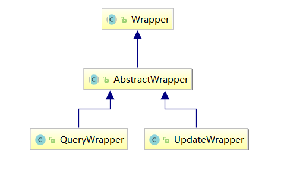

# 相关资料

- [视频教程](https://www.bilibili.com/video/BV1Bq4y1f7YD?spm_id_from=333.999.0.0&vd_source=be746efb77e979ca275e4f65f2d8cda3)

- [官网](https://mp.baomidou.com/ )


# 快速入门

- 数据库：

  ```sql
  CREATE TABLE `user` (
    `id` bigint(20) NOT NULL AUTO_INCREMENT COMMENT 'id',
    `user_name` varchar(20) NOT NULL COMMENT '用户名',
    `password` varchar(20) NOT NULL COMMENT '密码',
    `name` varchar(30) DEFAULT NULL COMMENT '姓名',
    `age` int(11) DEFAULT NULL COMMENT '年龄',
    `address` varchar(100) DEFAULT NULL COMMENT '地址',
    PRIMARY KEY (`id`)
  ) ENGINE=InnoDB AUTO_INCREMENT=5 DEFAULT CHARSET=utf8;
  
  insert  into `user`(`id`,`user_name`,`password`,`name`,`age`,`address`) values (1,'ruiwen','123','瑞文',12,'山东'),(2,'gailun','1332','盖伦',13,'平顶山'),(3,'timu','123','提姆',22,'蘑菇石'),(4,'daji','1222','妲己',221,'狐山');
  ```

- 依赖

  ```xml
  <parent>
      <groupId>org.springframework.boot</groupId>
      <artifactId>spring-boot-starter-parent</artifactId>
      <version>2.5.0</version>
  </parent>
  <dependencies>
      <dependency>
          <groupId>org.springframework.boot</groupId>
          <artifactId>spring-boot-starter-web</artifactId>
      </dependency>
      <dependency>
          <groupId>org.projectlombok</groupId>
          <artifactId>lombok</artifactId>
          <optional>true</optional>
      </dependency>
      <dependency>
          <groupId>org.springframework.boot</groupId>
          <artifactId>spring-boot-starter-test</artifactId>
          <scope>test</scope>
      </dependency>
  
      <dependency>
          <groupId>com.baomidou</groupId>
          <artifactId>mybatis-plus-boot-starter</artifactId>
          <version>3.4.3</version>
      </dependency>
      <dependency>
          <groupId>mysql</groupId>
          <artifactId>mysql-connector-java</artifactId>
      </dependency>
  </dependencies>
  ```

- User类：

  ```java
  @Data
  @NoArgsConstructor
  @AllArgsConstructor
  public class User {
      private Long id;
      private String userName;
      private String password;
      private String name;
      private Integer age;
      private String address;
  }
  ```

- application.yaml：

  ```yaml
  spring:
    datasource:
      url: jdbc:mysql://localhost:3306/mp_db?characterEncoding=utf-8&serverTimezone=UTC
      username: root
      password: root
      driver-class-name: com.mysql.cj.jdbc.Driver
  ```

- 启动类（**配置Mapper扫描**）：

  ```java
  @SpringBootApplication
  @MapperScan("com.sangeng.mapper")
  public class SGApplication {
      public static void main(String[] args) {
          SpringApplication.run(SGApplication.class,args);
      }
  }
  ```

- 创建Mapper接口：

  ```java
  public interface UserMapper extends BaseMapper<User> {
  }
  ```

- 获取Mapper进行测试：

  ```java
  @SpringBootTest
  public class MPTest {
  
      @Autowired
      private UserMapper userMapper;
  
      @Test
      public void testQueryList(){
          System.out.println(userMapper.selectList(null));
      }
  }
  ```

  

# 常用设置

## 设置表名映射规则

- 默认情况：表名即为实体类的类名

- 单独设置某个表的表名映射规则：

  在实体类的类名上加上`@TableName`注解进行标识：

  ```java
  @TableName("tb_user")
  public class User {
  	//....
  }
  ```

- 全局设置表名前缀：
  ```yaml
  mybatis-plus:
    global-config:
      db-config:
        #表名前缀
        table-prefix: tb_
  ```

  

## 设置主键映射规则

### 单独对表设置

- **默认情况下**，使用MP插入数据时，若未指定主键生成策略，则为**基于雪花算法的自增ID**。
- 如果我们需要使用别的策略可以在定义实体类时，在代表主键的字段上加上`@TableId`注解，使用其`type`属性指定主键生成策略。


全部主键策略定义在了枚举类`IdType`中，`IdType`有如下的取值：

- `AUTO`

  数据库ID自增，**依赖于数据库**。该类型请确保数据库设置了 ID自增，否则无效

- `NONE`

  未设置主键类型。若在代码中没有手动设置主键，则会根据**主键的全局策略**自动生成（默认的主键全局策略是基于雪花算法的自增ID）

- `INPUT`

  需要手动设置主键，若不设置。插入操作生成SQL语句时，主键这一列的值会是null。

- `ASSIGN_ID`

  当没有手动设置主键，即实体类中的主键属性为空时，才会自动填充，使用雪花算法

- `ASSIGN_UUID`

  当实体类的主键属性为空时，才会自动填充，使用UUID


### 全局设置

```yaml
mybatis-plus:
  global-config:
    db-config:
      # id生成策略 auto为数据库自增
      id-type: auto
```


## 设置字段映射规则

- 默认情况：以实体类的属性名，映射表的列名

- 如不一致，可以使用`@TableField`注解的`value`属性去设置映射关系

  ```java
  @TableField("address")
  private String addressStr;
  ```

  

## 设置字段和列名的驼峰映射

- **默认情况下**，MP会**开启**字段名列名的驼峰映射：

  即从经典数据库列名 A_COLUMN（下划线命名），到经典 Java 属性名 aColumn（驼峰命名） 的类似映射 。

- 如果需要关闭我们可以使用如下配置进行关闭：

  ```yaml
  mybatis-plus:
    configuration:
  	#是否开启自动驼峰命名规则（camel case）映射，即从经典数据库列名 A_COLUMN（下划线命名） 到经典 Java 属性名 aColumn（驼峰命名） 的类似映射
      map-underscore-to-camel-case: false
  ```

  

## 日志

application.yaml：
```yaml
mybatis-plus:
  configuration:
    # 日志
    log-impl: org.apache.ibatis.logging.stdout.StdOutImpl
```


# 条件构造器Wrapper

我们在实际操作数据库的时候会涉及到很多的条件。所以MP为我们提供了一个功能强大的条件构造器 `Wrapper` 。使用它可以让我们非常方便的构造条件。


其继承体系如下：



- `AbstractWrapper`中提供了很多用于构造Where条件的方法。
- `QueryWrapper`则额外提供了用于针对Select语法的`select`方法。可以用来设置查询哪些列
- `UpdateWrapper`则额外提供了用于针对SET语法的`set`方法。可以用来设置对哪些列进行更新

>完整的AbstractWrapper方法可以参照：https://baomidou.com/guide/wrapper.html#abstractwrapper


实现类：

- QueryWrapper
- UpdateWrapper
- LambdaQueryWrapper


## 常用AbstractWrapper方法

> eq：equals，等于
> gt：greater than ，大于 >
> ge：greater than or equals，大于等于≥
> lt：less than，小于<
> le：less than or equals，小于等于≤
> between：相当于SQL中的BETWEEN
> like：模糊匹配。like("name","黄")，相当于SQL的name like '%黄%'
> likeRight：模糊匹配右半边。likeRight("name","黄")，相当于SQL的name like '黄%'
> likeLeft：模糊匹配左半边。likeLeft("name","黄")，相当于SQL的name like '%黄'
> notLike：notLike("name","黄")，相当于SQL的name not like '%黄%'
> isNull
> isNotNull
> and：SQL连接符AND
> or：SQL连接符OR
>
> in: in(“age",{1,2,3})相当于 age in(1,2,3)
>
> groupBy: groupBy("id","name")相当于 group by id,name
>
> orderByAsc :orderByAsc("id","name")相当于 order by id ASC,name ASC
>
> orderByDesc :orderByDesc ("id","name")相当于 order by id DESC,name DESC


示例：

- 示例一：

  ```sql
  SELECT 
  	id,user_name,PASSWORD,NAME,age,address 
  FROM 
  	USER 
  WHERE 
  	age > 18 AND address = '狐山'
  ```

  ```java
  @Test
  public void testWrapper01(){
      QueryWrapper wrapper = new QueryWrapper();
      wrapper.gt("age",18);
      wrapper.eq("address","狐山");
      List<User> users = userMapper.selectList(wrapper);
      System.out.println(users);
  }
  ```

- 示例二：

  ```sql
  SELECT 
  	id,user_name,PASSWORD,NAME,age,address 
  FROM 
  	USER 
  WHERE 
  	id IN(1,2,3) AND 
  	age BETWEEN 12 AND 29 AND 
  	address LIKE '%山%'
  ```

  ```java
  @Test
  public void testWrapper02(){
      QueryWrapper<User> wrapper = new QueryWrapper<>();
      wrapper.in("id",1,2,3);
      wrapper.between("age",12,29);
      wrapper.like("address","山");
      List<User> users = userMapper.selectList(wrapper);
      System.out.println(users);
  }
  ```

  

## 常用QueryWrapper方法

QueryWrapper的 select 可以设置要查询的列。


### 示例一 

> select(String... sqlSelect) 方法的测试为要查询的列名

SQL语句如下：

~~~~mysql
SELECT 
	id,user_name
FROM 
	USER 
~~~~

MP写法如下：

~~~~java
    @Test
    public void testSelect01(){
        QueryWrapper<User> queryWrapper = new QueryWrapper<>();
        queryWrapper.select("id","user_name");
        List<User> users = userMapper.selectList(queryWrapper);
        System.out.println(users);
    }
~~~~


### 示例二

> select(Class<T> entityClass, Predicate<TableFieldInfo> predicate)

方法的第一个参数为实体类的字节码对象，第二个参数为Predicate类型，可以使用lambda的写法，过滤要查询的字段 (主键除外) 。


SQL语句如下：

~~~~mysql
SELECT 
	id,user_name
FROM 
	USER 
~~~~

MP写法如下：

~~~~java
    @Test
    public void testSelect02(){
        QueryWrapper<User> queryWrapper = new QueryWrapper<>();
        queryWrapper.select(User.class, new Predicate<TableFieldInfo>() {
            @Override
            public boolean test(TableFieldInfo tableFieldInfo) {
                return "user_name".equals(tableFieldInfo.getColumn());
            }
        });
        List<User> users = userMapper.selectList(queryWrapper);
        System.out.println(users);
    }
~~~~


### 示例三

> select(Predicate<TableFieldInfo> predicate)

方法第一个参数为Predicate类型，可以使用lambda的写法，过滤要查询的字段 (主键除外) 。


SQL语句如下：

~~~~mysql
SELECT 
	id,user_name,PASSWORD,NAME,age 
FROM 
	USER
~~~~

就是不想查询address这列，其他列都查询了


MP写法如下：

~~~~java
    @Test
    public void testSelect03(){
        QueryWrapper<User> queryWrapper = new QueryWrapper<>(new User());
        queryWrapper.select(new Predicate<TableFieldInfo>() {
            @Override
            public boolean test(TableFieldInfo tableFieldInfo) {
                return !"address".equals(tableFieldInfo.getColumn());
            }
        });
        List<User> users = userMapper.selectList(queryWrapper);
        System.out.println(users);
    }
~~~~


## 常用UpdateWrapper方法

- 使用update方法时可以创建一个实体类对象传入，用来指定要更新的列及对应的值。

  但是如果需要更新的列比较少时，创建这么一个对象显的有点麻烦和复杂。

- 可以使用UpdateWrapper的set方法来设置要更新的列及其值。

  同时这种方式也可以使用Wrapper去指定更复杂的更新条件。


示例：

```sql
UPDATE 
	USER
SET 
	age = 99
where 
	id > 1
```

```java
@Test
public void testUpdateWrapper(){
    UpdateWrapper<User> updateWrapper = new UpdateWrapper<>();
    updateWrapper.gt("id",1);
    updateWrapper.set("age",99);
    userMapper.update(null,updateWrapper);
}
```


## Lambda条件构造器

- 在之前使用条件构造器时，列名都是以字符串指定。这种方式无法在编译期确定列名的合法性。


- 所以MP提供了一个Lambda条件构造器可以让我们直接**以实体类的方法引用的形式来指定列名**。这样就可以弥补上述缺陷。


示例：

```java
SELECT 
	id,user_name,PASSWORD,NAME,age,address 
FROM 
	USER 
WHERE 
	age > 18 AND address = '狐山'
```

- 之前的条件构造器写法：

  ```java
  @Test
  public void testLambdaWrapper(){
      QueryWrapper<User> queryWrapper = new QueryWrapper();
      queryWrapper.gt("age",18);
      queryWrapper.eq("address","狐山");
      List<User> users = userMapper.selectList(queryWrapper);
  }
  ```

- Lambda条件构造器写法：

  ```java
  @Test
  public void testLambdaWrapper2(){
      LambdaQueryWrapper<User> queryWrapper = new LambdaQueryWrapper<>();
      queryWrapper.gt(User::getAge,18);
      queryWrapper.eq(User::getAddress,"狐山");
      List<User> users = userMapper.selectList(queryWrapper);
  }
  ```

  


# 自定义SQL

## 仅Mybatis方式

- 定义Mapper接口：

  ```java
  public interface UserMapper extends BaseMapper<User> {
  
      User findMyUser(Long id);
  }
  ```

- 配置mapper映射文件的存放目录：

  ```yaml
  mybatis-plus:
    mapper-locations: classpath*:/mapper/**/*.xml
  ```

- 编写mapper映射文件：

  ```java
  <?xml version="1.0" encoding="UTF-8" ?>
  <!DOCTYPE mapper PUBLIC "-//mybatis.org//DTD Mapper 3.0//EN" "http://mybatis.org/dtd/mybatis-3-mapper.dtd" >
  <mapper namespace="com.sangeng.mapper.UserMapper">
  
      <select id="findMyUser" resultType="com.sangeng.domian.User">
         select * from user where id = #{id} 
      </select>
  </mapper>
  ```

  

## Mybatis结合条件构造器

- 在方法定义中添加Warpper类型的参数：

  ```java
  public interface UserMapper extends BaseMapper<User> {
  
      User findMyUserByWrapper(@Param(Constants.WRAPPER) Wrapper<User> wrapper);
  }
  ```

- 在SQL语句中获取Warpper拼接的SQL片段进行拼接：

  ```xml
  <select id="findMyUserByWrapper" resultType="com.sangeng.domian.User">
      select * from user ${ew.customSqlSegment}
  </select>
  ```

  > ###### 💡注意
  >
  > 使用${}


# 分页查询

1. 配置分页查询拦截器：

   ```java
   @Configuration
   public class PageConfig {
   
       /**
        * 3.4.0之前的版本
        * @return
        */
      /* @Bean
       public PaginationInterceptor paginationInterceptor(){
           return  new PaginationInterceptor();
       }*/
   
       /**
        * 3.4.0之后版本
        * @return
        */
      @Bean
      public MybatisPlusInterceptor mybatisPlusInterceptor(){
          MybatisPlusInterceptor mybatisPlusInterceptor = new MybatisPlusInterceptor();
          mybatisPlusInterceptor.addInnerInterceptor(new PaginationInnerInterceptor());
          return mybatisPlusInterceptor;
      }
   }
   ```

2. 进行分页查询：

   ```java
   @Test
   public void testPage(){
       IPage<User> page = new Page<>();
       //设置每页条数
       page.setSize(2);
       //设置查询第几页
       page.setCurrent(1);
       userMapper.selectPage(page, null);
       System.out.println(page.getRecords());//获取当前页的数据
       System.out.println(page.getTotal());//获取总记录数
       System.out.println(page.getCurrent());//当前页码
   }
   ```

   

如果是需要进行**多表查询的分页操作**，在方法的第一个形参定义为Page类型：
```java
public interface OrdersMapper extends BaseMapper<Orders> {

    IPage<Orders> findAllOrders(Page<Orders> page);
}
```


# 自动填充

使用 `@TableField` 的 `fill`  属性来设置字段的自动填充。

```java
public enum FieldFill {
    /**
     * 默认不处理
     */
    DEFAULT,
    /**
     * 插入填充字段
     */
    INSERT,
    /**
     * 更新填充字段
     */
    UPDATE,
    /**
     * 插入和更新填充字段
     */
    INSERT_UPDATE
}
```


使用步骤：

1. 在对应字段上添加注解：

   ```java
   @TableField(fill = FieldFill.INSERT_UPDATE)
   private LocalDateTime updateTime;
   
   @TableField(fill = FieldFill.INSERT)
   private LocalDateTime createTime;
   ```

2. 自定义填充处理器：

   ```java
   @Component
   public class MyMetaObjectHandler implements MetaObjectHandler {
       @Override
       public void insertFill(MetaObject metaObject) {
           this.setFieldValByName("createTime", LocalDateTime.now(), metaObject);
           this.setFieldValByName("updateTime", LocalDateTime.now(), metaObject);
       }
   
       @Override
       public void updateFill(MetaObject metaObject) {
           this.setFieldValByName("updateTime", LocalDateTime.now(), metaObject);
       }
   }
   ```


# 逻辑删除

MP支持逻辑删除的处理，只需：

- 配置逻辑删除的实体字段名，代表删除的字段值和代表未删除的字段值


```yaml
mybatis-plus:
  global-config:
    db-config:
      logic-delete-field: delFlag  # 全局逻辑删除的实体字段名
      logic-delete-value: 1 # 逻辑已删除值(默认为 1)
      logic-not-delete-value: 0 # 逻辑未删除值(默认为 0)
```

>3.3.0版本之前，需要在对应的字段上加上`@TableLogic`注解


# 乐观锁

- 乐观锁的思路：

  - 在表中增加一个version列。用来记录我们对每天记录操作的版本。

    每次对某条记录进行操作后，对应的版本也需要+1

  - 在每次要进行更新操作时，先查询对应数据的version值。在执行更新时， `set version = 老版本+1 where version = 老版本` 


使用步骤：

1. 配置：

   ```java
   @Configuration
   public class MybatisPlusConfig {
       /**
        * 旧版
        */
       @Bean
       public OptimisticLockerInterceptor optimisticLockerInterceptor() {
           return new OptimisticLockerInterceptor();
       }
       
       /**
        * 新版
        */
       @Bean
       public MybatisPlusInterceptor mybatisPlusInterceptor() {
           MybatisPlusInterceptor mybatisPlusInterceptor = new MybatisPlusInterceptor();
           mybatisPlusInterceptor.addInnerInterceptor(new OptimisticLockerInnerInterceptor());
           return mybatisPlusInterceptor;
       }
   }
   ```

2. 在实体类的字段上加上`@Version`注解：

   ```java
   @Version
   private Integer version;
   ```

3. 执行更新

   > 在执行更新前，实体类一定要有version值


# 多插件配置问题

在使用3.4.0版本以后的MP时，如果需要用到多个插件的话要注意：

在配置的时候只需要注入一个MybatisPlusInterceptor 对象，把插件对象添加到MybatisPlusInterceptor 对象中即可。


```java
@Bean
public MybatisPlusInterceptor mybatisPlusInterceptor() {
    MybatisPlusInterceptor interceptor = new MybatisPlusInterceptor();
    
    interceptor.addInnerInterceptor(new PaginationInnerInterceptor(DbType.MYSQL));
    interceptor.addInnerInterceptor(new OptimisticLockerInnerInterceptor());
    
    return interceptor;
}
```

