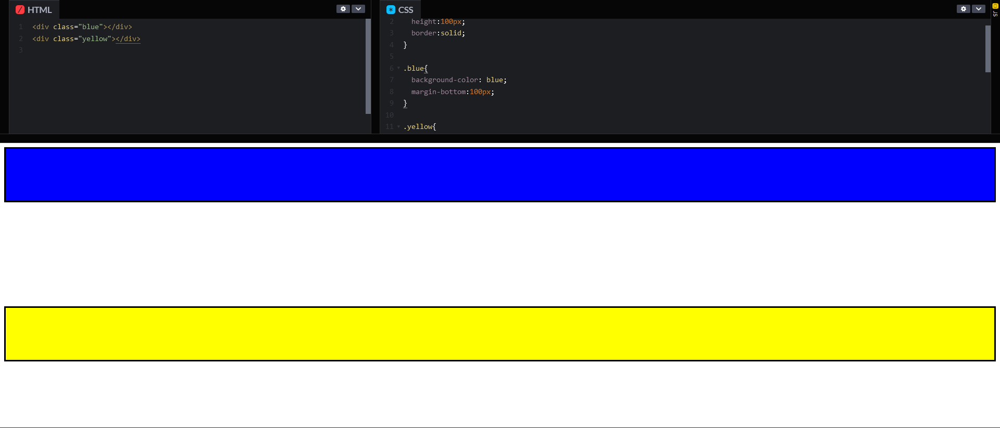
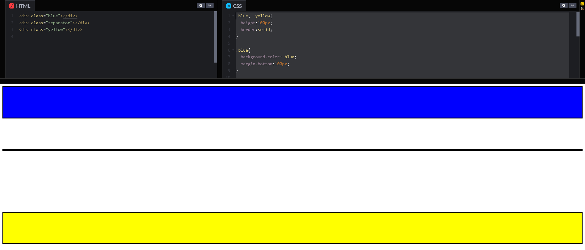

# 基础 CSS

## 设置字体大小

```css
h1 {
  font-size: 30px;
}
```


## 设置图片边框

```css
//即红色、5px宽的实线边框
.thin-red-border {
    border-color: red;
    border-width: 5px;
    border-style: solid;
}
```


特别的，`border-radius` 属性可以用来添加圆角边框。

> 其属性值既可以是px，又可以是百分比

```css
{
    //如下两种都可以
    border-width: 10px;
    border-width: 50%;
}

```


## 设置背景色

```css
.green-background {
  background-color: green;
}
```


## 内边距、外边距和边框

- [教程链接](https://chinese.freecodecamp.org/learn/responsive-web-design/basic-css/adjust-the-padding-of-an-element)

- [B站视频链接](https://www.bilibili.com/video/BV1WA411h7Y1)


在Box模型下，共有四种类别：


- **Margin(外边距)** ：即框线与<u>其他元素</u>之间的距离。
- **Border(边框)** ：即框线
- **Padding(内边距)** ：即内容与框线的距离。
- **Content(内容)** - 盒子的内容，显示文本和图像等

> 如背景颜色和超链接，生效的范围是border及其之内


### 当margin-bottom遇到margin-top



```css
.blue, .yellow{
  height:100px;
  border:solid;
}

.blue{
  background-color: blue;
  margin-bottom:100px;
}

.yellow{
  background-color: yellow;
  margin-top:200px;
}
```

在上面这个例子中：

- blue的div的margin-bottom为100px；
- yellow的div的margin-top为200px；

==两者的margin距离将重叠，保留距离较大的尺寸==


此时，若两者间存在一个有高度的元素，他们的margin将都将生效：



```css
.blue, .yellow{
  height:100px;
  border:solid;
}

.blue{
  background-color: blue;
  margin-bottom:100px;
}

.yellow{
  background-color: yellow;
  margin-top:200px;
}

.separator{
  height:1px;
  border:solid;
}
```


## 使用顺时针标记指定元素的内边距

```css
padding: 10px 20px 10px 20px;
```

分别对应于`padding-top`、`padding-right`、`padding-bottom`、`padding-left` 属性


## 选择器

### 元素选择器

```csss
h1{

}
```


### ID选择器

```css
#id{
    
}
```


### Class选择器

```css
.myclass{
    
}
```


### 属性选择器

```css
[type="radio"]{
    
}
```

> 将选定所有type属性为radio的元素


## 绝对单位与相对单位

- 绝对单位：px,in（英寸）,mm
- 相对单位：
    - em：依赖于元素字体的字体大小
    - rem


## CSS的继承

- Class 选择器的优先级高于继承样式

- 在 \<style> 标签中后声明的优先级更高：

    ```css
    <style>
        .pink-text {
            color: pink;
        }
    
        .blue-text {
            color: blue;
        }
    </style>
    
    <!--blue将生效-->
    <h1 class="pink-text blue-text">Hello World!</h1>
    ```

- ID 选择器优先级高于 Class 选择器

- 行内样式的优先级高于 ID 选择器

    ```css
    <style>
      body {
        background-color: black;
        font-family: monospace;
        color: green;
      }
      #orange-text {
        color: orange;
      }
      .pink-text {
        color: pink;
      }
      .blue-text {
        color: blue;
      }
    </style>
    
    <!--白色-->
    <h1 id="orange-text" style="color:white;" 
    	class="pink-text blue-text">Hello World!</h1>
    ```

- Important 的优先级最高

    ```css
    <style>
      body {
        background-color: black;
        font-family: monospace;
        color: green;
      }
      #orange-text {
        color: orange;
      }
      .pink-text {
        color: pink !important;
      }
      .blue-text {
        color: blue;
      }
    </style>
    
    <!--粉色-->
    <h1 id="orange-text" class="pink-text blue-text" 
    	style="color: white">Hello World!</h1>
    ```

    > 若无!important，`pink-text` 类的颜色样式将被之后的 class 声明、id 声明以及行内样式所覆盖。


## CSS变量

为创建一个 CSS 变量，你只需要在变量名前添加两个连字符号，并为其赋值即可，例子如下：

```css
--penguin-skin: gray;
```


创建变量后，CSS 属性可以通过调用变量名来使用它对应的值：

```css
background: var(--penguin-skin);
```


使用变量来作为 CSS 属性值的时候，可以设置一个备用值来防止由于某些原因导致变量不生效的情况：

```css
background: var(--penguin-skin, black);
```

如果你的变量没有设置，这将会把背景设置为 `black`


IE 浏览器由于不支持 CSS 变量，将会忽视CSS变量。应在调用变量之前提供一个降级方案：

```csss
  .red-box {
    background:red;
    background: var(--red-color);
    height: 200px;
    width:200px;
  }
```


当创建一个变量时，变量会在创建变量的选择器里可用。 
同时，在这个选择器的后代选择器里也是可用的。 

CSS 变量经常会定义在 :root 元素内，这样就可被所有选择器继承。

```css
:root {
    --penguin-belly: pink;
}
```

>`:root` 是一个伪类选择器，它是一个能够匹配文档根元素的选择器，通常指的是 `html` 元素。在 `:root` 里创建变量在全局都可用，即在任何选择器里都生效


当你在 `:root` 里创建变量时，这些变量的作用域是整个页面。
然后，你可以通过在一个特定的选择器中==再次设置==这些变量来==重写==这些变量。

```css
:root {
    --penguin-skin: gray;
    --penguin-belly: pink;
    --penguin-beak: orange;
}

.penguin {
    --penguin-belly: white;
    
    position: relative;
    margin: auto;
    display: block;
    margin-top: 5%;
    width: 300px;
    height: 300px;
}
```

