# 相关资料

- [教程](https://oschina.gitee.io/learn-git-branching/)

- [分支管理策略 - 廖雪峰的官方网站 (liaoxuefeng.com)](https://www.liaoxuefeng.com/wiki/896043488029600/900005860592480)


# git主要命令

## git commit

- 在**本地仓库的当前分支**，提交记录


## git branch \<name>

### 创建分支：git branch \<name>

```sh
git branch newImage
```

意为：创建新分支，其名为newImage

> 注意：切换分支之后，当前分支与新分支在同一个提交节点上。


### 强制移动分支：git branch -f \<name> <节点位置>

见：[使用相对引用强制修改分支](#使用相对引用强制修改分支)


## git checkout 

### 切换HEAD的引用：git checkout <节点位置>

```sh
git checkout  newImage
```

意为：切换到名为newImage的分支


### 创建并切换分支：git checkout -b \<branch-name>

创建新分支，并切换过去：

```sh
git checkout -b <branch-name>
```


## git merge \<branch-name>

例如：现在有两个branch：

- master：目前位于master
- bugFix

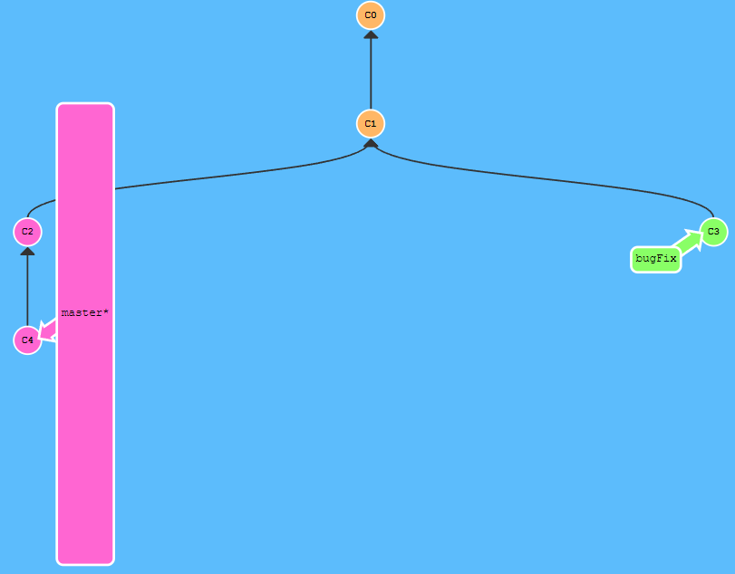

执行该命令后，master节点向前推进，结果节点的将存在两个父节点

```sh
git merge bugFix
```

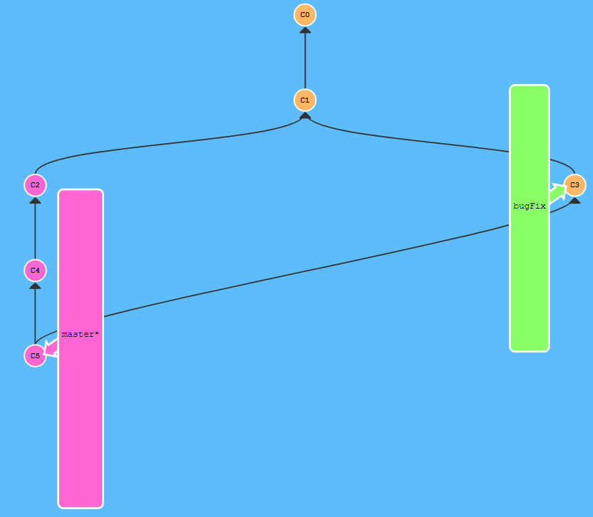


## git rebase \<branch-name>

- Rebase 实际上就是取出一系列的提交记录，“复制”它们，然后在另外一个地方逐个的放下去。
- Rebase 的优势就是可以创造更线性的提交历史，这听上去有些难以理解。如果只允许使用 Rebase 的话，代码库的提交历史将会变得异常清晰。


执行之前，存在两个分支：

- master：目前位于master
- bugFix

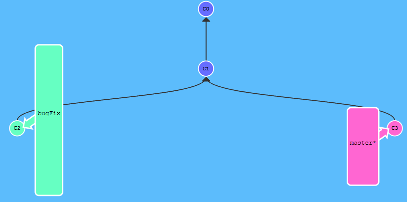

```sh
git rebase bugFix
```

执行该命令后，master移动到bugFix下面，结果节点仅存在一个父节点bugFix

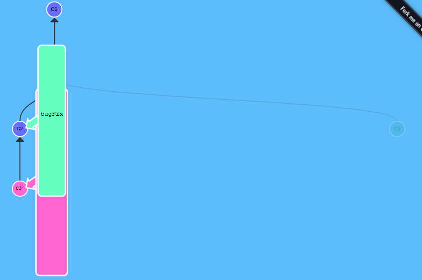


# 在提交树上移动

## HEAD

`HEAD`：是一个对当前检出记录的符号引用 —— 也就是指向你正在其基础上进行工作的提交记录

- 通常情况下，HEAD指向分支名（例如master），分支名再指向具体的提交记录

- 通过`git checkout <具体提交记录>`，可将HEAD从分支名中分离：

  - 执行之前：

    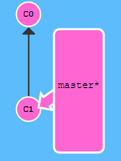

  - 执行之后：

    ```sh
    git checkout c1
    ```

    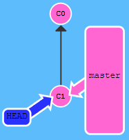


## 使用相对引用

使用哈希值指定记录很不方便。

可以从一个易于记忆的地方（比如 `bugFix` 分支或 `HEAD`）开始，使用**相对引用**：

- `^`：向上移动一个提交记录
- `~<num>`：向上提交多个提交记录。


例如：

- `master^`：表示master的父节点
- `master^^`：表示master的第二个父节点
- `master^~3`：表示master的第三个父节点


```sh
git checkout master^
```

表示，将HEAD指向master的父节点

```sh
git checkout HEAD^^
```

表示，将HEAD指向HEAD当前的第二个父节点


### 使用相对引用强制修改分支

可以直接使用 `-f` 选项让分支指向另一个提交。


例如:

- 执行之前：

  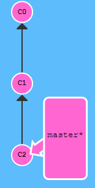

- 执行之后：

  ```
  git branch -f master HEAD~2
  ```

  上面的命令会将 master 分支强制指向 HEAD 的第 2 级父提交。

  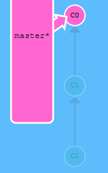


# 撤销变更

## git reset \<提交节点>

- 更改前：

  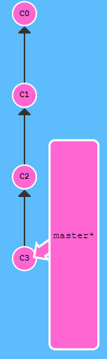

- 更改后：

  ```sh
  git reset HEAD^
  ```

  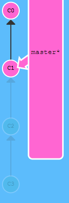


特点：

- 只能改写本地仓库

  

## git revert <提交节点>

- 更改前：

  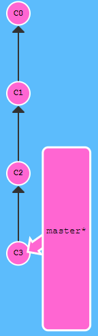

- 更改后：

  ```sh
  git revert c2
  ```

  将出现一个新提交，该提交与c2状态相同。

  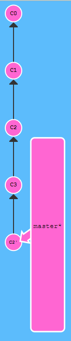


# 自由修改提交树

## git cherry-pick <提交号>...

将一些提交复制到当前所在的位置（`HEAD`）下面。


例如：

- 修改前：

  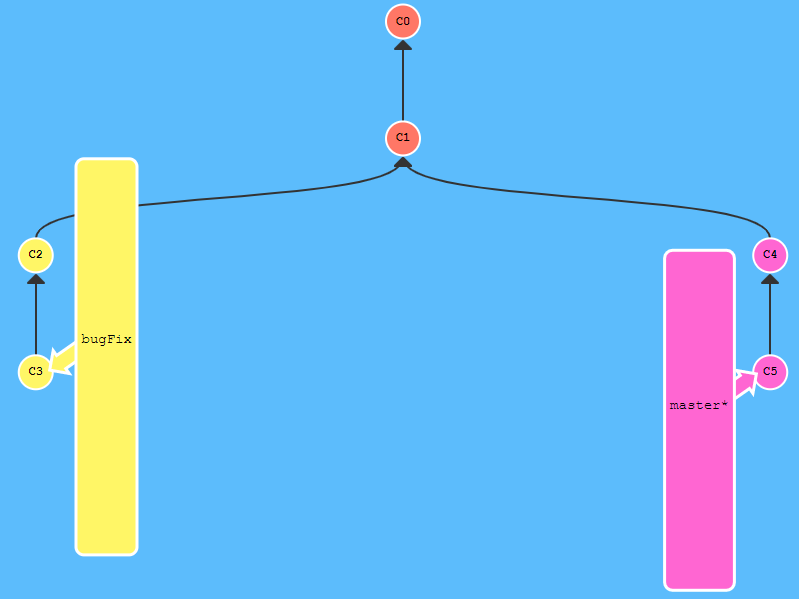

- 修改后：

  ```sh
  git cherry-pick c2 c3
  ```

  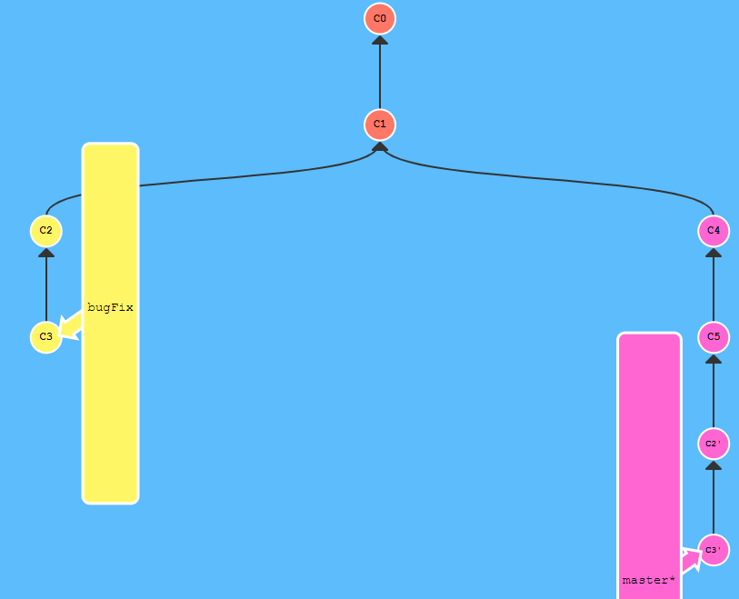


## 交互式rebase

交互式 rebase 指的是使用带参数 `--interactive` 的 rebase 命令, 简写为 `-i`。

Git 会打开一个 UI 界面并列出将要被复制到目标分支的备选提交记录，它还会显示每个提交记录的哈希值和提交说明。


当 rebase UI界面打开时, 你能做3件事:

- 调整提交记录的顺序（通过鼠标拖放来完成）
- 删除你不想要的提交（通过切换 `pick` 的状态来完成，关闭就意味着你不想要这个提交记录）
- 合并提交。 遗憾的是由于某种逻辑的原因，我们的课程不支持此功能，因此我不会详细介绍这个操作。简而言之，它允许你把多个提交记录合并成一个。


例如：

- 修改前：

  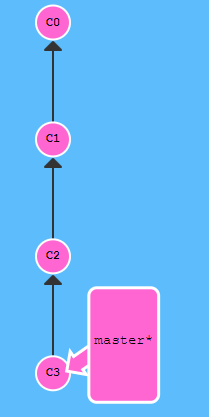

- 修改后：

  ```sh
  git rebase -i c1
  ```

  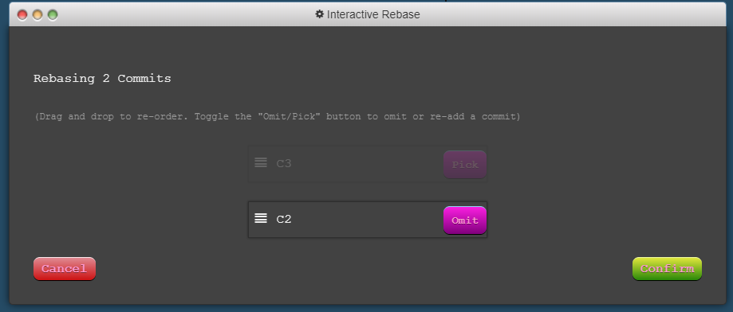

  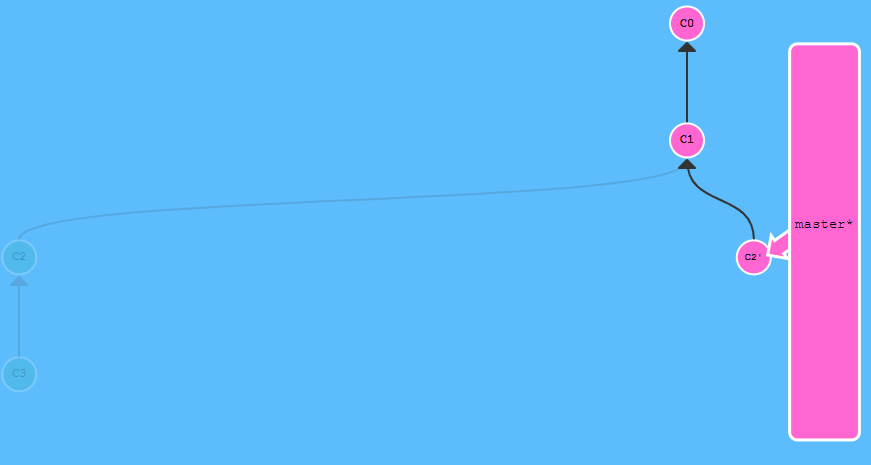


# 远程仓库

## git clone

克隆远程仓库到本地


## 远程分支

- 远程分支反映了远程仓库(在你上次和它通信时)的**状态**


## git fetch

从远程仓库获取更新

- `git fetch` 并不会改变你本地仓库的状态。

  它不会更新你的 `master` 分支，也不会修改你磁盘上的文件。

  >许多开发人员误以为执行了 `git fetch` 以后，他们本地仓库就与远程仓库同步了。它可能已经将进行这一操作所需的所有数据都下载了下来，但是**并没有**修改你本地的文件。


## git pull

当远程分支中存在新提交时：

1. git fetch下载新提交
2. 通过以下命令，合并远程分支：
   - `git cherry-pick o/master`
   - `git rebase o/master`
   - `git merge o/master
   - ...


git为我们提供了一个专门的命令，来完成上述两个步骤。

git pull：从远处获取更新，并合并到本地分支。


## git push

将**你的**变更上传到指定的远程仓库，并在远程仓库上合并你的新提交记录


## 冲突的情况

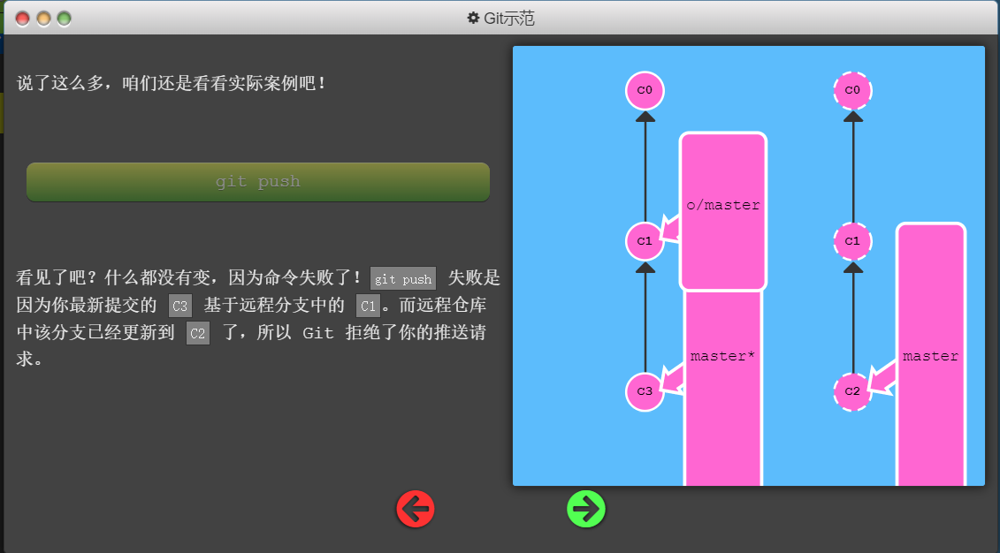


解决方案：

1. git fetch

2. git rebase / git merge

   - rebase：

     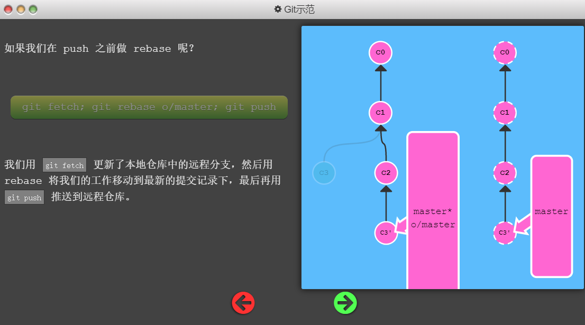

   - merge：

     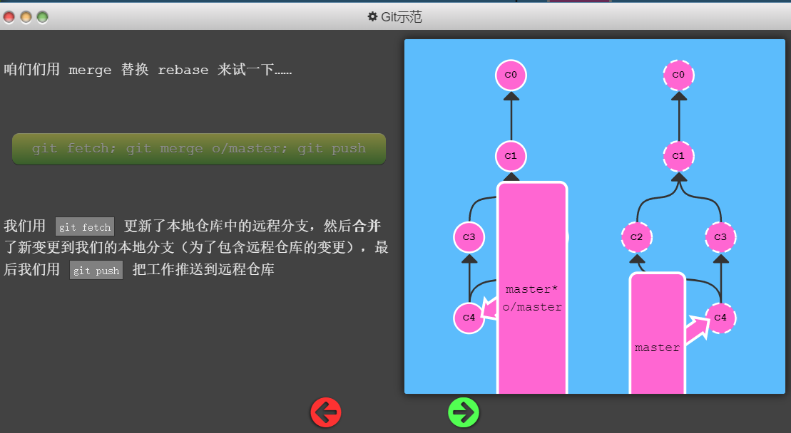


使用命令`git pull --rebase`（即git pull + git rebase简写）


# 分支策略

