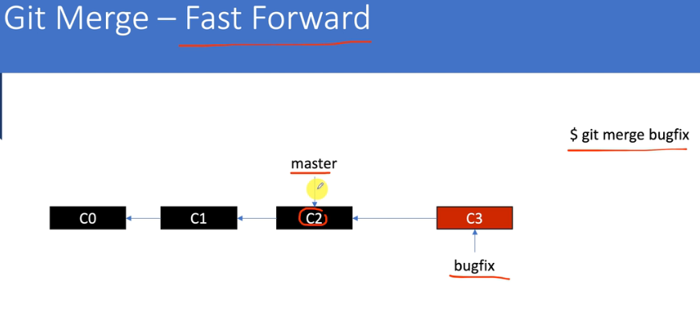
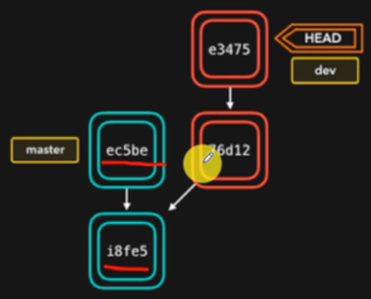

[Git基本原理介绍(8)——Branch和HEAD_哔哩哔哩_bilibili](https://www.bilibili.com/video/BV1s54y1Q746/?spm_id_from=pageDriver&vd_source=be746efb77e979ca275e4f65f2d8cda3)


# Branch是什么


# Head文件是一个特殊的指针


- 总是指向当前active的branch的==**最新**==一次commit


# 分支的相关操作


# git branch创建分支的变化

- 多一个文件：`.git/refs/heads/分支名`

  > 其内容为一个commit object的hash值。


# git check改变Active分支的变化

- `./git/Head`文件的内容发生变化，指向另一个branch文件。

  > 例如指向`.git/refs/heads/master`文件。


# git branch -D强制删除分支的变化

> - 不能对Active分支进行删除。
> - `git branch --delete`会在删除未merge分支时进行提示。

- 少一个分支文件。

  > 但不会删除objects。

- 如何找到误删除的branch，执行`git reflog`


# git checkout的变化

>[Git基本原理介绍(10)——checkout特定的commit_哔哩哔哩_bilibili](https://www.bilibili.com/video/BV1Ga4y1v7YW/?spm_id_from=pageDriver&vd_source=be746efb77e979ca275e4f65f2d8cda3)


- checkout既可以指定分支名，也可以直接指定commit object。
- checkout用于改变head指针。


# 添加远程分支git remote add origin

- 修改了`.git/config`文件：

  ```
  ❯ cat .git/config
  [core]
          repositoryformatversion = 0
          filemode = false
          bare = false
          logallrefupdates = true
          symlinks = false
          ignorecase = true
  [user]
          name = gxy
  [remote "origin"]
          url = https://gitlab.com/gg12138a/git-learn.git
          fetch = +refs/heads/*:refs/remotes/origin/*
  ```

  


# git push -u origin master

- 增加了目录：
  - `.git/refs/remotes/origin`
  - `.git/logs/refs/remotes/origin`
- 增加了文件：
  - `.git/refs/remotes/origin/master`
  - `.git/logs/refs/remotes/origin/master`


# fast forward合并




fast forward的条件：

- master无改变；
- bugfix基于master分支，并发生改变。


# 3way merge


如果发生冲突（修改同一文件）：


- 在merge之前，一个文件仅对应一个索引。
- 在merge并发生冲突时，文件的三个版本将对应三个索引。

冲突的解决：

- 手动修改冲突文件

- 再add和commit

  > 在add之后，一个文件将变成对应一个索引。
  >
  > 直接commit就可，无需注释，已经存在了待提交的commit。


# rebase

> [Git基本原理介绍(22)——什么是git rebase_哔哩哔哩_bilibili](https://www.bilibili.com/video/BV1T5411j76k/?spm_id_from=pageDriver&vd_source=be746efb77e979ca275e4f65f2d8cda3)


>- fast forward会隐藏分支都做了什么


当处于dev分支，而对master分支进行rebase时：

- 会在dev分支的之前结点进行提交的增加，从而使得dev分支能够fast forward。

  

  > ```
  > dev$ git rebase master
  > ```

  ==并且dev分支的SHA1将会重新计算==。


