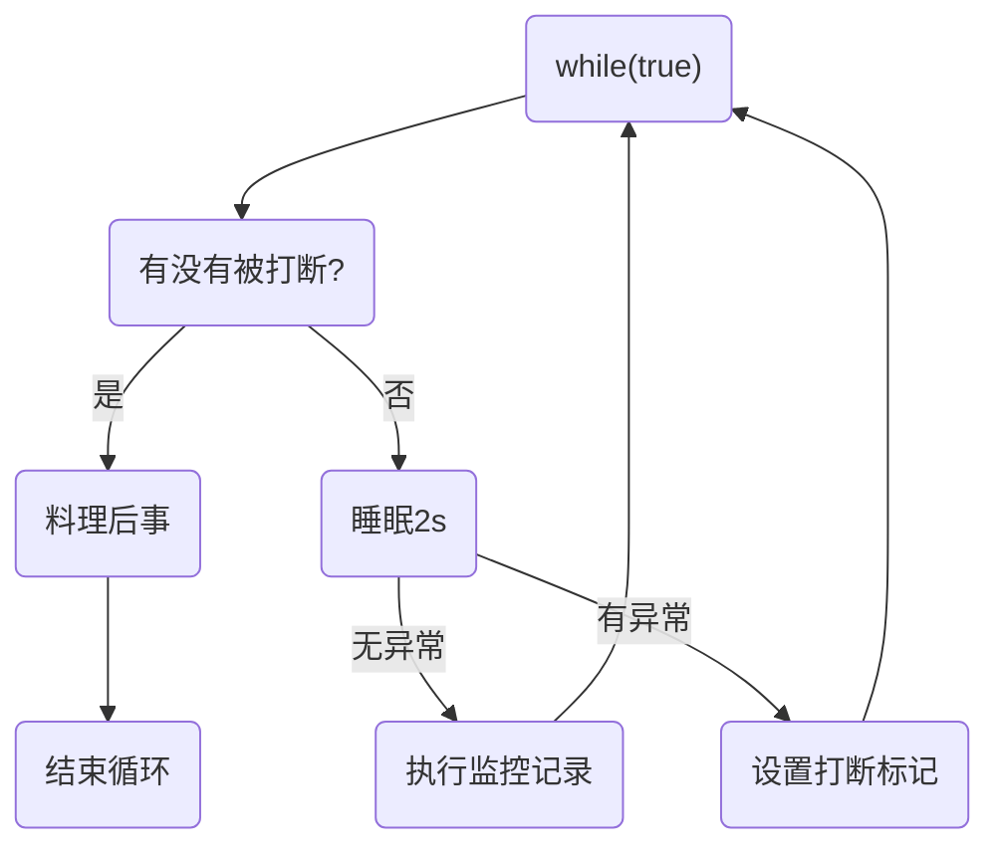

# 终止模式之两阶段终止模式

>Two Phase Termination

在一个线程 T1 中如何“优雅”终止线程 T2？这里的【优雅】指的是给 T2 一个料理后事的机会。


## 错误思路

- 使用线程对象的 stop() 方法停止线程：

  stop 方法会***强制杀死线程***，如果这时线程锁住了共享资源，那么当它被杀死后就再也没有机会释放锁，其它线程将永远无法获取锁

- 使用 System.exit(int) 方法停止线程：

  目的仅是停止一个线程，但这种做法***会让整个程序（进程）都停止***


## 两阶段终止模式

场景：实时监控PC状态信息




### 利用isInterrupted实现

```java
package com.example.juc_learn;

import lombok.extern.slf4j.Slf4j;

public class Test8 {
    public static void main(String[] args) throws InterruptedException {
        TwoPhaseTermination tpt = new TwoPhaseTermination();

        tpt.start();
        Thread.sleep(5_000);
        tpt.stop();

        //20:17:00.926 [Thread-0] DEBUG monitor - 记录监控信息
        //20:17:02.940 [Thread-0] DEBUG monitor - 记录监控信息
        //java.lang.InterruptedException: sleep interrupted
        //	at java.lang.Thread.sleep(Native Method)
        //	at com.example.juc_learn.TwoPhaseTermination.lambda$start$0(Test8.java:33)
        //	at java.lang.Thread.run(Thread.java:750)
        //20:17:03.917 [Thread-0] DEBUG monitor - 线程被打断，将要退出
    }
}

@Slf4j(topic = "monitor")
class TwoPhaseTermination {
    private Thread monitor;  //用于监控信息的线程

    //启动monitor线程
    public void start() {
        monitor = new Thread(() -> {
            while (true) {
                Thread current = Thread.currentThread();
                if (current.isInterrupted()) {

                    //此线程被打断，进行后续处理
                    log.debug("线程被打断，将要退出");
                    break;
                } else {
                    try {
                        Thread.sleep(2_000);

                        //进行信息监控及记录
                        log.debug("记录监控信息");
                    } catch (InterruptedException e) {

                        //重新设置打断标记
                        current.interrupt();
                        e.printStackTrace();
                    }
                }
            }
        });

        monitor.start();
    }

    //结束monitor线程
    public void stop() {
        monitor.interrupt();
    }
}
```


说明：

- 当monitor线程正常运行时被打断，将设置打断标记为true
- 当monitor线程处于sleep时被打断，打断标记将被清除，并抛出InterruptedException异常，从而进行catch块，将再次调用interrupt方法，设置打断标记为true
- 当检测到当前线程的打断标记为真时，进行后续处理操作，安全结束线程


# 同步模式之保护性暂停

## 定义

即 Guarded Suspension，用在一个线程等待另一个线程的执行结果

要点：

- 有**<u>*一个结果*</u>**需要从一个线程传递到另一个线程，让他们关联同一个 GuardedObject 

  > 但如果有结果不断从一个线程到另一个线程，则应采用消息队列（见生产者/消费者）

- JDK 中，join 的实现、Future 的实现采用的就是此模式

> 因为要等待另一方的结果，因此归类到同步模式


## 实现

```java
@Slf4j(topic = "c.Test20")
public class Test20 {

    public static void main(String[] args) {
        // 模拟 线程1 等待 线程2

        GuardedObject guardedObject = new GuardedObject();

        new Thread(() -> {
            List<String> list = (List<String>) guardedObject.get();
            log.debug("等待结束。结果长度：{}",list.size());
        }, "thread1").start();

        new Thread(()->{
            try {
                log.debug("开始下载");
                List<String> download = Downloader.download();

                guardedObject.complete(download);
            } catch (IOException e) {
                e.printStackTrace();
            }
        },"thread2").start();
    }
}


class GuardedObject {

    // 即运行结果
    private Object response;

    // 获取结果
    public Object get() {
        synchronized (this) {
            while (response == null) {
                try {
                    this.wait();
                } catch (InterruptedException e) {
                    e.printStackTrace();
                }
            }

            return response;
        }
    }
    
    // 获取结果
    // timeout表示最长等待时间
    public Object get(long timeout) {
        synchronized (this) {
            long begin = System.currentTimeMillis();
            long passedTime = 0;

            while (response == null) {
                if (passedTime >= timeout)
                    break;

                // 需考虑虚假唤醒问题
                try {
                    this.wait(timeout - passedTime);
                } catch (InterruptedException e) {
                    e.printStackTrace();
                }
                passedTime = System.currentTimeMillis() - begin;
            }

            return response;
        }
    }
    
    // 产生结果
    public void complete(Object response) {
        synchronized (this) {
            this.response = response;
            this.notifyAll();
        }
    }
}
```


## 拓展（多任务版 GuardedObject）

图中 Futures 就好比居民楼一层的信箱（每个信箱有房间编号），左侧的 t0，t2，t4 就好比等待邮件的居民，右侧的 t1，t3，t5 就好比邮递员

如果需要在多个类之间使用 GuardedObject 对象，作为参数传递不是很方便，因此设计一个用来解耦的中间类， 这样不仅能够***解耦【结果等待者】和【结果生产者】***，还能够同时支持多个任务的管理


> 区别于生产者消费者模式的特点：
>
> ***一个生产者和一个消费者之间***，是相互***一一对应的***。


- 新增 id 用来标识 Guarded Object

  ```java
  class GuardedObject {
  
      // 用于唯一表示GuardedObject
      private int id;
  
      public int getId() {
          return id;
      }
  
      public GuardedObject(int id) {
          this.id = id;
      }
  
      private Object response;
  
      public Object get(long timeout) {
          synchronized (this) {
              long begin = System.currentTimeMillis();
              long passedTime = 0;
  
              while (response == null) {
                  if (passedTime >= timeout)
                      break;
  
                  // 需考虑虚假唤醒问题
                  try {
                      this.wait(timeout - passedTime);
                  } catch (InterruptedException e) {
                      e.printStackTrace();
                  }
                  passedTime = System.currentTimeMillis() - begin;
              }
  
              return response;
          }
      }
  
      public void complete(Object response) {
          synchronized (this) {
              this.response = response;
              this.notifyAll();
          }
      }
  }
  ```

- 中间解耦类

  ```java
  class MailBoxes {
      private static Map<Integer, GuardedObject> boxes = new Hashtable<>();
      private static int id = 1;
  
      public static synchronized int generateId() {
          return id++;
      }
  
      public static GuardedObject createGuardObject() {
          GuardedObject go = new GuardedObject(generateId());
          boxes.put(go.getId(), go);
          return go;
      }
  
      public static GuardedObject getGuardObject(int id) {
          return boxes.remove(id);
      }
  
      public static Set<Integer> getIds() {
          return boxes.keySet();
      }
  }
  ```

- 业务相关类

  ```java
  // 居民类
  @Slf4j(topic = "c.People")
  class People extends Thread {
  
      @Override
      public void run() {
          GuardedObject guardObject = MailBoxes.createGuardObject();
          Object mail = guardObject.get(5000);
          log.debug("id:{},receivedMail：{}", guardObject.getId(), mail);
      }
  }
  ```

  ```java
  // 邮递员类
  @Slf4j(topic = "c.Postman")
  class Postman extends Thread {
      private int mailBoxId;
      private String mail;
  
      public Postman(int mailBoxId, String mail) {
          this.mailBoxId = mailBoxId;
          this.mail = mail;
      }
  
      @Override
      public void run() {
          GuardedObject guardObject = MailBoxes.getGuardObject(this.mailBoxId);
          guardObject.complete(this.mail);
          log.debug("id:{},deliverMail:{}", guardObject.getId(), mail);
      }
  }
  ```

- 测试

  ```java
  @Slf4j(topic = "c.Test20")
  public class Test20 {
  
      public static void main(String[] args) throws InterruptedException {
          for (int i = 0; i < 3; i++) {
              new People().start();
          }
          Thread.sleep(1000);
  
          for (Integer id : MailBoxes.getIds()) {
              // 注意：一个生产者和一个消费者相互对应
              new Postman(id, "content" + id).start();
          }
      }
  }
  ```

  ```
  21:14:42 [Thread-4] c.Postman - id:2,deliverMail:content2
  21:14:42 [Thread-2] c.People - id:2,receivedMail：content2
  21:14:42 [Thread-3] c.Postman - id:3,deliverMail:content3
  21:14:42 [Thread-1] c.People - id:3,receivedMail：content3
  21:14:42 [Thread-5] c.Postman - id:1,deliverMail:content1
  21:14:42 [Thread-0] c.People - id:1,receivedMail：content1
  ```


# 异步模式之生产者/消费者

## 定义

> #### 💡 为什么是异步模式？
>
> 因为生产者的生产结果，并不一定立即被消费

> 区别与多任务版的GuradedObjcet：
>
> 生产者消费者模式，***不需要生成结果的线程和消费结果的线程，一一对应***。

- ***消费队列可以用来平衡生产和消费的线程资源***
- ***生产者仅负责产生结果数据***，不关心数据该如何处理，而***消费者专心处理结果数据***

- 消息队列是有容量限制的，满时不会再加入数据，空时不会再消耗数据

- JDK 中各种阻塞队列，采用的就是这种模式


例如如下的情况：


## 实现

- 消息载体类：

  ```java
  final class Message {
      private int id;
      private Object value;
  
      public Message(int id, Object value) {
          this.id = id;
          this.value = value;
      }
  
      public int getId() {
          return id;
      }
  
      public Object getValue() {
          return value;
      }
  
      @Override
      public String toString() {
          return "Message{" +
                  "id=" + id +
                  ", value=" + value +
                  '}';
      }
  }
  ```

- 消息队列（仅能在Java**<u>线程间</u>**通信）：

  ```java
  // Java线程间 通信的消息队列
  @Slf4j(topic = "c.MessageQueue")
  class MessageQueue {
  
      private final LinkedList<Message> list = new LinkedList<>();
      private final int capacity;
  
      public MessageQueue(int capacity) {
          this.capacity = capacity;
      }
  
      public Message take() {
          synchronized (list) {
              while (list.isEmpty()) {
                  try {
                      log.debug("队列为空,消费者线程进入等待");
                      list.wait();
                  } catch (InterruptedException e) {
                      e.printStackTrace();
                  }
              }
  
              Message message = list.removeFirst();
              log.debug("消费：{}", message);
              list.notifyAll();
              return message;
          }
      }
  
      public void put(Message message) {
          synchronized (list) {
              while (list.size() == this.capacity) {
                  try {
                      log.debug("队列为满，生产者线程进入等待");
                      list.wait();
                  } catch (InterruptedException e) {
                      e.printStackTrace();
                  }
              }
  
              list.addLast(message);
              log.debug("生产：{}", message);
              list.notifyAll();
          }
      }
  }
  ```

- 测试类：

  ```java
  @Slf4j(topic = "c.Test21")
  public class Test21 {
  
      public static void main(String[] args) throws InterruptedException {
          MessageQueue queue = new MessageQueue(2);
  
          // 生产者线程
          for (int i = 0; i < 3; i++) {
              int id = i;
              new Thread(() -> {
                  queue.put(new Message(id, "message-" + id));
              }, "producer-" + i).start();
          }
  
          Thread.sleep(1000);
  
          // 消费者线程
          new Thread(() -> {
              while (true) {
                  Message message = queue.take();
              }
          }, "consumer").start();
      }
  
  }
  ```

  ```
  22:03:28 [producer-0] c.MessageQueue - 生产：Message{id=0, value=message-0}
  22:03:28 [producer-2] c.MessageQueue - 生产：Message{id=2, value=message-2}
  22:03:28 [producer-1] c.MessageQueue - 队列为满，生产者线程进入等待
  22:03:29 [consumer] c.MessageQueue - 消费：Message{id=0, value=message-0}
  22:03:29 [consumer] c.MessageQueue - 消费：Message{id=2, value=message-2}
  22:03:29 [consumer] c.MessageQueue - 队列为空,消费者线程进入等待
  22:03:29 [producer-1] c.MessageQueue - 生产：Message{id=1, value=message-1}
  22:03:29 [consumer] c.MessageQueue - 消费：Message{id=1, value=message-1}
  22:03:29 [consumer] c.MessageQueue - 队列为空,消费者线程进入等待
  ```


# 同步模式之顺序控制


## 固定运行顺序

比如，存在一种需求，必须先 2 再1 。


### wait-notify实现

```java
@Slf4j(topic = "c.Test25")
public class Test25 {

    private static final Object obj = new Object();
    private static boolean done = false;

    public static void main(String[] args) {
        Thread t1 = new Thread(() -> {
            synchronized (obj) {
                while (!done) {
                    try {
                        obj.wait();
                    } catch (InterruptedException e) {
                        e.printStackTrace();
                    }
                }

                log.debug("1");
            }
        }, "t1");

        Thread t2 = new Thread(() -> {
            synchronized (obj) {
                done = true;
                log.debug("2");

                obj.notifyAll();
            }
        }, "t2");

        t1.start();
        t2.start();
    }
}
```


### ReentrantLock(await-signalAll)实现

```java
@Slf4j(topic = "c.Test26")
public class Test26 {

    private static final ReentrantLock lock = new ReentrantLock();
    private static boolean done = false;

    public static void main(String[] args) {
        Condition isDone = lock.newCondition();

        Thread t1 = new Thread(() -> {
            lock.lock();
            try {
                while (!done) {
                    try {
                        isDone.await();
                    } catch (InterruptedException e) {
                        e.printStackTrace();
                    }
                }

                log.debug("1");
            } finally {
                lock.unlock();
            }
        }, "t1");

        Thread t2 = new Thread(() -> {
            lock.lock();
            try {
                done = true;
                log.debug("2");

                isDone.signalAll();
            } finally {
                lock.unlock();
            }
        }, "t2");

        t1.start();
        t2.start();
    }
}
```


### LockSupport(park-unpark)实现

```java
@Slf4j(topic = "c.Test27")
public class Test27 {

    public static void main(String[] args) {
        Thread t1 = new Thread(() -> {
            LockSupport.park();
            log.debug("1");
        }, "t1");

        Thread t2 = new Thread(() -> {
            log.debug("2");
            LockSupport.unpark(t1);
        }, "t2");

        t1.start();
        t2.start();
    }
}
```


## 交替运行顺序

线程 1 输出 a 5 次，线程 2 输出 b 5 次，线程 3 输出 c 5 次。现在要求输出 abcabcabcabcabc 怎么实现


### wait-notify实现

```java
@Slf4j(topic = "c.Test28")
public class Test28 {

    public static void main(String[] args) {
        FlagObject flagObject = new FlagObject(1, 5);

        new Thread(() -> {
            flagObject.print("a", 1, 2);
        }, "t1").start();

        new Thread(() -> {
            flagObject.print("b", 2, 3);
        }, "t2").start();

        new Thread(() -> {
            flagObject.print("c", 3, 1);
        }, "t3").start();
    }
}

@Slf4j(topic = "c.FlagObject")
class FlagObject {
    private int flag;

    private int loopNumber;

    public FlagObject(int flag, int loopNumber) {
        this.flag = flag;
        this.loopNumber = loopNumber;
    }

    public synchronized void print(String str, int waitFlag, int nextFlag) {
        for (int i = 0; i < loopNumber; i++) {
            while (flag != waitFlag) {
                try {
                    this.wait();
                } catch (InterruptedException e) {
                    e.printStackTrace();
                }
            }

            log.debug("{}", str);

            flag = nextFlag;
            this.notifyAll();
        }
    }
}
```


### ReentrantLock实现

```java
public class Test29 {

    public static void main(String[] args) throws InterruptedException {
        AwaitSignal awaitSignal = new AwaitSignal(5);
        Condition conditionA = awaitSignal.newCondition();
        Condition conditionB = awaitSignal.newCondition();
        Condition conditionC = awaitSignal.newCondition();

        Thread stater = new Thread(() -> {
            LockSupport.park();
            awaitSignal.lock();
            try {
                conditionA.signalAll();
            } finally {
                awaitSignal.unlock();
            }
        }, "stater");

        stater.start();


        new Thread(() -> {
            awaitSignal.print(conditionA, "a", conditionB, stater);
        }, "t1").start();

        new Thread(() -> {
            awaitSignal.print(conditionB, "b", conditionC, stater);
        }, "t2").start();

        new Thread(() -> {
            awaitSignal.print(conditionC, "c", conditionA, stater);
        }, "t3").start();

    }
}

@Slf4j(topic = "c.AwaitSignal")
class AwaitSignal extends ReentrantLock {
    private int loopNumber;
    private int lockedNum = 0;

    public int getLockedNum() {
        return lockedNum;
    }

    public AwaitSignal(int loopNumber) {
        this.loopNumber = loopNumber;
    }

    public void print(Condition current, String msg, Condition next, Thread thread) {
        for (int i = 0; i < loopNumber; i++) {
            this.lock();
            if (++lockedNum == 3) {
                LockSupport.unpark(thread);
            }

            try {
                try {
                    current.await();
                    log.debug("{}", msg);
                    next.signalAll();
                } catch (InterruptedException e) {
                    e.printStackTrace();
                }
            } finally {
                this.lockedNum--;
                this.unlock();
            }
        }
    }
}
```


### LockSupport实现

```java
@Slf4j(topic = "c.Test30")
public class Test30 {

    private static Thread t1;
    private static Thread t2;
    private static Thread t3;

    public static void main(String[] args) {
        ParkUnpark pu = new ParkUnpark(5);

        Thread starter = new Thread(() -> {
            LockSupport.park();
            LockSupport.unpark(t1);
        }, "starter");

        t1 = new Thread(() -> {
            pu.print("a", t2, starter);
        }, "t1");

        t2 = new Thread(() -> {
            pu.print("b", t3, starter);
        }, "t2");

        t3 = new Thread(() -> {
            pu.print("c", t1, starter);
        }, "t3");

        t1.start();
        t2.start();
        t3.start();
        starter.start();
    }
}

@Slf4j(topic = "c.ParkUnpark")
class ParkUnpark {
    private int loopNumber;
    private int parked = 0;
    private boolean started;

    public ParkUnpark(int loopNumber) {
        this.loopNumber = loopNumber;
    }

    public void print(String msg, Thread next, Thread starter) {
        for (int i = 0; i < loopNumber; i++) {
            if (!started) {
                synchronized (this) {
                    if (++parked == 3) {
                        LockSupport.unpark(starter);
                        started = true;
                    }
                }
            }

            LockSupport.park();
            log.debug("{}", msg);
            LockSupport.unpark(next);
        }
    }
}
```

