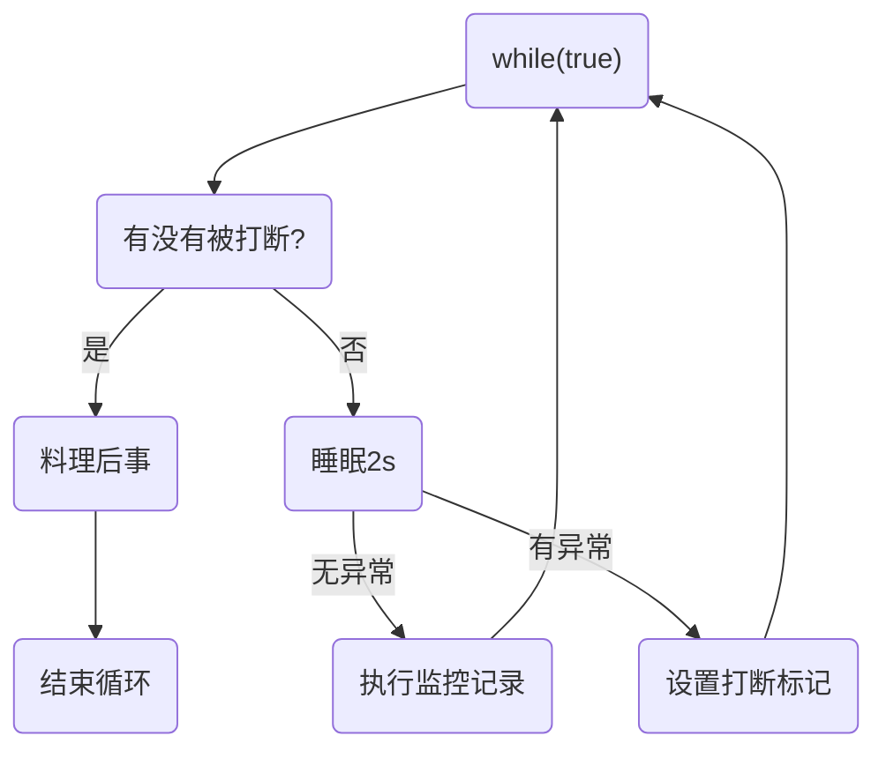

# 终止模式之两阶段终止模式

>Two Phase Termination

在一个线程 T1 中如何“优雅”终止线程 T2？这里的【优雅】指的是给 T2 一个料理后事的机会。


## 错误思路

- 使用线程对象的 stop() 方法停止线程：

  stop 方法会***强制杀死线程***，如果这时线程锁住了共享资源，那么当它被杀死后就再也没有机会释放锁，其它线程将永远无法获取锁

- 使用 System.exit(int) 方法停止线程：

  目的仅是停止一个线程，但这种做法***会让整个程序（进程）都停止***


## 两阶段终止模式

场景：实时监控PC状态信息




### 利用isInterrupted实现

```java
package com.example.juc_learn;

import lombok.extern.slf4j.Slf4j;

public class Test8 {
    public static void main(String[] args) throws InterruptedException {
        TwoPhaseTermination tpt = new TwoPhaseTermination();

        tpt.start();
        Thread.sleep(5_000);
        tpt.stop();

        //20:17:00.926 [Thread-0] DEBUG monitor - 记录监控信息
        //20:17:02.940 [Thread-0] DEBUG monitor - 记录监控信息
        //java.lang.InterruptedException: sleep interrupted
        //	at java.lang.Thread.sleep(Native Method)
        //	at com.example.juc_learn.TwoPhaseTermination.lambda$start$0(Test8.java:33)
        //	at java.lang.Thread.run(Thread.java:750)
        //20:17:03.917 [Thread-0] DEBUG monitor - 线程被打断，将要退出
    }
}

@Slf4j(topic = "monitor")
class TwoPhaseTermination {
    private Thread monitor;  //用于监控信息的线程

    //启动monitor线程
    public void start() {
        monitor = new Thread(() -> {
            while (true) {
                Thread current = Thread.currentThread();
                if (current.isInterrupted()) {

                    //此线程被打断，进行后续处理
                    log.debug("线程被打断，将要退出");
                    break;
                } else {
                    try {
                        Thread.sleep(2_000);

                        //进行信息监控及记录
                        log.debug("记录监控信息");
                    } catch (InterruptedException e) {

                        //重新设置打断标记
                        current.interrupt();
                        e.printStackTrace();
                    }
                }
            }
        });

        monitor.start();
    }

    //结束monitor线程
    public void stop() {
        monitor.interrupt();
    }
}
```


说明：

- 当monitor线程正常运行时被打断，将设置打断标记为true
- 当monitor线程处于sleep时被打断，打断标记将被清除，并抛出InterruptedException异常，从而进行catch块，将再次调用interrupt方法，设置打断标记为true
- 当检测到当前线程的打断标记为真时，进行后续处理操作，安全结束线程

