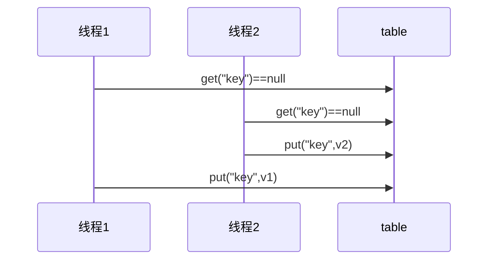

# 本章内容

- 共享问题
- synchronized
- 线程安全分析
- Monitor
- wait/notify
- 线程状态转换
- 活跃性
- Lock


# 共享带来的问题

## 经典的线程不安全案例

```java
@Slf4j
public class Test17 {

    public static int counter =0;

    public static void main(String[] args) throws InterruptedException {
        Thread t1 = new Thread(()->{
            for(int i = 0;i<5000;i++){
                counter++;
            }
        },"t1");

        Thread t2 = new Thread(() -> {
            for(int i = 0;i<5000;i++){
                counter--;
            }
        }, "t2");

        t1.start();
        t2.start();
        t1.join();
        t2.join();

        log.debug("{}",counter);
    }
}
```

会发现，counter的运行结果大概率不为0


## 问题分析

在Java中，***对静态变量的自增、自减，并非原子操作***：

- 自增：如对于 i++ 而言（i 为静态变量），实际会产生如下的 JVM 字节码指令：

  ```java
  getstatic i // 获取静态变量i的值
  iconst_1 // 准备常量1
  iadd // 自增
  putstatic i // 将修改后的值存入静态变量i
  ```

- 自减：

  ```java
  getstatic i // 获取静态变量i的值
  iconst_1 // 准备常量1
  isub // 自减
  putstatic i // 将修改后的值存入静态变量i
  ```


对应的Java内存模型如下，对于静态变量的自增、自减，***需要在主存和工作内存中进行数据交换***：


如果是单线程的情况，上述的代码将顺序执行，不会导致错误：


但在多线程的情况下，上述的代码可能交错运行，例如：

- 出错负数的情况：

  

- 出现正数的情况：

  


## **临界区** **Critical Section**

- 一个程序运行多个线程本身是没有问题的

- 问题出在多个线程访问**共享资源**
  - 多个线程读**共享资源**其实也没有问题
  - 在多个线程对**共享资源**读写操作时发生指令交错，就会出现问题

- *一段代码块内如果存在对**共享资源**的多线程读写操作，称这段代码块为**临界区***。例如：

  ```java
  static int counter = 0;
  
  static void increment() 
      // 临界区
  { 
      counter++; 
  }
  
  static void decrement() 
      // 临界区
  { 
      counter--; 
  }
  ```

  

## **竞态条件** **Race Condition**

多个线程在临界区内执行，由于代码的**执行序列不同**而导致结果无法预测，称之为发生了**竞态条件**

https://www.bilibili.com/video/BV16J411h7Rd?p=53


# synchronized

## 应用之“互斥”

为了避免临界区的竞态条件发生，有多种手段可以达到目的：

- 阻塞式的解决方案：synchronized，Lock
- 非阻塞式的解决方案：原子变量


本次课使用阻塞式的解决方案：synchronized，来解决上述问题，即俗称的【***对象锁***】，它采用互斥的方式让同一时刻至多只有一个线程能持有【对象锁】，其它线程再想获取这个【对象锁】时就会阻塞住。这样就能保证拥有锁的线程可以安全的执行临界区内的代码，不用担心线程上下文切换


>**注意**，虽然 java 中互斥和同步都可以采用 synchronized 关键字来完成，但它们还是有区别的：
>
>- 互斥：保证临界区的竞态条件发生，同一时刻只能有一个线程执行临界区代码
>- 同步：由于线程执行的先后、顺序不同、需要一个线程等待其它线程运行到某个点


## synchronized语法

```java
synchronized(对象){
    临界区
}
```


- 若对象锁已被某个线程占用，其余线程将发生上下文切换，进入阻塞状态；
- 若某个线程执行完synchronized{}块内的代码，***其将释放对象锁，并唤醒阻塞进程***。


注意，若某个线程获取了对象锁，***即便其时间片到而下处理机，也不会释放对象锁***。


## 面向过程的解决方案

例如：

```java
@Slf4j
public class Test18 {

    public static int counter =0;
    public static final Object room = new Object();

    public static void main(String[] args) throws InterruptedException {
        Thread t1 = new Thread(()->{
            for(int i = 0;i<5000;i++){
                synchronized (room){
                    counter++;
                }
            }
        },"t1");

        Thread t2 = new Thread(() -> {
            for(int i = 0;i<5000;i++){
                synchronized (room){
                    counter--;
                }
            }
        }, "t2");

        t1.start();
        t2.start();
        t1.join();
        t2.join();

        log.debug("{}",counter);
    }
}
```


## 面向对象的解决方案

```java
@Slf4j
public class Room {
    private int counter = 0;

    public void increment(){
        synchronized (this){
            counter++;
        }
    }

    public void decrement(){
        synchronized (this){
            counter--;
        }
    }

    public int getCounter() {
        synchronized (this){
            return counter;
        }
    }

    public static void main(String[] args) throws InterruptedException {
        Room room = new Room();

        Thread t1 = new Thread(()->{
            for (int i=0;i<5000;i++){
                room.increment();
            }
        },"t1");

        Thread t2 = new Thread(() -> {
            for (int i = 0; i < 5000; i++) {
                room.decrement();
            }
        }, "t2");

        t1.start();
        t2.start();

        t1.join();;
        t2.join();

        log.debug("{}",room.getCounter());
    }
}
```


## synchronized方法

- 成员方法上的synchronized：

  ```java
  public synchronized void test() {
  
  }
  
  //等价于
  public void test() {
      synchronized(this) {
  
      }
  }
  
  ```

  

- 静态方法上的synchronized：

  ```java
  public synchronized static void test() {
  }
  
  //等价于
  public static void test() {
      synchronized(Test.class) {
  
      }
  }
  ```


# 变量的线程安全分析

https://www.bilibili.com/video/BV16J411h7Rd?p=63


## 成员变量与静态变量是否安全

- 如果它们没有共享，则线程安全
- 如果它们***被共享***了，根据它们的状态是否能够改变，又分两种情况：
  - 如果只有读操作，则线程安全
  - ***如果有读写操作，则这段代码是临界区，需要考虑线程安全***


## 局部变量是否线程安全

- 局部变量是线程安全的
- 但***局部变量引用的对象***则未必：
  - 如果该对象没有逃离方法的作用访问，它是线程安全的
  - ***如果该对象逃离方法的作用范围，需要考虑线程安全***


### 安全的例子

```java
public static void test1() {
    int i = 10;
    i++;
}
```

每个线程调用 test1() 方法时局部变量 i，会在***每个线程的栈帧内存中被创建多份，因此不存在共享***


### 不安全的例子

```java
public class ThreadUnsafe {
    ArrayList<String> list = new ArrayList<>();

    public void method1(int loopNumber){
        for(int i=0; i<loopNumber;i++){
            // { 临界区，会产生竞态条件
            method2();
            method3();
            // } 临界区
        }
    }

    private void method2() {
        list.add("1");
    }

    private void method3() {
        list.remove(0);
    }

    public static void main(String[] args) {
        ThreadUnsafe test= new ThreadUnsafe();

        for(int i =0;i< 2 ;i++){
            new Thread(()->{
               test.method1(200);
            },"thread"+i).start();
        }
    }
}
```

可能导致如下异常：

```java
Exception in thread "thread0" java.lang.IndexOutOfBoundsException: Index 0 out of bounds for length 0
	at java.base/jdk.internal.util.Preconditions.outOfBounds(Preconditions.java:64)
	at java.base/jdk.internal.util.Preconditions.outOfBoundsCheckIndex(Preconditions.java:70)
	at java.base/jdk.internal.util.Preconditions.checkIndex(Preconditions.java:248)
	at java.base/java.util.Objects.checkIndex(Objects.java:372)
	at java.base/java.util.ArrayList.remove(ArrayList.java:536)
	at n4.ThreadUnsafe.method3(ThreadUnsafe.java:20)
	at n4.ThreadUnsafe.method1(ThreadUnsafe.java:11)
	at n4.ThreadUnsafe.lambda$main$0(ThreadUnsafe.java:28)
	at java.base/java.lang.Thread.run(Thread.java:829)
```


分析如下：


但倘若将list，修改为局部变量：

```java
class ThreadSafe {
    public final void method1(int loopNumber) {
        ArrayList<String> list = new ArrayList<>();
        for (int i = 0; i < loopNumber; i++) {
            method2(list);
            method3(list);
        }
    }
    private void method2(ArrayList<String> list) {
        list.add("1");
    }
    private void method3(ArrayList<String> list) {
        list.remove(0);
    }
}
```

则不会产生上述问题。这是因为：

- list 是局部变量，每个线程调用时会创建其不同实例，没有共享
- 而 method2 的参数是从 method1 中传递过来的，与 method1 中引用同一个对象


### 局部变量的暴露引用问题

```java
class ThreadSafe {
    public void method1(int loopNumber) {
        ArrayList<String> list = new ArrayList<>();
        for (int i = 0; i < loopNumber; i++) {
            method2(list);
            method3(list);
        }
    }
    private void method2(ArrayList<String> list) {
        list.add("1");
    }
    private void method3(ArrayList<String> list) {
        list.remove(0);
    }
}

//此子类并非线程安全的
class ThreadSafeSubClass extends ThreadSafe{
    @Override
    public void method3(ArrayList<String> list) {
        new Thread(() -> {
            list.remove(0);
        }).start();
    }
}

```

对ThreadSafe类进行考虑：

- 情况1：有其它线程调用 method2 和 method3 情况2：
  - 若method2为private的，显然是安全的。
  - 若method2为public的，调用method2传入的list对象是外部的，若外部创建新线程操作此list对象，仍将产生竞态条件，是线程不安全的。
- 在 情况1 的基础上，为 ThreadSafe 类添加子类，子类覆盖 method2 或 method3 方法，并使用新线程操作list对象：是线程不安全的。因为主线程将与新线程同时操作list对象，产生竞态条件

> 从这个例子可以看出 private 或 final 提供【安全】的意义所在，请体会面向对象的开闭原则中的【闭】


## 常见的线程安全类

[黑马程序员全面深入学习Java并发编程，JUC并发编程全套教程_哔哩哔哩_bilibili](https://www.bilibili.com/video/BV16J411h7Rd?p=67&spm_id_from=pageDriver)

- String
- Integer（即包装类）
- StringBuffer
- Random
- Vector
- Hashtable
- java.util.concurrent包下的类

> 此处的线程安全，是指：多个线程调用它们的***同一个实例时***的某个方法时，是线程安全的。也可以理解为：
>
> - 它们的每个方法都是原子的
> - 但注意，它们***多个方法的组合，并不是原子的***。


### 线程安全类的方法组合问题

虽然get和put方法是线程安全的，但如下的代码是非线程安全的：

```java
Hashtable table = new Hashtable();

//线程1和线程2都执行如下代码：
if(table.get("key") == null){
	table.put("key", value);
}
```





### 不可变类的线程安全性

String、Integer等都是不可变类（<u>**内部的状态(即属性)不可以被改变**</u>），它们的方法都是线程安全的。


对于String类来说，它的replace、substring等方法：返回的是***新String对象***

```java
public String substring(int beginIndex) {
    if (beginIndex < 0) {
        throw new StringIndexOutOfBoundsException(beginIndex);
    }
    int subLen = length() - beginIndex;
    if (subLen < 0) {
        throw new StringIndexOutOfBoundsException(subLen);
    }
    if (beginIndex == 0) {
        return this;
    }
    return isLatin1() ? StringLatin1.newString(value, beginIndex, subLen)
        : StringUTF16.newString(value, beginIndex, subLen);
}
```


## 案例分析

> 在tomcat中，Servlet只有一个实例，将被多个线程共享使用

```java
public class MyServlet extends HttpServlet{
    Map <String,Objcet> map = new HashMap<>(); //非线程安全
    
    String s1 = "...";			//线程安全
    final String s2 = "...";	 //线程安全
    
    Date d1 = new Date();		//非线程安全
    final Date d2 = new Date();	 //非线程安全

    public void doGet(HttpServletRequest request, HttpServletResponse response){
    	//使用上述变量    
    }
}
```


例2：

```java
public class MyServlet extends HttpServlet{
    private UserService userservice = new UserServiceImpl();	//非线程安全

    public void doGet(HttpServletRequest request, HttpServletResponse response){
    	userService.update();    
    }
}

public class UserServiceImpl implements UserSerivice{
    private int count = 0;
    
    public void update(){
        count++;
    }
}
```


> Spring的组件，***默认是单例的***。用环绕通知可解决此问题

例3：

```java
@Aspect
@Component
public class MyAspect{
    private long start = 0L;
    
    @Before("execution(* *(..))")
    public void before(){
        start = System.nanoTime();	//非线程安全
    }
    
    @After("execution(* *(..))")
    public void after(){
        long end = System.nanoTime();
        System.out.println("cost Time:" + (end-start));
    }
}
```


例4：

```java
public class MyServlet extends HttpServlet
    //线程安全
    private Userservice userservice = new UserserviceImpl();

    public void doGet(HttpServletRequest request,HttpServletResponse response){
        userService.update(...);
    }
}

public class UserServiceImpl implements UserService
    //线程安全，因为此对象是无状态的
    private UserDao userDao = new UserDaoImp1();

    public void update(){
        userDao.update();
    }
}

public class UserDaoImpl implements UserDao
    public void update(){
        String sql ="update user set password where username ?";
        //线程安全
        try (Connection conn = DriverManager.getconnection("","","")){
            //···
        }catch (Exception e){
            //··…
        }
}
```

​          

例5：

```java
public class MyServlet extends HttpServlet {
    // 非线程安全
    private UserService userService = new UserServiceImpl();

    public void doGet(HttpServletRequest request, HttpServletResponse response) {
        userService.update(...);
    }
}

public class UserServiceImpl implements UserService {
    // 非线程安全
    private UserDao userDao = new UserDaoImpl();

    public void update() {
        userDao.update();
    }
}

public class UserDaoImpl implements UserDao {
    // 非线程安全
    private Connection conn = null;
    public void update() throws SQLException {
        String sql = "update user set password = ? where username = ?";
        conn = DriverManager.getConnection("","","");
        // ...
        conn.close();
    }
}
```


例6：

```java
public class MyServlet extends HttpServlet {
    // 线程安全
    private UserService userService = new UserServiceImpl();

    public void doGet(HttpServletRequest request, HttpServletResponse response) {
        userService.update(...);
    }
}

public class UserServiceImpl implements UserService { 
    public void update() {
        UserDao userDao = new UserDaoImpl();
        userDao.update();
    }
}

public class UserDaoImpl implements UserDao {
    // 非线程安全
    private Connection = null;
    public void update() throws SQLException {
        String sql = "update user set password = ? where username = ?";
        conn = DriverManager.getConnection("","","");
        // ...
        conn.close();
    }
}
```


例7：

```java
public abstract class Test {

    public void bar() {
        // 是否安全
        SimpleDateFormat sdf = new SimpleDateFormat("yyyy-MM-dd HH:mm:ss");
        foo(sdf);
    }
    
    public abstract foo(SimpleDateFormat sdf);

    public static void main(String[] args) {
        new Test().bar();
    }
}

```

其中 foo 的行为是不确定的，可能导致不安全的发生，被称之为***外星方法***

```java
public void foo(SimpleDateFormat sdf) {
    String dateStr = "1999-10-11 00:00:00";
    for (int i = 0; i < 20; i++) {
        new Thread(() -> {
            try {
                sdf.parse(dateStr);
            } catch (ParseException e) {
                e.printStackTrace();
            }
        }).start();
    }
}
```


例8：

```java
private static Integer i = 0;
public static void main(String[] args) throws InterruptedException {
    List<Thread> list = new ArrayList<>();
    for (int j = 0; j < 2; j++) {
        Thread thread = new Thread(() -> {
            for (int k = 0; k < 5000; k++) {
                synchronized (i) {
                    i++;
                }
            }
        }, "" + j);
        list.add(thread);
    }
    list.stream().forEach(t -> t.start());
    list.stream().forEach(t -> {
        try {
            t.join();
        } catch (InterruptedException e) {
            e.printStackTrace();
        }
    });
    log.debug("{}", i);
}
```


# 习题

[黑马程序员全面深入学习Java并发编程，JUC并发编程全套教程_哔哩哔哩_bilibili](https://www.bilibili.com/video/BV16J411h7Rd?p=71&spm_id_from=pageDriver)

## 卖票案例

```java
@Slf4j(topic = "c.exerciseSell")
public class ExerciseSell {
    public static void main(String[] args) throws InterruptedException {
        TicketWindow ticketWindow = new TicketWindow(1000);
        List<Thread> threadList = new ArrayList<>();
        List<Integer> sellCount = new Vector<>();        // 用来存储买出去多少张票

        for (int i = 0; i < 4000; i++) {
            Thread t = new Thread(() -> {
                // 分析这里的竞态条件
                int count = ticketWindow.sell(randomAmount());
                sellCount.add(count);
            });
            threadList.add(t);
            t.start();
        }

        for (Thread thread : threadList) {
            thread.join();
        }

        log.debug("selled count:{}",sellCount.stream().mapToInt(c -> c).sum());
        log.debug("remainder count:{}", ticketWindow.getCount());
    }

    static Random random = new Random();    // Random 为线程安全

    public static int randomAmount() {
        return random.nextInt(5) + 1;    // 随机 1~5
    }
}
class TicketWindow {
    private int count;

    public TicketWindow(int count) {
        this.count = count;
    }

    public int getCount() {
        return count;
    }

    public synchronized int sell(int amount) {
        if (this.count >= amount) {
            this.count -= amount;
            return amount;
        } else {
            return 0;
        }
    }
}
```


可以在classes工作目录下，执行如下cmd脚本：

```sh
for /L %n in (1,1,10) do java -cp ".;C:\Users\manyh\.m2\repository\ch\qos\logback\logbackclassic\1.2.3\logback-classic-1.2.3.jar;C:\Users\manyh\.m2\repository\ch\qos\logback\logbackcore\1.2.3\logback-core-1.2.3.jar;C:\Users\manyh\.m2\repository\org\slf4j\slf4japi\1.7.25\slf4j-api-1.7.25.jar" n4.ExerciseSell
```


## 转账案例

```java
@Slf4j(topic = "c.exerciseTransfer")
public class ExerciseTransfer {
    public static void main(String[] args) throws InterruptedException {
        Account a = new Account(1000);
        Account b = new Account(1000);
        Thread t1 = new Thread(() -> {
            for (int i = 0; i < 1000; i++) {
                a.transfer(b, randomAmount());
            }
        }, "t1");
        Thread t2 = new Thread(() -> {
            for (int i = 0; i < 1000; i++) {
                b.transfer(a, randomAmount());
            }
        }, "t2");
        
        t1.start();
        t2.start();
        t1.join();
        t2.join();

        // 查看转账2000次后的总金额
        log.debug("total:{}",(a.getMoney() + b.getMoney()));
    }
    
    // Random 为线程安全
    static Random random = new Random();
    
    // 随机 1~100
    public static int randomAmount() {
        return random.nextInt(100) +1;
    }
}
class Account {
    
    private int money;
    
    public Account(int money) {
        this.money = money;
    }
    
    public int getMoney() {
        return money;
    }
    
    public void setMoney(int money) {
        this.money = money;
    }
    public void transfer(Account target, int amount) {
        synchronized (Account		.class){
            if (this.money > amount) {
                this.setMoney(this.getMoney() - amount);
                target.setMoney(target.getMoney() + amount);
            }
        }
    }
}
```


***在该例中，将transfr方法标记为synchronized是不能解决问题的***。其只能保证对象a和对象b，分别可同时进入一次，而无法保证该方法对任何对象同一时刻只能进入一次。


# Monitor 概念

## Java对象头

以32位虚拟机为例：

- 普通对象：对象头占8字节（4字节为Mark Word，4字节为Klass Word）

  ```ruby
  |-------------------------------------------------------|
  | Object Header (64 bits) 							|
  |--------------------------- |------------------------- |
  | Mark Word (32 bits) 	   | Klass Word (32 bits)  	  |
  |--------------------------- |------------------------- |
  ```

- 数组对象：对象头占12字节（4字节为Mark Word，4字节为Klass Word，4字节为数组长度）

  ```ruby
  |--------------------------------------------------------------------------------- |
  | Object Header (96 bits) 												  |
  |-------------------------------- |-----------------------|------------------------|
  | Mark Word(32bits) 			| Klass Word(32bits)   | array length(32bits)  |
  |-------------------------------- |-----------------------|------------------------|
  ```

  > 其中Klass Word指向了对应类型的Class对象


其中Mark Word的结构如下：


64 位虚拟机 Mark Word：


[参考资料](https://stackoverflow.com/questions/26357186/what-is-in-java-object-header)


## Monitor

Monitor被翻译为***监视器***或***管程***

**每个Java对象都可以关联一个Monitor对象**，如果使用synchronized给对象上锁（重量级）之后，该对象头的 Mark Word 中就被设置指向 Monitor 对象的指针

> ***Monitor对象由操作系统提供***，在Java中无法看到。
>
> 不加 synchronized 的对象，不会关联监视器。


Monitor结构如下：


> EntryList即阻塞队列，EntryList中的线程处于BLOCKED状态

1. 刚开始时，Monitor中的Owner为null
2. 当Thread-2指向 synchronized(obj)时，就会将Monitor的所有者Owner置为Thread-2。Monitor只能有一个Owner
3. 在Thread-2上锁时（即为Owner），如果Thread-3，Thread-4，Thread-5也来执行 synchronized(obj)，就会进入EntryList BLOCKED
4. Thread-2执行完同步代码块后，就会唤醒EntryList中等待的线程，让它们来***竞争锁***。竞争时是非公平的。

> 图中的WaitSet中的Thread-0，Thread-1是之前获得过锁，但条件不满足进入WAITING 状态的线程。


## synchronized原理

```java
static final Object lock = new Object();
static int counter = 0;
public static void main(String[] args) {
    synchronized (lock) {
        counter++;
    }
}
```

其对应的字节码为：

```java
public static void main(java.lang.String[]);
 descriptor: ([Ljava/lang/String;)V
 flags: ACC_PUBLIC, ACC_STATIC
 Code:
 	stack=2, locals=3, args_size=1
     0: getstatic #2 // <- lock引用 （synchronized开始）
     3: dup
     4: astore_1 // lock引用 -> slot 1
     5: monitorenter // 将 lock对象 MarkWord 置为 Monitor 指针
     6: getstatic #3 // <- i
     9: iconst_1 // 准备常数 1
     10: iadd // +1
     11: putstatic #3 // -> i
     14: aload_1 // <- lock引用
     15: monitorexit // 将 lock对象 MarkWord 重置, 唤醒 EntryList
     16: goto 24
     19: astore_2 // e -> slot 2 
     20: aload_1 // <- lock引用
     21: monitorexit // 将 lock对象 MarkWord 重置, 唤醒 EntryList
     22: aload_2 // <- slot 2 (e)
     23: athrow // throw e
     24: return
 	Exception table:
     from to target type
     6 16 19 any
     19 22 19 any
 	LineNumberTable:
     line 8: 0
     line 9: 6
     line 10: 14
     line 11: 24
 	LocalVariableTable:
     Start Length Slot Name Signature
     0 25 0 args [Ljava/lang/String;
 	StackMapTable: number_of_entries = 2
 		frame_type = 255 /* full_frame */
         offset_delta = 19
         locals = [ class "[Ljava/lang/String;", class java/lang/Object ]
         stack = [ class java/lang/Throwable ]
 		frame_type = 250 /* chop */
 			offset_delta = 4
```


## synchronized原理进阶

从优先级别上进行划分：

1. 有偏向锁，优先使用偏向锁

2. 若有其他线程使用此对象，则撤销偏向锁，使用轻量级锁

3. 如果使用轻量级锁时，存在竞争，则锁膨胀为重量级锁

   

### 1.轻量级锁

轻量级锁的使用场景：如果一个对象虽然有多线程要加锁，但***加锁的时间是错开的***（也就是没有竞争），那么可以 使用轻量级锁来优化。

>***轻量级锁对使用者是透明的，即语法仍然是 synchronized***。
>
>也就是说，同步代码块，会尝试使用轻量级锁，当出现冲突时，改为使用重量级锁


假设有两个方法同步块，利用同一个对象加锁：

```java
static final Object obj = new Object();
public static void method1() {
    synchronized( obj ) {
        // 同步块 A
        method2();
    }
}
public static void method2() {
    synchronized( obj ) {
        // 同步块 B
    }
}
```

- 创建锁记录（Lock Record）对象，每个线程都的栈帧都会包含一个锁记录的结构，内部可以存储锁定对象的 Mark Word

  

- 让锁记录中 Object reference 指向锁对象，并尝试用 cas 替换 Object 的 Mark Word，将 Mark Word 的值存入锁记录

  > cas能保证交换是原子性操作

  

- 如果 cas 替换成功，对象头中存储了 锁记录地址和状态 00 ，表示由该线程给对象加锁，这时图示如下

  

- 如果 cas 失败，有两种情况（总的来说，表现为此时Object的标记位已经为00）

  - 如果是其它线程已经持有了该 Object 的轻量级锁，这时表明有竞争，进入***锁膨胀过程***

  - 如果是自己执行了 synchronized ***锁重入***，那么再添加一条 Lock Record 作为重入的计数

    

- 当退出 synchronized 代码块（解锁时）如果有取值为 null 的锁记录，表示有重入，这时重置锁记录，表示重入计数减一

  

- 当退出 synchronized 代码块（解锁时）锁记录的值不为 null，这时使用 cas 将 Mark Word 的值恢复给对象头

  - 成功，则解锁成功
  - 失败，说明轻量级锁进行了锁膨胀或已经升级为重量级锁，进入重量级锁解锁流程


### 2.锁膨胀

如果在尝试加轻量级锁的过程中，CAS 操作无法成功，这时一种情况就是***有其它线程为此对象加上了轻量级锁（有竞争）***，这时需要***进行锁膨胀，将轻量级锁变为重量级锁***。


```java
static Object obj = new Object();
public static void method1() {
    synchronized( obj ) {
        // 同步块
    }
}
```

- 例如当 Thread-0 已经对该对象加过轻量级锁，Thread-1 再尝试加轻量级锁时（即生成Lock Record，然后尝试交换）：

  

- 这时 Thread-1 加轻量级锁失败，进入***锁膨胀流程***：

  1. 即为 Object 对象申请 Monitor 锁，让 Object 指向重量级锁地址（并且标记为10，图中未画）
  2. 然后自己进入 Monitor 的 EntryList BLOCKED

  

- 当 Thread-0 退出同步块解锁时，尝试使用 cas 将 Mark Word 的值恢复给对象头，但将失败，这时会进入***重量级解锁流程***：
  1. 即按照 Monitor 地址找到 Monitor 对象，设置 Owner 为 null
  2. 唤醒 EntryList 中 BLOCKED 线程


### 3.自旋优化

***重量级锁竞争的时候，还可以使用自旋来进行优化***，如果当前线程自旋成功（即这时候持锁线程已经退出了同步块，释放了锁），这时当前线程就可以避免阻塞。

- 自旋成功的情况：

  |     线程1（core1上）     | 对象Mark |    线程2（core2上）     |
  | :----------------------: | :------: | :---------------------: |
  |            -             |    10    |            -            |
  | 访问同步块，获取 monitor |    10    |            -            |
  |       成功（加锁）       |    10    |            -            |
  |        执行同步块        |    10    |            -            |
  |        执行同步块        |    10    | 访问同步块，获取monitor |
  |        执行同步块        |    10    |        自旋重试         |
  |         执行完毕         |    10    |        自旋重试         |
  |       成功（解锁）       |    01    |        自旋重试         |
  |            -             |    10    |      成功（加锁）       |
  |            -             |    10    |       执行同步块        |
  |           ...            |   ...    |           ...           |

- 自旋失败的情况：

  |     线程1（core1上）     | 对象Mark |    线程2（core2上）     |
  | :----------------------: | :------: | :---------------------: |
  |            -             |    10    |            -            |
  | 访问同步块，获取 monitor |    10    |            -            |
  |       成功（加锁）       |    10    |            -            |
  |        执行同步块        |    10    |            -            |
  |        执行同步块        |    10    | 访问同步块，获取monitor |
  |        执行同步块        |    10    |        自旋重试         |
  |        执行同步块        |    10    |        自旋重试         |
  |        执行同步块        |    10    |        自旋重试         |
  |        执行同步块        |    10    |          阻塞           |
  |           ...            |   ...    |           ...           |

注，对象Mark：

- 01：无锁

- 10：重量级锁


- 自旋会占用 CPU 时间，单核 CPU 自旋就是浪费，多核 CPU 自旋才能发挥优势。
- ***在 Java 6 之后自旋锁是自适应的***，比如对象刚刚的一次自旋操作成功过，那么认为这次自旋成功的可能性会高，就多自旋几次；反之，就少自旋甚至不自旋，总之，比较智能。
- Java 7 之后不能控制是否开启自旋功能，由底层控制


### 4.偏向锁

轻量级锁在没有竞争时（就自己这个线程），每次重入仍然需要执行 CAS 操作。

Java 6 中引入了偏向锁来做进一步优化：只有第一次使用 CAS 将线程 ID 设置到对象的 Mark Word 头，之后发现***这个线程 ID 是自己***的就表示没有竞争，***不用重新 CAS***。

***而且只要以后不发生竞争，这个对象就归该线程所有***


例如：

```java
static final Object obj = new Object();
public static void m1() {
    synchronized( obj ) {
        // 同步块 A
        m2();
    }
}
public static void m2() {
    synchronized( obj ) {
        // 同步块 B
        m3();
    }
}
public static void m3() {
    synchronized( obj ) {
        // 同步块 C
    }
}
```


#### 偏向状态

回忆一下对象头的格式：


Normal状态和Biased状态（即偏向状态），靠biased_lock位区分。


当一个对象创建时：

- 如果开启了偏向锁（默认开启），那么对象创建后，markword 值为 0x05 即最后 3 位为 101，这时它的 thread、epoch、age 都为 0

  > 偏向锁是默认是延迟的，不会在程序启动时立即生效，如果想避免延迟，可以加 VM 参数 `- XX:BiasedLockingStartupDelay=0` 来禁用延迟

- 如果没有开启偏向锁，那么对象创建后，markword 值为 0x01 即最后 3 位为 001，这时它的 hashcode、 age 都为 0，***第一次用到 hashcode 时才会赋值***

  > 当可偏向的对象，调用hashcode方法后，将撤销此对象的偏向状态


用于查看对象头的Jar包：

```xml
<dependency>
    <groupId>org.openjdk.jol</groupId>
    <artifactId>jol-core</artifactId>
    <version>0.10</version>
    <scope>provided</scope>
</dependency>
```

```java
// 添加虚拟机参数 -XX:BiasedLockingStartupDelay=0 
public static void main(String[] args) throws IOException {
    Dog d = new Dog();
    ClassLayout classLayout = ClassLayout.parseInstance(d);
    new Thread(() -> {
        log.debug("synchronized 前");
        System.out.println(classLayout.toPrintableSimple(true));
        synchronized (d) {
            log.debug("synchronized 中");
            System.out.println(classLayout.toPrintableSimple(true));
        }
        log.debug("synchronized 后");
        System.out.println(classLayout.toPrintableSimple(true));
    }, "t1").start();
}
```

输出如下：

```
11:08:58.117 c.TestBiased [t1] - synchronized 前
00000000 00000000 00000000 00000000 00000000 00000000 00000000 00000101 
11:08:58.121 c.TestBiased [t1] - synchronized 中
00000000 00000000 00000000 00000000 00011111 11101011 11010000 00000101 
11:08:58.121 c.TestBiased [t1] - synchronized 后
00000000 00000000 00000000 00000000 00011111 11101011 11010000 00000101 
```

> 处于偏向锁的对象解锁后，线程 id 仍存储于对象头中


在上面测试代码运行时在添加 VM 参数 -XX:-UseBiasedLocking ***禁用偏向锁***

将输出：

```
11:13:10.018 c.TestBiased [t1] - synchronized 前
00000000 00000000 00000000 00000000 00000000 00000000 00000000 00000001 
11:13:10.021 c.TestBiased [t1] - synchronized 中
00000000 00000000 00000000 00000000 00100000 00010100 11110011 10001000 
11:13:10.021 c.TestBiased [t1] - synchronized 后
00000000 00000000 00000000 00000000 00000000 00000000 00000000 00000001
```


#### 撤销偏向锁 - 调用对象的hashcode方法

> 撤销偏向锁，即把biased_lock位从1改为0

调用了对象的 hashCode，但此时偏向锁的对象 MarkWord 中存储的是线程 id，如果调用 hashCode 会导致偏向锁被撤销：

```java
11:22:10.386 c.TestBiased [main] - 调用 hashCode:1778535015 
11:22:10.391 c.TestBiased [t1] - synchronized 前
00000000 00000000 00000000 01101010 00000010 01001010 01100111 00000001 
11:22:10.393 c.TestBiased [t1] - synchronized 中
00000000 00000000 00000000 00000000 00100000 11000011 11110011 01101000 
11:22:10.393 c.TestBiased [t1] - synchronized 后
00000000 00000000 00000000 01101010 00000010 01001010 01100111 00000001 
```


而其他锁的情况时则不会：

- 轻量级锁会在锁记录中记录 hashCode
- 重量级锁会在 Monitor 中记录 hashCode


- 

#### 撤销偏向锁 - 其他线程使用对象

当有其它线程使用偏向锁对象时，会将偏向锁升级为轻量级锁

```java
private static void test2() throws InterruptedException {
    Dog d = new Dog();
    Thread t1 = new Thread(() -> {
        synchronized (d) {
            log.debug(ClassLayout.parseInstance(d).toPrintableSimple(true));
        }
        synchronized (TestBiased.class) {
            TestBiased.class.notify();
        }
        // 如果不用 wait/notify 使用 join 必须打开下面的注释
        // 因为：t1 线程不能结束，否则底层线程可能被 jvm 重用作为 t2 线程，底层线程 id 是一样的
        /*try {
            System.in.read();
        } catch (IOException e) {
            e.printStackTrace();
        }*/
    }, "t1");
    t1.start();
    Thread t2 = new Thread(() -> {
        synchronized (TestBiased.class) {
            try {
                TestBiased.class.wait();
            } catch (InterruptedException e) {
                e.printStackTrace();
            }
        }
        log.debug(ClassLayout.parseInstance(d).toPrintableSimple(true));
        synchronized (d) {
            log.debug(ClassLayout.parseInstance(d).toPrintableSimple(true));
        }
        log.debug(ClassLayout.parseInstance(d).toPrintableSimple(true));
    }, "t2");
    t2.start();
}
```

输出如下：

```
[t1] - 00000000 00000000 00000000 00000000 00011111 01000001 00010000 00000101 
[t2] - 00000000 00000000 00000000 00000000 00011111 01000001 00010000 00000101 
[t2] - 00000000 00000000 00000000 00000000 00011111 10110101 11110000 01000000 
[t2] - 00000000 00000000 00000000 00000000 00000000 00000000 00000000 00000001 
```


#### 撤销偏向锁 - 调用wait/notify

```java
public static void main(String[] args) throws InterruptedException {
    Dog d = new Dog();
    Thread t1 = new Thread(() -> {
        log.debug(ClassLayout.parseInstance(d).toPrintableSimple(true));
        synchronized (d) {
            log.debug(ClassLayout.parseInstance(d).toPrintableSimple(true));
            try {
                d.wait();
            } catch (InterruptedException e) {
                e.printStackTrace();
            }
            log.debug(ClassLayout.parseInstance(d).toPrintableSimple(true));
        }
    }, "t1");
    t1.start();
    new Thread(() -> {
        try {
            Thread.sleep(6000);
        } catch (InterruptedException e) {
            e.printStackTrace();
        }
        synchronized (d) {
            log.debug("notify");
            d.notify();
        }
    }, "t2").start();
}
```

输出：

```
[t1] - 00000000 00000000 00000000 00000000 00000000 00000000 00000000 00000101 
[t1] - 00000000 00000000 00000000 00000000 00011111 10110011 11111000 00000101 
[t2] - notify 
[t1] - 00000000 00000000 00000000 00000000 00011100 11010100 00001101 11001010 
```


#### 批量重偏向

如果对象虽然被多个线程访问，但没有竞争，这时偏向了线程 T1 的对象仍有机会重新偏向 T2，重偏向会重置对象 的 Thread ID 

当撤销偏向锁阈值超过 20 次后，jvm 将会在给这些对象加锁时重新偏向至加锁线程

```java
private static void test3() throws InterruptedException {
    Vector<Dog> list = new Vector<>();
    Thread t1 = new Thread(() -> {
        for (int i = 0; i < 30; i++) {
            Dog d = new Dog();
            list.add(d);
            synchronized (d) {
                log.debug(i + "\t" + ClassLayout.parseInstance(d).toPrintableSimple(true));
            }
        }
        synchronized (list) {
            list.notify();
        } 
    }, "t1");
    t1.start();

    Thread t2 = new Thread(() -> {
        synchronized (list) {
            try {
                list.wait();
            } catch (InterruptedException e) {
                e.printStackTrace();
            }
        }
        log.debug("===============> ");
        for (int i = 0; i < 30; i++) {
            Dog d = list.get(i);
            log.debug(i + "\t" + ClassLayout.parseInstance(d).toPrintableSimple(true));
            synchronized (d) {
                log.debug(i + "\t" + ClassLayout.parseInstance(d).toPrintableSimple(true));
            }
            log.debug(i + "\t" + ClassLayout.parseInstance(d).toPrintableSimple(true));
        }
    }, "t2");
    t2.start();
}
```

输出如下：

```
[t1] - 0 00000000 00000000 00000000 00000000 00011111 11110011 11100000 00000101 
[t1] - 1 00000000 00000000 00000000 00000000 00011111 11110011 11100000 00000101 
[t1] - 2 00000000 00000000 00000000 00000000 00011111 11110011 11100000 00000101 
[t1] - 3 00000000 00000000 00000000 00000000 00011111 11110011 11100000 00000101 
[t1] - 4 00000000 00000000 00000000 00000000 00011111 11110011 11100000 00000101 
[t1] - 5 00000000 00000000 00000000 00000000 00011111 11110011 11100000 00000101 
[t1] - 6 00000000 00000000 00000000 00000000 00011111 11110011 11100000 00000101 
[t1] - 7 00000000 00000000 00000000 00000000 00011111 11110011 11100000 00000101 
[t1] - 8 00000000 00000000 00000000 00000000 00011111 11110011 11100000 00000101 
[t1] - 9 00000000 00000000 00000000 00000000 00011111 11110011 11100000 00000101 
[t1] - 10 00000000 00000000 00000000 00000000 00011111 11110011 11100000 00000101 
[t1] - 11 00000000 00000000 00000000 00000000 00011111 11110011 11100000 00000101 
[t1] - 12 00000000 00000000 00000000 00000000 00011111 11110011 11100000 00000101 
[t1] - 13 00000000 00000000 00000000 00000000 00011111 11110011 11100000 00000101 
[t1] - 14 00000000 00000000 00000000 00000000 00011111 11110011 11100000 00000101 
[t1] - 15 00000000 00000000 00000000 00000000 00011111 11110011 11100000 00000101 
[t1] - 16 00000000 00000000 00000000 00000000 00011111 11110011 11100000 00000101 
[t1] - 17 00000000 00000000 00000000 00000000 00011111 11110011 11100000 00000101 
[t1] - 18 00000000 00000000 00000000 00000000 00011111 11110011 11100000 00000101 
[t1] - 19 00000000 00000000 00000000 00000000 00011111 11110011 11100000 00000101 
[t1] - 20 00000000 00000000 00000000 00000000 00011111 11110011 11100000 00000101 
[t1] - 21 00000000 00000000 00000000 00000000 00011111 11110011 11100000 00000101 
[t1] - 22 00000000 00000000 00000000 00000000 00011111 11110011 11100000 00000101 
[t1] - 23 00000000 00000000 00000000 00000000 00011111 11110011 11100000 00000101 
[t1] - 24 00000000 00000000 00000000 00000000 00011111 11110011 11100000 00000101 
[t1] - 25 00000000 00000000 00000000 00000000 00011111 11110011 11100000 00000101 
[t1] - 26 00000000 00000000 00000000 00000000 00011111 11110011 11100000 00000101 
[t1] - 27 00000000 00000000 00000000 00000000 00011111 11110011 11100000 00000101 
[t1] - 28 00000000 00000000 00000000 00000000 00011111 11110011 11100000 00000101 
[t1] - 29 00000000 00000000 00000000 00000000 00011111 11110011 11100000 00000101 
[t2] - ===============> 
[t2] - 0 00000000 00000000 00000000 00000000 00011111 11110011 11100000 00000101 
[t2] - 0 00000000 00000000 00000000 00000000 00100000 01011000 11110111 00000000 
[t2] - 0 00000000 00000000 00000000 00000000 00000000 00000000 00000000 00000001 
[t2] - 1 00000000 00000000 00000000 00000000 00011111 11110011 11100000 00000101 
[t2] - 1 00000000 00000000 00000000 00000000 00100000 01011000 11110111 00000000 
[t2] - 1 00000000 00000000 00000000 00000000 00000000 00000000 00000000 00000001 
[t2] - 2 00000000 00000000 00000000 00000000 00011111 11110011 11100000 00000101 
[t2] - 2 00000000 00000000 00000000 00000000 00100000 01011000 11110111 00000000 
[t2] - 2 00000000 00000000 00000000 00000000 00000000 00000000 00000000 00000001 
[t2] - 3 00000000 00000000 00000000 00000000 00011111 11110011 11100000 00000101 
[t2] - 3 00000000 00000000 00000000 00000000 00100000 01011000 11110111 00000000 
[t2] - 3 00000000 00000000 00000000 00000000 00000000 00000000 00000000 00000001 
[t2] - 4 00000000 00000000 00000000 00000000 00011111 11110011 11100000 00000101 
[t2] - 4 00000000 00000000 00000000 00000000 00100000 01011000 11110111 00000000 
[t2] - 4 00000000 00000000 00000000 00000000 00000000 00000000 00000000 00000001 
[t2] - 5 00000000 00000000 00000000 00000000 00011111 11110011 11100000 00000101 
[t2] - 5 00000000 00000000 00000000 00000000 00100000 01011000 11110111 00000000 
[t2] - 5 00000000 00000000 00000000 00000000 00000000 00000000 00000000 00000001 
[t2] - 6 00000000 00000000 00000000 00000000 00011111 11110011 11100000 00000101 
[t2] - 6 00000000 00000000 00000000 00000000 00100000 01011000 11110111 00000000 
[t2] - 6 00000000 00000000 00000000 00000000 00000000 00000000 00000000 00000001 
[t2] - 7 00000000 00000000 00000000 00000000 00011111 11110011 11100000 00000101
[t2] - 7 00000000 00000000 00000000 00000000 00100000 01011000 11110111 00000000 
[t2] - 7 00000000 00000000 00000000 00000000 00000000 00000000 00000000 00000001 
[t2] - 8 00000000 00000000 00000000 00000000 00011111 11110011 11100000 00000101 
[t2] - 8 00000000 00000000 00000000 00000000 00100000 01011000 11110111 00000000 
[t2] - 8 00000000 00000000 00000000 00000000 00000000 00000000 00000000 00000001 
[t2] - 9 00000000 00000000 00000000 00000000 00011111 11110011 11100000 00000101 
[t2] - 9 00000000 00000000 00000000 00000000 00100000 01011000 11110111 00000000 
[t2] - 9 00000000 00000000 00000000 00000000 00000000 00000000 00000000 00000001 
[t2] - 10 00000000 00000000 00000000 00000000 00011111 11110011 11100000 00000101 
[t2] - 10 00000000 00000000 00000000 00000000 00100000 01011000 11110111 00000000 
[t2] - 10 00000000 00000000 00000000 00000000 00000000 00000000 00000000 00000001 
[t2] - 11 00000000 00000000 00000000 00000000 00011111 11110011 11100000 00000101 
[t2] - 11 00000000 00000000 00000000 00000000 00100000 01011000 11110111 00000000 
[t2] - 11 00000000 00000000 00000000 00000000 00000000 00000000 00000000 00000001 
[t2] - 12 00000000 00000000 00000000 00000000 00011111 11110011 11100000 00000101 
[t2] - 12 00000000 00000000 00000000 00000000 00100000 01011000 11110111 00000000 
[t2] - 12 00000000 00000000 00000000 00000000 00000000 00000000 00000000 00000001 
[t2] - 13 00000000 00000000 00000000 00000000 00011111 11110011 11100000 00000101 
[t2] - 13 00000000 00000000 00000000 00000000 00100000 01011000 11110111 00000000 
[t2] - 13 00000000 00000000 00000000 00000000 00000000 00000000 00000000 00000001 
[t2] - 14 00000000 00000000 00000000 00000000 00011111 11110011 11100000 00000101 
[t2] - 14 00000000 00000000 00000000 00000000 00100000 01011000 11110111 00000000 
[t2] - 14 00000000 00000000 00000000 00000000 00000000 00000000 00000000 00000001 
[t2] - 15 00000000 00000000 00000000 00000000 00011111 11110011 11100000 00000101 
[t2] - 15 00000000 00000000 00000000 00000000 00100000 01011000 11110111 00000000 
[t2] - 15 00000000 00000000 00000000 00000000 00000000 00000000 00000000 00000001 
[t2] - 16 00000000 00000000 00000000 00000000 00011111 11110011 11100000 00000101 
[t2] - 16 00000000 00000000 00000000 00000000 00100000 01011000 11110111 00000000 
[t2] - 16 00000000 00000000 00000000 00000000 00000000 00000000 00000000 00000001 
[t2] - 17 00000000 00000000 00000000 00000000 00011111 11110011 11100000 00000101 
[t2] - 17 00000000 00000000 00000000 00000000 00100000 01011000 11110111 00000000 
[t2] - 17 00000000 00000000 00000000 00000000 00000000 00000000 00000000 00000001 
[t2] - 18 00000000 00000000 00000000 00000000 00011111 11110011 11100000 00000101 
[t2] - 18 00000000 00000000 00000000 00000000 00100000 01011000 11110111 00000000 
[t2] - 18 00000000 00000000 00000000 00000000 00000000 00000000 00000000 00000001 
[t2] - 19 00000000 00000000 00000000 00000000 00011111 11110011 11100000 00000101 
[t2] - 19 00000000 00000000 00000000 00000000 00011111 11110011 11110001 00000101 
[t2] - 19 00000000 00000000 00000000 00000000 00011111 11110011 11110001 00000101 
[t2] - 20 00000000 00000000 00000000 00000000 00011111 11110011 11100000 00000101 
[t2] - 20 00000000 00000000 00000000 00000000 00011111 11110011 11110001 00000101 
[t2] - 20 00000000 00000000 00000000 00000000 00011111 11110011 11110001 00000101 
[t2] - 21 00000000 00000000 00000000 00000000 00011111 11110011 11100000 00000101 
[t2] - 21 00000000 00000000 00000000 00000000 00011111 11110011 11110001 00000101 
[t2] - 21 00000000 00000000 00000000 00000000 00011111 11110011 11110001 00000101 
[t2] - 22 00000000 00000000 00000000 00000000 00011111 11110011 11100000 00000101 
[t2] - 22 00000000 00000000 00000000 00000000 00011111 11110011 11110001 00000101 
[t2] - 22 00000000 00000000 00000000 00000000 00011111 11110011 11110001 00000101 
[t2] - 23 00000000 00000000 00000000 00000000 00011111 11110011 11100000 00000101 
[t2] - 23 00000000 00000000 00000000 00000000 00011111 11110011 11110001 00000101 
[t2] - 23 00000000 00000000 00000000 00000000 00011111 11110011 11110001 00000101 
[t2] - 24 00000000 00000000 00000000 00000000 00011111 11110011 11100000 00000101 
[t2] - 24 00000000 00000000 00000000 00000000 00011111 11110011 11110001 00000101 
[t2] - 24 00000000 00000000 00000000 00000000 00011111 11110011 11110001 00000101 
[t2] - 25 00000000 00000000 00000000 00000000 00011111 11110011 11100000 00000101 
[t2] - 25 00000000 00000000 00000000 00000000 00011111 11110011 11110001 00000101 
[t2] - 25 00000000 00000000 00000000 00000000 00011111 11110011 11110001 00000101 
[t2] - 26 00000000 00000000 00000000 00000000 00011111 11110011 11100000 00000101 
[t2] - 26 00000000 00000000 00000000 00000000 00011111 11110011 11110001 00000101 
[t2] - 26 00000000 00000000 00000000 00000000 00011111 11110011 11110001 00000101 
[t2] - 27 00000000 00000000 00000000 00000000 00011111 11110011 11100000 00000101 
[t2] - 27 00000000 00000000 00000000 00000000 00011111 11110011 11110001 00000101 
[t2] - 27 00000000 00000000 00000000 00000000 00011111 11110011 11110001 00000101 
[t2] - 28 00000000 00000000 00000000 00000000 00011111 11110011 11100000 00000101 
[t2] - 28 00000000 00000000 00000000 00000000 00011111 11110011 11110001 00000101 
[t2] - 28 00000000 00000000 00000000 00000000 00011111 11110011 11110001 00000101 
[t2] - 29 00000000 00000000 00000000 00000000 00011111 11110011 11100000 00000101 
[t2] - 29 00000000 00000000 00000000 00000000 00011111 11110011 11110001 00000101 
[t2] - 29 00000000 00000000 00000000 00000000 00011111 11110011 11110001 00000101 
```


#### 批量撤销

https://www.bilibili.com/video/BV16J411h7Rd?p=86

当撤销偏向锁阈值超过 40 次后，于整个类的所有对象都会变为不可偏向的，新建的对象也是不可偏向的

```java
static Thread t1,t2,t3;
private static void test4() throws InterruptedException {
    Vector<Dog> list = new Vector<>();
    int loopNumber = 39;
    t1 = new Thread(() -> {
        for (int i = 0; i < loopNumber; i++) {
            Dog d = new Dog();
            list.add(d);
            synchronized (d) {
                log.debug(i + "\t" + ClassLayout.parseInstance(d).toPrintableSimple(true));
            }
        }
        LockSupport.unpark(t2);
    }, "t1");
    t1.start();
    t2 = new Thread(() -> {
        LockSupport.park();
        log.debug("===============> ");
        for (int i = 0; i < loopNumber; i++) {
            Dog d = list.get(i);
            log.debug(i + "\t" + ClassLayout.parseInstance(d).toPrintableSimple(true));
            synchronized (d) {
                log.debug(i + "\t" + ClassLayout.parseInstance(d).toPrintableSimple(true));
            }
            log.debug(i + "\t" + ClassLayout.parseInstance(d).toPrintableSimple(true));
        }
        LockSupport.unpark(t3);
    }, "t2");
    t2.start();
    t3 = new Thread(() -> {
        LockSupport.park();
        log.debug("===============> ");
        for (int i = 0; i < loopNumber; i++) {
            Dog d = list.get(i);
            log.debug(i + "\t" + ClassLayout.parseInstance(d).toPrintableSimple(true));
            synchronized (d) {
                log.debug(i + "\t" + ClassLayout.parseInstance(d).toPrintableSimple(true));
            }
            log.debug(i + "\t" + ClassLayout.parseInstance(d).toPrintableSimple(true));
        }
    }, "t3");
    t3.start();
    t3.join();
    log.debug(ClassLayout.parseInstance(new Dog()).toPrintableSimple(true));
}
```

> 参考资料：
>
> - https://github.com/farmerjohngit/myblog/issues/12
> - https://www.cnblogs.com/LemonFive/p/11246086.html
> - https://www.cnblogs.com/LemonFive/p/11248248.html
> - [偏向锁论文](https://www.oracle.com/technetwork/java/biasedlocking-oopsla2006-wp-149958.pdf)


### 5.锁消除

```java
@Fork(1)
@BenchmarkMode(Mode.AverageTime)
@Warmup(iterations=3)
@Measurement(iterations=5)
@OutputTimeUnit(TimeUnit.NANOSECONDS)
public class MyBenchmark {
    static int x = 0;
    @Benchmark
    public void a() throws Exception {
        x++;
    }
    @Benchmark
    public void b() throws Exception {
        Object o = new Object();
        synchronized (o) {
            x++;
        }
    }
}
```


java -jar benchmarks.jar：

```
Benchmark Mode Samples Score Score error Units 
c.i.MyBenchmark.a avgt 5 1.542 0.056 ns/op 
c.i.MyBenchmark.b avgt 5 1.518 0.091 ns/op
```


java -XX:-EliminateLocks -jar benchmarks.jar：（即关闭锁消除优化）

```
Benchmark Mode Samples Score Score error Units 
c.i.MyBenchmark.a avgt 5 1.507 0.108 ns/op 
c.i.MyBenchmark.b avgt 5 16.976 1.572 ns/op
```


### 6.锁粗化

对相同对象多次加锁，导致线程发生多次重入，可以使用锁粗化方式来优化，这不同于之前讲的细分锁的粒度。


# wait & notify

## wait-notify原理


- Owner 线程发现条件不满足，调用 wait 方法，即可进入 WaitSet 变为 WAITING 状态，同时释放对象锁

- BLOCKED 和 WAITING 的线程都处于阻塞状态，不占用 CPU 时间片

- ***BLOCKED 线程会在 Owner 线程释放锁时唤醒***

  > 线程不能获得锁进入 BLOCKED 状态

- ***WAITING 线程会在 Owner 线程调用 notify 或 notifyAll 时唤醒***，但唤醒后并不意味者立刻获得锁，***仍需进入 EntryList 重新竞争***

  > 线程获得了锁，但运行条件不满足，进入 WAITING 状态


## API说明

- obj.wait()：让进入 object 监视器的线程到 waitSet 等待

  > 即释放对象的锁，进入 WaitSet 等待区，从而让其他线程就机会获取对象的锁。调用wait的线程会无限制等待，直到 notify 为止

- wait(long n)：有时限的等待, 到 n 毫秒后结束等待，或是被 notify

- obj.notify()：在 object 上正在 waitSet 等待的线程中挑一个唤醒

- obj.notifyAll()：让 object 上正在 waitSet 等待的线程全部唤醒

>- 它们都是线程之间进行协作的手段，都属于 Object 对象的方法。
>
>- ***必须获得此对象的锁，才能调用这几个方法***
>
>  ```java
>  public class Test18 {
>  
>      private static final Object LOCK = new Object();
>  
>      public static void main(String[] args) {
>          try {
>              LOCK.wait();
>          } catch (InterruptedException e) {
>              e.printStackTrace();
>              //Exception in thread "main" java.lang.IllegalMonitorStateException
>              //	at java.base/java.lang.Object.wait(Native Method)
>              //	at java.base/java.lang.Object.wait(Object.java:328)
>              //	at n4.Test18.main(Test18.java:13)
>          }
>      }
>  }
>  ```


notfiy()和notifyAll()的区别演示：

```java
public class TestWaitNotify {

    private final static Object LOCK = new Object();
    public static void main(String[] args) throws InterruptedException {
        new Thread(()->{
            synchronized (LOCK){
                log.debug("开始执行");
                try {
                    LOCK.wait();
                } catch (InterruptedException e) {
                    e.printStackTrace();
                }
                log.debug("执行其他代码并结束");
            }
        },"wait_thread_1").start();

        new Thread(()->{
            synchronized (LOCK){
                log.debug("开始执行");
                try {
                    LOCK.wait();
                } catch (InterruptedException e) {
                    e.printStackTrace();
                }
                log.debug("执行其他代码并结束");
            }
        },"wait_thread_2").start();

        Thread.sleep(2000);
        log.debug("主线程唤醒 LOCK 上的其他线程");
        synchronized (LOCK){
//            LOCK.notify();          //唤醒LOCK的某一个线程
            LOCK.notifyAll();       //唤醒LOCK的全部线程
        }
    }
}
```

- notfiy()的一种结果：

  ```
  20:00:53.096 [Thread-0] c.TestWaitNotify - 执行.... 
  20:00:53.099 [Thread-1] c.TestWaitNotify - 执行.... 
  20:00:55.096 [main] c.TestWaitNotify - 唤醒 obj 上其它线程
  20:00:55.096 [Thread-0] c.TestWaitNotify - 其它代码.... 
  ```

- notifyAll()的一种结果：

  ```
  19:58:15.457 [Thread-0] c.TestWaitNotify - 执行.... 
  19:58:15.460 [Thread-1] c.TestWaitNotify - 执行.... 
  19:58:17.456 [main] c.TestWaitNotify - 唤醒 obj 上其它线程
  19:58:17.456 [Thread-1] c.TestWaitNotify - 其它代码.... 
  19:58:17.456 [Thread-0] c.TestWaitNotify - 其它代码.... 
  ```

  

## sleep、wait、notify 的正确使用

sleep(long n) 和 wait(long n) 的区别：

- sleep 是 Thread 方法，而 wait 是 Object 的方法
- sleep 不需要强制和 synchronized 配合使用，但 wait 需要 和 synchronized 一起用
-  ***sleep 在睡眠的同时，不会释放对象锁；但 wait 在等待的时候会释放对象锁***
- ***都进入状态 TIMED_WAITING***


### 线程协助案例

考虑如下的线程协作案例的*改进步骤*：

共享资源如下：

```java
static final Object room = new Object();
static boolean hasCigarette = false;
static boolean hasTakeout = false;
```


1. 只使用sleep的实现：

   ```java
   new Thread(() -> {
       synchronized (room) {
           log.debug("有烟没？[{}]", hasCigarette);
           if (!hasCigarette) {
               log.debug("没烟，先歇会！");
               sleep(2);
           }
           log.debug("有烟没？[{}]", hasCigarette);
           if (hasCigarette) {
               log.debug("可以开始干活了");
           }
       }
   }, "小南").start();
   
   for (int i = 0; i < 5; i++) {
       new Thread(() -> {
           synchronized (room) {
               log.debug("可以开始干活了");
           }
       }, "其它人").start();
   }
   
   sleep(1);
   new Thread(() -> {
       // 这里能不能加 synchronized (room)？
       hasCigarette = true;
       log.debug("烟到了噢！");
   }, "送烟的").start();
   ```

   输出如下：

   ```
   20:49:49.883 [小南] c.TestCorrectPosture - 有烟没？[false] 
   20:49:49.887 [小南] c.TestCorrectPosture - 没烟，先歇会！
   20:49:50.882 [送烟的] c.TestCorrectPosture - 烟到了噢！
   20:49:51.887 [小南] c.TestCorrectPosture - 有烟没？[true] 
   20:49:51.887 [小南] c.TestCorrectPosture - 可以开始干活了
   20:49:51.887 [其它人] c.TestCorrectPosture - 可以开始干活了
   20:49:51.887 [其它人] c.TestCorrectPosture - 可以开始干活了
   20:49:51.888 [其它人] c.TestCorrectPosture - 可以开始干活了
   20:49:51.888 [其它人] c.TestCorrectPosture - 可以开始干活了
   20:49:51.888 [其它人] c.TestCorrectPosture - 可以开始干活了
   ```

   - 其它干活的线程，都要一直阻塞，效率太低

   - 小南线程必须睡足 2s 后才能醒来，就算烟提前送到，也无法立刻醒来

     > 事实上，可以通过interrupt解决该问题

   - 加了 synchronized (room) 后，就好比小南在里面反锁了门睡觉，烟根本没法送进门

2. wait-notify实现：

   ```java
   new Thread(() -> {
       synchronized (room) {
           log.debug("有烟没？[{}]", hasCigarette);
           if (!hasCigarette) {
               log.debug("没烟，先歇会！");
               try {
                   room.wait(2000);
               } catch (InterruptedException e) {
                   e.printStackTrace();
               }
           }
           log.debug("有烟没？[{}]", hasCigarette);
           if (hasCigarette) {
               log.debug("可以开始干活了");
           }
       }
   }, "小南").start();
   
   for (int i = 0; i < 5; i++) {
       new Thread(() -> {
           synchronized (room) {
               log.debug("可以开始干活了");
           }
       }, "其它人").start();
   }
   
   sleep(1);
   new Thread(() -> {
       synchronized (room) {
           hasCigarette = true;
           log.debug("烟到了噢！");
           room.notify();
       }
   }, "送烟的").start();
   ```

   输出：

   ```java
   20:51:42.489 [小南] c.TestCorrectPosture - 有烟没？[false] 
   20:51:42.493 [小南] c.TestCorrectPosture - 没烟，先歇会！
   20:51:42.493 [其它人] c.TestCorrectPosture - 可以开始干活了
   20:51:42.493 [其它人] c.TestCorrectPosture - 可以开始干活了
   20:51:42.494 [其它人] c.TestCorrectPosture - 可以开始干活了
   20:51:42.494 [其它人] c.TestCorrectPosture - 可以开始干活了
   20:51:42.494 [其它人] c.TestCorrectPosture - 可以开始干活了
   20:51:43.490 [送烟的] c.TestCorrectPosture - 烟到了噢！
   20:51:43.490 [小南] c.TestCorrectPosture - 有烟没？[true] 
   20:51:43.490 [小南] c.TestCorrectPosture - 可以开始干活了
   ```

   - 解决了其它干活的线程阻塞的问题

   > - 但如果存在其它线程也调用了room.wait()方法，room.notify()可能错误的唤醒其他线程（***虚假唤醒***），最终造成死锁。
   > - 但若使用notifyAll()方法，又会唤醒过多的线程。被意外唤醒的线程，可能仍未满足运行条件

3. wait-notfiyAll与while语句的配合：

   ```java
   new Thread(() -> {
       synchronized (room) {
           log.debug("有烟没？[{}]", hasCigarette);
           while (!hasCigarette) {		//此处改为while
               log.debug("没烟，先歇会！");
               try {
                   room.wait(2000);
               } catch (InterruptedException e) {
                   e.printStackTrace();
               }
           }
           log.debug("有烟没？[{}]", hasCigarette);
           if (hasCigarette) {
               log.debug("可以开始干活了");
           }
       }
   }, "小南").start();
   
   for (int i = 0; i < 5; i++) {
       new Thread(() -> {
           synchronized (room) {
               log.debug("可以开始干活了");
           }
       }, "其它人").start();
   }
   
   sleep(1);
   new Thread(() -> {
       synchronized (room) {
           hasCigarette = true;
           log.debug("烟到了噢！");
           room.notifyAll();
       }
   }, "送烟的").start();
   ```

   输出如下：

   ```
   20:58:34.322 [小南] c.TestCorrectPosture - 有烟没？[false] 
   20:58:34.326 [小南] c.TestCorrectPosture - 没烟，先歇会！
   20:58:34.326 [小女] c.TestCorrectPosture - 外卖送到没？[false] 
   20:58:34.326 [小女] c.TestCorrectPosture - 没外卖，先歇会！
   20:58:35.323 [送外卖的] c.TestCorrectPosture - 外卖到了噢！
   20:58:35.324 [小女] c.TestCorrectPosture - 外卖送到没？[true] 
   20:58:35.324 [小女] c.TestCorrectPosture - 可以开始干活了
   20:58:35.324 [小南] c.TestCorrectPosture - 没烟，先歇会！
   ```


### 正确使用wait-notifyAll的套路

```java
synchronized(lock) {
    while(条件不成立) {
        lock.wait();
    }
    // 干活
}

//另一个线程
synchronized(lock) {
    lock.notifyAll();
}
```

> 若使用notify()方法，可能产生虚假唤醒问题（即唤醒了意外的线程）


## 设计模式——保护性暂停

见[JUC设计模式](.\JUC设计模式.md)——同步模式之保护性暂停


## join的原理

>注意：
>
>- 保护性暂停：一个线程等待另一个线程的**<u>*结果*</u>**
>
>- join方法：一个线程等待另一个线程的**<u>*结束*</u>**


```java
/**
     * Waits at most {@code millis} milliseconds for this thread to
     * die. A timeout of {@code 0} means to wait forever.
     *
     * <p> This implementation uses a loop of {@code this.wait} calls
     * conditioned on {@code this.isAlive}. As a thread terminates the
     * {@code this.notifyAll} method is invoked. It is recommended that
     * applications not use {@code wait}, {@code notify}, or
     * {@code notifyAll} on {@code Thread} instances.
     *
     * @param  millis
     *         the time to wait in milliseconds
     *
     * @throws  IllegalArgumentException
     *          if the value of {@code millis} is negative
     *
     * @throws  InterruptedException
     *          if any thread has interrupted the current thread. The
     *          <i>interrupted status</i> of the current thread is
     *          cleared when this exception is thrown.
     */
public final synchronized void join(long millis)
    throws InterruptedException {
    long base = System.currentTimeMillis();
    long now = 0;

    if (millis < 0) {
        throw new IllegalArgumentException("timeout value is negative");
    }

    if (millis == 0) {
        while (isAlive()) {
            wait(0);
        }
    } else {
        while (isAlive()) {
            long delay = millis - now;
            if (delay <= 0) {
                break;
            }
            wait(delay);
            now = System.currentTimeMillis() - base;
        }
    }
}

```

> 此处的等待条件为：threadObj.isAlive()


## 设计模式——生产者/消费者

见[JUC设计模式](.\JUC设计模式.md)——异步模式之生产者/消费者


# park & unpark

## 基本使用

> 它们都是 LockSupport 工具类中的方法

-  暂停当前线程：`LockSupport.park();`
- 恢复某个线程的运行：`LockSupport.unpark(已暂停线程对象);`


```java
@Slf4j(topic = "c.TestParkAndUnpark")
public class TestParkAndUnpark {

    public static void main(String[] args) throws InterruptedException {
        Thread t1 = new Thread(() -> {
            log.debug("start");

            try {
                Thread.sleep(1000);
            } catch (InterruptedException e) {
                e.printStackTrace();
            }

            log.debug("park");
            LockSupport.park();
            log.debug("resume");
        }, "t1");
        t1.start();

        Thread.sleep(2000);

        log.debug("unpark");
        LockSupport.unpark(t1);
    }
}
```

```
23:35:01 [t1] c.TestParkAndUnpark - start
23:35:02 [t1] c.TestParkAndUnpark - park
23:35:03 [main] c.TestParkAndUnpark - unpark
23:35:03 [t1] c.TestParkAndUnpark - resume
```


## 特点

与 Object 的 wait & notify 相比：

- wait，notify 和 notifyAll 必须配合 Object Monitor 一起使用，而 park，unpark 不必

- park & unpark 是以线程为单位来【阻塞】和【唤醒】线程，而 notify 只能随机唤醒一个等待线程，notifyAll  是唤醒所有等待线程，就不那么【精确】

- ==***park & unpark 可以先 unpark***==，而 wait & notify 不能先 notify

  > 若先有的unpark，则下一次的park()将立即返回


## 原理

每个线程都有自己的一个 Parker 对象（由C语言实现），由三部分组成 _counter ， _cond 和 _mutex

> 多次调用unpark()，仅会令一次接下来的park()立即返回


1. 当前线程调用 Unsafe.park() 方法
2. 检查 _counter ，本情况为 0，这时，获得 _mutex 互斥锁
3. 线程进入 _cond 条件变量阻塞
4. 设置 _counter = 0


1. 调用 Unsafe.unpark(Thread_0) 方法，设置 _counter 为 1
2. 唤醒 _cond 条件变量中的 Thread_0
3. Thread_0 恢复运行
4. 设置 _counter 为 0


1. 调用 Unsafe.unpark(Thread_0) 方法，设置 _counter 为 1
2. 当前线程调用 Unsafe.park() 方法
3. 检查 _counter ，本情况为 1，这时线程无需阻塞，继续运行
4. 设置 _counter 为 0


# 重新理解线程状态转换


> 事实上，可以从Waiting->Blocked，考虑wait后notify，但没竞争到锁的情况


- New：只创建了Java线程对象， 此线程对象还未与操作系统的线程相关联

- Runnable：

  - 运行状态：正在处理机上执行

  - 可运行状态：还未分到时间片
  - 阻塞状态：调用了操作系统的<u>阻塞IO</u>相关API。由于Java层面无法感知到，仍显示Runnable状态

- Waiting：无时限的等待
- Timed_Waiting
- Blocked：阻塞

> 注意：
>
> - Blocked：是竞争锁失败导致的
> - Waiting：是竞争锁成功，但运行条件尚未满足


***假设有线程`Thread t`***：以下是状态转换的例子

## New -> Runnable

当调用 `t.start()` 方法时，由 `NEW --> RUNNABLE`


## Runnable <-> Waiting

### wait & notify,notiyAll,interrupt

当 t 线程，获取对象锁(即 `synchronized(obj)`)后,

- 调用 `obj.wait()` 方法后，t线程从 Runnable -> Waiting

- 调用 `obj.notify()`,`obj.notifyAll()`,`t.interrupt()`时：

  > 此时处于Waiting状态的线程将被唤醒，线程将进入EntryList与其他线程竞争锁

  - 若竞争锁成功：t线程从 Waiting -> Runnable
  - <u>若竞争锁失败：t线程从 Waiting -> Blocked</u>


```java
@Slf4j(topic = "c.TestWaitNotify")
public class TestWaitNotify {

    final static Object obj = new Object();

    public static void main(String[] args) throws InterruptedException {
        new Thread(() -> {
            synchronized (obj) {
                log.debug("开始执行");

                try {
                    obj.wait();
                } catch (InterruptedException e) {
                    e.printStackTrace();
                }

                log.debug("结束wait");        // 调试断点
            }
        }, "t1").start();

        new Thread(() -> {
            synchronized (obj) {
                log.debug("开始执行");

                try {
                    obj.wait();
                } catch (InterruptedException e) {
                    e.printStackTrace();
                }

                log.debug("结束wait");        // 调试断点
            }
        }, "t2").start();

        Thread.sleep(500);
        log.debug("唤醒 obj 上的其他线程");
        synchronized (obj) {
            obj.notifyAll();                // 调试断点
        }
    }
}
```


### join & interrupt

- 当前线程调用`t.join()`方法后，**当前线程**从 Runnable -> Waiting

  > 注意，当前线程将在t线程对象的monitor的WaitSet上等待

- 当 t 线程运行结束，或者interrupt()了当前线程，那么当前线程从 Waiting -> Runnable


### park() & unpark,interrupt

- 当前线程调用 `LockSupport.park()` 方法会让**当前线程**从 RUNNABLE -> WAITING
- 调用 `LockSupport.unpark(目标线程)` 或调用了线程的 interrupt() ，会让**目标线程**从 WAITING ->  RUNNABLE


## Runnable <-> Timed_Waiting

### wait(n)进入Timed_Waiting

t 线程用 synchronized(obj) 获取了对象锁后

- 调用 `obj.wait(long n)` 方法时，t 线程从 RUNNABLE --> TIMED_WAITING
- t 线程`等待时间超过了 n 毫秒`，或调用 `obj.notify()`， `obj.notifyAll()` ， `t.interrupt()` 时：
  - 若竞争锁成功，t 线程从 TIMED_WAITING --> RUNNABLE
  - ***若竞争锁失败，t 线程从 TIMED_WAITING --> BLOCKED***


### join(n)进入Timed_Waiting

- 当前线程调用 `t.join(long n)` 方法时，当前线程从 RUNNABLE --> TIMED_WAITING

  >注意，当前线程将在t线程对象的monitor的WaitSet上等待

- 当前线程`等待时间超过了 n 毫秒`，或`t 线程运行结束`，或调用了当前线程的 `interrupt()` 时，当前线程从 TIMED_WAITING --> RUNNABLE


### sleep(n)进入Timed_Waiting

- 当前线程调用 `Thread.sleep(long n)` ，当前线程从 RUNNABLE --> TIMED_WAITING
- 当前线程等待时间`超过了 n 毫秒`或被`interrupt`，当前线程从 TIMED_WAITING --> RUNNABLE


### parkNanos(nanos)或parkUntil(millis)进入Timed_Waiting

- 当前线程调用 `LockSupport.parkNanos(long nanos)` 或 `LockSupport.parkUntil(long millis)` 时，当前线程从 RUNNABLE --> TIMED_WAITING
- 调用 `LockSupport.unpark(目标线程)` 或调用了线程的`interrupt()` ，或是`等待超时`，会让目标线程从TIMED_WAITING--> RUNNABLE


## Runnable <-> Blocked

- t 线程用 synchronized(obj) `在获取对象锁时，如果竞争失败`，从 RUNNABLE --> BLOCKED
- 持 obj 锁线程的同步代码块执行完毕，会唤醒该对象上所有 BLOCKED 的线程重新竞争：
  - 如果其中 `t线程竞争成功`，从 BLOCKED --> RUNNABLE 
  - 其它`竞争失败`的线程仍然 BLOCKED


## Runnable -> Terminated

当前线程所有代码运行完毕，进入 TERMINATED


# 多把锁的情况

在使用Synchronized时，在保证能得到预期结果的基础上，能尽量提高并发度。


例如：

一间大屋子有两个功能：睡觉、学习，互不相干。

现在小南要学习，小女要睡觉，但如果只用一间屋子（一个对象锁）的话，那么并发度很低：

```java
class BigRoom {
    public void sleep() {
        synchronized (this) {
            log.debug("sleeping 2 小时");
            Sleeper.sleep(2);
        }
    }
    public void study() {
        synchronized (this) {
            log.debug("study 1 小时");
            Sleeper.sleep(1);
        }
    }
}
```

此时，应该***使用更细粒度的锁***：

```java
class BigRoom {
    private final Object studyRoom = new Object();
    private final Object bedRoom = new Object();
    public void sleep() {synchronized (bedRoom) {
        log.debug("sleeping 2 小时");
        Sleeper.sleep(2);
    }
                        }
    public void study() {
        synchronized (studyRoom) {
            log.debug("study 1 小时");
            Sleeper.sleep(1);
        }
    }
}
```


将锁的粒度细分：

- 好处，是可以增强并发度

- 坏处，***如果一个线程需要同时获得多把锁，就容易发生死锁***


# 活跃性

## 死锁

有这样的情况：***一个线程需要同时获取多把锁，这时就容易发生死锁***

***死锁产生的原因：互相等待对方已拥有的资源***


例如：

- t1线程获得 A对象锁，接下来想获取 B对象的锁；

- t2线程获得 B对象锁，接下来想获取 A对象的锁

```java
@Slf4j(topic = "c.DeadThreadTest")
public class DeadThreadTest {

    public static void main(String[] args) throws InterruptedException {
        Object A = new Object();
        Object B = new Object();

        Thread t1 = new Thread(() -> {
            synchronized (A) {
                log.debug("A locked");
                try {
                    Thread.sleep(1000);
                } catch (InterruptedException e) {
                    e.printStackTrace();
                }

                synchronized (B) {
                    log.debug("B locked");
                    log.debug("do some work");
                }
            }
        }, "t1");

        Thread t2 = new Thread(() -> {
            synchronized (B) {
                log.debug("B locked");
                try {
                    Thread.sleep(500);
                } catch (InterruptedException e) {
                    e.printStackTrace();
                }

                synchronized (A) {
                    log.debug("A locked");
                    log.debug("do some work");
                }
            }
        }, "t2");


        t1.start();
        t2.start();
    }
}
```


### 定位死锁

[视频演示](https://www.bilibili.com/video/BV16J411h7Rd?p=116&spm_id_from=pageDriver)

1. 检测死锁可以使用 jconsole工具，或者使用 jps 定位进程 id

   ```shell
   cmd > jps
   Picked up JAVA_TOOL_OPTIONS: -Dfile.encoding=UTF-8
   12320 Jps
   22816 KotlinCompileDaemon
   33200 TestDeadLock // JVM 进程
   11508 Main
   28468 Launcher
   ```

2. 再用 jstack 定位死锁：

   ```shell
   cmd > jstack 33200
   Picked up JAVA_TOOL_OPTIONS: -Dfile.encoding=UTF-8
   2018-12-29 05:51:40
   Full thread dump Java HotSpot(TM) 64-Bit Server VM (25.91-b14 mixed mode):
   "DestroyJavaVM" #13 prio=5 os_prio=0 tid=0x0000000003525000 nid=0x2f60 waiting on condition 
   [0x0000000000000000]
    java.lang.Thread.State: RUNNABLE
   "Thread-1" #12 prio=5 os_prio=0 tid=0x000000001eb69000 nid=0xd40 waiting for monitor entry 
   [0x000000001f54f000]
    java.lang.Thread.State: BLOCKED (on object monitor)
    at thread.TestDeadLock.lambda$main$1(TestDeadLock.java:28)
    - waiting to lock <0x000000076b5bf1c0> (a java.lang.Object)
    - locked <0x000000076b5bf1d0> (a java.lang.Object)
    at thread.TestDeadLock$$Lambda$2/883049899.run(Unknown Source)
    at java.lang.Thread.run(Thread.java:745)
   "Thread-0" #11 prio=5 os_prio=0 tid=0x000000001eb68800 nid=0x1b28 waiting for monitor entry 
   [0x000000001f44f000]
    java.lang.Thread.State: BLOCKED (on object monitor)
    at thread.TestDeadLock.lambda$main$0(TestDeadLock.java:15)
    - waiting to lock <0x000000076b5bf1d0> (a java.lang.Object)
    - locked <0x000000076b5bf1c0> (a java.lang.Object)
    at thread.TestDeadLock$$Lambda$1/495053715.run(Unknown Source)
    at java.lang.Thread.run(Thread.java:745)
    
   // 略去部分输出
   Found one Java-level deadlock:
   =============================
   "Thread-1":
    waiting to lock monitor 0x000000000361d378 (object 0x000000076b5bf1c0, a java.lang.Object),
    which is held by "Thread-0"
   "Thread-0":
    waiting to lock monitor 0x000000000361e768 (object 0x000000076b5bf1d0, a java.lang.Object),
    which is held by "Thread-1"
   Java stack information for the threads listed above:
   ===================================================
   "Thread-1":
    at thread.TestDeadLock.lambda$main$1(TestDeadLock.java:28)
    - waiting to lock <0x000000076b5bf1c0> (a java.lang.Object)
    - locked <0x000000076b5bf1d0> (a java.lang.Object)
    at thread.TestDeadLock$$Lambda$2/883049899.run(Unknown Source)
    at java.lang.Thread.run(Thread.java:745)
   "Thread-0":
    at thread.TestDeadLock.lambda$main$0(TestDeadLock.java:15)
    - waiting to lock <0x000000076b5bf1d0> (a java.lang.Object)
    - locked <0x000000076b5bf1c0> (a java.lang.Object)
    at thread.TestDeadLock$$Lambda$1/495053715.run(Unknown Source)
    at java.lang.Thread.run(Thread.java:745)
   Found 1 deadlock.
   
   ```


- 避免死锁要注意加锁顺序
- 另外如果由于某个线程进入了死循环，导致其它线程一直等待，对于这种情况 linux 下可以通过 top 先定位到 CPU 占用高的 Java 进程，再利用 top -Hp 进程id 来定位是哪个线程，最后再用 jstack 排查


### 哲学家就餐问题


场景：有五位哲学家，围坐在圆桌旁。

- 他们只做两件事，思考和吃饭，思考一会吃口饭，吃完饭后接着思考。
- 吃饭时要用两根筷子吃，桌上共有 5 根筷子，每位哲学家左右手边各有一根筷子。
- 如果筷子被身边的人拿着，自己就得等待


造成死锁的代码：

```java
@Slf4j(topic = "c.Philosopher")
public class Philosopher extends Thread {
    Chopstick left;
    Chopstick right;

    public Philosopher(String name, Chopstick left, Chopstick right) {
        super(name);
        this.left = left;
        this.right = right;
    }

    @Override
    public void run() {
        while (true) {
            synchronized (left) {
                synchronized (right) {
                    eat();
                }
            }
        }
    }

    private void eat() {
        log.debug("eating");
        try {
            Thread.sleep(1000);
        } catch (InterruptedException e) {
            e.printStackTrace();
        }
    }

    public static void main(String[] args) {
        Chopstick c1 = new Chopstick("1");
        Chopstick c2 = new Chopstick("2");
        Chopstick c3 = new Chopstick("3");
        Chopstick c4 = new Chopstick("4");
        Chopstick c5 = new Chopstick("5");
        new Philosopher("苏格拉底", c1, c2).start();
        new Philosopher("柏拉图", c2, c3).start();
        new Philosopher("亚里士多德", c3, c4).start();
        new Philosopher("赫拉克利特", c4, c5).start();
        new Philosopher("阿基米德", c5, c1).start();
    }
}


class Chopstick {
    String name;

    public Chopstick(String name) {
        this.name = name;
    }

    @Override
    public String toString() {
        return "Chopstick{" +
                "name='" + name + '\'' +
                '}';
    }
}
```


## 活锁

活锁出现在两个线程***互相改变对方的结束条件***，最后谁也无法结束，例如

```java
public class TestLiveLock {
    static volatile int count = 10;
    static final Object lock = new Object();
    public static void main(String[] args) {
        new Thread(() -> {
            // 期望减到 0 退出循环
            while (count > 0) {
                sleep(0.2);
                count--;
                log.debug("count: {}", count);
            }
        }, "t1").start();
        new Thread(() -> {
            // 期望超过 20 退出循环
            while (count < 20) {
                sleep(0.2);
                count++;
                log.debug("count: {}", count);
            }
        }, "t2").start();
    }
}
```


## 饥饿

很多教程中把饥饿定义为，***一个线程由于优先级太低，始终得不到 CPU 调度执行，也不能够结束***，饥饿的情况不易演示，讲读写锁时会涉及饥饿问题


下面我讲一下我遇到的一个线程饥饿的例子，先来看看使用顺序加锁的方式解决之前的死锁问题:


顺序加锁的解决方案：


# ReentrantLock

相较于使用synchronized加锁，ReentrantLock具有如下特点：

- 可中断（synchronized获得的锁是不能中断的）
- 可以设置超时时间
- 可以设置为公平锁
- ***支持多个条件变量***（条件变量就好比Monitor对象的WaitSet）
- 与 synchronized 一样，都支持可重入

> ReentrantLock类似于synchronized：
>
> - 使用synchronized，将尝试对和对象管理的monitor对象加锁，若加锁失败，则进入monitor对象的entrylist
> - 使用ReentrantLock，则是对ReentrantLock对象加锁，加锁失败将进入ReentrantLock对象的内部等待队列


基本语法：

```java
// 获取锁
reentrantLock.lock();
try {
    // 临界区
} finally {
    // 释放锁
    reentrantLock.unlock();
}
```


## 可重入

- 可重入，是指：***若某个线程已经获得了锁，该线程可以重复加锁***。
- 如果是不可重入锁，那么在第二次尝试获取锁时，该线程本身也会阻塞

```java
@Slf4j(topic = "c.ReentrantLockTest")
public class ReentrantLockTest {

    private static ReentrantLock reentrantLock = new ReentrantLock();

    private static void method() {
        reentrantLock.lock();
        try {
            log.debug("enter method()");
        } finally {
            reentrantLock.unlock();
        }
    }

    public static void main(String[] args) {
        reentrantLock.lock();
        try {
            log.debug("enter main()");
            method();
        } finally {
            reentrantLock.unlock();
        }
    }
}
```


## 可打断

可打断指的是：

***某个线程在<u>尝试获得锁的等待途中</u>，可以被其他线程打断***


与synchronized关键字一样，ReentrantLock对象若竞争锁失败，当前线程将进入ReentrantLock的阻塞对象。

- lock()方法

  **lock方法是不可被打断的**。即使执行了 interrupt 也不会让等待中断

- lockInterruptibly()方法

  ```java
  @Slf4j(topic = "c.InterruptAbleTest")
  public class InterruptAbleTest {
  
      private static ReentrantLock lock = new ReentrantLock();
  
      public static void main(String[] args) throws InterruptedException {
          Thread t1 = new Thread(() -> {
              try {
                  log.debug("尝试获取锁");
                  lock.lockInterruptibly();
              } catch (InterruptedException e) {
                  e.printStackTrace();
                  log.debug("没有获得锁，被中断了");
                  return;
              }
  
              try {
                  log.debug("获取到锁");
              } finally {
                  lock.unlock();
              }
          }, "t1");
  
          lock.lock();
          t1.start();
  
          Thread.sleep(1000);
          log.debug("执行打断");
          t1.interrupt();
      }
  }
  ```

  ```
  22:16:33 [t1] c.InterruptAbleTest - 尝试获取锁
  22:16:34 [main] c.InterruptAbleTest - 执行打断
  22:16:34 [t1] c.InterruptAbleTest - 没有获得锁，被中断了
  java.lang.InterruptedException
  	at java.base/java.util.concurrent.locks.AbstractQueuedSynchronizer.doAcquireInterruptibly(AbstractQueuedSynchronizer.java:944)
  	at java.base/java.util.concurrent.locks.AbstractQueuedSynchronizer.acquireInterruptibly(AbstractQueuedSynchronizer.java:1263)
  	at java.base/java.util.concurrent.locks.ReentrantLock.lockInterruptibly(ReentrantLock.java:317)
  	at reentrant.InterruptAbleTest.lambda$main$0(InterruptAbleTest.java:16)
  	at java.base/java.lang.Thread.run(Thread.java:829)
  ```

  

## 锁超时

> 相比于可打断的机制，锁超时的机制能够让线程<u>**主动放弃获取锁**</u>

使用tryLock()方法，


- 使用无参数的tryLock()方法：

  若竞争锁失败，则***直接返回false，无需进入等待队列***

  ```java
  @Slf4j(topic = "c.TimedWaitTest")
  public class TimedWaitTest {
      private static ReentrantLock lock = new ReentrantLock();
  
      public static void main(String[] args) {
          Thread t1 = new Thread(() -> {
              // 若竞争失败，则直接返回false
              if (!lock.tryLock()) {
                  log.debug("未竞争到锁");
                  return;
              }
  
              try {
                  log.debug("竞争到锁");
              } finally {
                  lock.unlock();
              }
          }, "t1");
  
          lock.lock();
          t1.start();
      }
  }
  ```

- 使用带参数的tryLock()方法：

  - 若在超时时间内，未竞争到锁，则直接返回false。

  - 若在超时时间内，被其他线程打断，则抛出InterruptedException异常

  ```java
  @Slf4j(topic = "c.TimedWaitTest")
  public class TimedWaitTest {
      private static ReentrantLock lock = new ReentrantLock();
  
      public static void main(String[] args) throws InterruptedException {
          Thread t1 = new Thread(() -> {
              // 若竞争失败，则直接返回false
              try {
                  if (!lock.tryLock(2, TimeUnit.SECONDS)) {
                      log.debug("未竞争到锁");
                      return;
                  }
              } catch (InterruptedException e) {
                  log.debug("在尝试获取锁时被打断");
                  e.printStackTrace();
                  return;
              }
  
              try {
                  log.debug("竞争到锁");
              } finally {
                  lock.unlock();
              }
          }, "t1");
  
          lock.lock();
          t1.start();
  
          Thread.sleep(1000);
          lock.unlock();
      }
  }
  ```


### 解决哲学家进餐问题

```java
@Slf4j(topic = "c.Philosopher")
public class Philosopher extends Thread {
    Chopstick left;
    Chopstick right;

    public Philosopher(String name, Chopstick left, Chopstick right) {
        super(name);
        this.left = left;
        this.right = right;
    }

    @Override
    public void run() {
        while (true) {
            // 尝试获得左手筷子
            if (left.tryLock()) {
                try {

                    //尝试获取右手筷子
                    if (right.tryLock()) {
                        try {
                            eat();
                        } finally {
                            right.unlock();
                        }
                    }
                } finally {
                    left.unlock();
                }
            }
        }
    }

    private void eat() {
        log.debug("eating");
        try {
            Thread.sleep(1000);
        } catch (InterruptedException e) {
            e.printStackTrace();
        }
    }

    public static void main(String[] args) {
        Chopstick c1 = new Chopstick("1");
        Chopstick c2 = new Chopstick("2");
        Chopstick c3 = new Chopstick("3");
        Chopstick c4 = new Chopstick("4");
        Chopstick c5 = new Chopstick("5");
        new Philosopher("苏格拉底", c1, c2).start();
        new Philosopher("柏拉图", c2, c3).start();
        new Philosopher("亚里士多德", c3, c4).start();
        new Philosopher("赫拉克利特", c4, c5).start();
        new Philosopher("阿基米德", c5, c1).start();
    }
}


class Chopstick extends ReentrantLock {
    String name;

    public Chopstick(String name) {
        this.name = name;
    }

    @Override
    public String toString() {
        return "Chopstick{" +
                "name='" + name + '\'' +
                '}';
    }
}
```


精髓在于：

***如果获取不到锁就立即返回，而不是像synchronized一样阻塞等待***


## 公平锁

***ReentrantLock默认是不公平的***。synchronized锁也是不公平的。

- 公平锁就意味着，***先进入阻塞队列的先获得锁***。
- 非公平就意味着，新来的线程可以不进入阻塞队列，就能竞争锁

> 公平锁一般没必要，会降低并发度。使用tryLock解决饥饿问题即可。


通过构造方法，改变ReentrantLock的公平性。但此实验不容易复现。

```java
@Slf4j(topic = "c.FairTest")
public class FairTest {

    public static void main(String[] args) throws InterruptedException {
        ReentrantLock lock = new ReentrantLock(true);
        lock.lock();
        for (int i = 0; i < 500; i++) {
            new Thread(() -> {
                lock.lock();
                try {
                    System.out.println(Thread.currentThread().getName() + " running...");
                } finally {
                    lock.unlock();
                }
            }, "t" + i).start();
        }

        // 1s 之后去争抢锁
        Thread.sleep(1000);
        new Thread(() -> {
            System.out.println(Thread.currentThread().getName() + " start...");
            lock.lock();
            try {
                System.out.println(Thread.currentThread().getName() + " running...");
            } finally {
                lock.unlock();
            }
        }, "强行插入").start();
        lock.unlock();
    }
}
```


## 条件变量

- synchronized 中也有条件变量，就是我们讲原理时那个 waitSet 休息室，当条件不满足时进入 waitSet 等待
- ReentrantLock 的条件变量比 synchronized 强大之处在于，它是支持多个条件变量的，这就好比：
  - synchronized 是那些不满足条件的线程都在一间休息室等消息
  - 而 ReentrantLock <u>**支持多间休息室**</u>，有专门等烟的休息室、专门等早餐的休息室，<u>**唤醒时也是按休息室来唤**</u>


使用上的要点：

- await 前需要获得锁

- await 执行后，会释放锁，进入 conditionObject 等待

- ***await 的线程被唤醒（或打断、或超时）后，会自动重新竞争 lock 锁***

  竞争 lock 锁成功后，从 await 后继续执行

> - await()也支持传递timeout；也支持不可被打断的等待
> - signal()是唤醒对应休息室的某个线程
> - signalAll()是唤醒对应休息室的所有线程


```java
@Slf4j(topic = "c.ConditionTest")
public class ConditionTest {

    private static ReentrantLock lock = new ReentrantLock();
    private static boolean hasCigarette = false;
    private static boolean hasTakeout = false;

    public static void main(String[] args) throws InterruptedException {
        Condition waitCigaretteSet = lock.newCondition();
        Condition waitTakeoutSet = lock.newCondition();

        new Thread(() -> {
            lock.lock();
            try {
                log.debug("有烟没？{}", hasCigarette);

                while (!hasCigarette) {
                    log.debug("没烟，先歇会");
                    try {
                        waitCigaretteSet.await();
                    } catch (InterruptedException e) {
                        e.printStackTrace();
                    }
                }
                log.debug("开始干活");
            } finally {
                lock.unlock();
            }
        }, "t1").start();

        new Thread(() -> {
            lock.lock();
            try {
                log.debug("外卖到没？{}", hasTakeout);

                while (!hasTakeout) {
                    log.debug("没外卖，先饿会");
                    try {
                        waitTakeoutSet.await();
                    } catch (InterruptedException e) {
                        e.printStackTrace();
                    }
                }
                log.debug("开始干饭");
            } finally {
                lock.unlock();
            }
        }, "t2").start();

        Thread.sleep(1000);

        new Thread(() -> {
            lock.lock();
            try {
                hasCigarette = true;
                waitCigaretteSet.signal();
            } finally {
                lock.unlock();
            }
        }, "送烟的").start();

        new Thread(() -> {
            lock.lock();
            try {
                hasTakeout = true;
                waitTakeoutSet.signal();
            } finally {
                lock.unlock();
            }
        }, "送外卖的").start();
    }
}
```

```
23:08:04 [t1] c.ConditionTest - 有烟没？false
23:08:04 [t1] c.ConditionTest - 没烟，先歇会
23:08:04 [t2] c.ConditionTest - 外卖到没？false
23:08:04 [t2] c.ConditionTest - 没外卖，先饿会
23:08:05 [t1] c.ConditionTest - 开始干活
23:08:05 [t2] c.ConditionTest - 开始干饭
```


# 同步模式之顺序控制

[黑马程序员全面深入学习Java并发编程，JUC并发编程全套教程_哔哩哔哩_bilibili](https://www.bilibili.com/video/BV16J411h7Rd?p=128&spm_id_from=pageDriver)
