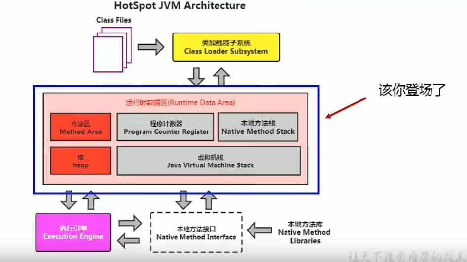
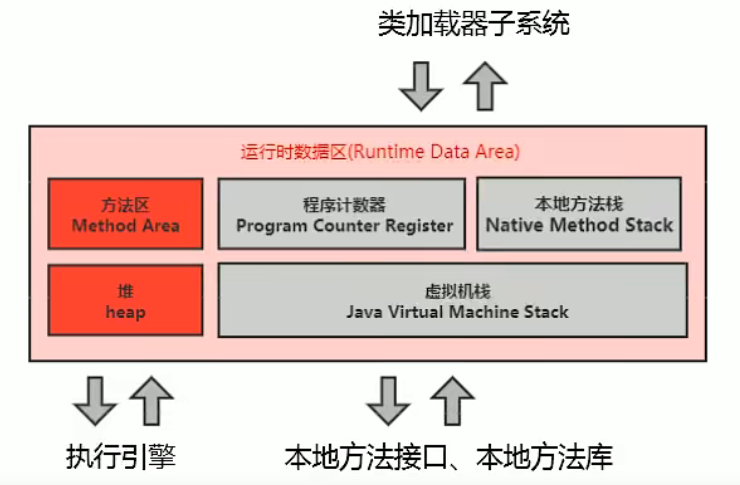

# 相关资料

- 虚拟机规范：[The Java® Virtual Machine Specification (oracle.com)](https://docs.oracle.com/javase/specs/jvms/se8/html/)


# 本章涉及内容



> 此图是针对于HotSpot虚拟机而言的。


# 运行时数据区概述与线程

JVM内存布局，规定了Java在运行过程中内存申请、分配、管理的策略，保证了JVM的高效稳定运行。

但不同的JVM，对于内存的划分方式和管理机制存在部分差异（方法区）。本章结合JVM虚拟机规范，对**<u>经典的JVM内存布局</u>**进行探讨。


## 运行时数据区的内部结构

运行时数据区的结构：




- 类加载器：将class文件，加载到内存中。

- 执行引擎：对<u>字节码指令</u>进行解释执行，将其翻译成<u>机器指令</u>。

- 本地方法接口、本地方法库：C/C++语言的接口或库

- 运行时数据区：可分为：

  - 由所有线程共享的数据区：随虚拟机启动而创建，随虚拟机退出而销毁：

    - 堆区
    - 堆外内存（<u>永久代,元空间（方法区）</u>、代码缓存）

    > ***永久代和元空间，可以理解为方法区的落地实现***。
    >
    > ***在JDK8之后***，方法区换名为元空间，使用的是***本地内存***

  - 线程隔离的数据区：随线程的开始和结束而创建和销毁

    - 程序计数器
    - 本地方法栈
    - 虚拟机栈

> 垃圾回收，一般是针对堆区和方法区而言的，尤其是堆区。

 

> 每个JVM，仅有一份单例的Runtime类实例。对应于运行时数据区，即运行时环境。


## 线程

- 线程是一个程序里的执行单元。JVM允许一个应用有多个线程并行执行。

- 在HotSpot JVM里，***每个线程都与操作系统的本地线程直接映射***：

  - 当一个Java线程准备好（PC、NMS、VMS、缓存分配、本地存储等）执行以后，此时一个操作系统的本地线程也同时创建。当本地线程初始化成功之后，它就会调用Java线程中的run()方法

  - 当Java线程执行终止后，本地线程会被回收

    > 当Java线程因未捕获的异常而终止时，如果此线程为最后一个非守护线程，虚拟机将退出

- 操作系统负责所有线程的安排调度，会将线程调度到任何一个可用的CPU上。

- 如果使用 jconsole 或任何一个调试工具，会发现存在许多后台线程（不包含main线程和main线程创建的线程）。这些后台系统线程，在Hotspot JVM主要是以下几个类别：

  1. 虚拟机线程：

     这种线程的操作是需要JVM达到安全点才会出现。这些操作必须在不同的线程中发生的原因是他们都需要JVM达到安全点，这样堆才不会变化。这种线程的执行类型包括“stop-the-world”的垃圾收集，线程栈收集，线程挂起以及偏向锁撤销。

  2. 周期任务线程：

     这种线程是时间周期事件的体现（比如中断），他们一般用于周期性操作的调度执行。

  3. GC线程：

     这种线程对在JVM里不同种类的垃圾收集行为提供了支持。

  4. 编译线程：

     这种线程在运行时会将字节码编译成本地代码（本地机器指令）

  5. 信号调度线程：

     这种线程接收信号并发送给JVM，在它内部通过调用适当的方法进行处理。


# PC寄存器

> ***JVM中的PC寄存器，是对物理PC寄存器的一种抽象模拟***

> ***是唯一一个，在JVM规范中没有规定任何OutOfMemoryOut情况的区域***


- PC寄存器的作用：

  用来存储指向下一条指令（即将要执行的指令）的地址。由执行引擎读取并执行下一条指令

- 在任何时间，一个线程都只有一个方法在执行，也就是所谓的当前方法（栈顶方法）。

  程序计数器会存储当前线程执行的Java方法的JVM指令地址；

  或者，若当前正在执行native方法，则是未指定值（undefined）

- 为什么要使用PC寄存器存储指令地址：

  因为CPU需要不停的进行线程切换，CPU需要知道接下来执行哪条指令

## PC寄存器的例子

对如下java代码：

```java
package chapter04;

public class PCRegisterTest {
    public PCRegisterTest() {
    }

    public static void main(String[] args) {
        int i = 10;
        int j = 20;
        int var10000 = i + j;
    }
}
```

执行反编译：` javap -v .\PCRegisterTest.class`，将得到如下结果：

```
Classfile /D:/idea_workspace/juc_learn/out/production/juc_learn/chapter04/PCRegisterTest.class
  Last modified 2022年4月22日; size 473 bytes
  MD5 checksum a01ae18f61395a307fc0ad2182b1e003
  Compiled from "PCRegisterTest.java"
public class chapter04.PCRegisterTest
  minor version: 0
  major version: 55
  flags: (0x0021) ACC_PUBLIC, ACC_SUPER
  this_class: #2                          // chapter04/PCRegisterTest
  super_class: #3                         // java/lang/Object
  interfaces: 0, fields: 0, methods: 2, attributes: 1
Constant pool:
   #1 = Methodref          #3.#21         // java/lang/Object."<init>":()V
   #2 = Class              #22            // chapter04/PCRegisterTest
   #3 = Class              #23            // java/lang/Object
   #4 = Utf8               <init>
   #5 = Utf8               ()V
   #6 = Utf8               Code
   #7 = Utf8               LineNumberTable
   #8 = Utf8               LocalVariableTable
   #9 = Utf8               this
  #10 = Utf8               Lchapter04/PCRegisterTest;
  #11 = Utf8               main
  #12 = Utf8               ([Ljava/lang/String;)V
  #13 = Utf8               args
  #14 = Utf8               [Ljava/lang/String;
  #15 = Utf8               i
  #16 = Utf8               I
  #17 = Utf8               j
  #18 = Utf8               k
  #19 = Utf8               SourceFile
  #20 = Utf8               PCRegisterTest.java
  #21 = NameAndType        #4:#5          // "<init>":()V
  #22 = Utf8               chapter04/PCRegisterTest
  #23 = Utf8               java/lang/Object
{
  public chapter04.PCRegisterTest();
    descriptor: ()V
    flags: (0x0001) ACC_PUBLIC
    Code:
      stack=1, locals=1, args_size=1
         0: aload_0
         1: invokespecial #1                  // Method java/lang/Object."<init>":()V
         4: return
      LineNumberTable:
        line 3: 0
      LocalVariableTable:
        Start  Length  Slot  Name   Signature
            0       5     0  this   Lchapter04/PCRegisterTest;

  public static void main(java.lang.String[]);
    descriptor: ([Ljava/lang/String;)V
    flags: (0x0009) ACC_PUBLIC, ACC_STATIC
    Code:
      stack=2, locals=4, args_size=1
         0: bipush        10
         2: istore_1
         3: bipush        20
         5: istore_2
         6: iload_1
         7: iload_2
         8: iadd
         9: istore_3
        10: return
      LineNumberTable:
        line 6: 0
        line 7: 3
        line 8: 6
        line 9: 10
      LocalVariableTable:
        Start  Length  Slot  Name   Signature
            0      11     0  args   [Ljava/lang/String;
            3       8     1     i   I
            6       5     2     j   I
           10       1     3     k   I
}
SourceFile: "PCRegisterTest.java"
```

其中：

- Code中：0,2,3...为指令地址（或称偏移地址）


# 虚拟机栈

## 虚拟机栈概述

- ***栈是运行时单位，而堆是存储单位***

- Java虚拟机栈是什么？

  ***每个线程在创建时，都会创建一个虚拟机栈，其内部保持一个个的栈帧，对应着一个个的Java方法调用。***

- 一个虚拟机栈，是由多个栈帧组成的。

- 一个栈帧，对应着一个java方法。

  栈帧中，保存着该方法的局部变量。

  - 若局部变量为基本数据类型，则保存的就是值本身。
  - 若局部变量为引用数据类型，则保存的对象的引用地址。对象本身存储于堆区。

- ***对于栈来说，不存在的垃圾回收的问题。但存在OutOfMemory的可能***。


```java
package chapter05;

public class StackTest {

    public void methodA(){
        int i = 10;
        int j = 20;

        methodB();
    }

    public void methodB(){
        int m = 30;
        int n = 40;
    }

    public static void main(String[] args) {
        StackTest stackTest = new StackTest();
        stackTest.methodA();
    }
}
```

此main线程对应的Java虚拟机栈如下：


## 虚拟机栈的常见异常与设置栈大小

Java虚拟机规范中，允许Java栈的大小是动态的，或者是固定不变的。

- ***若采用固定大小的Java虚拟机栈***，那么每一个线程的的Java虚拟机栈容量可以在线程创建时独立选定。如果***线程请求分配的栈容量超过Java虚拟机栈允许的最大容量***，Java虚拟机将抛出`StackOverflowError`异常

  ```java
  public class StackOverflowErrorTest {
  
      public static void main(String[] args) {
          main(args);
      }
  }
  // Exception in thread "main" java.lang.StackOverflowError
  ```

- ***若Java虚拟机栈可以动态拓展，并在尝试拓展时无法申请到足够的内存***；***或者在创建新的线程时没有足够的内存去创建对应的虚拟机栈***，则Java虚拟机将抛出`OutOfMemory`异常


通过使用`参数 -Xss 选项`，可以设置线程的最大栈空间。栈的大小直接决定了函数调用的最大可达深度。


```java
public class StackDeepTest {

    private static int count = 0;
    
    public static void recursion(){
        count++;
        recursion();
    }
    
    public static void main(String[] args) {
        try {
            recursion();
        }catch (Throwable e){
            System.out.println("deep of calling is:"+ count);
        }
    }
}
```


## 虚拟机栈的存储单位——栈帧

- 一个线程中，可以运行多个方法。对于着一个虚拟机栈的多个栈帧
- 在一条活动线程中，一个时间点上，只会有一个活动的栈帧。
  - 即只有当前正在执行的方法的栈帧（即栈顶栈帧）是有效的，此栈帧被称为`当前栈帧（Current Frame）`。
  - 与当前栈帧对应的方法，称为`当前方法（Current Method）`
  - 定义当前方法的类，被称为`当前类（Current Class）`

- 不同线程之间所包含的栈帧，是不能相互引用的。即不可能在一个栈帧中引用另一个线程的栈帧

- Java方法有两种返回函数的方式：

  1. 正常的函数返回，使用return指令
  2. 运行时出现未捕获的异常，以抛出异常的方式返回

  不管是哪种返回方式，都会导致栈帧被出栈。


### 栈帧的内部结构

每个栈帧中，存储着：

- 局部变量表
- 操作数栈（或称表达式栈）
- 动态链接（或指向运行时常量池的方法引用）
- 方法返回地址（或方法正常返回或异常退出的定义）
- 一些附加信息


### 局部变量表(Local Variables)

- 局部变量表，也成为局部变量数组或本地变量表。

- 其定义为一个***数字数组***，主要用于存储方法参数和定义在方法体内的局部变量。

  存储的数据类型包含：基本数据类型、对象引用，returnAddress类型

- 由于局部变量表是建立在线程的栈上的，是线程的私有数据，因此是不存在线程安全问题的。

- 局部变量表所需的大小，是在**编译阶段确定**下来的，并**保存在方法的Code属性的maximum local variables数据项**中。

  在方法的运期间，是不会改变局部变量表的大小的。


- 局部变量表中的变量，只在当前方法调用中有效。

  在方法执行时，虚拟机通过使用局部变量表，来完成参数值到参数变量列表的传递过程。

  当方法调用结束后，随着方法栈帧的销毁，局部变量表也随之销毁。


譬如：

- java方法：
  ```java
  public static void main(String[] args) {
      int i = 10;
      int j = 20;
      int k = i + j;
      Object obj = null;
  }
  ```

- 对应的局部变量表（执行 javap  -v xxx.class）：

  ```
  public static void main(java.lang.String[]);
      descriptor: ([Ljava/lang/String;)V
      flags: (0x0009) ACC_PUBLIC, ACC_STATIC
      Code:
        stack=2, locals=5, args_size=1
           0: bipush        10
           2: istore_1
           3: bipush        20
           5: istore_2
           6: iload_1
           7: iload_2
           8: iadd
           9: istore_3
          10: aconst_null
          11: astore        4
          13: return
        LineNumberTable:
          line 6: 0
          line 7: 3
          line 8: 6
          line 9: 10
          line 10: 13
        LocalVariableTable:
          Start  Length  Slot  Name   Signature
              0      14     0  args   [Ljava/lang/String;
              3      11     1     i   I
              6       8     2     j   I
             10       4     3     k   I
             13       1     4   obj   Ljava/lang/Object;
  ```

  > - 关于LineNumberTable：
  >
  >   java代码行号和Code行号的映射关系。
  >
  > - 关于Start：
  >
  >   Start+1 为该变量开始有效的Code行号。存在Start+Length = Code总行号的关系
  >
  > - 其中关于Signature：
  >
  >   - 以`[`开头，表示为Java的数组类型
  >
  >   - 以`L`开头，表示为引用


#### Slot

- 局部变量表（一数字数组），其<font style="color:LightCOral;">最基本的存储单元是Slot（变量槽）</font>
- 在局部变量表中：
  - 32位以内的类型，占用一个Slot。主要有：
    - returnAddress类型
    - reference类型
    - int
    - float
    - byte、short、char、boolean（非0为true）在存储前被转换为int
  - 64位的类型，占用两个Slot。主要有：
    - long
    - double

- JVM会为局部变量表中的每一个Slot都分配一个索引。通过这个索引即可访问局部变量表中的对应的局部变量。

  > 当访问64bit的局部变量值时，通过前一个索引进行访问。
  >
  > 例如通过索引值4访问double变量q
  >
  > 

- 局部变量表的分配顺序，是按照变量定义的顺序来的。

  > 特别的，对于构造方法或实例方法（非static方法），***对象引用this放在索引为0的Slot处***。

- <font style="color:LightCoral">Slot的重复利用</font>：

  栈帧中的局部变量表的槽位是可以重复利用的。如果一个局部变量过了其作用域，那么在作用域之后声明的新的局部变量，就很可能复用过期局部变量的槽位。

  例如：

  ```java
  public class SlotTest{
      public void localVarl(){
          int a = 0;
          int b = 0;
      }
      
      public void localVar2(){
          {
              int a = 0;
          }
          // 此时b就会复用a的槽位
          int b = 0;
      }
  }
  ```


复习一下变量的分类：

- 按数据类型分：

  - 基本数据类型
  - 引用数据类型

- 按照在类中声明的位置：

  - 成员变量：都存在默认初始化值

    - **类变量（static修饰）**：

      1. linking的prepare阶段，给类变量默认赋值（赋零值）。

         > 当然，final修饰的static变量，在此已经显式赋初值

      2. 在linking的initial阶段，给类变量显式赋初值。

    - **实例变量（无static修饰）**：

      随着对象的创建，在堆空间中分配实例变量空间，并进行默认赋值。

  - 局部变量：

    - 必须显式赋值，不存在默认赋值。

    

  

### 操作数栈

[尚硅谷宋红康JVM全套教程（详解java虚拟机）_哔哩哔哩_bilibili](https://www.bilibili.com/video/BV1PJ411n7xZ?p=52&spm_id_from=pageDriver)
