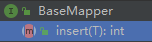
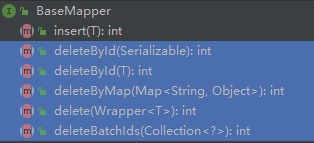
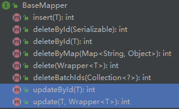
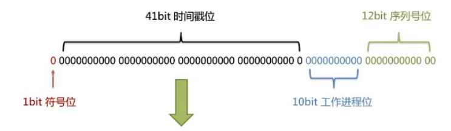

# 相关网址

官方地址: http://mp.baomidou.com

代码发布地址:

Github: https://github.com/baomidou/mybatis-plus

Gitee: https://gitee.com/baomidou/mybatis-plus

文档发布地址: https://baomidou.com/pages/24112f


# Mybatis-plus框架结构


# 入门Demo

## 开发环境

IDE：idea 2019.2

JDK：JDK8+

构建工具：maven 3.5.4

MySQL版本：MySQL 5.7


## 创建数据库及表

```sql
CREATE DATABASE `mybatis_plus`
/*!40100 DEFAULT CHARACTER SET utf8mb4 */
;

use `mybatis_plus`;

CREATE TABLE `user` (
    `id` bigint(20) NOT NULL COMMENT '主键ID',
    `name` varchar(30) DEFAULT NULL COMMENT '姓名',
    `age` int(11) DEFAULT NULL COMMENT '年龄',
    `email` varchar(50) DEFAULT NULL COMMENT '邮箱',
    PRIMARY KEY (`id`)
) ENGINE = InnoDB DEFAULT CHARSET = utf8;

INSERT INTO
    user (id, name, age, email)
VALUES
    (1, 'Jone', 18, 'test1@baomidou.com'),
    (2, 'Jack', 20, 'test2@baomidou.com'),
    (3, 'Tom', 28, 'test3@baomidou.com'),
    (4, 'Sandy', 21, 'test4@baomidou.com'),
    (5, 'Billie', 24, 'test5@baomidou.com');
```


## 创建SpringBoot工程

1. 使用Spring Initializr创建，Spring Boot版本2.6.3

2. 引入依赖

    ```xml
    <dependencies>
        <dependency>
            <groupId>org.springframework.boot</groupId>
            <artifactId>spring-boot-starter</artifactId>
        </dependency>
        <dependency>
            <groupId>org.springframework.boot</groupId>
            <artifactId>spring-boot-starter-test</artifactId>
            <scope>test</scope>
        </dependency>
        <dependency>
            <groupId>com.baomidou</groupId>
            <artifactId>mybatis-plus-boot-starter</artifactId>
            <version>3.5.1</version>
        </dependency>
        <dependency>
            <groupId>org.projectlombok</groupId>
            <artifactId>lombok</artifactId>
            <optional>true</optional>
        </dependency>
        <dependency>
            <groupId>mysql</groupId>
            <artifactId>mysql-connector-java</artifactId>
            <scope>runtime</scope>
        </dependency>
    </dependencies>
    ```

3. 在IDEA中安装lombok插件


## 编写代码

1. 配置application.yml

    ```yaml
    spring:
      datasource:
        type: com.zaxxer.hikari.HikariDataSource
        driver-class-name: com.mysql.cj.jdbc.Driver
        url: jdbc:mysql://localhost:3306/mybatis_plus?characterEncoding=utf-8&useSSL=false
        username: root
        password: 123456
    ```

    >- spring boot 2.0（内置jdbc5驱动），驱动类使用：
    >
    >    driver-class-name: com.mysql.jdbc.Driver
    >
    >- spring boot 2.1及以上（内置jdbc8驱动），驱动类使用：
    >
    >    driver-class-name: com.mysql.cj.jdbc.Driver
    >
    >- MySQL5.7版本的url：
    >
    >    jdbc:mysql://localhost:3306/mybatis_plus?characterEncoding=utf-8&useSSL=false
    >
    >- MySQL8.0版本的url：
    >
    >    jdbc:mysql://localhost:3306/mybatis_plus?serverTimezone=GMT%2B8&characterEncoding=utf-8&useSSL=false

2. 创建实体类：

    ```java
    import lombok.Data;
    
    @Data //lombok注解
    public class User {
        private Long id;
        private String name;
        private Integer age;
        private String email;
    }
    ```

    > @Data注解，将自动生成Getter/Setter，equals，hashCode，toString，无参构造器

3. 创建Mapper接口：

    ```java
    @Repository
    public interface UserMapper extends BaseMapper<User> {
    }
    ```

    > 添加@Repository注解，即可解决IDEA报错：没有可匹配类型的Bean

4. 指定包扫描

    ```java
    @SpringBootApplication
    @MapperScan("com.example.mybatisplus.mapper")
    public class MybatisplusApplication {
        public static void main(String[] args) {
            SpringApplication.run(MybatisplusApplication.class, args);
        }
    }
    ```

5. 测试：

    ```java
    @SpringBootTest
    public class UserTest {
    
        @Autowired
        private UserMapper userMapper;
    
        @Test
        public void testSelectList(){
            //通过条件构造器queryWrapper进行查询，封装结果为list
            List<User> users = userMapper.selectList(null);
            System.out.println(users);
        }
    }
    ```

    

## 配置日志功能

```yaml
mybatis-plus:
  configuration:
    log-impl: org.apache.ibatis.logging.stdout.StdOutImpl
```


## 总结

- 基于BaseMapper\<T>接口提供的基本查询方法，及通过反射生成的实现类(启动类标注`@MapperScan()`注解)，即可完成基本的数据库操作。

- 特别的，Mybatis-plus提供了`ServiceImpl<M extends BaseMapper<T>, T> implements IService<T>`类，用它就可以提供基本的业务操作。

    > 如ServiceImpl<UserMapper, User>

    但在开发中，业务层往往有自定义的操作，往往有如下形式的代码结构：

    ```java
    public interface UserService extends IService<User> {
        
    }
    ```

    ```java
    @Service
    public class UserServiceImpl  extends ServiceImpl<UserMapper, User> implements UserService {
    
    }
    ```

    

    

# BaseMapper\<T>接口

## 新增功能




### insert(T entity)

```java
@SpringBootTest
public class UserTest {

    @Autowired
    private UserMapper userMapper;

    @Test
    public void testInsert(){
        User user =new User();
        user.setName("张三");
        user.setAge(23);
        user.setEmail("abc@qq.com");

        //INSERT INTO user ( id, name, age, email ) VALUES ( ?, ?, ?, ? )
        int result = userMapper.insert(user);
        System.out.println(result);
        System.out.println(user);
    }
}

```

> 在插入记录前，将根据默认的雪花算法，设置user对象的id属性


##删除功能




### deleteById(Serializable id)方法

```java
@SpringBootTest
public class UserTest {

    @Autowired
    private UserMapper userMapper;

    @Test
    public void deleteByID(){
        //DELETE FROM user WHERE id=?
        int result = userMapper.deleteById(1505084180572893186L);
        System.out.println(result);
    }
}
```


### deleteByMap(Map<String, Object> columnMap)法

```java
@SpringBootTest
public class UserTest {

    @Autowired
    private UserMapper userMapper;

    @Test
    public void deleteByMap(){
        //DELETE FROM user WHERE name = ? AND age = ?
        Map<String,Object> map = new HashMap<>();
        map.put("name","张三");
        map.put("age",23);

        int result = userMapper.deleteByMap(map);
        System.out.println(result);
    }
}
```


### deleteBatchIds(Collection<?> idList)

```java
@SpringBootTest
public class UserTest {

    @Autowired
    private UserMapper userMapper;

    @Test
    public void deleteByBatchIDs(){
        List<Long> idList = Arrays.asList(1L, 2L, 3L);

        // Preparing: DELETE FROM user WHERE id IN ( ? , ? , ? )
        //Parameters: 1(Long), 2(Long), 3(Long)
        int result = userMapper.deleteBatchIds(idList);
        System.out.println(result);
    }
}
```


## 修改功能




### updateById(T entity)

```java
@SpringBootTest
public class UserTest {

    @Autowired
    private UserMapper userMapper;
    
    @Test
    public void testUpdateByID(){
        User user = new User();
        user.setId(4L);
        user.setName("lisi");
        user.setEmail("lisi@qq.com");

        //UPDATE user SET name=?, email=? WHERE id=?
        int result = userMapper.updateById(user);
        System.out.println(result);
    }
}
```


## 查询功能


### T selectById(Serializable id)

```java
@SpringBootTest
public class UserTest {

    @Autowired
    private UserMapper userMapper;

    @Test
    public void selectByID(){
        //SELECT id,name,age,email FROM user WHERE id=?
        User user = userMapper.selectById(1L);
        System.out.println(user);
    }
}
```


### List\<T> selectBatchIds(Collection<? extends Serializable> idList)

```java
@SpringBootTest
public class UserTest {

    @Autowired
    private UserMapper userMapper;

    @Test
    public void selectByBatchIDs(){
        List<Long> idList = Arrays.asList(1L, 2L, 3L);
        
        // Preparing: SELECT id,name,age,email FROM user WHERE id IN ( ? , ? , ? )
        //Parameters: 1(Long), 2(Long), 3(Long)
        List<User> users = userMapper.selectBatchIds(idList);
        users.forEach(System.out::println);
    }
}
```


### List\<T> selectByMap(Map<String, Object> columnMap)

```java
@SpringBootTest
public class UserTest {

    @Autowired
    private UserMapper userMapper;

    @Test
    public void selectByMap(){
        Map<String,Object> map = new HashMap<>();
        map.put("name","张三");
        map.put("age",23);
        
        // Preparing: SELECT id,name,age,email FROM user WHERE name = ? AND age = ?
        //Parameters: 张三(String), 23(Integer)
        List<User> users = userMapper.selectByMap(map);
        users.forEach(System.out::println);
    }
}
```


### List\<T> selectList(Wrapper\<T> queryWrapper)

```java
@SpringBootTest
public class UserTest {

    @Autowired
    private UserMapper userMapper;
    
    @Test
    public void selectByList(){
        //SELECT id,name,age,email FROM user
        List<User> users = userMapper.selectList(null);
        users.forEach(System.out::println);
    }
}
```


# 自定义功能

1. 配置SQL映射文件的扫描位置：

    ```yaml
    mybatis-plus:
      configuration:
        log-impl: org.apache.ibatis.logging.stdout.StdOutImpl
      mapper-locations: 
        - classpath*:/mapper/**/*.xml #即默认值
    
    ```

    >- 启动类上的@MapperScan()，是用于扫描Mapper接口的
    >
    >- mapper-locations配置，是用于扫描SQL映射文件的

2. 编写SQL映射文件：

    ```xml
    <?xml version="1.0" encoding="utf-8" ?>
    <!DOCTYPE mapper
            PUBLIC "-//mybatis.org//DTD Mapper 3.0//EN"
            "http://mybatis.org/dtd/mybatis-3-mapper.dtd" >
    <mapper namespace="com.example.mybatisplus.mapper.UserMapper">
        <select id="selectMapByID" resultType="map">
            SELECT id,name,age,email FROM user WHERE id = #{id}
        </select>
    </mapper>
    ```

3. 测试：

    ```java
    @SpringBootTest
    public class UserTest {
    
        @Autowired
        private UserMapper userMapper;
    
        @Test
        public void testCustomMapper(){
            Map<String, Object> map = userMapper.selectMapByID(1L);
            System.out.println(map);
        }
    }
    ```

    

# IService\<T>接口

> 该接口的实现类：
>
> ```java
> public class ServiceImpl<M extends BaseMapper<T>, T> implements IService<T>{}
> ```
>
> - M：Mapper接口，通常应该继承BaseMapper\<T>
> - T：实例类类型


步骤如下：

1. 创建Service接口：

    ```java
    public interface UserService extends IService<User> {
    }
    ```

2. 创建Service接口的实现类：

    ```java
    @Service
    public class UserServiceImpl  extends ServiceImpl<UserMapper, User>implements UserService{
    }
    ```

    > 其中UserMapper：
    >
    > ```java
    > public interface UserMapper extends BaseMapper<User> {}
    > ```

3. 编写自定义Service层业务


## 查询记录数量

### long count()

```java
@SpringBootTest
public class UserServiceTest {

    @Autowired
    private UserService userService;

    @Test
    public void testRecordsCount(){
        //SELECT COUNT( * ) FROM user
        long count = userService.count();
        System.out.println(count);
    }
}
```


## 批量添加

### boolean saveBatch(Collection<T> entityList)

```java
@SpringBootTest
public class UserServiceTest {

    @Autowired
    private UserService userService;

    @Test
    public void testBatchInsert(){
        List<User> list = new ArrayList<>();
        for (int i = 1;i <= 10;i++){
            User user = new User();
            user.setName("name_"+i);
            user.setAge(20+i);
            list.add(user);
        }

        // Preparing: INSERT INTO user ( id, name, age ) VALUES ( ?, ?, ? )
        //Parameters: 1505102000320888834(Long), name_1(String), 21(Integer)
        //Parameters: 1505102000392192001(Long), name_2(String), 22(Integer)
        //...
        boolean b = userService.saveBatch(list);
        System.out.println(b);
    }
}
```


# 常用注解

https://www.bilibili.com/video/BV12R4y157Be?p=21&spm_id_from=pageDriver

## @TableName注解

> 在默认情况下，由BaseMapper\<T>的T决定要操作的表名，即默认为实体类类名小写


当表名与实体类类名不一致时，可采用`@TableName`注解

```java
import com.baomidou.mybatisplus.annotation.TableName;
import lombok.Data;

@TableName("tb_user")
@Data //lombok注解
public class User {
    private Long id;
    private String name;
    private Integer age;
    private String email;
}
```


> 特别的，也可以选择为所有的表名添加前缀：
>
> ```yaml
> mybatis-plus:
>   global-config:
>     db-config:
>       table-prefix: tb_
> ```


## @TableID注解

通过@TableId注解，可以指定哪个POJO属性将来作为数据表的主键字段

- value属性：用于指明属性对应的数据表字段的名称

- type属性：主键的生成策略:

    - IdType.AUTO：主键自增时使用
    - IdType.NONE
    - IdType.ASSIGN_ID：==仅在id属性为空时==，使用雪花算法生成ID（在插入记录前为对象设置属性）

    > 例如，如果想要主键自增：
    >
    > 1. 数据库的主键设置为自增
    > 2. type设置为IdType.AUTO

```java
public @interface TableId {

    /**
     * 字段名（该值可无）
     */
    String value() default "";

    /**
     * 主键类型
     * {@link IdType}
     */
    IdType type() default IdType.NONE;
}
```


使用方法如下：

```java
@Data //lombok注解
public class User {
    
    @TableId(value = "uid") //数据表中的主键名为uid
    private Long id;
    
    private String name;
    private Integer age;
    private String email;
}
```

> 也可以配置全局配置：
>
> ```yaml
> mybatis-plus:
>   global-config:
>     id-type: auto
> ```


### 雪花算法

- 背景：

    需要选择合适的方案去应对数据规模的增长，以应对逐渐增长的访问压力和数据量。

    数据库的扩展方式主要包括：业务分库、主从复制，数据库分表


其中**数据库分表策略**：将不同业务数据分散存储到不同的数据库服务器，能够支撑百万甚至千万用户规模的业务，但如果业务继续发展，同一业务的单表数据也会达到单台数据库服务器的处理瓶颈。

例如，淘宝的几亿用户数据，如果全部存放在一台数据库服务器的一张表中，肯定是无法满足性能要求的，此时就需要对单表数据进行拆分。


- 垂直拆分：垂直分表适合将表中某些不常用且占了大量空间的列拆分出去

- 水平拆分：适合表行数特别大的表

    水平分表相比垂直分表，会引入更多的复杂性。例如要求全局唯一的数据id该如何处理


水平拆分引起的问题，常见的解决策略：

- **为每张表设置主键区间**：

    以最常见的用户 ID 为例，可以按照 1000000 的范围大小进行分段，1 ~ 999999 放到表 1中，1000000 ~ 1999999 放到表2中，以此类推。

    - 复杂点：分段大小的选取。分段太小会导致切分后子表数量过多，增加维护复杂度；分段太大可能会导致单表依然存在性能问题，一般建议分段大小在 100 万至 2000 万之间，具体需要根据业务选取合适的分段大小。
    - 优点：可以随着数据的增加平滑地扩充新的表。例如，现在的用户是 100 万，如果增加到 1000 万，只需要增加新的表就可以了，原有的数据不需要动。
    - 缺点：分布不均匀。假如按照 1000 万来进行分表，有可能某个分段实际存储的数据量只有 1 条，而另外一个分段实际存储的数据量有 1000 万条。

- **取模**：

    同样以用户 ID 为例，假如我们一开始就规划了 10 个数据库表，可以简单地用 user_id % 10 的值来表示数据所属的数据库表编号，ID 为 985 的用户放到编号为 5 的子表中，ID 为 10086 的用户放到编号为 6 的子表中

    - 复杂点：初始表数量的确定。表数量太多维护比较麻烦，表数量太少又可能导致单表性能存在问题。
    - 优点：表分布比较均匀。
    - 缺点：扩充新的表很麻烦，所有数据都要重分布。

- **雪花算法**：

    雪花算法是由Twitter公布的==分布式主键生成算法==，它能够保证不同表的主键的不重复性，以及相同表的主键的有序性。


核心思想：



- 1bit符合位：一般是0，即正数
- 41bit时间戳：存储的是时间截的差值（当前时间截 - 开始时间截)，结果约等于69.73年
- 1obit作为机器的ID（5个bit是数据中心，5个bit的机器ID，可以部署在1024个节点）
- 12bit作为毫秒内的流水号（意味着每个节点在每毫秒可以产生 4096 个 ID）


优点：整体上按照时间自增排序，并且整个分布式系统内不会产生ID碰撞，并且效率较高


## @TableField注解

类似于@TableId注解：

```java
@TableName("user")
@Data //lombok注解
public class User {
    private Long id;
    
    @TableField("username")
    private String name;
    private Integer age;
    private String email;
}
```


## @TableLogic注解

### 逻辑删除

- 物理删除：真实删除，对应的数据将从数据库中被删除

- 逻辑删除：假删除，仅设置“被删除状态”字段。

    从而实现数据恢复

### 实现逻辑删除

1. 在数据库的数据表中，创建逻辑删除状态列，设置默认值为0

    

2. 在实体类中相应的属性，添加@TableLogic注解

    ```java
    @TableName("user")
    @Data //lombok注解
    public class User {
        private Long id;
        private String name;
        private Integer age;
        private String email;
        
        @TableLogic
        private Integer isDeleted;
    }
    ```

    

- 执行删除方法：

    ```java
    @SpringBootTest
    public class UserDaoTest {
    
        @Autowired
        private UserMapper userMapper;
    
        @Test
        public void deleteByID(){
            //UPDATE user SET is_deleted=1 WHERE id=? AND is_deleted=0
            int result = userMapper.deleteById(1505102000320888834L);
            System.out.println(result);
        }
    }
    ```

    > 处于逻辑删除状态的记录，将不会被Mybatis-plus查询到；
    > **需要手动编写SQL语句**


​    

# 条件构造器Wrapper

## Wrapper介绍


Wrapper：条件构造抽象类

- AbstractWrapper：用于封装查询条件，生成SQL的WHERE条件
    - QueryWrapper：封装查询条件
    - UpdateWrapper：封装Update条件
    - AbstractLambdaWrapper：使用Lambda语法
        - LambdaQueryWrapper：用Lambda语法封装查询条件
        - LambdaUpdateWrapper：用Lambda语法封装Update条件


## QueryMapper\<T>接口(查询、删除)

>QueryMapper主要用于查询和删除功能。修改功能也可以使用


### 例：组装查询条件

```java
@SpringBootTest
public class WrapperTest {

    @Autowired
    private UserMapper userMapper;

    @Test
    public void test1(){
        QueryWrapper<User> queryWrapper = new QueryWrapper<>();

        queryWrapper.like("name","a")
                .between("age",20,30)
                .isNotNull("email");

        List<User> users = userMapper.selectList(queryWrapper);
        users.forEach(System.out::println);
    }
}
```


### 例：组装排序条件

```java
@SpringBootTest
public class WrapperTest {

    @Autowired
    private UserMapper userMapper;

    @Test
    public void test02() {
        QueryWrapper<User> queryWrapper = new QueryWrapper<>();

        //按年龄降序；年龄相同者，按id升序
        queryWrapper.orderByDesc("age")
                .orderByAsc("id");

        List<User> users = userMapper.selectList(queryWrapper);
        users.forEach(System.out::println);
    }
}
```


### 例：组装删除条件

```java
@SpringBootTest
public class WrapperTest {

    @Autowired
    private UserMapper userMapper;

    @Test
    public void test03(){
        QueryWrapper<User> queryWrapper = new QueryWrapper<>();
        queryWrapper.isNull("email");

        int delete = userMapper.delete(queryWrapper);
        System.out.println("影响行数："+delete);
    }
}
```


### 在Update中使用QueryMapper

```java
@SpringBootTest
public class WrapperTest {

    @Autowired
    private UserMapper userMapper;

    @Test
    public void test04(){
        //修改 年龄大于20且用户名包含a 或 邮箱为null 的用户信息

        QueryWrapper<User> queryWrapper = new QueryWrapper<>();
        queryWrapper.gt("age",20)
            .like("name","a")
            .or()
            .isNull("email");

        User u = new User();
        u.setName("xiaoming123");

        //UPDATE user SET name=? WHERE (age > ? AND name LIKE ? OR email IS NULL)
        userMapper.update(u,queryWrapper);
    }
}
```


### 优先级问题

```java
@SpringBootTest
public class WrapperTest {

    @Autowired
    private UserMapper userMapper;

    @Test
    public void test05(){
        //修改 年龄大于20 且 用户名包含a或邮箱为null 的用户信息

        QueryWrapper<User> queryWrapper = new QueryWrapper<>();
        queryWrapper.gt("age", 20)
                .and(wrapper -> wrapper.like("name", "a")
                        .isNull("email"));

        User u = new User();
        u.setName("xiaoming123");

        //UPDATE user SET name=? WHERE (age > ? AND (name LIKE ? AND email IS NULL))
        userMapper.update(u,queryWrapper);
    }
}
```

> 链式编程时，默认用and进行连接。
>
> 当想让or条件优先时，需要提供lamda表达式。


```java
public interface Nested<Param, Children> extends Serializable {

	//泛型 Param 是具体需要运行函数的类(也是 wrapper 的子类)
    default Children and(Consumer<Param> consumer) {
        return and(true, consumer);
    }
}
```


### 组装查询字段

```java
@SpringBootTest
public class WrapperTest {

    @Autowired
    private UserMapper userMapper;

    @Test
    public void test06(){
        QueryWrapper<User> queryWrapper = new QueryWrapper<>();

        queryWrapper.select("name","email");
        //SELECT name,email FROM user
        List<Map<String, Object>> maps = userMapper.selectMaps(queryWrapper);

        maps.forEach(System.out::println);
    }
}
```


### 组装子查询

```java
@SpringBootTest
public class WrapperTest {

    @Autowired
    private UserMapper userMapper;

    @Test
    public void test07(){
        QueryWrapper<User> queryWrapper = new QueryWrapper<>();

        queryWrapper.inSql("id","SELECT id FROM user WHERE id<=100");
        //SELECT id,name,age,email,is_deleted FROM user WHERE (id IN (SELECT id FROM user WHERE id<=100))
        List<User> users = userMapper.selectList(queryWrapper);
        users.forEach(System.out::println);
    }
}
```


## UpdateMapper\<T>接口

```java
@SpringBootTest
public class WrapperTest {

    @Autowired
    private UserMapper userMapper;

    @Test
    public void test08(){
        UpdateWrapper<User> updateWrapper = new UpdateWrapper<>();

        updateWrapper.set("name","xiaohong123");
        updateWrapper.like("name","a");

        //UPDATE user SET name=? WHERE (name LIKE ?)
        int update = userMapper.update(null, updateWrapper);
    }
}
```


> 注意与[使用QueryWrapper进行更新](#在Update中使用QueryMapper)操作相对比。
>
> ```java
> int update(@Param(Constants.ENTITY) T entity, @Param(Constants.WRAPPER) Wrapper<T> updateWrapper);
> ```
>
> - 使用QueryWrapper时：entity不应为null
> - 使用UpdateWrapper时：entity可以为null


## condition

在真正开发的过程中，组装条件是常见的功能，而这些条件数据来源于用户输入，是可选的，因此我们在组装这些条件时，必须先判断用户是否选择了这些条件：

- 若选择则需要组装该条件
- 若没有选择则不进行组装


```java
@SpringBootTest
public class WrapperTest {

    @Autowired
    private UserMapper userMapper;

    @Test
    public void test09() {
        String username = null;
        Integer ageBegin = 10;
        Integer ageEnd = 24;

        QueryWrapper<User> queryWrapper = new QueryWrapper<>();
        queryWrapper.like(StringUtils.isNotBlank(username),"username","a")
                .ge(ageBegin != null,"age",ageBegin)
                .le(ageEnd != null ,"age", ageEnd);

        List<User> users = userMapper.selectList(queryWrapper);
    }
}
```


## LambdaQueryWrapper\<T>接口

```java
@SpringBootTest
public class WrapperTest {

    @Autowired
    private UserMapper userMapper;

    @Test
    public void test10(){
        String username = null;
        Integer ageBegin = 10;
        Integer ageEnd = 24;

        LambdaQueryWrapper<User> lambdaQueryWrapper = new LambdaQueryWrapper<>();
        lambdaQueryWrapper.like(StringUtils.isNotBlank(username), User::getName, username)
                .ge(ageBegin != null, User::getAge,ageBegin)
                .le(ageEnd != null, User::getAge,ageEnd);

        //SELECT id,name,age,email,is_deleted FROM user WHERE (age >= ? AND age <= ?)
        List<User> users = userMapper.selectList(lambdaQueryWrapper);
        users.forEach(System.out::println);
    }
}
```

> 主要用于：防止字段名写错


原理：

```java
import java.io.Serializable;
import java.lang.invoke.SerializedLambda;
import java.lang.reflect.Method;
import java.util.function.Function;

public class LambdaTest {
    @FunctionalInterface
    interface MFunction<T, R> extends Function<T, R>, Serializable {
    }

    private static <T, R> SerializedLambda doSFunction(MFunction<T, R> func) throws Exception {
        // 直接调用writeReplace
        Method writeReplace = func.getClass().getDeclaredMethod("writeReplace");
        writeReplace.setAccessible(true);
        //反射调用
        Object sl = writeReplace.invoke(func);
        return (SerializedLambda) sl;
    }


    public static void main(String[] args) throws Exception {
        SerializedLambda serializedLambda = doSFunction(User::getId);

        System.out.println("方法名：" + serializedLambda.getImplMethodName());
        System.out.println("类名：" + serializedLambda.getImplClass());
    }
}
```


## LambdaUpdateWrapper\<T>接口

```java
@SpringBootTest
public class WrapperTest {

    @Autowired
    private UserMapper userMapper;

    @Test
    public void test11() {
        String username = "a";
        Integer ageBegin = 10;
        Integer ageEnd = 24;
        
        LambdaQueryWrapper<User> queryWrapper = new LambdaQueryWrapper<>();
        queryWrapper
                .like(StringUtils.isNotBlank(username), User::getName, username)
                .ge(ageBegin != null, User::getAge, ageBegin)
                .le(ageEnd != null, User::getAge, ageEnd);
        
        List<User> users = userMapper.selectList(queryWrapper);
        users.forEach(System.out::println);
    }
}
```


# 插件

## 分页插件

>MyBatis Plus自带分页插件，只要简单的配置即可实现分页功能


### 基本使用

步骤如下：

1. 添加配置类

    ```java
    import com.baomidou.mybatisplus.annotation.DbType;
    import com.baomidou.mybatisplus.extension.plugins.MybatisPlusInterceptor;
    import com.baomidou.mybatisplus.extension.plugins.inner.PaginationInnerInterceptor;
    import org.mybatis.spring.annotation.MapperScan;
    import org.springframework.context.annotation.Bean;
    import org.springframework.context.annotation.Configuration;
    
    @Configuration
    @MapperScan("com.example.mybatisplus.mapper")
    public class MybatisConfig {
        @Bean
        public MybatisPlusInterceptor mybatisPlusInterceptor(){
            MybatisPlusInterceptor interceptor = new MybatisPlusInterceptor();
            interceptor.addInnerInterceptor(new PaginationInnerInterceptor(DbType.MYSQL));
    
            return interceptor;
        }
    }
    ```

2. 测试

    ```java
    @SpringBootTest
    public class MybatisPluginTest {
    
        @Autowired
        UserMapper userMapper;
    
        @Test
        public void testPage() {
            Page<User> page = new Page<>(2,3);//当前页页码，每页显示记录条数
    
            //SELECT id,name,age,email,is_deleted FROM user LIMIT ?,?
            userMapper.selectPage(page, null);
    
            List<User> records = page.getRecords();
            records.forEach(System.out::println);
        }
    }
    ```

    


### XML自定义

步骤如下：

1. 在Mapper接口中的定义方法：

    ```java
    @Repository
    public interface UserMapper extends BaseMapper<User> {
    
        Page<User> selectPageVo(@Param("page") Page<User> page, @Param("age") Integer age);    
    }
    ```

    > 注意：
    >
    > - 方法的返回值必须是Page<T>
    > - 方法的第一个参数必须是Page<T>

2. 在相应的XML映射文件中实现方法：

    ```xml
    <?xml version="1.0" encoding="utf-8" ?>
    <!DOCTYPE mapper
            PUBLIC "-//mybatis.org//DTD Mapper 3.0//EN"
            "http://mybatis.org/dtd/mybatis-3-mapper.dtd" >
    <mapper namespace="com.example.mybatisplus.mapper.UserMapper">
    
        <!--此处使用类型别名-->
        <select id="selectPageVo" resultType="User">
            SELECT * from user where age > #{age}
        </select>
    </mapper>
    ```

3. 测试：

    ```java
    @SpringBootTest
    public class MybatisPluginTest {
    
        @Autowired
        UserMapper userMapper;
    
        @Test
        public void testXMLPage(){
            Page<User> page = new Page<>(2,3);
    
            userMapper.selectPageVo(page, 18);
            
            List<User> records = page.getRecords();
            records.forEach(System.out::println);
        }
    }
    ```

    


## 乐观锁插件

- 情景：

    一件商品，成本价是80元，售价是100元。

    老板先通知小李，让其将价格增加50元。

    后通知小王，让其将价格降低30元。

- 可能出现的问题：

    小李和小王同时查询数据库，得到价格为100元。

    小李先将价格设置为150元；但小王的将价格覆盖为70元。

    ```java
    @SpringBootTest
    public class ProductTest {
    
        @Autowired
        ProductMapper productMapper;
    
        @Test
        public void test(){
            Product product_A = productMapper.selectById(1L);//100
            Product product_B = productMapper.selectById(1L);//100
    
            product_A.setPrice(product_A.getPrice()+50);//150
            product_B.setPrice(product_B.getPrice()-30);//70
    
            productMapper.updateById(product_A);//150
            productMapper.updateById(product_B);//70
        }
    }
    ```


基于乐观锁的解决方案：

1. 为JavaBean的相应属性，添加`@Version`注解

    ```java
    @Data
    @TableName("t_product")
    public class Product {
        private Long id;
        private String name;
        private Integer price;
        
        @Version
        private Integer version;
    }
    ```

2. 配置乐观锁插件

    ```java
    @Configuration
    @MapperScan("com.example.mybatisplus.mapper")
    public class MybatisConfig {
        @Bean
        public MybatisPlusInterceptor mybatisPlusInterceptor(){
            MybatisPlusInterceptor interceptor = new MybatisPlusInterceptor();
    
            interceptor.addInnerInterceptor(new OptimisticLockerInnerInterceptor());
            return interceptor;
        }
    }
    
    ```

3.  测试

    ```java
    @SpringBootTest
    public class ProductTest {
    
        @Autowired
        ProductMapper productMapper;
    
        @Test
        public void testOptimistic(){
            Product product_A = productMapper.selectById(1L);
            Product product_B = productMapper.selectById(1L);
    
            product_A.setPrice(product_A.getPrice()+50);
            product_B.setPrice(product_A.getPrice()-30);
    
            productMapper.updateById(product_A);
            int result = productMapper.updateById(product_B);
    
            while (result==0){
                Product product_new = productMapper.selectById(1L);
                product_new.setPrice(product_B.getPrice());
                result = productMapper.updateById(product_new);
            }
        }
    }
    ```

    


# 通用枚举

> 数据库中可能出现某些字段，其取值是可以被枚举的。因此往往在Java代码中对应着枚举类型。

1. 在数据库的数据表中，添加int型字段sex

2. 创建枚举类型，并在相应字段添加`@EnumValue`注解

    ```java
    @Getter
    public enum SexEnum {
        MALE(1,"男"),
        FEMALE(2,"女");
    
    
        @EnumValue
        private Integer sex;
        private String sexName;
    
        SexEnum(Integer sex, String sexName) {
            this.sex = sex;
            this.sexName = sexName;
        }
    }
    ```

3. 配置扫描通用枚举

    ```yaml
    mybatis-plus:
      type-enums-package: com.example.mybatisplus.enums
    ```

4. 测试：

    ```java
    @SpringBootTest
    public class SexEnumTest {
    
        @Autowired
        UserMapper userMapper;
    
        @Test
        public void test(){
            User u = new User();
    
            u.setName("xiaowang");
            u.setAge(19);
            u.setSex(SexEnum.MALE);
    
            userMapper.insert(u);
        }
    }
    ```

    


# 代码生成器

1. 引入依赖：

    ```xml
    <dependency>
        <groupId>com.baomidou</groupId>
        <artifactId>mybatis-plus-generator</artifactId>
        <version>3.5.1</version>
    </dependency>
    <dependency>
        <groupId>org.freemarker</groupId>
        <artifactId>freemarker</artifactId>
        <version>2.3.31</version>
    </dependency>
    ```

2. 生成代码：

    - 快速生成：

        ```java
        FastAutoGenerator.create("url", "username", "password")
            .globalConfig(builder -> {
                builder.author("baomidou") // 设置作者
                    .enableSwagger() // 开启 swagger 模式
                    .fileOverride() // 覆盖已生成文件
                    .outputDir("D://"); // 指定输出目录
            })
            .packageConfig(builder -> {
                builder.parent("com.baomidou.mybatisplus.samples.generator") // 设置父包名
                    .moduleName("system") // 设置父包模块名
                    .pathInfo(Collections.singletonMap(OutputFile.mapperXml, "D://")); // 设置mapperXml生成路径
            })
            .strategyConfig(builder -> {
                builder.addInclude("t_simple") // 设置需要生成的表名
                    .addTablePrefix("t_", "c_"); // 设置过滤表前缀
            })
            .templateEngine(new FreemarkerTemplateEngine()) // 使用Freemarker引擎模板，默认的是Velocity引擎模板
            .execute();
        ```

    - 交互式生成：

        ```java
        FastAutoGenerator.create(DATA_SOURCE_CONFIG)
            // 全局配置
            .globalConfig((scanner, builder) -> builder.author(scanner.apply("请输入作者名称？")).fileOverride())
            // 包配置
            .packageConfig((scanner, builder) -> builder.parent(scanner.apply("请输入包名？")))
            // 策略配置
            .strategyConfig((scanner, builder) -> builder.addInclude(getTables(scanner.apply("请输入表名，多个英文逗号分隔？所有输入 all")))
                                .controllerBuilder().enableRestStyle().enableHyphenStyle()
                                .entityBuilder().enableLombok().addTableFills(
                                        new Column("create_time", FieldFill.INSERT)
                                ).build())
            /*
                模板引擎配置，默认 Velocity 可选模板引擎 Beetl 或 Freemarker
               .templateEngine(new BeetlTemplateEngine())
               .templateEngine(new FreemarkerTemplateEngine())
             */
            .execute();
        
        
        // 处理 all 情况
        protected static List<String> getTables(String tables) {
            return "all".equals(tables) ? Collections.emptyList() : Arrays.asList(tables.split(","));
        }
        ```

        

# 多数据源

场景：

- 多数据库
- 读写分离
- 一主多从
- 混合模式


Demo结构：

- mybatis_plus数据库：有数据表user
- mybatis_plus_1数据库：有数据表product


步骤：

1. 引入依赖

    ```xml
    <dependency>
        <groupId>com.baomidou</groupId>
        <artifactId>dynamic-datasource-spring-boot-starter</artifactId>
        <version>3.5.0</version>
    </dependency>
    ```

2. 配置多数据源信息：

    ```yaml
    spring:
      datasource:
        dynamic:
          primary: master
          strict: false #严格模式下，若未匹配到数据源将抛出异常
          datasource:
            master:
              driver-class-name: com.mysql.cj.jdbc.Driver
              url: jdbc:mysql://localhost:3306/mybatis_plus?characterEncoding=utf-8&useSSL=false&serverTimezone=GMT%2B8
              username: root
              password: gg12138.
            slave_1:
              driver-class-name: com.mysql.cj.jdbc.Driver
              url: jdbc:mysql://localhost:3306/mybatis_plus_1?characterEncoding=utf-8&useSSL=false&serverTimezone=GMT%2B8
              username: root
              password: gg12138.
    ```

3. 编写service层代码，并==在类或方法上==添加`@DS`注解指定数据源

    ```java
    public interface UserService extends IService<User> {
    }
    
    @DS("master")
    @Service
    public class UserServiceImpl  extends ServiceImpl<UserMapper, User> implements UserService {
    }
    ```

    ```java
    public interface ProductService extends IService<Product> {
    }
    
    @DS("slave_1")
    @Service
    public class ProductServiceImpl extends ServiceImpl<ProductMapper, Product> implements ProductService {
    }
    ```

4. 测试：

    ```java
    @SpringBootTest
    public class DynamicDatasourceTest {
    
        @Autowired
        private UserService userService;
    
        @Autowired
        private ProductService productService;
    
        @Test
        public void test(){
            User user = userService.getById(1L);
            Product product = productService.getById(1L);
    
            System.out.println(user);
            System.out.println(product);
        }
    }
    ```

    

# MyBatisX插件

MyBatis-Plus为我们提供了强大的mapper和service模板，能够大大的提高开发效率

但是在真正开发过程中，MyBatis-Plus并不能为我们解决所有问题，例如一些复杂的SQL，多表
联查，我们就需要自己去编写代码和SQL语句，我们该如何快速的解决这个问题呢，这个时候可
以使用MyBatisX插件

MyBatisX一款基于 IDEA 的快速开发插件，为效率而生。


MyBatisX插件用法：https://baomidou.com/pages/ba5b24

提供的功能，包括但不限制于：

- 关联Mapper接口与对应的Mapper映射文件

- 图形化的MBG界面

    
