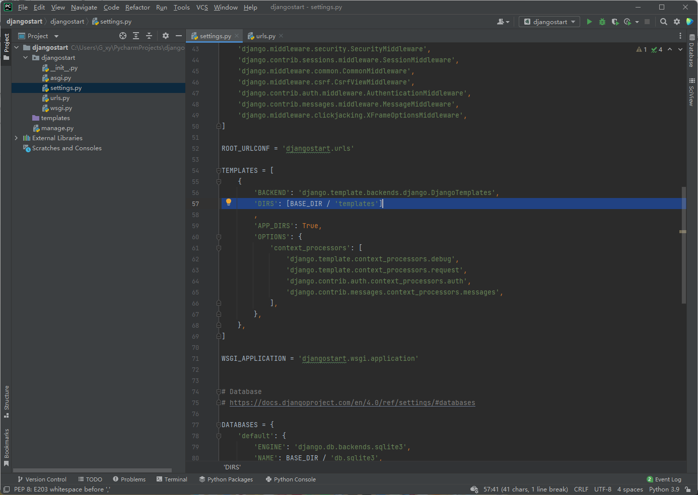
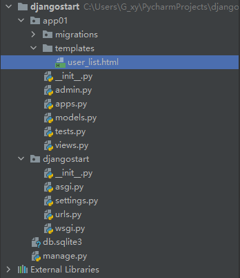

# 相关资源

- [视频](https://www.bilibili.com/video/BV1NL41157ph?p=2&spm_id_from=pageDriver)


# 安装Django

```sh
pip3.9 install django
```


```
c:\python39
	- python.exe
	- scripts
		- pip.exe
		- django-admin.exe	[用于创建Django项目的工具]
	- lib
		- 内置模块
		- 第三方模块
			- 如openpyxl
			- django		[框架的源码]
```


# 创建Django项目

使用Pycharm创建即可。

> 相比于命令行方式，pycharm多了：
>
> - templates目录
>
> - setting.py文件：DIRS不再为空[]
>
>     


# 项目结构

```
project
├─ manage.py
└─ project
	├─ __init__.py
	├─ asgi.py
	├─ settings.py
	├─ urls.py
	└─ wsgi.py
```


- manage.py：项目的管理、启动项目、创建app、数据管理
- asgi.py：用于接收网络请求（异步）
- wsgi.py：用于接收网络请求（同步）
- `urls.py`：url和python函数的对应关系
- `settings.py`：项目配置文件


# App的概念

```
- 项目
	--xxxapp:用户管理
	--xxxapp:订单管理
	...
```

每个app，都可以有独立的：

- 数据表结构
- 函数
- HTML模板
- CSS


创建App：

在项目路径下，执行：

```
python3.9 manage.py startapp appname
```

https://www.bilibili.com/video/BV1NL41157ph?p=7&spm_id_from=pageDriver


app的结构：

```
├─ app01
│	├─ __init__.py
│  	├─ admin.py	[无需更改]	[django默认提供了admin后台管理功能]
│  	├─ apps.py	[无需更改]	[app启动类]
│  	├─ migrations	[无需更改] [数据库迁移]
│  	│	└─ —__init__.py
│  	├─ models.py
│  	├─ tests.py	[单元测试]
│  	└─ views.py	
```

- `view.py`：编写对应于url的函数
- `models.py`：对数据库进行操作


# 入门Demo

## 启动运行Django

1. 在运行前，确保app已被注册：

    在settings.py文件中，修改`INSTALLED_APPS`数组

    ```py
    INSTALLED_APPS = [
        'app01.apps.App01Config'
    ]
    ```

2. 编写URL和视图函数的对应关系：

    - 在urls.py中：

        ```python
        from app01 import views
        
        urlpatterns = [
            
            # 当访问www.xxx.com/index/，就执行此函数views.index
            path('index/', views.index),
        ]
        ```

    - views.py中：

        ```py
        from django.shortcuts import render, HttpResponse
        
        
        def index(request):
            return HttpResponse("欢迎使用")
        ```

        > 函数必须有一个参数接收request

3. 启动Django项目

    - 命令行启动：

        ```
        python manage.py runserver
        ```

    - pychram启动


## 模板

urls.py：

```py
from app01 import views

urlpatterns = [
    path('user/list/', views.user_list),
]
```


views.py：

```py
def user_list(request):
    # 默认查找：按app配置的顺序，查找各app目录下的templates文件夹
    return render(request, "user_list.html",)
```



> 关于模板应放置的位置：
>
> 1. 优先查找根目录下的templates文件夹（若settings.py的DIR配置为[os.path.join(BASE_DIR,'templates')]，若配置为[]则无效）
> 2. 根据app的注册顺序，依次查找各app下的templates文件夹

 

## 静态文件

静态文件包含：

- img
- CSS
- js


文件放在名为static的目录下：


引入方式：

- 硬链接：

    ```html
    
    ```

- static标签：

    ```html
    
    
    <!DOCTYPE html>
    <html lang="en">
    <head>
        <meta charset="UTF-8">
        <title>用户列表</title>
        <link rel="stylesheet" href="">
    </head>
    ```

    

# Django模板语法

## 处理单个值

使用`{{ }}`，适合取出单个值：

- views.py：

    ```py
    def tpl(request):
        name = "xiaowang"
        roles = ["青年", "管理员"]
        return render(request, "tpl.html", {"n1": name, "n2": roles})
    ```

- tpl.html：

    ```html
    <!DOCTYPE html>
    <html lang="en">
    <head>
        <meta charset="UTF-8">
        <title>Title</title>
    </head>
    <body>
        <div>welcome,{{ n1 }}</div>
        <div>{{ n2.0 }}</div>
        <div>{{ n2.1 }}</div>
    </body>
    </html>
    ```

    

## 处理列表

使用``，遍历列表

- views.py：

    ```py
    def tpl(request):
        roles = ["青年", "管理员"]
        return render(request, "tpl.html", {"n2": roles})
    ```

- tpl.html：

    ```html
    <!DOCTYPE html>
    <html lang="en">
    <head>
        <meta charset="UTF-8">
        <title>Title</title>
    </head>
    <body>
        <div>
            
                <span>{{ item }}</span>
            
        </div>
    </body>
    </html>
    ```

    

## 处理字典

使用``，遍历列表

- views.py：

    ```py
    def tpl(request):
        user_info = {
            "name": "xiaohong",
            "salary": 100,
            "role": "CTO"
        }
    
        return render(request, "tpl.html", {"n3":user_info})
    ```

- tpl.html：

    ```html
    <!DOCTYPE html>
    <html lang="en">
    <head>
        <meta charset="UTF-8">
        <title>Title</title>
    </head>
    <body>
        {{ n3.name }}
        {{ n3.salary }}
        {{ n3.role }}
        
        <ul>
        
            <li>{{ item }}</li>
        
        </ul>
        
        <ul>
        
            <li>{{ item }}</li>
        
        </ul>
        
        <ul>
        
            <li>{{ key }},{{ value }}</li>
        
        </ul>
    
    </body>
    </html>
    ```

> 处理字典的方式有：
>
> - 直接用{{}}输出整个字典
> - 使用{{字典名.key}}输出单个value
> - 使用for循环语句，遍历keys或values或entrys


## if分支

```html




```


# 请求和响应

https://www.bilibili.com/video/BV1NL41157ph?p=11

```py
def test(request):
    print(request.method) #获取请求方式
    print(request.GET)  # 获取请求参数<QueryDict: {'name': ['121']}>
    print(request.POST) # 获取请求体<QueryDict: {}>

    return HttpResponse("ok")
```


特别的，form表单提交需要携带csrf验证``：

```html
<form action="/login">
    

    <input type="text" name="name" placeholder="用户名">
    <input type="password" name="pwd" placeholder="密码">

    <input type="submit" value="点击提交">
</form>
```


响应的方式有：

- HttpResponse：

    ```py
    from django.shortcuts import HttpResponse
    
    def test(request):
        return HttpResponse("ok")
    ```

- render：

    ```py
    from django.shortcuts import render
    
    def test(request):
        return render(request, "user_list.html", )
    ```

- redirect：

    ```py
    from django.shortcuts import redirect
    
    def test(request):
        return redirect("https://www.baidu.com")
    ```


- 


# ORM框架

https://www.bilibili.com/video/BV1NL41157ph?p=12


Django的ORM可以：

- 创建、修改、删除数据库的数据表
- 操作数据表中数据：insert,select,update,delete


## 安装第三方模块

安装mysqlclient：

```sh
pip install mysqlclient
```


## 创建Demo数据库

数据库库名为：day15


## 连接数据库

修改settings.py：

```py
DATABASES = {
    'default': {
        'ENGINE': 'django.db.backends.mysql',  # 默认
        'NAME': 'day15',  # 连接的数据库
        'HOST': '127.0.0.1',  # mysql的ip地址
        'PORT': 3306,  # mysql的端口
        'USER': 'root',  # mysql的用户名
        'PASSWORD': 'gg12138.'  # mysql的密码
    }
}
```


## 操作数据表


1. 定义类：

    > 在modles.py文件中

    ```py
    from django.db import models
    
    
    # 继承models.Model
    class UserInfo(models.Model):
        name = models.CharField(max_length=32)
        password = models.CharField(max_length=64)
        age = models.IntegerField()
    
    
    """
    表名：appname_类名
    create table app01_userInfo(
        id bigint auto_increment primary key,（自动生成）
        name varchar(32),
        password varchar(64),
        age int
    )
    """
    ```

2. 执行命令：

    ```sh
    python manage.py makemigrations
    python manage.py migrate
    ```

    > app需已经提前注册


## 增删改查

- 新增：

    ```py
    UserInfo.objects.create(name="xiaowang",password="123321",age=19)
    ```

-  删除：

    ```py
    UserInfo.objects.filter(id=3).delete()
    ```

- 查询：

    ```py
    data_list = UserInfo.objects.all()
    for obj in data_list:
        print(obj.id, obj.name, obj.password)
    ```

    QuerySet类型，即由各条记录封装的对象，组成的列表

    ```py
    data_list =UserInfo.objects.filter(id=1)
    print(data_list)
    ```

    仍为QuerySet类型

- 更新：

    ```py
    UserInfo.objects.filter(id=1).update(password="hello")
    ```

    


# 爬虫案例

https://www.bilibili.com/video/BV1NL41157ph?p=10 28min