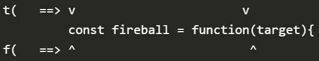

# 在VSCode中安装Vim拓展

# Vim的Mode

- Insert Mode：输入
- Normal Mode：编辑和导航
- Visual Mode：选择

# Surviving Skills

- **Move around** with the `hjkl` keys.
- **Go into Insert mode** with `i` where you can type stuff as usual.
- **Go back to Normal mode** with `<ESC>`, `<CTRL-C>` or `<CTRL-[>`.

# 移动光标

## 按Word移动

- `w`，移动到下一个word的开头

- `b`，与w命令相反，向前移动

  

- `e`，移动到词尾

- `ge`，向前移动到词尾

## 在行内移动到特定字符

- `f{character}`：向右找
- `F{character}`：向左找

- `t`命令类似于`f`，只不过会停留到目标字符之前

- `;`：重复上一动作
- `,`：反向重复上一动作

## 水平方向移动

- **`0`**: Moves to the **first character of a line**
- **`^`**: Moves to the **first non-blank character of a line**
- **`$`**: Moves to the **end of a line**
- **`g_`**: Moves to the **non-blank character at the end of a line**

## 垂直方向移动

- **`}`** jumps entire paragraphs **downwards**
- **`{`** similarly but **upwards**
- **`CTRL-D`** lets you **move down half a page** by scrolling the page
- **`CTRL-U`** lets you **move up half a page** also by scrolling

## 垂直方向上搜索移动

- Use **`/{pattern}`** to **search forward** inside a file
- Use **`?{pattern}`** to **search backwards**

-  use **`n`** to jump to the next match 
-  **`N`** for the previous one

## 重复指定次数的移动

`{count}{command}`

## 语义上的移动

- Use **`gd`** to jump to definition of whatever is under your cursor.
- Use **`gf`** to jump to a file in an import.

# 复制粘贴

>- CTRL + C：进入Nomal Mode
>- CTRL + V：进入Visual Mode

- `dd`，截切整行

- `yy`：复制整行

- `p`：粘贴到光标下一行处
- `P`：粘贴到光标上一行处

# 删除

- `x`，向后删除一个字符
- `X`，向前删除一个字符

# 查找

>- CTRL + F：PageDown.

- `/word`，向下搜索
- `?word`，向上搜索
- `n`，重复上一搜索动作。

# 撤回与重做

- `u`：撤回
- `r`：重做

