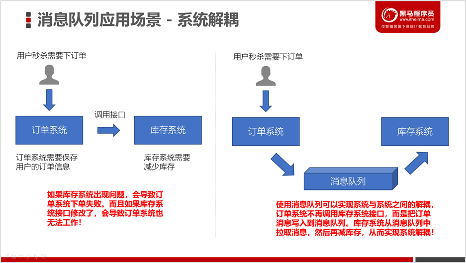
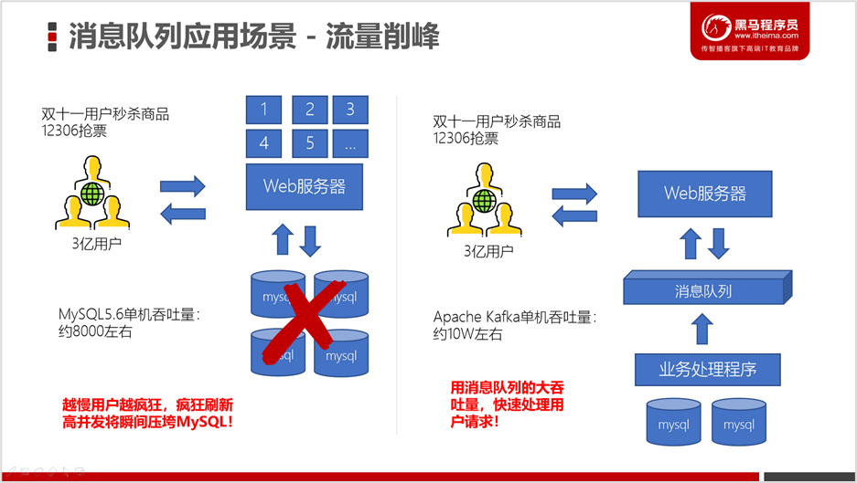
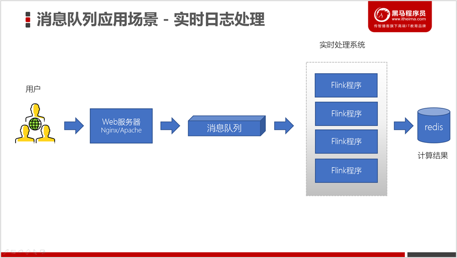
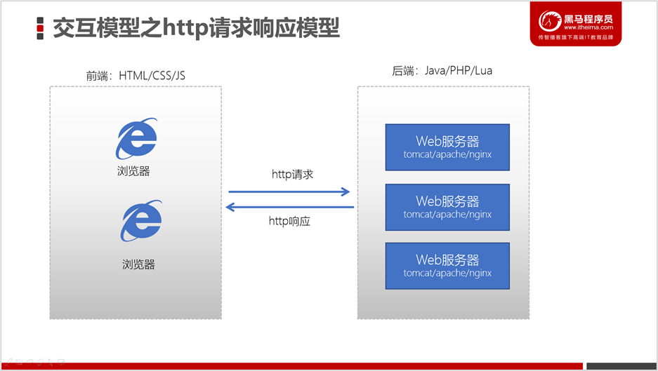
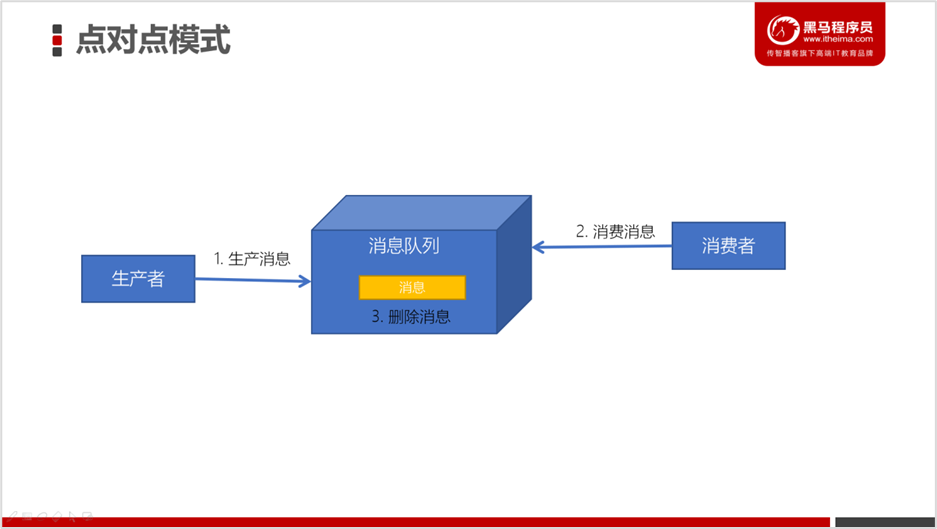
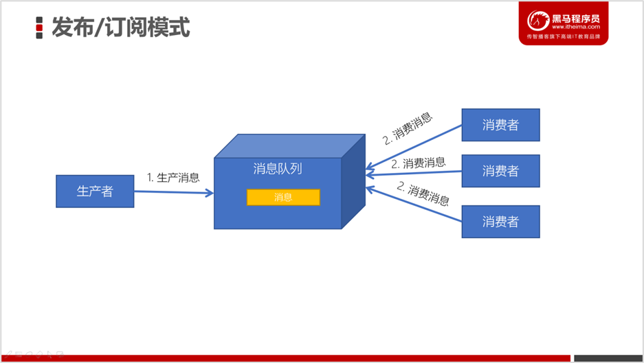
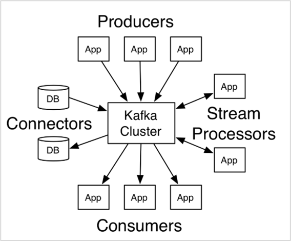

# 相关资料

- [视频教程](https://www.bilibili.com/video/BV19y4y1b7Uo?spm_id_from=333.999.0.0&vd_source=be746efb77e979ca275e4f65f2d8cda3)


# 简介

## 消息队列的应用场景

### 异步处理

电商网站中，新的用户注册时，需要将用户的信息保存到数据库中，同时还需要额外发送注册的邮件通知、以及短信注册码给用户。但因为发送邮件、发送注册短信需要连接外部的服务器，需要额外等待一段时间，此时，就可以使用消息队列来进行异步处理，从而实现快速响应。


### 系统解耦




### 流量削峰




### 日志处理（大数据领域常见）

大型电商网站（淘宝、京东、国美、苏宁...）、App（抖音、美团、滴滴等）等需要分析用户行为，要根据用户的访问行为来发现用户的喜好以及活跃情况，需要在页面上收集大量的用户访问信息。




## 生产者、消费者模型

- 我们之前学习过Java的服务器开发，Java服务器端开发的交互模型是这样的：

- 我们之前也学习过使用Java JDBC来访问操作MySQL数据库，它的交互模型是这样的：

  它也是一种请求响应模型，只不过它不再是基于http协议，而是基于MySQL数据库的通信协议。

  

  

  

而如果我们**基于消息队列来编程**，此时的**交互模式成为：生产者、消费者模型**。


### 点对点模式



1. 消息发送者生产消息发送到消息队列中，

2. 然后消息接收者从消息队列中取出并且消费消息。

   > 消息被消费以后，消息队列中不再有存储，所以消息接收者不可能消费到已经被消费的消息。


点对点模式特点：

- 每个消息只有一个接收者（Consumer）(即一旦被消费，消息就不再在消息队列中)
- 发送者和接收者间没有依赖性，发送者发送消息之后，不管有没有接收者在运行，都不会影响到发送者下次发送消息；
- **接收者**在成功接收消息之后**需向队列应答成功**，以便消息队列删除当前接收的消息；


### 发布订阅模式




发布/订阅模式特点：

- 每个消息可以有多个订阅者

- 发布者和订阅者之间**有时间上的依赖性**。

  针对某个主题（Topic）的订阅者，它必须创建一个订阅者之后，才能消费发布者的消息。

- 为了消费消息，订阅者需要**提前订阅该角色主题**，**并保持在线运行**；


## Kafka简介


Kafka是由Apache软件基金会开发的一个开源流平台，由Scala和Java编写。Kafka的Apache官网是这样介绍Kakfa的。

>  Apache Kafka是一个分布式流平台。一个分布式的流平台应该包含3点关键的能力：  
>
>  1. 发布和订阅流数据流，类似于消息队列或者是企业消息传递系统  
>  2. 以容错的持久化方式存储数据流 
>  3. 处理数据流


英文原版

>- **Publish and subscribe** to streams of records, similar to a message queue or enterprise messaging system.
>- **Store** streams of records in a fault-tolerant durable way.
>- **Process** streams of records as they occur.
>
>更多参考：http://kafka.apache.org/documentation/#introduction


我们重点关键三个部分的关键词：

- Publish and subscribe：发布与订阅
- Store：存储
- Process：处理


### Kafka的应用场景

我们通常将Apache Kafka用在两类程序：

1. 建立实时数据管道，以可靠地在系统或应用程序之间获取数据
2. 构建实时流应用程序，以转换或响应数据流



- Producers：可以有很多的应用程序，将消息数据放入到Kafka集群中。

- Consumers：可以有很多的应用程序，将消息数据从Kafka集群中拉取出来。

- Connectors：Kafka的连接器**可以将数据库中的数据导入到Kafka，也可以将Kafka的数据导出到**

  **数据库中**。

- Stream Processors：流处理器可以Kafka中拉取数据，也可以将数据写入到Kafka中。


### Kafka的优势

| 特性              | ActiveMQ     | RabbitMQ               | Kafka                | RocketMQ       |
| ----------------- | ------------ | ---------------------- | -------------------- | -------------- |
| 所属社区/公司     | Apache       | Mozilla Public License | Apache               | Apache/Ali     |
| 成熟度            | 成熟         | 成熟                   | 成熟                 | 比较成熟       |
| 生产者-消费者模式 | 支持         | 支持                   | 支持                 | 支持           |
| 发布-订阅         | 支持         | 支持                   | 支持                 | 支持           |
| REQUEST-REPLY     | 支持         | 支持                   | -                    | 支持           |
| API完备性         | 高           | 高                     | 高                   | 低（静态配置） |
| 多语言支持        | 支持JAVA优先 | 语言无关               | 支持，JAVA优先       | 支持           |
| 单机呑吐量        | 万级（最差） | 万级                   | **十万级**           | 十万级（最高） |
| 消息延迟          | -            | 微秒级                 | **毫秒级**           | -              |
| 可用性            | 高（主从）   | 高（主从）             | **非常高（分布式）** | 高             |
| 消息丢失          | -            | 低                     | **理论上不会丢失**   | -              |
| 消息重复          | -            | 可控制                 | 理论上会有重复       | -              |
| 事务              | 支持         | 不支持                 | 支持                 | 支持           |
| 文档的完备性      | 高           | 高                     | 高                   | 中             |
| 提供快速入门      | 有           | 有                     | 有                   | 无             |
| 首次部署难度      | -            | 低                     | 中                   | 高             |


# 环境搭建

## Kafka版本

本次课程使用的Kafka版本为2.4.1，是2020年3月12日发布的版本。

可以注意到Kafka的版本号为：kafka_2.12-2.4.1，因为kafka主要是使用scala语言开发的，2.12为scala的版本号。http://kafka.apache.org/downloads可以查看到每个版本的发布时间。


## 搭建Kafka集群

https://www.bilibili.com/video/BV19y4y1b7Uo?p=4&t=556.4


> 安装在：/usr/local/server下


1. 将Kafka的安装包上传到虚拟机，并解压

   ```sh
   cd /export/software/
   tar -xvzf kafka_2.12-2.4.1.tgz -C ../server/
   cd /export/server/kafka_2.12-2.4.1/
   ```

2. 修改 server.properties

   ```sh
   cd /export/server/kafka_2.12-2.4.1/config
   vim server.properties
   # 指定broker的id
   broker.id=0
   # 指定Kafka数据的位置
   log.dirs=/export/server/kafka_2.12-2.4.1/data
   # 配置zk的三个节点
   zookeeper.connect=node1.itcast.cn:2181,node2.itcast.cn:2181,node3.itcast.cn:2181
   ```

3. 将安装好的kafka复制到另外两台服务器

   ```sh
   cd /export/server
   scp -r kafka_2.12-2.4.1/ node2.itcast.cn:$PWD
   scp -r kafka_2.12-2.4.1/ node3.itcast.cn:$PWD
   
   修改另外两个节点的broker.id分别为1和2
   ---------node2.itcast.cn--------------
   cd /export/server/kafka_2.12-2.4.1/config
   vim erver.properties
   broker.id=1
   
   --------node3.itcast.cn--------------
   cd /export/server/kafka_2.12-2.4.1/config
   vim server.properties
   broker.id=2
   ```

4. 配置KAFKA_HOME环境变量/usr/local/server/kafka_2.12-2.4.1/

   ```sh
   vim /etc/profile
   export KAFKA_HOME=/export/server/kafka_2.12-2.4.1
   export PATH=:$PATH:${KAFKA_HOME}
   
   分发到各个节点
   scp /etc/profile node2.itcast.cn:$PWD
   scp /etc/profile node3.itcast.cn:$PWD
   每个节点加载环境变量
   source /etc/profile
   ```

5. 启动服务器

   ```sh
   # 启动ZooKeeper
   nohup bin/zookeeper-server-start.sh config/zookeeper.properties &
   # 启动Kafka
   cd /export/server/kafka_2.12-2.4.1
   nohup bin/kafka-server-start.sh config/server.properties &
   # 测试Kafka集群是否启动成功
   bin/kafka-topics.sh --bootstrap-server node1.itcast.cn:9092 --list
   ```

   

## 目录结构分析

| 目录名称  | 说明                                                         |
| --------- | ------------------------------------------------------------ |
| bin       | Kafka的所有执行脚本都在这里。例如：启动Kafka服务器、创建Topic、生产者、消费者程序等等 |
| config    | Kafka的所有配置文件                                          |
| libs      | 运行Kafka所需要的所有JAR包                                   |
| logs      | Kafka的所有日志文件，如果Kafka出现一些问题，需要到该目录中去查看异常信息 |
| site-docs | Kafka的网站帮助文件                                          |


## Kafka一键启动/关闭脚本

为了方便将来进行一键启动、关闭Kafka，我们可以编写一个shell脚本来操作。将来只要执行一次该脚本就可以快速启动/关闭Kafka。


1. 在节点1中创建 /export/onekey 目录

   ```sh
   cd /export/onekey
   ```

2. 准备slave配置文件，用于保存要启动哪几个节点上的kafka

   ```sh
   node1.itcast.cn
   node2.itcast.cn
   node3.itcast.cn
   ```

3. 编写start-kafka.sh脚本
   ```sh
   vim start-kafka.sh
   cat /export/onekey/slave | while read line
   do
   {
       echo $line
       ssh $line "source /etc/profile;export JMX_PORT=9988;nohup ${KAFKA_HOME}/bin/kafka-server-start.sh ${KAFKA_HOME}/config/server.properties >/dev/nul* 2>&1 & "
   }&
   wait
   done
   ```
   
4. 编写start-kafka.sh脚本
   ```sh
   vim stop-kafka.sh
   cat /export/onekey/slave | while read line
   do
   {
       echo $line
       ssh $line "source /etc/profile;jps |grep Kafka |cut -d' ' -f1 |xargs kill -s 9"
   }&
   wait
   done
   ```
   
5. 给start-kafka.sh、stop-kafka.sh配置执行权限
   ```sh
   chmod u+x start-kafka.sh
   chmod u+x stop-kafka.sh
   ```
6. 执行一键启动、一键关闭
   ```sh
   ./start-kafka.sh
   ./stop-kafka.sh
   ```