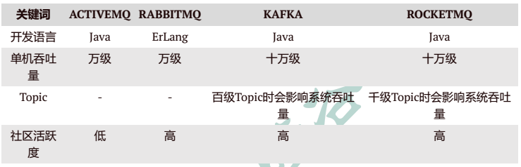
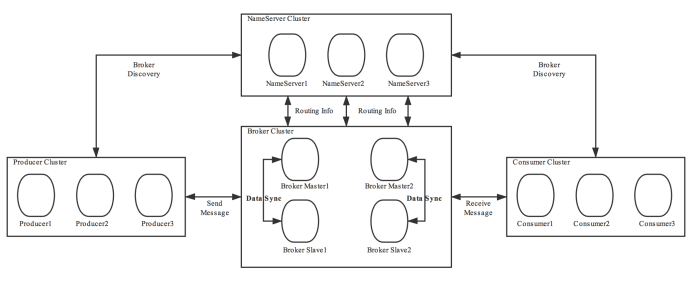
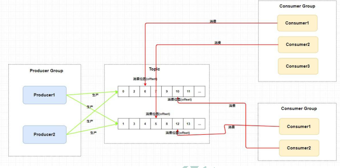
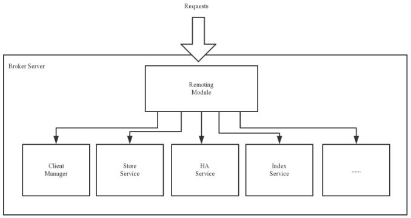
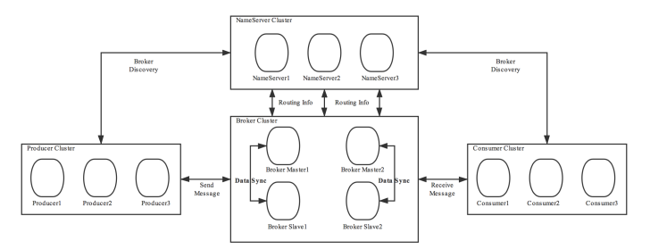

# 相关资料

- [视频教程](https://www.bilibili.com/video/BV1cf4y157sz?spm_id_from=333.337.search-card.all.click&vd_source=be746efb77e979ca275e4f65f2d8cda3)
- [RocketMQ官网](http://rocketmq.apache.org)

# RabbitMQ概述

## MQ的常见用途

- 限流消峰
- 异步解耦
- 数据收集

## 常见MQ产品

- ActiveMQ：

  基于Java开发，但目前社区活跃度较低。

- RabbitMQ：

  基于ErLang开发，吞吐量低于Kafka和RockerMQ

- Kafka：

  基于Scala/Java开发。高吞吐率。自研协议。

- RocketMQ

  基于Java开发，自研协议。

>- Spring Cloud：支持RabbitMQ 和 Kafka
>- Spring Cloud Alibaba：支持RocketMQ 和 Kafka

## MQ常见协议

- JMS：

  JMS，Java Messaging Service（Java消息服务）。是Java平台上有关MOM（Message Oriented Middleware，面向消息的中间件 PO/OO/AO）的技术规范，它便于消息系统中的Java应用程序进行消息交换，并且通过提供标准的产生、发送、接收消息的接口，简化企业应用的开发。ActiveMQ是该协议的典型实现。  

- STOMP：

  STOMP，Streaming Text Orientated Message Protocol（面向流文本的消息协议），是一种MOM设计的简单文本协议。STOMP提供一个可互操作的连接格式，允许客户端与任意STOMP消息代理（Broker）进行交互。ActiveMQ是该协议的典型实现，RabbitMQ通过插件可以支持该协议。  

- AMQP：

  AMQP，Advanced Message Queuing Protocol（高级消息队列协议），一个提供统一消息服务的应用层标准，是应用层协议的一个开放标准，是一种MOM设计。基于此协议的客户端与消息中间件可传递消息，并不受客户端/中间件不同产品，不同开发语言等条件的限制。 RabbitMQ是该协议的典型实现。  

- MQTT：

  MQTT，Message Queuing Telemetry Transport（消息队列遥测传输），是IBM开发的一个即时通讯协议，是一种二进制协议，主要用于服务器和低功耗IoT（物联网）设备间的通信。该协议支持所有平台，几乎可以把所有联网物品和外部连接起来，被用来当做传感器和致动器的通信协议。 RabbitMQ通过插件可以支持该协议。  

# 基础概念

## 消息（Message）

消息是指：

- 消息系统所传输信息的物理载体
- 生产和消费数据的最小单位
- 每条消息必须属于一个主题

## 主题（Topic）

- Topic表示一类消息的集合
- **每个主题包含若干条消息，每条消息只能属于一个主题**
- 是RocketMQ进行消息订阅的基本单位

> 即一个Topic，对应多个Message；一个Message，只能隶属于一个Topic

- 一个生产者可以同时发送多种Topic的消息；
- 而**一个消费者只可以订阅和消费一种Topic的消息**。  

> 即一个生产者，对应多个Topic；一个Topic，只能隶属于一个消费者

## 标签（Tag）

- 为消息设置的标签，用于同一主题下区分不同类型的消息。
- 来自同一业务单元的消息，可以根据不同业务目的在同一主题下设置不同标签。  
- 标签能够有效地保持代码的清晰度和连贯性，并优化RocketMQ提供的查询系统。
- 消费者可以根据Tag实现对不同子主题的不同消费逻辑，实现更好的扩展性。 

>Topic是消息的一级分类，Tag是消息的二级分类。

 

## 队列（Queue）

- 队列是存储消息的物理实体。
- 一个Topic中可以包含多个Queue，每个Queue中存放的就是该Topic的消息。
- 一个Topic的Queue也被称为一个Topic中消息的分区（Partition）  

- 一个Topic的Queue中的消息只能被一个消费者组中的一个消费者消费。
- **一个Queue中的消息不允许同一个消费者组中的多个消费者同时消费**

关于读/写队列：

- 在物理上，是读/写队列是同一个队列

- 但在逻辑上，进行了区分

  - 一般情况下，读写队列数量相同

  - 但如果不同，例如：

    - 写设置8个队列，写设置4个队列：

      将创建 max(8,4)=8个物理队列，则消息会被写到8个队列，但只会对前4个队列进行读取

    - 写设置4个队列，读设置8个队列：

      将创建 max(8,4)=8个物理队列，则消息会被写到4个队列，

      前8个队列将被读取（显然后4个读队列拿不到消息）

  > 这样设计的目的，是为了便于Queue的缩容：
  >
  > > 注意：配置是可以动态修改的。
  >
  > 1. 原先，Queue的读和写数量一样
  > 2. 先减少写队列的数量；读队列数量不变
  > 3. 待写队列中的剩余消息被消费完，再减少读队列数量

## 分片（Sharding）

> 分片是非官方的概念。

- 在RocketMQ中，分片指的是存放相应Topic的Broker。
- 每个分片中会创建出相应数量的分区，即Queue，每个Queue的大小都是相同的  

## 消息标识（MessageID/Key）

- RocketMQ中每个消息拥有唯一的MessageId，且可以携带具有业务标识的Key，以方便对消息的查询。

- 需要注意的是，MessageId有两个：

  - 在生产者send()消息时会自动生成一个MessageId（msgId)：
  - 当消息到达Broker后，Broker也会自动生成一个MessageId（offsetMsgId）。

  >- msgId：由producer端生成，其生成规则为：
  >
  >  producerIp + 进程pid + MessageClientIDSetter类的ClassLoader的hashCode +
  >  当前时间 + AutomicInteger自增计数器
  >
  >- offsetMsgId：由broker端生成，其生成规则为：
  >
  >  brokerIp + 物理分区的offset（Queue中的偏移量）

- msgId、offsetMsgId与key都称为消息标识。

# 系统架构

## 生产者（Producer）

- 消息生产者，负责生产消息。
- Producer通过MQ的负载均衡模块选择相应的Broker集群队列进行消息投递，投递的过程支持快速失败并且低延迟。  

- RocketMQ中的消息生产者都是以生产者组（Producer Group）的形式出现的。
- 生产者组是同一类生产者的集合，这类Producer发送相同Topic类型的消息。一个生产者组可以同时发送多个主题的消息。  

## 消费者（Consumer）

- 消息消费者，负责消费消息。
- 一个消息消费者会从Broker服务器中获取到消息，并对消息进行相关业务处理。  

- RocketMQ中的消息消费者都是以消费者组（Consumer Group）的形式出现的。
- 消费者组是同一类消费者的集合，这类Consumer消费的是同一个Topic类型的消息。
- 消费者组使得在消息消费方面，实现了：
  - 对Queue分配的负载均衡（将一个Topic中的不同的Queue平均分配给同一个Consumer Group中不同的Consumer，注意，并不是将消息负载均衡）
  - 容错（一个Consmer挂了，该Consumer Group中的其它Consumer可以接着消费原Consumer消费的Queue）  

## 命名服务器（Name Server）

### 功能介绍

- NameServer是一个Broker与Topic路由的注册中心，支持Broker的动态注册与发现。

- 主要包含两个功能：

  - Broker管理：接受Broker集群的注册信息并且保存下来作为路由信息的基本数据；提供心跳检测机制，检查Broker是否还存活。 

  - 路由信息管理：每个NameServer中都保存着Broker集群的整个路由信息和用于客户端查询的队列信息。

    Producer和Conumser通过NameServer可以获取整个Broker集群的路由信息，从而进行消息的投递和消费。

  

### 路由注册

- NameServer通常也是以集群的方式部署，不过，NameServer是无状态的，即NameServer集群中的各个节点间是无差异的，各节点间相互不进行信息通讯

- 那各节点中的数据是如何进行数据同步的呢？

  在Broker节点启动时，轮询NameServer列表，与每个NameServer节点建立长连接，发起注册请求。在NameServer内部维护着⼀个Broker列表，用来动态存储Broker的信息。  

  >这是与其它像zk、Eureka、Nacos等注册中心不同的地方。  
  >
  >- 优点：NameServer集群搭建简单，扩容简单。  
  >
  >- 缺点：
  >
  >  对于Broker，必须明确指出所有NameServer地址。否则未指出的将不会去注册。也正因为如此，NameServer并不能随便扩容。因为，若Broker不重新配置，新增的NameServer对于Broker来说是不可见的，其不会向这个NameServer进行注册。  

- Broker节点为了证明自己是活着的，为了维护与NameServer间的长连接，会将最新的信息以心跳包的方式上报给NameServer，每30秒发送一次心跳。

  心跳包中包含 BrokerId、Broker地址(IP+Port)、Broker名称、Broker所属集群名称等等。NameServer在接收到心跳包后，会更新心跳时间戳，记录这
  个Broker的最新存活时间。  

### 路由剔除

- 由于Broker关机、宕机或网络抖动等原因，NameServer没有收到Broker的心跳，NameServer可能会将其从Broker列表中剔除。  
- NameServer中有⼀个定时任务，每隔10秒就会扫描⼀次Broker表，查看每一个Broker的最新心跳时间戳距离当前时间是否超过120秒，如果超过，则会判定Broker失效，然后将其从Broker列表中剔除。  

>对于RocketMQ日常运维工作，例如Broker升级，需要停掉Broker的工作。OP（运维工程师  ）需要怎么做？  
>
>1. OP需要将Broker的读写权限禁掉。一旦client(Consumer或Producer)向broker发送请求，都会收到broker的NO_PERMISSION响应，然后client会进行对其它Broker的重试。  
>2. 当OP观察到这个Broker没有流量后，再关闭它，实现Broker从NameServer的移除。

### 路由发现

> 指的是，消费端和生产端，如何发现Broker

- RocketMQ的路由发现采用的是Pull模型。
- 当Topic路由信息出现变化时，NameServer不会主动推送给客户端，而是客户端定时拉取主题最新的路由。默认客户端每30秒会拉取一次最新的路由  

### 客户端选择NameServer的策略

> 客户端：即消费端和生产端

客户端在配置时必须要写上NameServer集群的地址，那么客户端到底连接的是哪个NameServer节点呢？

1. 客户端首先会生产一个随机数，然后再与NameServer节点数量取模，此时得到的就是所要连接的节点索引，然后就会进行连接。
2. 如果连接失败，则会采用round-robin策略，逐个尝试着去连接其它节点。  

## 主机（Broker）

### 功能介绍

- Broker充当着消息中转角色，负责存储消息、转发消息。
- Broker在RocketMQ系统中负责接收并存储从生产者发送来的消息，同时为消费者的拉取请求作准备。
- Broker同时也存储着消息相关的元数据，包括消费者组消费进度偏移offset、主题、队列等。  

### 模块构成

下图为Broker Server的功能模块示意图：

- Remoting Module：整个Broker的实体，负责处理来自clients端的请求。而这个Broker实体则由以下模块构成：

  - Client Manager：客户端管理器。负责接收、解析客户端(Producer/Consumer)请求，管理客户端。

    例如，维护Consumer的Topic订阅信息  

  - Store Service：存储服务。提供方便简单的API接口，处理消息存储到物理硬盘和消息查询功能。
  - HA Service：高可用服务，提供Master Broker 和 Slave Broker之间的数据同步功能。
  - Index Service：索引服务。根据特定的Message key，对投递到Broker的消息进行索引服务，同时也提供根据Message Key对消息进行快速查询的功能。  

### 集群部署

为了增强Broker性能与吞吐量，Broker一般都是以集群形式出现的。各集群节点中可能存放着相同Topic的不同Queue。不过，这里有个问题，如果某Broker节点宕机，如何保证数据不丢失呢？其解决方案是，将每个Broker集群节点进行横向扩展，即将Broker节点再建为一个HA集群，解决单点问题  

Broker节点集群是一个主从集群，即集群中具有Master与Slave两种角色。Master负责处理读写操作请求，Slave负责对Master中的数据进行备份。当Master挂掉了，Slave则会自动切换为Master去工作。所以这个Broker集群是主备集群。一个Master可以包含多个Slave，但一个Slave只能隶属于一个Master。Master与Slave 的对应关系是通过指定相同的BrokerName、不同的BrokerId 来确定的。BrokerId为0表示Master，非0表示Slave。每个Broker与NameServer集群中的所有节点建立长连接，定时注册Topic信息到所有NameServer。  

## 工作流程

1. 启动NameServer，NameServer启动后开始监听端口，等待Broker、Producer、Consumer连接。  

2. 启动Broker时，Broker会与所有的NameServer建立并保持长连接，然后每30秒向NameServer定时发送心跳包

3. 发送消息前，可以先创建Topic，创建Topic时需要指定该Topic要存储在哪些Broker上，当然，在创建Topic时也会将Topic与Broker的关系写入到NameServer中。不过，这步是可选的，也可以在发送消息时自动创建Topic。  

   >Topic创建分两种情况：
   >
   >- 在集群模式下：
   >
   >  每个Broker中的Queue配置相同
   >
   >- 在Broker模式下：
   >
   >  每个Broker中的Queue配置可以不同

4. Producer发送消息，启动时先跟NameServer集群中的其中一台建立长连接，并从NameServer中获取路由信息，即当前发送的Topic消息的选择的Queue（IP+Port）的映射关系。然后根据算法策略从队选择一个Queue，与队列所在的Broker建立长连接从而向Broker发消息。当然，在获取到路由信息后，Producer会首先将路由信息缓存到本地，再每30秒从NameServer更新一次路由信息。  

   > 自动创建Topic时：
   >
   > 根据配置文件，默认为每个Broker创建4个Queue

5. Consumer跟Producer类似，跟其中一台NameServer建立长连接，获取其所订阅Topic的路由信息，然后根据算法策略从路由信息中获取到其所要消费的Queue，然后直接跟Broker建立长连接，开始消费其中的消息。Consumer在获取到路由信息后，同样也会每30秒从NameServer更新一次路由信息。不过不同于Producer的是，Consumer还会向Broker发送心跳，以确保Broker的存活状态。  

 