# 技巧

## 单行文字的垂直居中

- 解决方案：

  **让文字的行高，等于盒子的高度**。

  > - 如果 行高 > 盒子高度：文字偏下
  >
  > - 如果 行高 < 盒子高度：文字偏下


# CSS语法规范

CSS规则由两个主要的组成部分：

- 选择器

- 一条或多条声明

  ```css
  h1{
      color:red;
      font-size:25px;
  }
  ```

  

- 属性与属性值以“键值对”的形式出现，多个键值对之间用分号。

  如`属性名:值;`


编码风格：

- 将{}中的内容以多行展示
- 选择器、属性名、属性值，全部使用小写字母
- 空格：
  - 选择器 和 { 间有空格
  - : 和 属性值间有空格 


# 选择器

- 文档：[CSS 选择器参考手册 (w3school.com.cn)](https://www.w3school.com.cn/cssref/css_selectors.asp)
- 选择器可分为：
  - 基础选择器：仅由单个选择器组成
    - 标签选择器
    - 类选择器
    - id选择器
    - 通配符选择器
  - 复合选择器：由基础选择器组合而成：
    - 后代选择器
    - 子选择器
    - 并集选择器
    - 伪类选择器


## 基础选择器

### 标签选择器

- 作用：将某一类标签，**全部**选择出来。

如：

```css
p {
    color:red;
}
```


### 类选择器

- 作用：用于差异化的选择标签

- 语法：

  ```css
  .类名 {
      ...
  }
  ```

- 例如：

  ```html
  <style>
      .red{
  		color: red;
      }
  </style> 
  
  <div class="red">
      这是红色的字
  </div>
  
  ```

- 关于命名：

  - 多个单词，用 `-` 分 割
  - 命名的规则见附件：Web前端开发规范.doc


- 若应用了多个类：

  - 不重复的属性，将共同生效。

  - 重复的属性，**后面的会覆盖前面的**。

    ```html
    <style>
        .red {
            color: red;
        }
    
        .green{
            color: green;
        }
    </style>
    
    <div class="red green">最终会是绿色</div>
    ```


### id选择器

例如：

```html
<style>
    #pink {
        color:pink;
    }
</style>

<div id="pink">
	粉红色的字
</div>
```


### 通配符选择器

会**选择页面中的所有标签**。

```html
<style>
    * {
        ...
    }
</style>
```


## 复合选择器

### 后代选择器

 用于选择父元素里的子元素：

```html
<style>
    ol li {
        color: pink;
    }
</style>

<div>
    <ol>
        <li>子</li>
        <li>子</li>
        <li>子</li>
        <span><li>孙</li></span> <!-- 会被选中 -->
    </ol>
</div>
```

如上例中的`ol li{}`，表示选择ol中的所有li元素（**包括子类和后代**）。

> 后代选择器，可以是任意基础选择器的组合，如`.nav li span`


### 子选择器

子元素选择器，仅会选择某元素的**最近一级子元素**。

```html
<style>
    ol>li {
        color: pink;
    }
</style>

<div>
    <ol>
        <li>子</li>
        <li>子</li>
        <li>子</li>
        <span><li>孙</li></span> <!-- 不会被选中 -->
    </ol>
</div>
```


### 并集选择器

```html
<style>
    div, p {
        color: pink;
    }
</style>
```


### 伪类选择器

伪类选择器的特点是以`:`开头，如`:hover`，`:first-child`。


#### 链接伪类

```css
a:link		/* 选择所有未被访问的链接 */
a:vistited  /* 选择所有已被访问的链接 */
a:hover		/* 选择指针悬停的链接 */
a:active	/* 选择活动链接（鼠标按下未弹起） */
```


注意事项：

- 为了确保生效，**按照LVHA的顺序声明**：link - visited - hover - active


#### 结构伪类


#### 表单伪类

`:focus`伪类选择器，用于选择获取了焦点的元素。（一般情况下，仅有\<input>类表单元素可以获取焦点）

```css
input:focus 
```


# 字体属性

用于定义：

- 字体系列
- 大小
- 粗细
- 文字样式（如斜体）


## 字体系列

```css
p {
    font-family: "微软雅黑";
}

div {
    font-family: Arial,"Microsoft Yahei","微软雅黑";
}
```

当值存在多个时，将依次查找，直到用户电脑上有该字体。若所有的都没有，将使用默认字体。


## 字体大小

```css
p {
    font-size: 20px;
}
```

关于单位：

- px：像素。（chrome默认为16px）


## 字体粗细

语法：

**font-weight**：normal | bold | bolder | lighter | 数字

取值：

- normal：正常的字体。相当于数字值400

- bold：粗体。相当于数字值700。

- bolder：定义比继承值更重的值

- lighter：定义比继承值更轻的值

- 用数字表示文本字体粗细。取值范围：100 | 200 | 300 | 400 | 500 | 600 | 700 | 800 | 900


```css
p {
    font-weight: 500;
}
```


## 文字样式

`font-style`属性，其有两个常见的取值：

- normal：默认值
- italic：斜体


## 复合属性（简记）

字体属性可以综合起来写，格式为：

`font: font-style font-weight font-size/line-height font-family;`

> 不需要设置的属性可以忽略不写，但size和family属性必须有。


例如：

```css
div {
    font-style: italic;
    font-weight: 700;
    font-size: 16px;
    font-family: 'Microsoft yahei';
}
```

等价于：

```css
div {
    font: italic 700 16px 'Microsoft yahei';
}
```


# 文本属性

用于定义文本的外观，如：

- 文本的颜色
- 对齐文本
- 装饰文本
- 文本缩进
- 行间距等


## 文本颜色

```css
div {
    color: red;
}
```

取值的方式：

- 预定义的颜色值，如red, green等
- 十六进制，如#FF0000
- RGB代码，如 rgb(255,0,0) 或 rgb(100%,0%,0%)


## 对齐文本

`text-align`属性，用于设置文本内容的**水平对齐**方式，取值：

- left：左对齐（默认）
- center：居中对齐
- right：右对齐


> 盒子的位置不变，改变的是盒子内元素的位置。


## 装饰文本

`text-decoration`属性用于为文本添加属性。取值如下：

- none：没有装饰线（默认）
- underline：下划线（a标签自带下划线）
- overline：上划线
- line-through：删除线


## 文本缩进

`text-indent`属性，用于指定文本的第一行的缩进。

```css
p {
    text-indent: 2em;
}
```

> em是一个相对单位，为当前元素的font-size的1个文字的大小。


## 行间距

`line-height`属性，用于控制行间的距离。


```css
p {
    line-height: 26px;
}
```


# CSS的引入方式

- 内部样式表（嵌入式）：放在html页面的style标签内

- 行内样式表（行内式）：

  ```css
  <p style="color: red; font-size: 12px;">段落内容</p>
  ```

- 外部样式表（链接式）：

  ```html
  <link rel="stylesheet" href="css文件路径">
  ```

  

  

# Emmet语法

快速生成HTML结构：

- 生成标签：键入div，然后按tab

- 生成多个相同标签：键入div*3，然后按tab

- 生成父子级别标签：键入 ul>li，然后按tab

- 生成兄弟级别标签：键入div+p，然后按tab

- 生成带类名或id的标签：键入div.demo#two，然后按tab

- 自增符号`$`：键入div.demo$*5，然后按tab

  ```html
  <div class="demo1"></div>
  <div class="demo2"></div>
  <div class="demo3"></div>
  <div class="demo4"></div>
  <div class="demo5"></div>
  ```

- 如果想要在标签内部写内容：键入div{内容}，然后按tab

  ```html
  <div>内容</div>
  ```

  

快速生成CSS样式：

- 采取简写方式，如：

  ```css
  .demo{
      /* h32 */
      height: 32px;   
      /* ti2 */
      text-indent: 2em; 
  }
  ```


# CSS的元素显示模式

## 元素显示模式的分类

- 块元素：

  - \<h1> ~ \<h6>
  - \<p>
  - **\<div>**
  - \<ul>
  - \<ol>
  - \<li>等

  > ###### 💡 块元素的特点
  >
  > - 自己独占一行
  >
  > - 高度、宽度、外边距、内边距 都可以控制
  >
  > - 宽度默认是容器（父级宽度）的100%
  >
  > - 是一个容器及盒子，内部可以放 块元素 或 行内元素。
  >
  >   > 特别的，p和标题标签，都不能放其他块元素

- 行内元素（或内联元素）：

  - \<a>
  - \<strong>,\<b>,\<em>,\<i>,\<del>,\<ins>,\<u>
  - \<span>

  > ###### 💡 行内元素的特点
  >
  > - 相邻的多个行内元素，可以显示在一行上
  >
  > - **高、宽的直接设置是无效的**。
  >
  > - **默认宽度是其内容的宽度**。
  >
  > - 行内元素，仅可容纳文本或行内元素。
  >
  >   > 特别的，a标签可以容纳块级元素（但最好先将a标签转换为块元素）。

- 行内块元素：

  - \
  - \<input>
  - \<td>

  > 它们同时具有块元素和行内元素的特点。有些资料将它们称为行内块元素。
  >
  > - 多个行内块元素可以显示在一行，但有空白间隙。（行内元素特点）
  > - 默认宽度为内容的宽度。（行内元素的特点）
  > - 高、宽、内边距、外边距可以控制。（块元素特点）


## 元素显示模式的切换

- 转换为块元素：`display:block;` 
- 转换为行内元素：`display:inline;`
- 转换为行内块元素：`display:inline-block;`


# 背景属性

可以设置：

- 背景颜色
- 背景图片
- 背景平铺
- 背景图片位置
- 背景图像固定等


## 背景颜色

`background-color`，取值：

- transparent：透明

- *color*：具体的颜色

  > CSS3提供了背景颜色半透明的效果，如：
  >
  > `background-color: rgba(0,0,0,0.3)`


## 背景图片

`background-image`，取值：

- none
- *url*


```css
div {
	width: 300px;
    height: 300px;
    background-image: url("./logo.png");
}
```

> 页面元素，既可以添加背景图片，也可以添加背景颜色。
>
> 背景颜色会在图片底下。


### 背景平铺

如果需要在HTML页面上，对背景图片进行平铺，可以设置`background-repeat`属性。取值：

- no-repeat
- repeat（默认）
- repeat-x
- repeat-y


### 背景图片位置

利用`background-position`属性，可以改变图片在背景中的位置。

```css
background-position: x y;
```

参数x和y，可以使用 **方位名词** 或 **精确单位**。

取值：

- position：top | center | bottom | left | center | right

  ```css
  div {
      background-image: url(...);
      background-repeat: no-repeat;
      background-position: center top; <!--或 top center-->
  }
  ```

  > 如果只指定了一个方位名词，则默认第二个方位名词为居中

- length：百分数 | 由浮点数和单位标识符组成的长度值

  ```css
  div {
      background-image: url(...);
      background-repeat: no-repeat;
      background-position: 20px 50px; <!--或 top center-->
  }
  ```

  > 如果只指定了一个数值，则该数组为x坐标。y坐标垂直居中。

> 也可以混合使用方位名词和精确单位，但第一个必是x坐标，第二个必为y坐标。


### 背景附着

`background-attachment`属性，用于设置背景图像是否固定 或 随着页面的其余部分滚动。取值：

- scroll
- fixed


## 背景属性的复合写法

```css
background:背景颜色 背景图片地址 背景平铺 背景图像滚动 背景图片位置
```

> 背景属性的次序，没有规定。但一般按如上的默认约定。


# CSS的三大特性

## 层叠性

相同的选择器，设置了同一属性的不同值，此时一个样式会覆盖（层叠）另一个样式。

层叠规则为：

- 同一属性的不同值：选择离HTML元素“**最近**”的样式。

  - 案例1：

    ```html
    <style>
        .red {
            color:red;
        }
        
        .pink {
            color:pink;
        }
    </style>
    
    <div class="red pink">
        最终会是粉色
    </div>
    ```

  - 案例2：

    ```html
    <style>
        .red {
            color:red;
        }
    </style>
    
    <div class="red" style="color:pink;">
        最终会是粉色
    </div>
    ```

- 不同属性：共同起作用。


## 继承性

子标签，会继承父标签的某些样式，如文本颜色和字号。

> 继承的样式：
>
> 如`text-`，`font-`，`line-`，`color`属性


特别的，行高的特别写法：

```css
body{
    /* font:12px/18px; 直接指定行高为18px */
    /* 也可将其指定为字号的1.5倍 */
    font: 12px/1.5;
}

p{
    font-size:16px;
    /* 此时p标签继承body，其行高为字号的1.5倍。但此时字号为16px */
}
```


## 优先级

当同一个元素，被多个选择器选中，则存在优先级：

1. 选择器类型相同，则执行层叠性。

2. 选择器类型不同，则根据 **选择器权重** 执行。

   | 选择器               | 选择器权重 |
   | -------------------- | ---------- |
   | **继承** 或 *        | 0,0,0,0    |
   | 元素选择器           | 0,0,0,1    |
   | 类选择器，伪类选择器 | 0,0,1,0    |
   | ID选择器             | 0,1,0,0    |
   | 行内样式 style=""    | 1,0,0,0    |
   | !important           | ∞          |

   > 复合选择器的权重，需要叠加计算：
   >
   > ```css
   > /* 权重为0,0,0,2 */
   > ul li {
   >  color: green; 
   > }
   > 
   > /* 权重为0,0,0,1 */
   > li{
   >  color: red;
   > }
   > ```
   >
   > > ***永远不用考虑进位***。


## 总结

当发生样式的冲突时，哪个样式将最终生效，需要：

1. **先看选择器的类型**，权重最高的选择器生效
2. **若选择器的类型相同**，按照层叠性规则（最近优先规则）


# 盒子模型

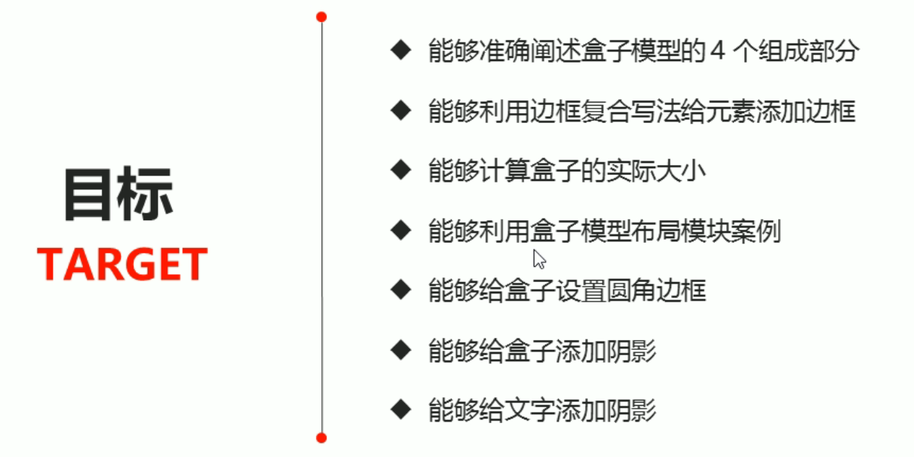

## 盒子模型的4个组成部分

组成部分：

- 边框 `border`
- 外边距 `margin`：控制盒子边框与别的盒子边框之间的距离
- 内边距 `padding`：控制盒子边框与其内容的距离
- 实际内容 `content`

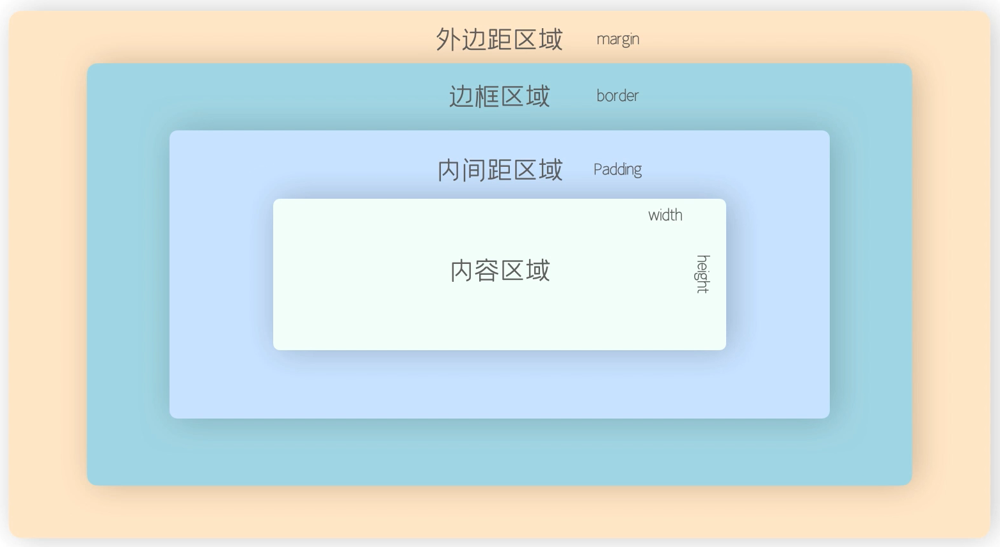


### 边框 border

`border: border-width || border-style || border-color`

| 属性         | 作用                   |
| ------------ | ---------------------- |
| border-width | 定义边框粗细，单位为px |
| border-style | 定义边框的样式         |
| border-color | 定义边框的颜色         |

```css
<style>
    div{
        height: 200px;
        width: 300px;
        border-width: 5px;
        border-style: solid;
        border-color: red;
    }

	/* 等价于 */
	div {
		border: 5px solid red;
	}
</style>

<body>
	<div></div>
</body>
```

> 简写记法，没有顺序要求。


边框可以分开写，例如：

```css
div{
    border-top: 1px solid pink;
}
```


- `border-collapse`属性，合并相邻的盒子的边框

- 注意：**边框会影响盒子的实际大小**：

  ```css
  <style>
      div{
          height: 200px;
          width: 200px;
          background-color: pink;
          border: 10px solid red;            
      }
  </style>
  
  <body>
  	<div></div>
  </body>
  ```

  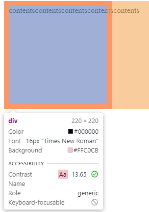


### 内边距 padding

padding属性，用于设置内边距，即**边框与内容之间的距离**。

| 属性           | 作用     |
| -------------- | -------- |
| padding-left   | 左内边距 |
| padding-right  | 右内边距 |
| padding-top    | 上内边距 |
| padding-bottom | 下内边距 |


简记方式：

| 值的个数                     | 意义                                    |
| ---------------------------- | --------------------------------------- |
| padding: 5px;                | 上下左右全为5px                         |
| padding: 5px 10px;           | 上下为5px，左右10px                     |
| padding: 5px 10px 20px;      | 上5px，左右10px，下20px                 |
| padding: 5px 10px 20px 30px; | 上5px，右10px，下20px，左30px（顺时针） |


当指定padding值后，发生了两件事情：

1. 内容和边框有了距离，即内边距

2. padding影响了盒子的实际大小

   ```css
   <style>
   div{
       height: 200px;
       width: 200px;
       background-color: pink;
       padding: 20px;
   }
   </style>
   
   <body>
       <div>
           contentscontentscontentscontentscontents
       </div>
   </body>
   ```

   

   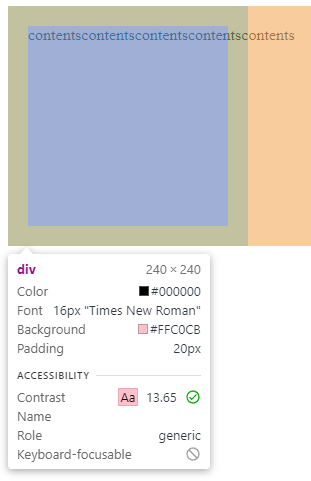


#### padding不会撑开大小的情况

若盒子本身没有指定width/height属性，则此时padding不会撑开盒子大小。

```html
<style>
    h1 {
        height:200px;
        /* 未指定宽度,宽度将继承自body */
        background-color: pink;
        padding: 30px;
    }
</style>

<body>
    <h1></h1>
</body>
```


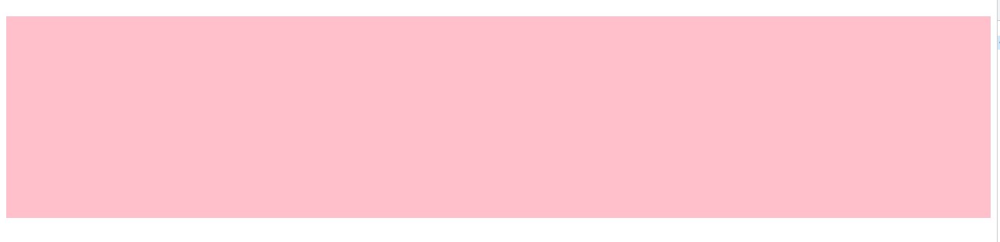

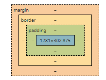


例2：

```html
<style>
    div{
        width: 300px;
        height: 100px;
        background-color: purple;
    }

    div p {
        padding: 30px;
        background-color: skyblue;
    }
</style>

<body>
    <div>
        <p></p>
    </div>
</body>
```


### 外边距 margin

margin属性，用于控制盒子和盒子之间的距离。

类似与padding，margin也可以分别设置上下左右的外边距。


#### 外边距的应用——块级盒子水平居中

需要满足两个条件：

1. 盒子必须指定宽度（width）
2. 盒子的左右边距，设置为auto

```html
<style>
    .header{
        width: 900px;
        height: 200px;
        background-color: pink;
        margin: 0 auto;
    }
</style>

<body>
    <div class="header"></div>
</body>
```

>##### 💡 行内元素和行内块元素的水平居中
>
>给其父元素，添加`text-align:center`


#### 外边距合并

- 相邻块元素，垂直边距的合并：

  当上下相邻的两个块元素（兄弟关系）相遇时，如果上面的元素设置了下边距，下面的元素设置了上边距，则此时它们之间的垂直边距取的是两者的最大值。

  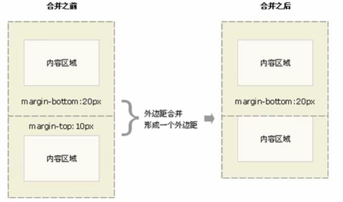

- 嵌套块元素，垂直外边距的塌陷：

  对于两个嵌套关系（父子关系）的块元素，若父子元素同时有上外边距，则父元素会塌陷较大的那个值，而子元素仍和父元素邻接。

  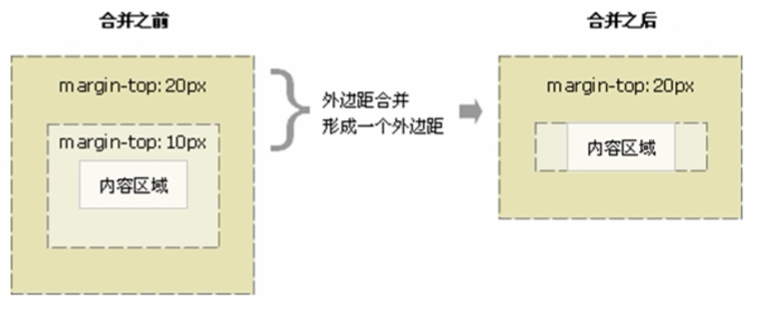

  ```html
  <style>
      .father{
          width: 400px;
          height: 400px;
          background-color: purple;
      }
  
      .son{
          width: 200px;
          height: 200px;
          background-color: pink;
          margin-top: 100px;
      }
  </style>
  <body>
      <div class="father">
          <div class="son"></div>
      </div>
  </body>
  ```

  解决方案：

  1. 为父元素再添加上边框`border:1px solid transparent;`
  2. 为父元素定义上内边距`padding-top: 1px;`
  3. 为父元素添加`overflow:hidden`
  4. 浮动、固定、绝对定位的盒子，不会有塌陷的问题


#### 清除内外边距

HTML元素很多带有默认的内外边距，且不同浏览器的默认值不同。

因此在开始网页布局之前，通常先清除网页元素的内外边距：

```css
* {
	padding: 0px;
	margin: 0px;
}
```


### 小总结

- 到底用margin还是padding ？
  - 大部分情况可以混用
  - 但如果已经指定了width，再指定左右padding的话，会把盒子的大小改变。而margin不会。


## 盒子尺寸的计算

- box-sizing：content-box（默认）

  - width和height设置的是**content的尺寸**。

  - 盒子的尺寸为content+padding+border。

  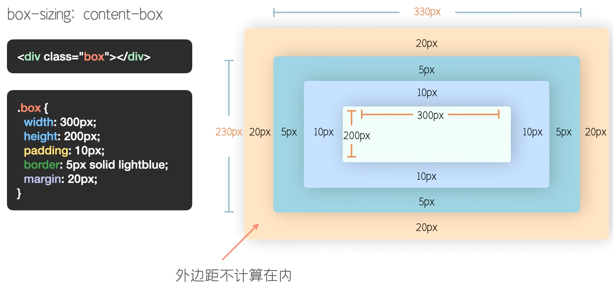

- box-sizing：border-box

  - width和height设置的是**盒子的最终尺寸**。

  


## 盒子的布局方式

- 外部显示类型：控制的是相邻盒子之间的布局，分为：

  - 块级盒子：display:block

    其**宽度为盒子的整体宽度**。

    

  - 行内盒子：display:inline

    其**宽度是内容的宽度**。

    且无法手动设置宽高。垂直方向padding和margin会生效，但会发生重叠。

    水平方向会相互挤占空间。

  


# 圆角边框

`border-radius`属性，用于设置元素的外边框圆角。

```html
<style>
    div {
        height: 150px;
        width: 300px;
        background-color: pink;
        border-radius: 10px;
    }
</style>

<body>
    <div></div>
</body>
```

形成圆角的原理：圆与边框的交集

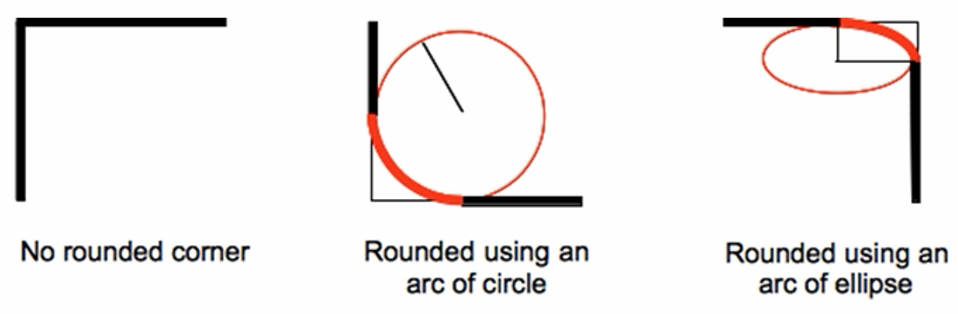

> - 值也可以设置为**百分比**。
> - 也可以分别设置4个角落。


# 盒子阴影

使用`box-shadow`属性，可以为盒子添加阴影。

语法：`box-shadow: h-shadow v-shadow blur spread color inset;`

| 值       | 描述                               |
| -------- | ---------------------------------- |
| h-shadow | 必需。水平阴影的位置。支持负值。   |
| v-shadow | 必需。垂直阴影的位置。支持负值。   |
| blur     | 可选。模糊距离。（影子的虚实程度） |
| spread   | 可选。阴影的尺寸。                 |
| color    | 可选。阴影的颜色。                 |
| inset    | 可选。将外部阴影，改为内部阴影。   |

```html
<style>
    div {
        height: 200px;
        width: 200px;
        background-color: pink;
        margin: 100px auto;

        box-shadow: 10px 10px 10px 10px rgba(0, 0, 0, 0.3);
    }
</style>

<body>
    <div></div>
</body>
```


# 文字阴影

`text-shadow`属性，可对文本应用阴影。

语法：`text-shadow: h-shadow v-shadow blur color;`

| 值       | 描述                               |
| -------- | ---------------------------------- |
| h-shadow | 必需。水平阴影的位置。支持负值。   |
| v-shadow | 必需。垂直阴影的位置。支持负值。   |
| blur     | 可选。模糊距离。（影子的虚实程度） |
| color    | 可选。阴影的颜色。                 |

```html
<style>
    div {
        font-size: 50px;
        color: orangered;
        font-weight: 700;

        text-shadow: 5px 5px 6px rgba(0, 0, 0, 0.3);
    }
</style>

<body>
    <div>我是阴影</div>
</body>
```


# CSS浮动

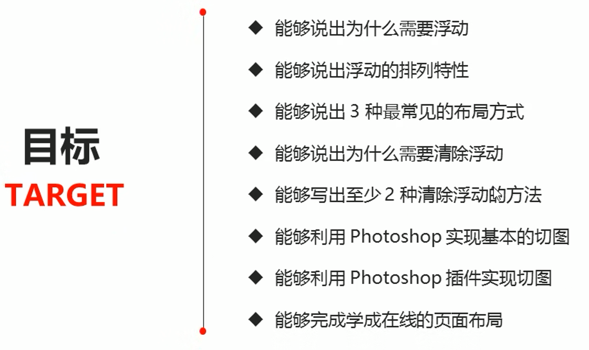

https://www.bilibili.com/video/BV14J4114768?p=170


## 传统网页布局的三种方式

CSS提供了三种传统布局方式（即盒子如何排列顺序）：

- 普通流（标准流 / 文档流）

  标签按照默认规定好的方式进行排列。

  1. 块级元素独占一行，从上往下顺序排列

  2.  行内元素按照顺序，从左到右依次排列。

     > 碰到父元素边缘则自动换行

- 浮动

- 定位

> 在实际开发中，**一个页面中，基本包含了这三种布局方式**。


## 为什么需要浮动

使用标准流，需要实现如下的效果比较麻烦（甚至有些做不了）。例如：

1. 让多个块级元素(div)，水平排列成一行：

   将其转换为 行内块元素。但他们之间的空白缝隙，比较难控制。

2. 如何两个盒子的左右对齐：

   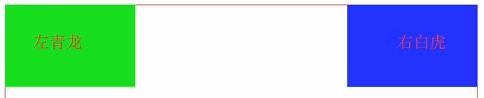

   


总结：

- 浮动可以做到标准流难以实现的布局效果

- 因为浮动可以改变标签默认的排列方式

  >##### 💡 浮动最典型的应用：
  >
  >让多个块级元素在一行内排列显示。


***网页布局第一准则***：

- 多个块级元素纵向排列：使用标准流
- 横向排列：使用浮动


## 什么是浮动

`float`属性，用于创建**浮动框**，将其移动到一边，直到左边缘或右边缘，触及包含块或另一个浮动框的边缘。

语法：

```css
选择器 { float：属性值; }
```

| 属性值 | 描述                 |
| ------ | -------------------- |
| none   | 元素不浮动（默认值） |
| left   | 元素向左浮动         |
| right  | 元素向右浮动         |


## 浮动的特性

### 脱标

设置了浮动(float)的元素，最重要的特性：

1. 设置了浮动的元素，**将漂浮在标准流的上面。不占位置**。（即脱标）
2. 浮动的盒子不再保留原先的位置。


```html
<style>
    .box-float {
        float: left;
        width: 100px;
        height: 100px;
        background-color: pink;
    }

    .box-standard{
        width: 200px;
        height: 200px;
        background-color:rgb(0,153,255);
    }
</style>

<body>
    <div class="box-float">float</div>
    <div class="box-standard">standard</div>
</body>
```

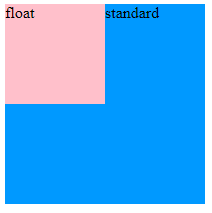


### 浮动元素一行显示

如果多个盒子都设置了浮动，则它们将按照属性值，**在一行内显示并且顶端对齐排列**。

> 显然，如果父级盒子的宽度装不下，将自动换行。


### 浮动元素具有行内块特性

任何元素都可以设置浮动，并且不管原先是什么模式的元素，**在添加浮动后，将自动具有行内块元素相似的特性**。

- 对于块级盒子：
  - 标准流：其宽度默认与父级一样宽
  - **添加浮动之后：其宽度根据内容变化**
- 浮动的盒子，中间没有任何缝隙，是紧挨在一起的。


## 浮动元素通常搭配标准流的父元素

为了约束浮动元素的位置，通常的网页布局策略是：

1. 先用标准流的父元素，确定上下位置
2. 之后内部的子元素，采取浮动排列左右位置

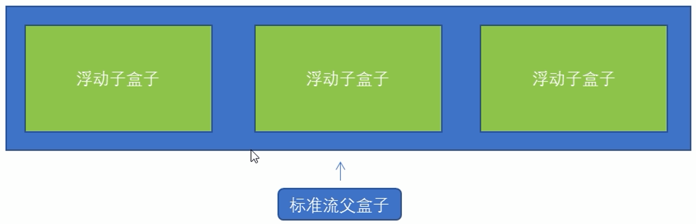


## 清除浮动

为什么需要清除浮动：

- 浮动元素，都应有一父元素。

- 但**在某些需求下，父元素的高度不是确定的**。（如新闻）
- 但子盒子浮动后不占有位置，此时若未指定父元素的高度，父元素高度将为0，会影响下面的标准流盒子。


清除浮动的本质：

- 清除浮动之后，父级元素将根据浮动的子盒子自动设置高度。


语法：

```css
选择器 {clear: 属性值;}
```

| 属性值 | 描述                                       |
| ------ | ------------------------------------------ |
| left   | 不允许左侧有浮动元素（清除左侧浮动的影响） |
| right  | 不允许右侧有浮动元素（清除右侧浮动的影响） |
| both   | 同时清除左右两侧浮动的影响                 |


清除浮动的方法：

1. 额外标签法（隔墙法）：

   在浮动元素的末尾，添加一个空标签（必须是块级元素）。

   ```html
   <style>
       .container{
           width: 800px;
           margin: 0 auto;
           background-color: skyblue;
       }
   
       .box-float {
           float: left;
           width: 200px;
           height: 200px;
           background-color: pink;
       }
   </style>
   
   <body>
       <div class="container">
           <div class="box-float">1</div>
           <div class="box-float">2</div>
           <div class="box-float">3</div>
           <div style="clear: both;"></div>
       </div>
   </body>
   ```

2. 父级元素添加 `overflow` 属性：

    给父级元素设置该属性，属性值为 hidden、auto 或 scroll
    
    ```html
    <style>
        .container{
            width: 800px;
            margin: 0 auto;
            background-color: skyblue;
            overflow: hidden;
        }
    
        .box-float {
            float: left;
            width: 200px;
            height: 200px;
            background-color: pink;
        }
    </style>
    
    <body>
        <div class="container">
            <div class="box-float">1</div>
            <div class="box-float">2</div>
            <div class="box-float">3</div>
        </div>
    </body>
    ```

3. 父级元素添加 `:after`伪元素：

   ```html
   <style>
       .clearfix:after{
           content: "";
           display: block;
           height: 0;
           clear: both;
           visibility: hidden;
       }
   
       .clearfix{
           *zoom: 1;
       }
   
       .container{
           width: 800px;
           margin: 0 auto;
           background-color: skyblue;
       }
   
       .box-float {
           float: left;
           width: 200px;
           height: 200px;
           background-color: pink;
       }
   </style>
   
   <body>
       <div class="container clearfix">
           <div class="box-float">1</div>
           <div class="box-float">2</div>
           <div class="box-float">3</div>
       </div>
   </body>
   ```

4. 父级元素添加 双伪元素：

   ```html
   <style>
       .clearfix:before,
       .clearfix:after{
           content: "";
           display: table;
       }
   
       .clearfix:after{
           clear: both;
       }
   
       .clearfix{
           *zoom: 1;
       }
   
       .container{
           width: 800px;
           margin: 0 auto;
           background-color: skyblue;
       }
   
       .box-float {
           float: left;
           width: 200px;
           height: 200px;
           background-color: pink;
       }
   </style>
   
   <body>
       <div class="container clearfix">
           <div class="box-float">1</div>
           <div class="box-float">2</div>
           <div class="box-float">3</div>
       </div>
   </body>
   ```

   

# CSS属性书写顺序

1. 布局定位属性：

   display / position / float / clear / visibility / overflow

2. 自身属性：

   width / height / margin / padding / border / background

3. 文本属性：

   color / font / text-decoration / text-align / vertical-align / white-space / break-word

4. 其他属性（CSS3）：

   content / cursor / border-radius / box-shadow / text-shadow / background:liner-gradient...


# CSS定位

https://www.bilibili.com/video/BV14J4114768?p=221&spm_id_from=pageDriver&vd_source=be746efb77e979ca275e4f65f2d8cda3
