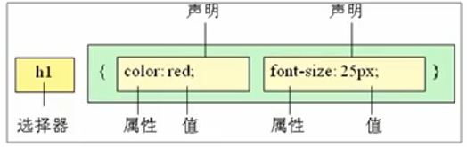
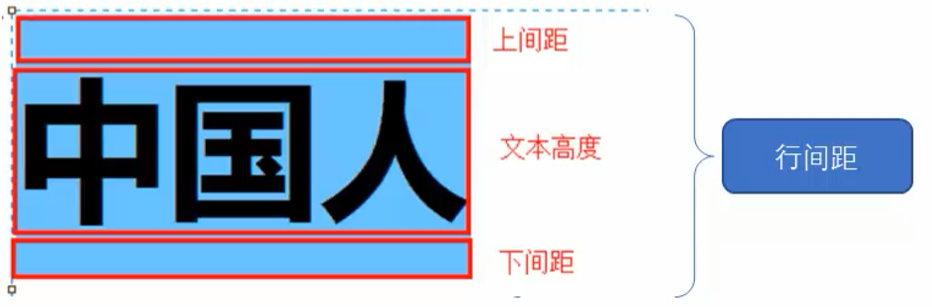

# CSS语法规范

CSS规则由两个主要的组成部分：

- 选择器

- 一条或多条声明

  ```css
  h1{
      color:red;
      font-size:25px;
  }
  ```

  

- 属性与属性值以“键值对”的形式出现，多个键值对之间用分号。

  如`属性名:值;`


编码风格：

- 将{}中的内容以多行展示
- 选择器、属性名、属性值，全部使用小写字母
-  空格：
  - 选择器 和 { 间有空格
  - : 和 属性值间有空格 


# 选择器

- 文档：[CSS 选择器参考手册 (w3school.com.cn)](https://www.w3school.com.cn/cssref/css_selectors.asp)
- 选择器可分为：
  - 基础选择器：仅由单个选择器组成
    - 标签选择器
    - 类选择器
    - id选择器
    - 通配符选择器
  - 复合选择器：由基础选择器组合而成：
    - 后代选择器
    - 子选择器
    - 并集选择器
    - 伪类选择器


## 基础选择器

### 标签选择器

- 作用：将某一类标签，**全部**选择出来。

如：

```css
p {
    color:red;
}
```


### 类选择器

- 作用：用于差异化的选择标签

- 语法：

  ```css
  .类名 {
      ...
  }
  ```

- 例如：

  ```html
  <style>
      .red{
  		color: red;
      }
  </style> 
  
  <div class="red">
      这是红色的字
  </div>
  
  ```

- 关于命名：
  - 多个单词，用 `-` 分 割
  - 命名的规则见附件：Web前端开发规范.doc


- 若应用了多个类：

  -  不重复的属性，将共同生效。

  - 重复的属性，**后面的会覆盖前面的**。

    ```html
    <style>
        .red {
            color: red;
        }
    
        .green{
            color: green;
        }
    </style>
    
    <div class="red green">最终会是绿色</div>
    ```


### id选择器

例如：

```html
<style>
    #pink {
        color:pink;
    }
</style>

<div id="pink">
	粉红色的字
</div>
```


### 通配符选择器

会**选择页面中的所有标签**。

```html
<style>
    * {
        ...
    }
</style>
```


## 复合选择器

### 后代选择器

 用于选择父元素里的子元素：

```html
<style>
    ol li {
        color: pink;
    }
</style>

<div>
    <ol>
        <li>子</li>
        <li>子</li>
        <li>子</li>
        <span><li>孙</li></span> <!-- 会被选中 -->
    </ol>
</div>
```

如上例中的`ol li{}`，表示选择ol中的所有li元素（**包括子类和后代**）。

> 后代选择器，可以是任意基础选择器的组合，如`.nav li span`


### 子选择器

子元素选择器，仅会选择某元素的**最近一级子元素**。

```html
<style>
    ol>li {
        color: pink;
    }
</style>

<div>
    <ol>
        <li>子</li>
        <li>子</li>
        <li>子</li>
        <span><li>孙</li></span> <!-- 不会被选中 -->
    </ol>
</div>
```


### 并集选择器

```html
<style>
    div, p {
        color: pink;
    }
</style>
```


### 伪类选择器

伪类选择器的特点是以`:`开头，如`:hover`，`:first-child`。


#### 链接伪类

```css
a:link		/* 选择所有未被访问的链接 */
a:vistited  /* 选择所有已被访问的链接 */
a:hover		/* 选择指针悬停的链接 */
a:active	/* 选择活动链接（鼠标按下未弹起） */
```


注意事项：

- 为了确保生效，**按照LVHA的顺序声明**：link - visited - hover - active


#### 结构伪类


#### 表单伪类

`:focus`伪类选择器，用于选择获取了焦点的元素。（一般情况下，仅有\<input>类表单元素可以获取焦点）

```css
input:focus 
```


# 字体属性

用于定义：

- 字体系列
- 大小
- 粗细
- 文字样式（如斜体）


## 字体系列

```css
p {
    font-family: "微软雅黑";
}

div {
    font-family: Arial,"Microsoft Yahei","微软雅黑";
}
```

当值存在多个时，将依次查找，直到用户电脑上有该字体。若所有的都没有，将使用默认字体。


## 字体大小

```css
p {
    font-size: 20px;
}
```

关于单位：

- px：像素。（chrome默认为16px）


## 字体粗细

语法：

**font-weight**：normal | bold | bolder | lighter | 数字

取值：

- normal：正常的字体。相当于数字值400

- bold：粗体。相当于数字值700。

- bolder：定义比继承值更重的值

- lighter：定义比继承值更轻的值

- 用数字表示文本字体粗细。取值范围：100 | 200 | 300 | 400 | 500 | 600 | 700 | 800 | 900


```css
p {
    font-weight: 500;
}
```


## 文字样式

`font-style`属性，其有两个常见的取值：

- normal：默认值
- italic：斜体


## 复合属性（简记）

字体属性可以综合起来写，格式为：

`font: font-style font-weight font-size/line-height font-family;`

> 不需要设置的属性可以忽略不写，但size和family属性必须有。


例如：

```css
div {
    font-style: italic;
    font-weight: 700;
    font-size: 16px;
    font-family: 'Microsoft yahei';
}
```

等价于：

```css
div {
    font: italic 700 16px 'Microsoft yahei';
}
```


# 文本属性

用于定义文本的外观，如：

- 文本的颜色
- 对齐文本
- 装饰文本
- 文本缩进
- 行间距等


## 文本颜色

```css
div {
    color: red;
}
```

取值的方式：

- 预定义的颜色值，如red, green等
- 十六进制，如#FF0000
- RGB代码，如 rgb(255,0,0) 或 rgb(100%,0%,0%)


## 对齐文本

`text-align`属性，用于设置文本内容的**水平对齐**方式，取值：

- left：左对齐（默认）
- center：居中对齐
- right：右对齐


> 盒子的位置不变，改变的是盒子内元素的位置。


## 装饰文本

`text-decoration`属性用于为文本添加属性。取值如下：

- none：没有装饰线（默认）
- underline：下划线（a标签自带下划线）
- overline：上划线
- line-through：删除线


## 文本缩进

`text-indent`属性，用于指定文本的第一行的缩进。

```css
p {
    text-indent: 2em;
}
```

> em是一个相对单位，为当前元素的font-size的1个文字的大小。


## 行间距

`line-height`属性，用于控制行间的距离。




```css
p {
    line-height: 26px;
}
```


# CSS的引入方式

- 内部样式表（嵌入式）：放在html页面的style标签内

- 行内样式表（行内式）：

  ```css
  <p style="color: red; font-size: 12px;">段落内容</p>
  ```

- 外部样式表（链接式）：

  ```html
  <link rel="stylesheet" href="css文件路径">
  ```

  

  

# Emmet语法

快速生成HTML结构：

- 生成标签：键入div，然后按tab

- 生成多个相同标签：键入div*3，然后按tab

- 生成父子级别标签：键入 ul>li，然后按tab

- 生成兄弟级别标签：键入div+p，然后按tab

- 生成带类名或id的标签：键入div.demo#two，然后按tab

- 自增符号`$`：键入div.demo$*5，然后按tab

  ```html
  <div class="demo1"></div>
  <div class="demo2"></div>
  <div class="demo3"></div>
  <div class="demo4"></div>
  <div class="demo5"></div>
  ```

- 如果想要在标签内部写内容：键入div{内容}，然后按tab

  ```html
  <div>内容</div>
  ```

  

快速生成CSS样式：

- 采取简写方式，如：

  ```css
  .demo{
      /* h32 */
      height: 32px;   
      /* ti2 */
      text-indent: 2em; 
  }
  ```


# CSS的元素显示模式

## 元素显示模式的分类

- 块元素：

  - \<h1> ~ \<h6>
  - \<p>
  - **\<div>**
  - \<ul>
  - \<ol>
  - \<li>等

  > ###### 💡 块元素的特点
  >
  > - 自己独占一行
  >
  > - 高度、宽度、外边距、内边距 都可以控制
  >
  > - 宽度默认是容器（父级宽度）的100%
  >
  > - 是一个容器及盒子，内部可以放 块元素 或 行内元素。
  >
  >   > 特别的，p和标题标签，都不能放其他块元素

- 行内元素（或内联元素）：

  - \<a>
  - \<strong>,\<b>,\<em>,\<i>,\<del>,\<ins>,\<u>
  - \<span>

  > ###### 💡 行内元素的特点
  >
  > - 相邻的多个行内元素，可以显示在一行上
  >
  > - **高、宽的直接设置是无效的**。
  >
  > - **默认宽度是其内容的宽度**。
  >
  > - 行内元素，仅可容纳文本或行内元素。
  >
  >   > 特别的，a标签可以容纳块级元素（但最好先将a标签转换为块元素）。

- 行内块元素：

  - \
  - \<input>
  - \<td>

  > 它们同时具有块元素和行内元素的特点。有些资料将它们称为行内块元素。
  >
  > - 多个行内块元素可以显示在一行，但有空白间隙。（行内元素特点）
  > - 默认宽度为内容的宽度。（行内元素的特点）
  > - 高、宽、内边距、外边距可以控制。（块元素特点）


## 元素显示模式的切换

- 转换为块元素：`display:block;` 
- 转换为行内元素：`display:inline;`
- 转换为行内块元素：`display:inline-block;`