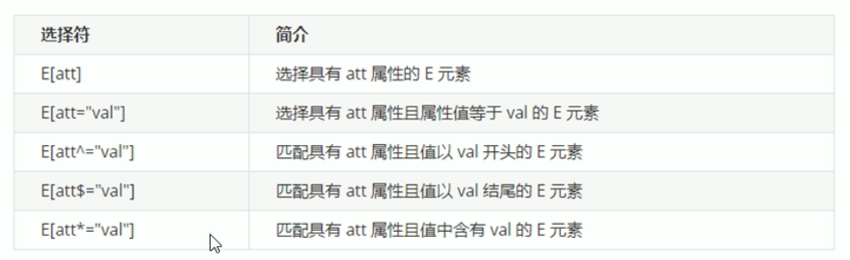
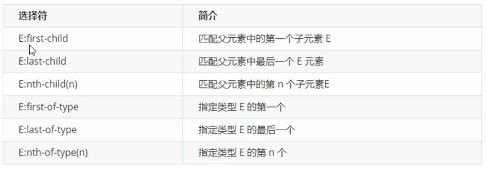
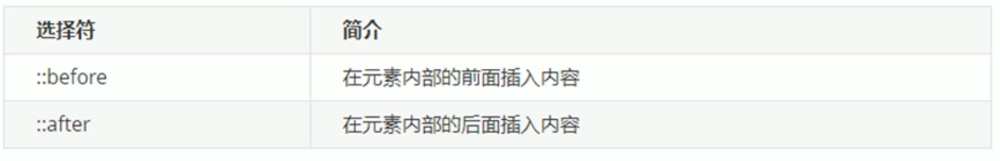
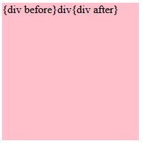

# CSS3 新增选择器

## 属性选择器

- 权重：10
- 可根据元素特定属性来选择元素。从而无需借助类或id选择器。




```html
<style>
    p[paragraph]{
        font-weight: 700;
    }
</style>

<body>
    <p paragraph="1">1111</p>
    <p>2222</p>
</body>
```


## 结构伪类选择器

- 权重：10

- 根据文档结构来选择元素。

  > 常用于：选择父级选择器里面的子元素





`nth-child(n)`：

- n可以为数字、关键字或公式

  - 数字：选择第n个元素，**数字以1开始**

  - 关键字：even偶数、odd奇数

  - 公式： n从0开始算

    ```css
    ul li:nth-child(n){...} //选择全部
    ul li:nth-child(5n){...} //选择 5，10，15，...
    ```

    

child和type的区别：

- child：

  ```html
  <style>
      section div:nth-child(1){
          background-color: red;
      }
  </style>
  
  <body>
      <section>
          <p>p</p>
          <div>div1</div> <!-- 不生效 -->
          <div>div2</div>
      </section>
  </body>
  ```

  child**会给每个子元素都编号**，`div:nth-child(1)`表示第一个子元素，且该元素为div

- type：

  ```html
  <style>
      section div:nth-of-type(1){
          background-color: red;
      }
  </style>
  
  <body>
      <section>
          <p>p</p>
          <div>div1</div> <!-- 生效 -->
          <div>div2</div>
      </section>
  </body>
  ```

  **仅给指定元素排列序号**。`div:nth-of-type(1)`表示：div元素的第一个


## 伪元素选择器

- 权重为1
- 伪元素选择器，**可以利用CSS创建标签元素，而无需HTML标签**。




- before和after创建的元素，是**行内元素**。

- 新创建元素，无法在文档树内找到。

- before和after选择器，必须设置content属性。

- 语法：`element::before{}`

  div::before{}，意味着将创建一个行内元素在div中，且为第一个子元素。


```html
<style>
    div{
        width: 200px;
        height: 200px;
        background-color: pink;
    }

    div::before{
        content: "{div before}";

    }

    div::after{
        content: "{div after}";
    }
</style>

<body>
    <div>div</div>
</body>
```




https://www.bilibili.com/video/BV14J4114768?p=288&vd_source=be746efb77e979ca275e4f65f2d8cda3