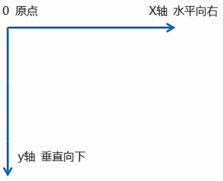
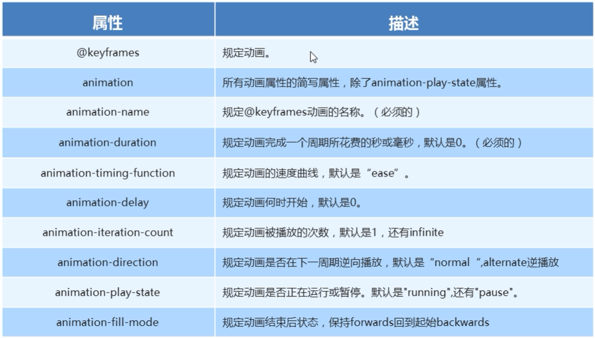

# CSS3 新增选择器

## 属性选择器

- 权重：10
- 可根据元素特定属性来选择元素。从而无需借助类或id选择器。


```html
<style>
    p[paragraph]{
        font-weight: 700;
    }
</style>

<body>
    <p paragraph="1">1111</p>
    <p>2222</p>
</body>
```


## 结构伪类选择器

- 权重：10

- 根据文档结构来选择元素。

  > 常用于：选择父级选择器里面的子元素


`nth-child(n)`：

- n可以为数字、关键字或公式

  - 数字：选择第n个元素，**数字以1开始**

  - 关键字：even偶数、odd奇数

  - 公式： n从0开始算

    ```css
    ul li:nth-child(n){...} //选择全部
    ul li:nth-child(5n){...} //选择 5，10，15，...
    ```

    

child和type的区别：

- child：

  ```html
  <style>
      section div:nth-child(1){
          background-color: red;
      }
  </style>
  
  <body>
      <section>
          <p>p</p>
          <div>div1</div> <!-- 不生效 -->
          <div>div2</div>
      </section>
  </body>
  ```

  child**会给每个子元素都编号**，`div:nth-child(1)`表示第一个子元素，且该元素为div

- type：

  ```html
  <style>
      section div:nth-of-type(1){
          background-color: red;
      }
  </style>
  
  <body>
      <section>
          <p>p</p>
          <div>div1</div> <!-- 生效 -->
          <div>div2</div>
      </section>
  </body>
  ```

  **仅给指定元素排列序号**。`div:nth-of-type(1)`表示：div元素的第一个


## 伪元素选择器

- 权重为1
- 伪元素选择器，**可以利用CSS创建标签元素，而无需HTML标签**。


- before和after创建的元素，是**行内元素**。

- 新创建元素，无法在文档树内找到。

- before和after选择器，必须设置content属性。

- 语法：`element::before{}`

  div::before{}，意味着将创建一个行内元素在div中，且为第一个子元素。


```html
<style>
    div{
        width: 200px;
        height: 200px;
        background-color: pink;
    }

    div::before{
        content: "{div before}";

    }

    div::after{
        content: "{div after}";
    }
</style>

<body>
    <div>div</div>
</body>
```


# CSS3盒子模型


盒子模型，可以通过`box-sizing`选项改变。


## 默认的盒子模型content-box

- width和height，设置的是content部分的尺寸。
- 但盒子的尺寸计算是：content+padding+border


## border-box

CSS3新引入的盒子模型：

- width和height，设置的是盒子的最终尺寸


# 图片模糊——滤镜filter

filter属性，可以将模糊或颜色偏移等图像效果应用于元素

```css
filter: 函数(); // 如 filter:blur(5px); //blur模糊处理，数值越大越模糊
```


```html
<style>
    img {
        filter: blur(5px);
    }
</style>

<body>
	
</body>
```


>[MDN Web Docs (mozilla.org)](https://developer.mozilla.org/zh-CN/)


# calc函数

calc()函数，用于在声明CSS属性值时执行一些计算。

例如：

```css
width:calc(100%-80px);
```


```html
<style>
    .outer {
        width: 300px;
        height: 200px;
        background-color: skyblue;
    }

    .inner{
        width: calc(50% - 50px);
        height: 100px;
        background-color: blueviolet;
    }
</style>


<body>
    <div class="outer">
        <div class="inner"></div>
    </div>
</body>
```


# 过渡

- 过渡（`transition`）属性，可以在不使用Flash或JS的情况下，在元素的样式变化时添加效果。
- 常和`:hover`一起使用


语法：

```css
transition: 要过渡的属性 花费时间 运动取消 延迟触发时间;
```

- 属性：想要变化的CSS属性，诸如宽度、高度、背景颜色、内外边距等。

  如果想要变化所有的属性，则写all即可

- 花费时间：必须写单位

- 运动曲线：默认为ease，可以省略

- 延迟触发时间：必须写单位。默认为0s

> 过渡写在哪里：谁做过渡给谁加


```html
<style>
    div {
        width: 200px;
        height: 100px;
        background-color: skyblue;
        
        transition: width 1s;
    }

    div:hover {
        width: 400px;
    }
</style>

<body>
    <div></div>
</body>
```


过渡多个属性：

```html
<style>
    div {
        width: 200px;
        height: 100px;
        background-color: skyblue;
        transition: width 1s,background-color 1s;
    }

    div:hover {
        width: 400px;
        background-color: slateblue;
    }
</style>
```


# 转换

转换（`transfrom`）属性，可以实现元素的位移、旋转、缩放等效果

> 也可以理解为“变形”

- 移动：translate
- 选择：rotate
- 缩放：scale


## 2D转换

二维坐标系：




### 移动translate

特点：

- translate：**不会影响到其他元素的位置**
- 若使用百分比单位，则是相对于自身元素的width和height属性而言的
- 对**行内标签没有效果**


语法：

```css
transform: translate(x,y);
transform: translateX(n);
transform: translateY(n);
```


```html
<style>
    div {
        width: 200px;
        height: 200px;
        background-color: skyblue;
    }

    div:hover {
        transform: translate(200px, 200px);
    }
</style>

<body>
    <div></div>
</body>
```


技巧：

**`盒子水平垂直居中`**：

```html
<style>
    div {
        position: relative;
        width: 400px;
        height: 400px;
        background-color: skyblue;
    }

    p{
        position: absolute;
        top: 50%;
        left: 50%;

        transform: translate(-50%,-50%);

        width: 200px;
        height: 200px;
        background-color: #ff5000;
    }
</style>

<body>
    <div>
        <p></p>
    </div>
</body>
```


### 旋转rotate

```css
transform: rotate(度数);
```

- 单位：deg（度）
- 正值：顺时针
- 旋转中心点：元素的中心点


同时设置中心点：

```css
transform-origin: x y;
```

- 默认中心点：元素的中心点（50% 50%）
- 可以设置 像素 或 方位名词（top,bottom,left,right,center）


### 缩放scale

```css
transform:scale(x,y)
```

- transform:scale(1,1)：没有变化
- transform:scale(2,2)：宽高都放大两倍

- transform:scale(2)：宽高都放大两倍


特点：

- 不影响其他盒子

- 同样可以设置中心点：

  ```css
  tranform-origin: x y;
  ```

  

### 综合写法

```css
transform: translate() rorate() scale()
```

> 注意：
>
> - 顺序会影响转换的结果。（比如先旋转会改变坐标轴方向）
> - 位移应写在其他属性之前


## 3D转换

坐标系：


### 3D位移

```css
translate3d(x,y,z)
```


### 3D旋转

```css
rolate3d(x,y,z,deg)
```

- 其中xyz是代表旋转轴的矢量


### 透视

- 如果需要在网页中展现3d效果，需要透视
- `perspective`属性，可以设置相机与屏幕的距离

- 透视，需要写在被观察元素的父盒子上：
  - d：视距
  - z：是被观察物体与屏幕的距离


```html
<style>
    body {
        perspective: 500px;
    }

    div {
        width: 200px;
        height: 200px;
        background-color: pink;

        transform: translate3d(400px, 100px,100px);
    }
</style>

<body>
    <div></div>
</body>
```


### 3D呈现

```css
transform-style
```

`transform-style`

- 控制子元素，是否开启三维立体环境
- `transform-style: flat;` 默认值，子元素不开启
- `transform-style: preserve-3d;` 子元素开启
- 该属性，写在被观察盒子的父盒子上


```html
<style>
    body {
        perspective: 500px;
    }

    .box {
        position: relative;
        width: 200px;
        height: 200px;
        margin: 0 auto;
        perspective: 500px;

        transition: all 2s;
        transform-style: preserve-3d;
    }

    .box:hover {
        transform: rotateY(60deg);
    }

    .box div {
        position: absolute;
        top: 0;
        left: 0;
        width: 100%;
        height: 100%;

    }

    .box div:nth-child(1) {
        background-color: pink;
    }

    .box div:nth-child(2) {
        background-color: skyblue;
        transform: rotateX(60deg);
    }

</style>

<body>
    <div class="box">
        <div></div>
        <div></div>
    </div>
</body>
```


# 动画(animation)

- 可通过设置多个节点来精确控制一个或一组动画
- 相较于过渡，动画可以实现更多变化


## 动画的基本使用

制作动画的步骤：

1. 定义动画：

   ```css
   @keyframes 动画名称{
       0%{
           width:100%;
       }
       100%{
           width:200%;
       }
   }
   ```

   > 0%是动画的开始（from），100%是动画的结束（to）。

2. 使用（调用）动画：

   ```css
   选择器 {
       animation-name: 动画名称;
       animation-duration: 持续时间;
   }
   ```

   

```html
<style>
    @keyframes div-move {
        0% {
            transform: translateX(0px);
        }

        100% {
            transform: translateX(1000px);
        }
    }

    div {
        width: 200px;
        height: 200px;
        background-color: skyblue;

        animation-name: div-move;
        animation-duration: 1s;
    }
</style>

<body>
    <div></div>
</body>
```


## 动画的常见属性




总结：

- 暂停动画：`animation-play-state: paused;`
- 动画走回来，而非直接跳回来：`animation-direction: alternate;`
- 动画结束后，停在结束位置：`animation-fill-mode: forwards;`


## 简写

```css
animation： 动画名称 持续时间 运动曲线 何时开始 播放次数 是否反方向 mode
```

> 注意：简写形式不包含state属性
