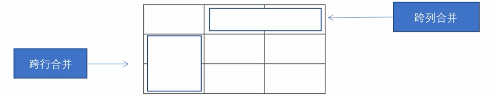

# 相关资料

- [视频](https://www.bilibili.com/video/BV14J4114768?spm_id_from=333.337.search-card.all.click)


- 文档：[Html 官方文档 官方文档|官方教程|Html 官方文档 API中文手册|Html 官方文档参考文档_w3cschool](https://www.w3cschool.cn/html/dict)


# 基础HTML标签

## DIV与Span

- div：division，分割、分区。
- span：跨度、跨距。
- 都是用于布局的，**没有语义**。


- DIV标签：一个DIV，**独占一行**。
- Span标签


## 相对路径与绝对路径

- 相对路径：以引用文件所在位置为参考基础，而建立出的目录路径。

  简单的说，是当对于此HTML页面的位置

- 绝对路径：指目录下的绝对位置：

  - 如盘符路径："D:\web\img\logo.gif"
  - 或完整的网络路径："http://www.example.com/images/logo.gif"


## a标签

### 锚点链接

语法：`<a href="#id值> 第2集 </a>"`


例如：

```html
<a href="#two">第二集</a>
<h3 id="two">第二集介绍</h3>
```


## table标签

### 合并单元格

合并单元格的方式：

- 跨行合并：rowspan="合并单元格的个数"
- 跨列合并：colspan="合并单元格的个数"




目标单元格：

- 若想做到跨行：在最上侧单元格写合并代码
- 若想跨列：写在最左侧单元格

 


例如：

```html
<table width="500" height="249" border="1" cellspacing="0">
    <tr>
        <td></td>
        <td colspan="2"></td>
        <!-- 记得删除多余单元格 -->
    </tr>
    <tr>
        <td rowspan="2"></td>
        <td></td>
        <td></td>
    </tr>
    <tr>
        <td></td>
        <td></td>
    </tr>
</table>
```

> 跨2列，意味着占用两个单元格。**记得删除多余单元格**。


## ul标签（无序列表）

列表项用`<li>`表示。如：

```html
<ul>
    <li>列表项1</li>
    <li>列表项2</li>
    <li>列表项3</li>
	...
</ul>
```


> - 注意：`<ul></ul>`中，仅可嵌套`<li></li>`。
>
>   **不能**在其内部**直接**输入**其他标签**或**文本**。
>
> - `<li>`内部相当于一个容器，可以容纳任何元素。


## ol标签（有序列表）

> ol内部，同样也只能直接放li标签


## dl标签（自定义列表）

在HTML标签中，`<dl>`标签用于定义描述列表，该标签会与`<dt>`（定义项目/名字）和`<dd>`（描述每一个项目/名字）一起使用。

语法：

```html
<dl>
    <dt>名词1</dt>
    <dd>名词1解析1</dd>
    <dd>名词1解析2</dd>
</dl>
```

> - `<dl>`中，仅可包含`<dt>`或`<dd>`
> - `<dt>`和`<dd>`的个数没有限制。但通常是一个`<dt>`对应多个`<dd>`（都放在一个dl中）。


## form标签

- 表单域：`<form>`标签用于定义表单域，以实现用户信息的收集和传递。

- `input`标签：

  - name属性：用于提交的名称。
  - value属性：用于提交的值。
  - checked属性（针对单选框或复选框）：规定此input元素，在首次加载时应默认被选中。
  - maxlength属性：规定输入字段中字符的最大长度。

- `label`标签：用于为input元素定义标注内容。

  当点击label标签内的文本时，浏览器会自动将焦点转到对应的表单元素上。

  ```html
  <label for="male">男</label>
  <input type="radio" name="sex" id="male" value="male">
  ```

  > label标签的for属性，应与相应的input元素的id属性相同


