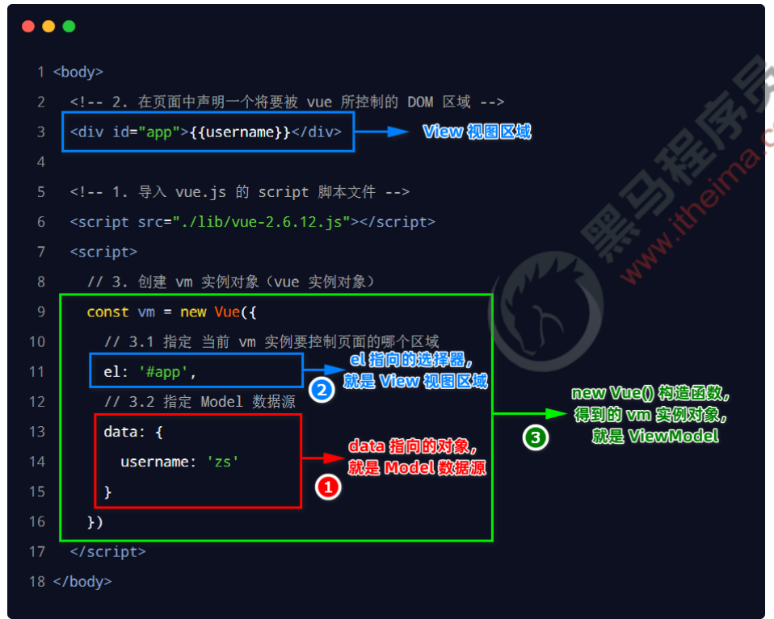

# Vue的基本使用

## 基本使用步骤

1. 导入vue.js
2. 在页面中声明一个将要被 vue实例 所控制的DOM区域
3. 创建vm实例对象（vue实例对象）


```html
<body>
    <div id="app">
        {{username}}
    </div>

    <script src="./lib/vue-2.6.12.js"></script>
    <script>
        const vm = new Vue({
            el: "#app",
            data:{
                username :'zs'
            }
        });
    </script>
</body>
```


## 基本代码与MVVM的对应关系




# Vue指令

## 指令的概念

指令（Directives）是 vue 为开发者提供的模板语法，用于**辅助开发者渲染页面的基本结构**。


vue 中的指令**按照不同的用途**可以分为如下 6 大类：

- 内容渲染指令
- 属性绑定指令
- 事件绑定指令
- 双向绑定指令
- 条件渲染指令
- 列表渲染指令


## 内容渲染指令

内容渲染指令用来辅助开发者渲染 DOM 元素的文本内容。常用的内容渲染指令有如下 3 个：

- v-text

  ```html
  <div id="app">
      <p v-text="username"></p>
      <p v-text="gender"></p>
  </div>
  
  <script src="./lib/vue.js"></script>
  <script>
      new Vue({
          el:"#app",
          data:{
              username:'zs',
              gender: 'male'
          }
      });
  </script>
  ```

  > 注意：v-text指令，会**覆盖**元素内默认的值。

- {{ }}：即插值表达式

  ```html
  <div id="app">
      <p>姓名：{{username}}</p>
      <p>性别：{{gender}}</p>
  </div>
  
  <script src="./lib/vue.js"></script>
  <script>
      new Vue({
          el: "#app",
          data: {
              username: 'zs',
              gender: 'male'
          }
      });
  </script>
  ```

- v-html：可以渲染html元素

  ```html
  <div id="app">
      <div v-html="description"></div>
  </div>
  
  <script src="./lib/vue.js"></script>
  <script>
      new Vue({
          el: "#app",
          data: {
              description:'<h5>黑马程序员</h5>'
          }
      });
  </script>
  ```


## 属性绑定指令

如果需要为元素的属性动态绑定属性值，则需要用到 v-bind 属性绑定指令。用法示例如下：  

```html
<div id="app">
    <input type="text" v-bind:placeholder="inputValue">
</div>

<script src="./lib/vue.js"></script>
<script>
    new Vue({
        el: "#app",
        data: {
            inputValue:'请输入搜索关键字'
        }
    });
</script>
```


由于 v-bind 指令在开发中使用频率非常高，因此，vue 官方为其提供了简写形式：

- `v-bind:src`等同于`:src`


## 事件绑定指令

vue 提供了 v-on 事件绑定指令，用来辅助程序员为 DOM 元素绑定事件监听。语法格式如下：

```html
<div id="app">
    <h3> count值为：{{count}}</h3>
    <button v-on:click="addCount">+1</button>
</div>

<script src="./lib/vue.js"></script>
<script>
    new Vue({
        el: "#app",
        data: {
            count: 0
        },
        methods:{
            addCount(){
                this.count++
            }
        }
    });
</script>
```


由于 v-on 指令在开发中使用频率非常高，因此，vue 官方为其提供了简写形式（简写为英文的 @ ）。  

- `v-on:click`等同于`@click`


### 事件对象event

- 在原生的 DOM 事件绑定中，可以在事件处理函数的形参处，接收事件对象 event。

- 同理，在 v-on 指令（简写为 @ ）所绑定的事件处理函数中，同样可以接收到事件对象 event，示例代码如下：  

  ```html
  <div id="app">
      <h3> count值为：{{count}}</h3>
      <button v-on:click="addCount">+1</button>
  </div>
  
  <script src="./lib/vue.js"></script>
  <script>
      new Vue({
          el: "#app",
          data: {
              count: 0
          },
          methods: {
              addCount(event) {
                  const nowBgColor = event.target.style.backgroundColor;
                  event.target.style.backgroundColor = (nowBgColor === 'red') ? '' : 'red';
                  this.count++
              }
          }
      });
  </script>
  ```

  

### 绑定事件并传参

在使用 v-on 指令绑定事件时，可以使用 ( ) 进行传参，示例代码如下：  

```html
<div id="app">
    <h3> count值为：{{count}}</h3>
    <button v-on:click="addCount(2)">+2</button>
</div>

<script src="./lib/vue.js"></script>
<script>
    new Vue({
        el: "#app",
        data: {
            count: 0
        },
        methods: {
            addCount(step) {
                this.count += step
            }
        }
    });
</script>
```


### $event

- `$event` 是 vue 提供的特殊变量，用来表示原生的事件参数对象 event。

- \$event 可以解决事件参数对象 event被覆盖的问题。

  

示例用法如下：  

```html
<div id="app">
    <h3> count值为：{{count}}</h3>
    <button v-on:click="addCount(2,$event)">+2</button>
</div>

<script src="./lib/vue.js"></script>
<script>
    new Vue({
        el: "#app",
        data: {
            count: 0
        },
        methods: {
            addCount(step, e) {
                this.count += step
                console.log(e)
            }
        }
    });
</script>
```


### 事件修饰符

- 在事件处理函数中调用 preventDefault() 或 stopPropagation() 是非常常见的需求。

- 因此，vue 提供了事件修饰符的概念，来辅助程序员更方便的对事件的触发进行控制。

  

常用的 5 个事件修饰符如下： 

| 事件修饰符 | 说明                                                     |
| ---------- | -------------------------------------------------------- |
| .prevent   | 阻止默认行为                                             |
| .stop      | 阻止事件冒泡                                             |
| .capture   | 以捕获模式，触发当前的事件处理函数                       |
| .once      | 绑定的事件只触发1次                                      |
| .self      | 只有在 event.target 是当前元素自身时，才触发事件处理函数 |


```html
<div id="app">
    <a href="https://www.baidu.com" @click.prevent="onLinkClick()">百度首页</a>
</div>

<script src="./lib/vue.js"></script>
<script>
    new Vue({
        el: "#app",
        methods: {
            onLinkClick(){
                alert("a clicked")
            }
        }
    });
</script>
```


### 按键修饰符

- 在监听键盘事件时，我们经常需要判断详细的按键。

- 此时，可以为键盘相关的事件添加按键修饰符，例如：  

  ```html
  <div id="app">
      <input @keyup.enter="submit">
  </div>
  
  <script src="./lib/vue.js"></script>
  <script>
      new Vue({
          el: "#app",
          methods: {
              submit(){
                  alert("form submit")
              }
          }
      });
  </script>
  ```

  

## 双向绑定指令

vue 提供了 v-model 双向数据绑定指令，用来辅助开发者在不操作 DOM 的前提下，快速获取表单的数据。  

>注意：v-model 指令只能配合表单元素一起使用！


 ```html
 <div id="app">
     <input type="text" v-model="username">
     <select v-model="province">
         <option value="">请选择</option>
         <option value="1">1</option>
         <option value="2">2</option>
         <option value="3">3</option>
     </select>
 
     <p>用户名为：{{username}}</p>
     <p>选中的省份为：{{province}}</p>
 </div>
 
 <script src="./lib/vue.js"></script>
 <script>
     new Vue({
         el: "#app",
         data:{
             username:'',
             province: 0
         }
     });
 </script>
 ```


### v-model指令的修饰符

为了方便对用户输入的内容进行处理，vue 为 v-model 指令提供了 3 个修饰符，分别是：

| 修饰符  | 作用                             | 示例                           |
| ------- | -------------------------------- | ------------------------------ |
| .number | 自动将用户的输入值转换为数值类型 | \<input v-model.number="age"/> |
| .trim   | 自动过滤用户输入的首尾空白字符   | \<input v-model.trim="msg"/>   |
| .lazy   | 在“change”时而非“input”时更新    | \<input v-model.lazy="msg"/>   |


## 条件渲染指令

条件渲染指令用来辅助开发者按需控制 DOM 的显示与隐藏。条件渲染指令有如下两个，分别是：  

- v-if：

  v-if 指令会动态地创建或移除 DOM 元素，从而控制元素在页面上的显示与隐藏；  

  - v-else

    ```html
    <div v-if="Math.random() > 0.5">随机数大于0.5</div>
    <div v-else>随机数小于或等于0.5</div>
    ```

  - v-else-if

    ```html
    <div v-if="type === 'A'">优秀</div>
    <div v-else-if="type === 'B'">良好</div>
    <div v-else-if="type === 'C'">一般</div>
    <div v-else>差</div>
    ```

- v-show：

  v-show 指令会动态为元素添加或移除 style="display: none;" 样式，从而控制元素的显示与隐藏；  


> 最佳实践：
>
> - 需要频繁切换的：使用v-show
> - 否则：v-if


## 列表渲染指令

- vue 提供了 v-for 指令，用来辅助开发者基于一个数组来循环渲染相似的 UI 结构。

- v-for 指令需要使用 item in items 的特殊语法，其中  
  - items 是待循环的数组  
  - item 是当前的循环项

```html
<div id="app">
    <ul>
        <li v-for="item in list">
            <span>id为：{{item.id}}</span>
            <span>姓名为：{{item.name}}</span>
        </li>
    </ul>
</div>

<script src="./lib/vue.js"></script>
<script>
    new Vue({
        el: "#app",
        data: {
            list: [
                {id: 1, name: 'zs'},
                {id: 2, name: "ls"}
            ]
        }
    });
</script>
```


### v-for中的索引

- v-for 指令还支持一个可选的第二个参数，即**当前项的索引**。(索引从0开始)

- 语法格式为 `(item, index) in items`，示例代码如下：  

  ```html
  <div id="app">
      <ul>
          <li v-for="(item,index) in list">
              <span>索引为：{{index}}</span>
              <span>id为：{{item.id}}</span>
              <span>姓名为：{{item.name}}</span>
          </li>
      </ul>
  </div>
  
  <script src="./lib/vue.js"></script>
  <script>
      new Vue({
          el: "#app",
          data: {
              list: [
                  {id: 1, name: 'zs'},
                  {id: 2, name: "ls"}
              ]
          }
      });
  </script>
  ```

  

### 使用 key 维护列表的状态

- 当列表的数据变化时，默认情况下，vue 会尽可能的复用已存在的 DOM 元素，从而提升渲染的性能。

  但这种默认的性能优化策略，会导致有状态的列表无法被正确更新。

- 为了给 vue 一个提示，以便它能跟踪每个节点的身份，从而在保证有状态的列表被正确更新的前提下，提升渲染的性能。

  此时，**需要为每项提供一个唯一的 key 属性**  

  ```html
  <div id="app">
      <ul>
          <li v-for="item in list" :key="item.id">
              姓名为：{{item.name}}
          </li>
      </ul>
  </div>
  
  <script src="./lib/vue.js"></script>
  <script>
      new Vue({
          el: "#app",
          data: {
              list: [
                  {id: 1, name: 'zs'},
                  {id: 2, name: "ls"}
              ]
          }
      });
  </script>
  ```

  

  key的注意事项：

- key 的值只能是字符串或数字类型  
- key 的值必须具有唯一性（即：key 的值不能重复）


# 过滤器

[黑马程序员Vue全套视频教程，从vue2.0到vue3.0一套全覆盖，前端必会的框架教程_哔哩哔哩_bilibili](https://www.bilibili.com/video/BV1zq4y1p7ga?p=64)