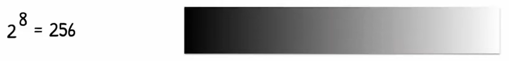
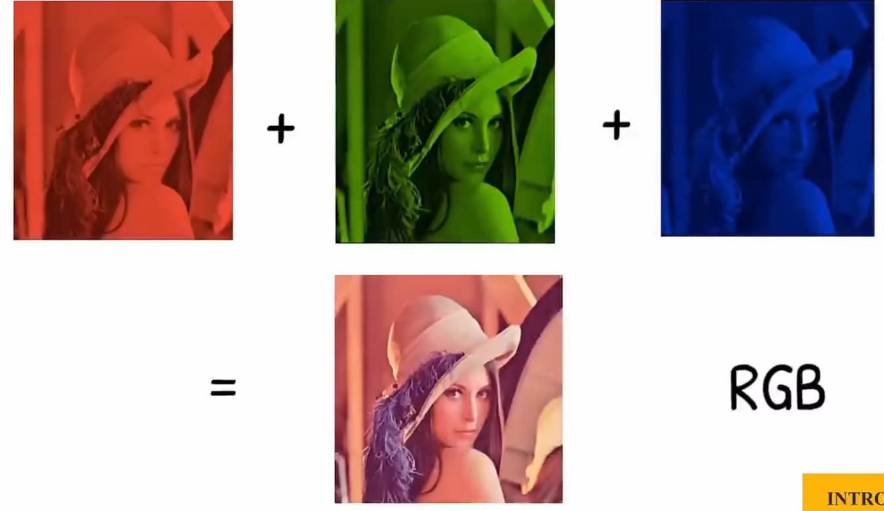

# 图像的组成

图像由通道组成，每个通道由像素组成：

- VGA = 640 * 480
- HD = 1280 * 720
- FHD = 1920 * 1080
- 4K = 3840 * 2160

> 一个像素通道、	的像素规模数。

# 黑白图片（二值图片）

每个像素点，仅为0 / 1

# 灰度图像

仅有一个通道，每个像素点有取值范围。（如8位的灰度图）

# 彩色图像

一个彩色图像，由三张灰度图像组成，它们分别代表了红色、绿色、蓝色的强度。

