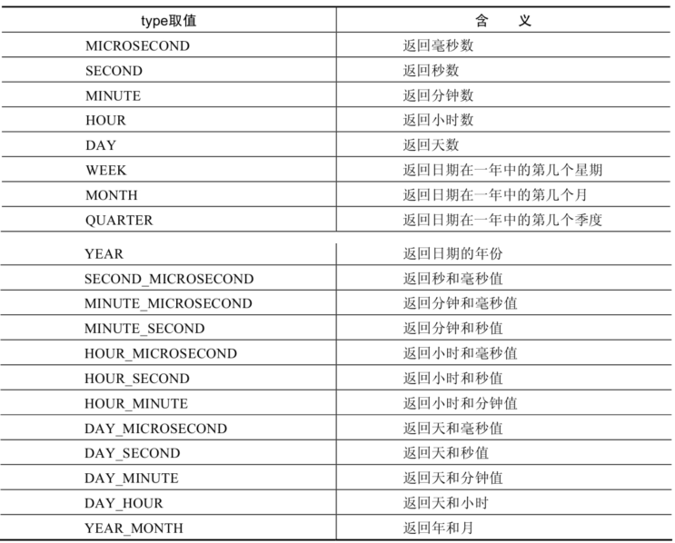
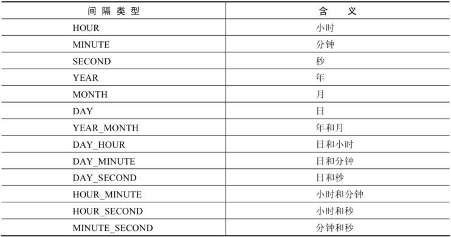
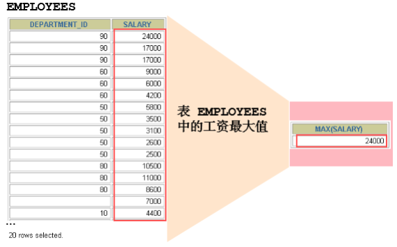
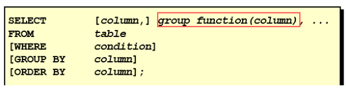
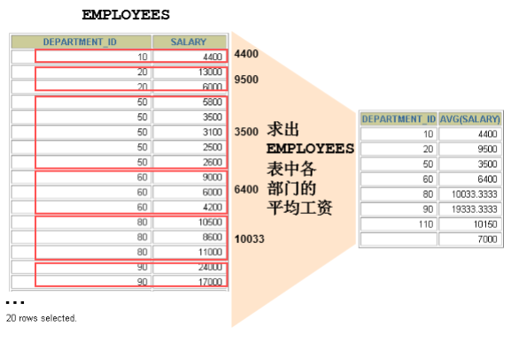
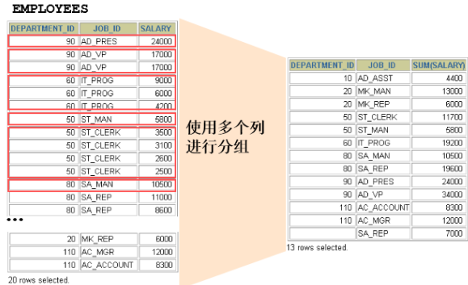
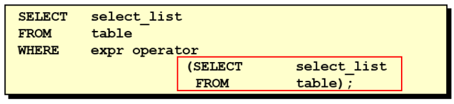
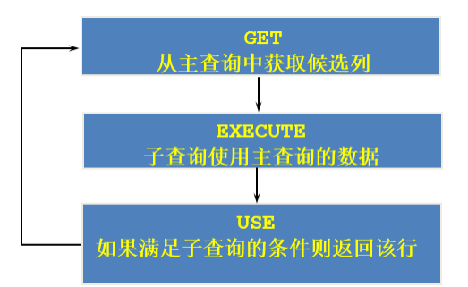
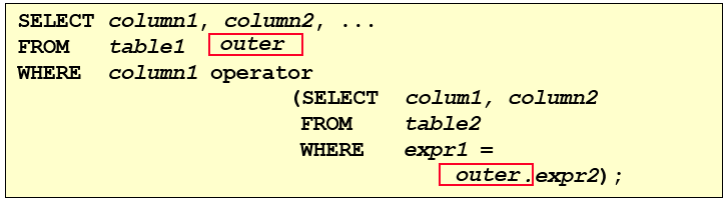

# 内容

- 基本的SELECT
- 运算符
- 排序与分页
- 多表查询
- 单行函数
- 聚合函数
- 子查询


# 数据导入指令source

```sh
mysql> source d:\mysqldb.sql
```


> 准备的数据：atguigudb.sql


# Select语句

## 语法

```sql
SELECT 标识选择哪些列
FROM 标识从哪个表中选择
```


## 列的重名

语法：

- 使用`AS`关键字，别名可以使用双引号（从而可以在别名中包含空格或特殊字符）
- AS关键字可省略，但不推荐


```sql
SELECT last_name AS name, commission_pct comm
FROM employees;
```


## 去除重复行 DISTINCT

```sql
SELECT DISTINCT department_id,salary
FROM employees;
```


注意：

- DISTINCT，是对被查询所有字段的组合、而言的去重


## NULL参与运算

- 所有与NULL进行的运算，结果都为NULL

```sql
SELECT employee_id,salary,commission_pct,
12 * salary * (1 + commission_pct) "annual_sal"
FROM employees;
```


# 运算符

[MySQL数据库教程天花板，mysql安装到mysql高级，强！硬！_哔哩哔哩_bilibili](https://www.bilibili.com/video/BV1iq4y1u7vj?p=18&vd_source=be746efb77e979ca275e4f65f2d8cda3)


## 算术运算符

算术运算符主要用于数学运算，其可以连接运算符前后的两个数值或表达式，对数值或表达式进行加（+）、减（-）、乘（*）、除（/）和取模（%）运算。  


```sql
mysql> SELECT 100, 100 + 0, 100 - 0, 100 + 50, 100 + 50 -30, 100 + 35.5, 100 - 35.5
FROM dual;
   100  100 + 0  100 - 0  100 + 50  100 + 50 -30  100 + 35.5  100 - 35.5  
------  -------  -------  --------  ------------  ----------  ------------
   100      100      100       150           120       135.5          64.5
```

> 非数字类型与数字类型进行数学运算时：
>
> - 先尝试转换为数值；若转换失败则按0算

；

## 比较运算符

比较运算符用来对表达式左边的操作数和右边的操作数进行比较，比较的结果为真则返回1，比较的结果为假则返回0，其他情况则返回NULL。  


## 逻辑运算符


## 位运算符


# 排序

## 排序规则

使用`ORDER BY`字句排序：

- ASC（ascend）：升序
- DESC（descend）：降序


## 单列排序

```sql
SELECT last_name, job_id, department_id, hire_date
FROM employees
ORDER BY hire_date ;
```


## 多列排序

```sql
SELECT last_name, department_id, salary
FROM employees
ORDER BY department_id, salary DESC;
```


# 分页

## 语法

- 使用`LIMIT`关键字：

  ```sql
  LIMIT [位置偏移量,] 行数
  ```


```sql
--前10条记录：
SELECT * FROM 表名 LIMIT 0,10;
或者
SELECT * FROM 表名 LIMIT 10;

--第11至20条记录：
SELECT * FROM 表名 LIMIT 10,10;

--第21至30条记录：
SELECT * FROM 表名 LIMIT 20,10;
```

>分页显式公式：（当前页数-1）*每页条数，每页条数
>
>```sql
>SELECT * FROM table
>LIMIT(PageNo - 1)*PageSize,PageSize;
>```


# 多表查询

- 多表查询，也称为关联查询，指两个或更多个表一起完成查询操作。

- 前提条件：这些一起查询的表之间是有关系的（一对一、一对多），它们之间一定是有关联字段，这个关联字段可能建立了外键，也可能没有建立外键。

  比如：员工表和部门表，这两个表依靠“部门编号”进行关联。  


## 一个案例引发的多表连接

### 案例说明


需求：查询员工所在的部门名：

```sql
SELECT last_name, department_name
FROM employees, departments
WHERE employees.department_id = departments.department_id;
```


### 笛卡尔积（或交叉连接）

- 笛卡尔乘积是一个数学运算。

- 假设我有两个集合 X 和 Y，那么 X 和 Y 的笛卡尔积就是 X 和 Y 的所有可能组合，也就是第一个对象来自于 X，第二个对象来自于 Y 的所有可能。
- 组合的个数即为两个集合中元素个数的乘积数。


- SQL92中，笛卡尔积也称为 交叉连接 ，英文是 CROSS JOIN 。
- 在 SQL99 中也是使用 CROSS JOIN表示交叉连接。

它的作用就是可以把任意表进行连接，即使这两张表不相关。


## 内连接 vs 外连接

- 内连接：

  合并具有同一列的两个以上的表的行, 结果集中不包含一个表与另一个表不匹配的行

- 外连接：

  两个表在连接过程中除了返回满足连接条件的行以外还返回左（或右）表中不满足条件的行 ，这种连接称为左（或右） 外连接。没有匹配的行时, 结果表中相应的列为空(NULL)  

  - 如果是左外连接，则连接条件中左边的表也称为 主表 ，右边的表称为 从表
  - 如果是右外连接，则连接条件中右边的表也称为 主表 ，左边的表称为 从表 


## SQL99实现多表查询

使用JOIN...ON子句创建连接的语法结构：

```sql
SELECT table1.column, table2.column,table3.column
FROM table1
	JOIN table2 ON table1 和 table2 的连接条件
		JOIN table3 ON table2 和 table3 的连接条件
```


语法说明：

- 可以使用 ON 子句指定连接条件。
- ON 子句使语句具有更高的易读性。
- 关键字 `JOIN`、`INNER JOIN`、`CROSS JOIN` 的含义是一样的，都表示**`内连接`**


### SQL99下的内连接

```sql
SELECT 字段列表
FROM A表 INNER JOIN B表
ON 关联条件
WHERE 等其他子句;
```


### SQL99下的外连接

- 左外连接：

  ```sql
  SELECT 字段列表
  FROM A表 LEFT JOIN B表
  ON 关联条件
  WHERE 等其他子句;
  ```

- 右外连接：

  ```sql
  FROM A表 RIGHT JOIN B表
  ON 关联条件
  WHERE 等其他子句;
  ```

  

### 满外连接

- 满外连接的结果 = 左右表匹配的数据 + 左表没有匹配到的数据 + 右表没有匹配到的数据。
- SQL99是支持满外连接的。使用FULL JOIN 或 FULL OUTER JOIN来实现。
- 需要注意的是，MySQL不支持FULL JOIN，但是可以用`LEFT JOIN UNION RIGHT join`代替。


## UNION关键字

- 作用：

  利用UNION关键字，可以给出多条SELECT语句，并将它们的结果组合成单个结果集。合并时，两个表对应的列数和数据类型必须相同，并且相互对应。各个SELECT语句之间使用UNION或UNION ALL关键字分隔。  

- 语法格式：

  ```sql
  SELECT column,... FROM table1
  UNION [ALL]
  SELECT column,... FROM table2
  ```


- UNION操作符：

  UNION 操作符返回两个查询的结果集的并集，**去除重复记录**。

- UNION ALL操作符：

  UNION ALL操作符返回两个查询的结果集的并集。对于两个结果集的重复部分，不去重。

  >注意：执行UNION ALL语句时所需要的资源比UNION语句少。
  >
  >如果明确知道合并数据后的结果数据不存在重复数据，或者不需要去除重复的数据，则尽量使用UNION ALL语句，以提高数据查询的效率。  


例如：查询部门编号>90或邮箱包含a的员工信息：

```sql
#方式1
SELECT * FROM employees WHERE email LIKE '%a%' OR department_id>90;
```

```sql
SELECT * FROM employees WHERE email LIKE '%a%'
UNION
SELECT * FROM employees WHERE department_id>90;
```


## 7种SQL JOINS及其实现


```sql
#中图：内连接 A∩B
SELECT employee_id,last_name,department_name
FROM employees e JOIN departments d
ON e.`department_id` = d.`department_id`;
```

```sql
#左上图：左外连接
SELECT employee_id,last_name,department_name
FROM employees e LEFT JOIN departments d
ON e.`department_id` = d.`department_id`;
```

```sql
#右上图：右外连接
SELECT employee_id,last_name,department_name
FROM employees e RIGHT JOIN departments d
ON e.`department_id` = d.`department_id`;
```

```sql
#左中图：A - A∩B
SELECT employee_id,last_name,department_name
FROM employees e LEFT JOIN departments d
ON e.`department_id` = d.`department_id`
WHERE d.`department_id` IS NULL
```

```sql
#右中图：B-A∩B
SELECT employee_id,last_name,department_name
FROM employees e RIGHT JOIN departments d
ON e.`department_id` = d.`department_id`
WHERE e.`department_id` IS NULL
```

```sql
# 左下图：满外连接
# 左中图 + 右上图 A∪B
SELECT employee_id,last_name,department_name
FROM employees e LEFT JOIN departments d
ON e.`department_id` = d.`department_id`
WHERE d.`department_id` IS NULL
UNION ALL #没有去重操作，效率高
SELECT employee_id,last_name,department_name
FROM employees e RIGHT JOIN departments d
ON e.`department_id` = d.`department_id`;
```

```sql
#右下图
#左中图 + 右中图 A ∪B- A∩B 或者 (A - A∩B) ∪ （B - A∩B）
SELECT employee_id,last_name,department_name
FROM employees e LEFT JOIN departments d
ON e.`department_id` = d.`department_id`
WHERE d.`department_id` IS NULL
UNION ALL
SELECT employee_id,last_name,department_name
FROM employees e RIGHT JOIN departments d
ON e.`department_id` = d.`department_id`
WHERE e.`department_id` IS NULL
```


## SQL99语法新特性

### 自然连接

- NATURAL JOIN 用来表示自然连接。

  可以把自然连接理解为 SQL92 中的等值连接。

  它会帮你自动查询两张连接表中 所有相同的字段 ，然后进行等值连接 。


例如：

- 在SQL92标准中：

  ```sql
  SELECT employee_id,last_name,department_name
  FROM employees e JOIN departments d
  ON e.`department_id` = d.`department_id`
  AND e.`manager_id` = d.`manager_id`;
  ```

- 在 SQL99 中你可以写成：

  ```sql
  SELECT employee_id,last_name,department_name
  FROM employees e NATURAL JOIN departments d;
  ```

  

### USING连接

当我们进行连接的时候，SQL99还支持使用 USING 指定数据表里的 同名字段 进行等值连接。但是只能配合JOIN一起使用。


比如 ：

- SQL92：

  ```sql
  SELECT employee_id,last_name,department_name
  FROM employees e ,departments d
  WHERE e.department_id = d.department_id;
  ```

- 相同结果的SQL99写法：

  ```sql
  SELECT employee_id,last_name,department_name
  FROM employees e JOIN departments d
  USING (department_id);
  ```


## 表连接约束条件总结

表连接的约束条件可以有三种方式：WHERE, ON, USING

- WHERE：适用于所有关联查询

- ON ：只能和JOIN一起使用，只能写关联条件

  > 虽然关联条件可以并到WHERE中和其他条件一起写，但分开写可读性更好

- USING：只能和JOIN一起使用，而且要求两个关联字段在关联表中名称一致，而且只能表示关联字段值相等  

```sql
#关联条件
#把关联条件写在where后面
SELECT last_name,department_name
FROM employees,departments
WHERE employees.department_id = departments.department_id;

#把关联条件写在on后面，只能和JOIN一起使用
SELECT last_name,department_name
FROM employees INNER JOIN departments
ON employees.department_id = departments.department_id;

SELECT last_name,department_name
FROM employees CROSS JOIN departments
ON employees.department_id = departments.department_id;

SELECT last_name,department_name
FROM employees JOIN departments
ON employees.department_id = departments.department_id;

#把关联字段写在using()中，只能和JOIN一起使用
#而且两个表中的关联字段必须名称相同，而且只能表示=
#查询员工姓名与基本工资
SELECT last_name,job_title
FROM employees INNER JOIN jobs USING(job_id);

#n张表关联，需要n-1个关联条件
#查询员工姓名，基本工资，部门名称
SELECT last_name,job_title,department_name FROM employees,departments,jobs
WHERE employees.department_id = departments.department_id
AND employees.job_id = jobs.job_id;

SELECT last_name,job_title,department_name
FROM employees INNER JOIN departments INNER JOIN jobs
ON employees.department_id = departments.department_id
AND employees.job_id = jobs.job_id;
```


# 函数

## MySQL的函数

MySQL的函数，分为：

- 内置函数

  从实现的功能角度，可分为：

  - 数值函数
  - 字符串函数
  - 日期和时间函数
  - 流程控制函数
  - 加密与解密函数
  - 获取MySQL信息函数
  - 聚合函数等

  也可以分为：

  - 单行函数
  - 聚合函数（或分组函数）

- 自定义函数

> 在不同的DBMS中，函数的**可移植性**是**很差**的。


## 单行函数

单行函数的特点：

- 操作数据对象
- 接收参数并返回一个结果
- <span style="color:#A20000">只对一行进行变换，且每行返回一个结果</span>
- 可以嵌套
- 参数可以是 一列 或 一个值


### 数值函数

| 函数                 | 用法                                                         |
| -------------------- | ------------------------------------------------------------ |
| ABS(x)               | 返回x的绝对值                                                |
| SIGN(X)              | 返回X的符号。正数返回1，负数返回-1，0返回0                   |
| PI()                 | 返回圆周率的值                                               |
| CEIL(x)，CEILING(x)  | 返回大于或等于某个值的最小整数                               |
| FLOOR(x)             | 返回小于或等于某个值的最大整数                               |
| LEAST(e1,e2,e3…)     | 返回列表中的最小值                                           |
| GREATEST(e1,e2,e3…)  | 返回列表中的最大值                                           |
| MOD(x,y)             | 返回X除以Y后的余数                                           |
| RAND()               | 返回0~1的随机值                                              |
| RAND(x)              | 返回0~1的随机值，其中x的值用作种子值，相同的X值会产生相同的随机 数 |
| ROUND(x)             | 返回一个对x的值进行四舍五入后，最接近于X的整数               |
| ROUND(x,y)           | 返回一个对x的值进行四舍五入后最接近X的值，并保留到小数点后面Y位 |
| TRUNCATE(x,y)        | 返回数字x截断为y位小数的结果                                 |
| SQRT(x)              | 返回x的平方根。当X的值为负数时，返回NULL                     |
| POW(x,y)，POWER(X,Y) | 返回x的y次方                                                 |
| EXP(X)               | 返回e的X次方，其中e是一个常数，2.718281828459045             |
| LN(X)，LOG(X)        | 返回以e为底的X的对数，当X <= 0 时，返回的结果为NULL          |
| LOG10(X)             | 返回以10为底的X的对数，当X <= 0 时，返回的结果为NULL         |
| LOG2(X)              | 返回以2为底的X的对数，当X <= 0 时，返回NULL                  |


例如：

```sql
SELECT
ABS(-123),ABS(32),SIGN(-23),SIGN(43),PI(),CEIL(32.32),CEILING(-43.23),FLOOR(32.32),
FLOOR(-43.23),MOD(12,5)
FROM DUAL;
```


### 三角函数

| 函数       | 用法                                                         |
| ---------- | ------------------------------------------------------------ |
| RADIANS(x) | 将角度转化为弧度，其中，参数x为角度                          |
| DEGREES(x) | 将弧度转化为角度，其中，参数x为弧度值                        |
| SIN(x)     | 返回x的正弦值，其中，参数x为弧度值                           |
| ASIN(x)    | 返回x的反正弦值，即获取正弦为x的值。如果x的值不在-1到1之间，则返回NULL |
| COS(x)     | 返回x的余弦值，其中，参数x为弧度值                           |
| ACOS(x)    | 返回x的反余弦值，即获取余弦为x的值。如果x的值不在-1到1之间，则返回NULL |
| TAN(x)     | 返回x的正切值，其中，参数x为弧度值                           |
| ATAN(x)    | 返回x的反正切值，即返回正切值为x的值                         |
| ATAN2(m,n) | 返回两个参数的反正切值                                       |
| COT(x)     | 返回x的余切值，其中，X为弧度值                               |

```sql
SELECT RADIANS(30),RADIANS(60),RADIANS(90),DEGREES(2*PI()),DEGREES(RADIANS(90))
FROM DUAL;
```

```sql
SELECT
SIN(RADIANS(30)),DEGREES(ASIN(1)),TAN(RADIANS(45)),DEGREES(ATAN(1)),DEGREES(ATAN2(1,1)) 
FROM DUAL;
```


### 进制间的转换

| 函数          | 用法                     |
| ------------- | ------------------------ |
| BIN(x)        | 返回x的二进制编码        |
| HEX(x)        | 返回x的十六进制编码      |
| OCT(x)        | 返回x的八进制编码        |
| CONV(x,f1,f2) | 返回f1进制数变成f2进制数 |

```sql
SELECT BIN(10),HEX(10),OCT(10),CONV(10,2,8)
FROM DUAL;
```


### 字符串函数

| 函数                              | 用法                                                         |
| --------------------------------- | ------------------------------------------------------------ |
| ASCII(S)                          | 返回字符串S中的第一个字符的ASCII码值                         |
| CHAR_LENGTH(s)                    | 返回字符串s的字符数。作用与CHARACTER_LENGTH(s)相同           |
| LENGTH(s)                         | 返回字符串s的字节数，和字符集有关                            |
| CONCAT(s1,s2,......,sn)           | 连接s1,s2,......,sn为一个字符串                              |
| CONCAT_WS(x, s1,s2,......,sn)     | 同CONCAT(s1,s2,...)函数，但是每个字符串之间要加上x           |
| INSERT(str, idx, len, replacestr) | 将字符串str从第idx位置开始，len个字符长的子串替换为字符串replacestr |
| REPLACE(str, a, b)                | 用字符串b替换字符串str中所有出现的字符串a                    |
| UPPER(s) 或 UCASE(s)              | 将字符串s的所有字母转成大写字母                              |
| LOWER(s) 或LCASE(s)               | 将字符串s的所有字母转成小写字母                              |
| LEFT(str,n)                       | 返回字符串str最左边的n个字符                                 |
| RIGHT(str,n)                      | 返回字符串str最右边的n个字符                                 |
| LPAD(str, len, pad)               | 用字符串pad对str最左边进行填充，直到str的长度为len个字符     |
| RPAD(str ,len, pad)               | 用字符串pad对str最右边进行填充，直到str的长度为len个字符     |
| LTRIM(s)                          | 去掉字符串s左侧的空格                                        |
| RTRIM(s)                          | 去掉字符串s右侧的空格                                        |
| TRIM(s)                           | 去掉字符串s开始与结尾的空格                                  |
| TRIM(s1 FROM s)                   | 去掉字符串s开始与结尾的s1                                    |
| TRIM(LEADING s1 FROM s)           | 去掉字符串s开始处的s1                                        |
| TRIM(TRAILING s1 FROM s)          | 去掉字符串s结尾处的s1                                        |
| REPEAT(str, n)                    | 返回str重复n次的结果                                         |
| SPACE(n)                          | 返回n个空格                                                  |
| STRCMP(s1,s2)                     | 比较字符串s1,s2的ASCII码值的大小                             |
| SUBSTR(s,index,len)               | 返回从字符串s的index位置其len个字符，作用与SUBSTRING(s,n,len)、 MID(s,n,len)相同 |
| LOCATE(substr,str)                | 返回字符串substr在字符串str中首次出现的位置，作用于POSITION(substr IN str)、INSTR(str,substr)相同。未找到，返回0 |
| ELT(m,s1,s2,…,sn)                 | 返回指定位置的字符串，如果m=1，则返回s1，如果m=2，则返回s2，如 果m=n，则返回sn |
| FIELD(s,s1,s2,…,sn)               | 返回字符串s在字符串列表中第一次出现的位置                    |
| FIND_IN_SET(s1,s2)                | 返回字符串s1在字符串s2中出现的位置。其中，字符串s2是一个以逗号分 隔的字符串 |
| REVERSE(s)                        | 返回s反转后的字符串                                          |
| NULLIF(value1,value2)             | 比较两个字符串，如果value1与value2相等，则返回NULL，否则返回 value1 |

>注意：MySQL中，字符串的位置是从1开始的。


```sql
mysql> SELECT FIELD('mm','hello','msm','amma'),FIND_IN_SET('mm','hello,mm,amma')
    -> FROM DUAL;
+----------------------------------+-----------------------------------+
| FIELD('mm','hello','msm','amma') | FIND_IN_SET('mm','hello,mm,amma') |
+----------------------------------+-----------------------------------+
|                                0 |                                 2 |
+----------------------------------+-----------------------------------+
1 row in set (0.00 sec)
```


### 日期和时间函数

- 获取日期、时间

  | 函数                                                         | 用法                            |
  | ------------------------------------------------------------ | ------------------------------- |
  | `CURDATE() `，CURRENT_DATE()                                 | 返回当前日期，只包含年、 月、日 |
  | `CURTIME() `， CURRENT_TIME()                                | 返回当前时间，只包含时、 分、秒 |
  | `NOW()`/ SYSDATE() / CURRENT_TIMESTAMP() / LOCALTIME() / LOCALTIMESTAMP() | 返回当前系统日期和时间          |
  | UTC_DATE()                                                   | 返回UTC（世界标准时间） 日期    |
  | UTC_TIME()                                                   | 返回UTC（世界标准时间） 时间    |

- 日期与时间戳的转换：

  | 函数                     | 用法                                                         |
  | ------------------------ | ------------------------------------------------------------ |
  | UNIX_TIMESTAMP()         | 以UNIX时间戳的形式返回当前时间。SELECT UNIX_TIMESTAMP() - >1634348884 |
  | UNIX_TIMESTAMP(date)     | 将时间date以UNIX时间戳的形式返回。                           |
  | FROM_UNIXTIME(timestamp) | 将UNIX时间戳的时间转换为普通格式的时间                       |

- 获取月份、星期、星期数、天数等：

  | 函数                                     | 用法                                             |
  | ---------------------------------------- | ------------------------------------------------ |
  | YEAR(date) / MONTH(date) / DAY(date)     | 返回具体的日期值                                 |
  | HOUR(time) / MINUTE(time) / SECOND(time) | 返回具体的时间值                                 |
  | MONTHNAME(date)                          | 返回月份：January，...                           |
  | DAYNAME(date)                            | 返回星期几：MONDAY，TUESDAY.....SUNDAY           |
  | WEEKDAY(date)                            | 返回周几，注意，周1是0，周2是1，。。。周日是6    |
  | QUARTER(date)                            | 返回日期对应的季度，范围为1～4                   |
  | WEEK(date) ， WEEKOFYEAR(date)           | 返回一年中的第几周                               |
  | DAYOFYEAR(date)                          | 返回日期是一年中的第几天                         |
  | DAYOFMONTH(date)                         | 返回日期位于所在月份的第几天                     |
  | DAYOFWEEK(date)                          | 返回周几，注意：周日是1，周一是2，。。。周六是 7 |
  | EXTRACT(type FROM date)                  | 返回指定日期中特定的部分，type指定返回的值       |

  EXTRACT(type FROM date)函数中type的取值与含义：

  

  ```sql
  SELECT EXTRACT(MINUTE FROM NOW()),EXTRACT( WEEK FROM NOW()),
  EXTRACT( QUARTER FROM NOW()),EXTRACT( MINUTE_SECOND FROM NOW())
  FROM DUAL;
  ```

- 时间和秒钟转换的函数：

  | 函数                 | 用法                                                         |
  | -------------------- | ------------------------------------------------------------ |
  | TIME_TO_SEC(time)    | 将 time 转化为秒并返回结果值。转化的公式为： 小时*3600+分钟 *60+秒 |
  | SEC_TO_TIME(seconds) | 将 seconds 描述转化为包含小时、分钟和秒的时间                |

- 日期加减计算：

  | 函数                                                         | 用法                                            |
  | ------------------------------------------------------------ | ----------------------------------------------- |
  | DATE_ADD(datetime, INTERVAL expr type)， ADDDATE(date,INTERVAL expr type) | 返回与给定日期时间相差INTERVAL时 间段的日期时间 |
  | DATE_SUB(date,INTERVAL expr type)， SUBDATE(date,INTERVAL expr type) | 返回与date相差INTERVAL时间间隔的 日期           |

  上述函数中type的取值：

  

  ```sql
  SELECT DATE_SUB('2021-01-21',INTERVAL 31 DAY) AS col1,
  SUBDATE('2021-01-21',INTERVAL 31 DAY) AS col2,
  DATE_SUB('2021-01-21 02:01:01',INTERVAL '1 1' DAY_HOUR) AS col3
  FROM DUAL;
  ```

  | 函数                         | 用法                                                         |
  | ---------------------------- | ------------------------------------------------------------ |
  | ADDTIME(time1,time2)         | 返回time1加上time2的时间。当time2为一个数字时，代表的是 秒 ，可以为负数 |
  | SUBTIME(time1,time2)         | 返回time1减去time2后的时间。当time2为一个数字时，代表的 是 秒 ，可以为负数 |
  | DATEDIFF(date1,date2)        | 返回date1 - date2的日期间隔天数                              |
  | TIMEDIFF(time1, time2)       | 返回time1 - time2的时间间隔                                  |
  | FROM_DAYS(N)                 | 返回从0000年1月1日起，N天以后的日期                          |
  | TO_DAYS(date)                | 返回日期date距离0000年1月1日的天数                           |
  | LAST_DAY(date)               | 返回date所在月份的最后一天的日期                             |
  | MAKEDATE(year,n)             | 针对给定年份与所在年份中的天数返回一个日期                   |
  | MAKETIME(hour,minute,second) | 将给定的小时、分钟和秒组合成时间并返回                       |
  | PERIOD_ADD(time,n)           | 返回time加上n后的时间                                        |

- 日期的格式化与解析：

  | 函数                              | 用法                                       |
  | --------------------------------- | ------------------------------------------ |
  | DATE_FORMAT(date,fmt)             | 按照字符串fmt格式化日期date值              |
  | TIME_FORMAT(time,fmt)             | 按照字符串fmt格式化时间time值              |
  | GET_FORMAT(date_type,format_type) | 返回日期字符串的显示格式                   |
  | STR_TO_DATE(str, fmt)             | 按照字符串fmt对str进行解析，解析为一个日期 |

  fmt参数常用的格式符：  

  | 格 式 符 | 说明                                                         | 格式 符 | 说明                                                         |
  | -------- | ------------------------------------------------------------ | ------- | ------------------------------------------------------------ |
  | %Y       | 4位数字表示年份                                              | %y      | 表示两位数字表示年份                                         |
  | %M       | 月名表示月份（January,....）                                 | %m      | 两位数字表示月份 （01,02,03。。。）                          |
  | %b       | 缩写的月名（Jan.，Feb.，....）                               | %c      | 数字表示月份（1,2,3,...）                                    |
  | %D       | 英文后缀表示月中的天数 （1st,2nd,3rd,...）                   | %d      | 两位数字表示月中的天数(01,02...)                             |
  | %e       | 数字形式表示月中的天数 （1,2,3,4,5.....）                    |         |                                                              |
  | %H       | 两位数字表示小数，24小时制 （01,02..）                       | %h 和%I | 两位数字表示小时，12小时制 （01,02..）                       |
  | %k       | 数字形式的小时，24小时制(1,2,3)                              | %l      | 数字形式表示小时，12小时制 （1,2,3,4....）                   |
  | %i       | 两位数字表示分钟（00,01,02）                                 | %S 和%s | 两位数字表示秒(00,01,02...)                                  |
  | %W       | 一周中的星期名称（Sunday...）                                | %a      | 一周中的星期缩写（Sun.， Mon.,Tues.，..）                    |
  | %w       | 以数字表示周中的天数 (0=Sunday,1=Monday....)                 |         |                                                              |
  | %j       | 以3位数字表示年中的天数(001,002...)                          | %U      | 以数字表示年中的第几周， （1,2,3。。）其中Sunday为周中第一 天 |
  | %u       | 以数字表示年中的第几周， （1,2,3。。）其中Monday为周中第一 天 |         |                                                              |
  | %T       | 24小时制                                                     | %r      | 12小时制                                                     |
  | %p       | AM或PM                                                       | %%      | 表示%                                                        |

  GET_FORMAT函数中date_type和format_type参数取值如下：

  | **Function Call**               | **Result**                                |
  | :------------------------------ | :---------------------------------------- |
  | GET_FORMAT(DATE,'USA')          | '%m.%d.%Y'                                |
  | GET_FORMAT(DATE,'JIS')          | '%Y-%m-%d'                                |
  | GET_FORMAT(DATE,'ISO')          | '%Y-%m-%d'                                |
  | GET_FORMAT(DATE,'EUR')          | '%d.%m.%Y'                                |
  | GET_FORMAT(DATE,'INTERNAL')     | '%Y%m%d'                                  |
  | GET_FORMAT(DATETIME,'USA')      | '%Y-%m-%d %H.%i.%s'                       |
  | GET_FORMAT(DATETIME,'JIS')      | '%Y-%m-%d %H:%i:%s'                       |
  | GET_FORMAT(DATETIME,'ISO')      | '%Y-%m-%d %H:%i:%s'                       |
  | GET_FORMAT(DATETIME,'EUR')      | '%Y-%m-%d %H.%i.%s'                       |
  | GET_FORMAT(DATETIME,'INTERNAL') | '%Y%m%d%H%i%s'                            |
  | GET_FORMAT(TIME,'USA')          | '%h:%i:%s %p'                             |
  | GET_FORMAT(TIME,'JIS')          | '%H:%i:%s'                                |
  | GET_FORMAT(TIME,'ISO')          | '%H:%i:%s'                                |
  | GET_FORMAT(TIME,'EUR')          | '%H.%i.%s'                                |
  | HOUR_MINUTE                     | 'HOURS:MINUTES'                           |
  | DAY_MICROSECOND                 | 'DAYS HOURS:MINUTES:SECONDS.MICROSECONDS' |
  | DAY_SECOND                      | 'DAYS HOURS:MINUTES:SECONDS'              |
  | DAY_MINUTE                      | 'DAYS HOURS:MINUTES'                      |
  | DAY_HOUR                        | 'DAYS HOURS'                              |
  | YEAR_MONTH                      | 'YEARS-MONTHS'                            |

  ```sql
  SELECT STR_TO_DATE('09/01/2009','%m/%d/%Y')
  FROM DUAL;
  SELECT STR_TO_DATE('20140422154706','%Y%m%d%H%i%s')
  FROM DUAL;
  SELECT STR_TO_DATE('2014-04-22 15:47:06','%Y-%m-%d %H:%i:%s')
  FROM DUAL;
  ```

### 流程控制函数

流程处理函数可以根据不同的条件，执行不同的处理流程，可以在SQL语句中实现不同的条件选择。MySQL中的流程处理函数主要包括IF()、IFNULL()和CASE()函数  

| 函数                                                         | 用法                                             |
| ------------------------------------------------------------ | ------------------------------------------------ |
| IF(value,value1,value2)                                      | 如果value的值为TRUE，返回value1， 否则返回value2 |
| IFNULL(value1, value2)                                       | 如果value1不为NULL，返回value1，否 则返回value2  |
| CASE WHEN 条件1 THEN 结果1 WHEN 条件2 THEN 结果2 .... [ELSE resultn] END | 相当于Java的if...else if...else...               |
| CASE expr WHEN 常量值1 THEN 值1 WHEN 常量值1 THEN 值1 .... [ELSE 值n] END | 相当于Java的switch...case...                     |


```sql
SELECT IF(1 > 0,'正确','错误')
->正确
```

```sql
SELECT CASE
WHEN 1 > 0
THEN '1 > 0'
WHEN 2 > 0
THEN '2 > 0'
ELSE '3 > 0'
END
->1 > 0
```


### 加密与解密函数

加密与解密函数主要用于对数据库中的数据进行加密和解密处理，以防止数据被他人窃取。


| 函数                        | 用法                                                         |
| --------------------------- | ------------------------------------------------------------ |
| PASSWORD(str)               | 返回字符串str的加密版本，41位长的字符串。加密结果 不可逆 ，常用于用户的密码加密 |
| MD5(str)                    | 返回字符串str的md5加密后的值，也是一种加密方式。若参数为 NULL，则会返回NULL |
| SHA(str)                    | 从原明文密码str计算并返回加密后的密码字符串，当参数为 NULL时，返回NULL。 SHA加密算法比MD5更加安全 。 |
| ENCODE(value,password_seed) | 返回使用password_seed作为加密密码加密value                   |
| DECODE(value,password_seed) | 返回使用password_seed作为加密密码解密value                   |

>可以看到，ENCODE(value,password_seed)函数与DECODE(value,password_seed)函数互为反函数。


### MySQL信息函数

MySQL中内置了一些可以查询MySQL信息的函数，这些函数主要用于帮助数据库开发或运维人员更好地对数据库进行维护工作。  

| 函数                                                   | 用法                                                      |
| ------------------------------------------------------ | --------------------------------------------------------- |
| VERSION()                                              | 返回当前MySQL的版本号                                     |
| CONNECTION_ID()                                        | 返回当前MySQL服务器的连接数                               |
| DATABASE()，SCHEMA()                                   | 返回MySQL命令行当前所在的数据库                           |
| USER()，CURRENT_USER()、SYSTEM_USER()， SESSION_USER() | 返回当前连接MySQL的用户名，返回结果格式为 “主机名@用户名” |
| CHARSET(value)                                         | 返回字符串value自变量的字符集                             |
| COLLATION(value)                                       | 返回字符串value的比较规则                                 |


```sql
mysql> SELECT CHARSET('ABC');
+----------------+
| CHARSET('ABC') |
+----------------+
| gbk            |
+----------------+
1 row in set (0.00 sec)
```

```sql
mysql> SELECT COLLATION('ABC');
+------------------+
| COLLATION('ABC') |
+------------------+
| gbk_chinese_ci   |
+------------------+
1 row in set (0.00 sec)
```


### 其他函数

| 函数                           | 用法                                                         |
| ------------------------------ | ------------------------------------------------------------ |
| FORMAT(value,n)                | 返回对数字value进行格式化后的结果数据。n表示 四舍五入 后保留 到小数点后n位 |
| CONV(value,from,to)            | 将value的值进行不同进制之间的转换                            |
| INET_ATON(ipvalue)             | 将以点分隔的IP地址转化为一个数字                             |
| INET_NTOA(value)               | 将数字形式的IP地址转化为以点分隔的IP地址                     |
| BENCHMARK(n,expr)              | 将表达式expr重复执行n次。用于测试MySQL处理expr表达式所耗费 的时间 |
| CONVERT(value USING char_code) | 将value所使用的字符编码修改为char_code                       |


## 聚合函数

### 什么是聚合函数

聚合函数作用于一组数据，并对一组数据返回一个值。




- 聚合函数语法：

  


### AVG和SUM函数

可以对**数值型数据**使用AVG 和 SUM 函数：

```sql
SELECT AVG(salary), MAX(salary),MIN(salary), SUM(salary)
FROM employees
WHERE job_id LIKE '%REP%';
```


### MIN和MAX函数

可以对任意数据类型的数据使用 MIN 和 MAX 函数。

```sql
SELECT MIN(hire_date), MAX(hire_date)
FROM employees;
```


### COUNT函数

- COUNT(*)返回表中记录总数，适用于任意数据类型

  ```sql
  SELECT COUNT(*)
  FROM employees
  WHERE department_id = 50;
  ```

- COUNT(expr) 返回expr不为空的记录总数

  ```sql
  SELECT COUNT(commission_pct)
  FROM employees
  WHERE department_id = 50;
  ```

> 即count(*)会统计值为 NULL 的行，而 count(列名)不会统计此列为 NULL 值的行。


> count(*)与count(1)等价，且优于count(列名)


### Group By关键字

可以使用GROUP BY子句将表中的数据分成若干组




语法：

```sql
SELECT column, group_function(column)
FROM table
[WHERE condition]
[GROUP BY group_by_expression]
[ORDER BY column];
```


**💡注意**，在SELECT列表中所有未包含在组函数中的列，都应该包含在 GROUP BY子句中：

```sql
SELECT department_id, AVG(salary)
FROM employees
GROUP BY department_id ;
```


使用多个列进行分组，例如：



```sql
SELECT department_id dept_id, job_id, SUM(salary)
FROM employees
GROUP BY department_id, job_id ;
```


GROUP BY中使用`WITH ROLLUP`：

使用 WITH ROLLUP 关键字之后，在所有查询出的分组记录之后增加一条**记录**，该记录计算查询出的所有记录的平均值，即统计记录数量。  

```sql
SELECT department_id,AVG(salary)
FROM employees
WHERE department_id > 80
GROUP BY department_id WITH ROLLUP;
```

> 注意：当使用ROLLUP时，不能同时使用ORDER BY子句进行结果排序，即ROLLUP和ORDER BY是互相排斥的。  


### HAVING子句

HAVING的要求：

- 行应被分组
- 使用了聚合函数
- 满足HAVING子句条件的分组将被显示，**起过滤作用**
- HAVING不能单独使用，必须和GROUP BY一起使用


例如：查询部门最高工资比10000高的部门

```sql
SELECT department_id, MAX(salary)
FROM employees
GROUP BY department_id
HAVING MAX(salary)>10000 ;
```


WHERE和HAVING的对比：

1. WHERE 可以直接使用表中的字段作为筛选条件，但不能使用分组中的计算函数作为筛选条件；
   HAVING 必须要与 GROUP BY 配合使用，可以把分组计算的函数和分组字段作为筛选条件。  
2. 如果需要通过连接从关联表中获取需要的数据，**WHERE 是先筛选后连接**，而 **HAVING 是先连接后筛选**。   

> 开发中的选择：
>
> 包含分组统计函数的条件用 HAVING，普通条件用 WHERE。  


# SELECT的执行过程

## 查询的结构

```sql
#方式1：
SELECT ...,....,...
FROM ...,...,....
WHERE 多表的连接条件
GROUP BY ...,...
HAVING 包含组函数的过滤条件
ORDER BY ... ASC/DESC
LIMIT ...,...

#方式2：
SELECT ...,....,...
FROM ... 
(LEFT/RIGHT)JOIN ...ON 多表的连接条件
(LEFT/RIGHT)JOIN ...ON ...
WHERE 不包含组函数的过滤条件
GROUP BY ...,...
HAVING 包含组函数的过滤条件
ORDER BY ... ASC/DESC
LIMIT ...,...

#其中：
#（1）from：从哪些表中筛选
#（2）on：关联多表查询时，去除笛卡尔积
#（3）where：从表中筛选的条件
#（4）group by：分组依据
#（5）having：在统计结果中再次筛选
#（6）order by：排序
#（7）limit：分页
```


## SQL的执行顺序

1. FROM：例如FROM a,b，将产生一虚拟表，此表为a和b的笛卡尔积
2. ON
3. LEFT/RIGHT JOIN
4. WHERE
5. GROUP BY
6. HAVING
7. SELECT的字段
8. DISTINCT
9. ORDER BY
10. LIMIT


## 执行原理

SELECT 是先执行 FROM 这一步的。在这个阶段，如果是多张表联查，还会经历下面的几个步骤：

1. 首先先通过 CROSS JOIN 求笛卡尔积，相当于得到虚拟表 vt（virtual table）1-1；  
2. 通过 ON 进行筛选，在虚拟表 vt1-1 的基础上进行筛选，得到虚拟表 vt1-2；  
3. 添加外部行。如果我们使用的是左连接、右连接或者全连接，就会涉及到外部行，也就是在虚拟表 vt1-2 的基础上增加外部行，得到虚拟表 vt1-3。  

>当然如果我们操作的是两张以上的表，还会重复上面的步骤，直到所有表都被处理完为止。这个过程得

4. 当我们拿到了查询数据表的原始数据，也就是最终的虚拟表 vt1 ，就可以在此基础上再进行 WHERE 阶段 。在这个阶段中，会根据 vt1 表的结果进行筛选过滤，得到虚拟表 vt2 。  

5. 然后进入第三步和第四步，也就是 GROUP 和 HAVING 阶段 。在这个阶段中，实际上是在虚拟表 vt2 的基础上进行分组和分组过滤，得到中间的虚拟表 vt3 和 vt4 。  

6. 当我们完成了条件筛选部分之后，就可以筛选表中提取的字段，也就是进入到 SELECT 和 DISTINCT阶段 。  

   首先在 SELECT 阶段会提取想要的字段，然后在 DISTINCT 阶段过滤掉重复的行，分别得到中间的虚拟表vt5-1 和 vt5-2 。  

7. 当我们提取了想要的字段数据之后，就可以按照指定的字段进行排序，也就是 ORDER BY 阶段 ，得到虚拟表 vt6

8. 最后在 vt6 的基础上，取出指定行的记录，也就是 LIMIT 阶段 ，得到最终的结果，对应的是虚拟表vt7 。  


# 子查询

- 子查询指一个查询语句嵌套在另一个查询语句内部的查询，这个特性从MySQL 4.1开始引入。
- SQL 中子查询的使用大大增强了 SELECT 查询的能力，因为很多时候查询需要从结果集中获取数据，或者需要从同一个表中先计算得出一个数据结果，然后与这个数据结果（**可能是某个标量，也可能是某个集合**）进行比较。  


## 需求分析与问题解决

实际问题：


解决方式：

```sql
#方式一：
SELECT salary
FROM employees
WHERE last_name = 'Abel';

SELECT last_name,salary
FROM employees
WHERE salary > 11000;

#方式二：自连接
SELECT e2.last_name,e2.salary
FROM employees e1,employees e2
WHERE e1.last_name = 'Abel'
AND e1.`salary` < e2.`salary`

#方式三：子查询
SELECT last_name,salary
FROM employees
WHERE salary > (
                    SELECT salary
                    FROM employees
                    WHERE last_name = 'Abel'
                );
```


## 子查询的语法




## 子查询的分类

按内查询的结果返回一条还是多条记录，将子查询分为：

- 单行子查询：子查询仅返回一条记录
- 多行子查询：子查询返回多条记录


按内查询是否被执行多次，将子查询划分为：

- 不相关(或非关联)子查询：

  子查询从数据表中查询了数据结果，如果这个数据结果只执行一次，然后这个数据结果作为主查询的条件进行执行，那么这样的子查询叫做不相关子查询。  

- 相关(或关联)子查询：

  如果子查询需要执行多次，即采用循环的方式，先从外部查询开始，**每次都传入子查询进行查询**，然后再将结果反馈给外部，这种嵌套的执行方式就称为相关子查询  


## 单行子查询

单行比较操作符：

| 操作符 | 含义                     |
| ------ | ------------------------ |
| =      | equal to                 |
| >      | greater than             |
| >=     | greater than or equal to |
| <      | less than                |
| <=     | less than or equal to    |
| <>     | not equal to             |


例如：查询工资大于149号员工工资的员工信息：
```sql
SELECT last_name
FROM employees
WHERE salary > (
	SELECT salary
    FROM employees
    WHERE employee_id = 149
);
```


> 同样的，也可以在`HAVING`子句和`CASE`中，进行子查询


## 多行子查询

- 也称为集合比较子查询

- 内查询返回的是多行记录

- 使用多行比较操作符：

  | 操作符 | 含义                                                     |
  | ------ | -------------------------------------------------------- |
  | IN     | 等于列表中的任意一个                                     |
  | ANY    | 需要和单行比较操作符一起使用，和子查询返回的某一个值比较 |
  | ALL    | 需要和单行比较操作符一起使用，和子查询返回的所有值比较   |
  | SOME   | 实际上是ANY的别名，作用相同，一般常使用ANY               |


示例：返回其它job_id中比job_id为‘IT_PROG’部门任一工资低的员工的员工号、姓名、job_id 以及salary  

```sql
SELECT employee_id, last_name, job_id, salary
FROM employees
WHERE salary < ANY
					(SELECT salary
                     FROM employees
                     WHERE job_id = 'IT_PROG')
	AND job_id <> 'IT_PROG';
```


## 相关子查询

如果子查询的执行依赖于外部查询，通常情况下都是因为**子查询中的表用到了外部的表**，并进行了条件关联，因此每执行一次外部查询，子查询都要重新计算一次，这样的子查询就称为 关联子查询  

相关子查询按照一行接一行的顺序执行，主查询的每一行都执行一次子查询。






示例：查询员工中工资大于本部门平均工资的员工的last_name,salary和其department_id  

```sql
SELECT last_name, salary, department_id
FROM employees outer
WHERE salary > (
	SELECT AVG(salary)
    FROM employees
    WHERE department_id = outer.department_id;
)
```


- 特别的，在FROM中使用子查询：

  子查询是作为from的一部分，子查询要用()引起来，并且要给这个子查询取别
  名， 把它当成一张“临时的虚拟的表”来使用。  

  ```sql
  SELECT last_name,salary,e1.department_id
  FROM employees e1,(SELECT department_id,AVG(salary) dept_avg_sal FROM employees GROUP
  BY department_id) e2
  WHERE e1.`department_id` = e2.department_id
  AND e2.dept_avg_sal < e1.`salary`;
  ```

  
