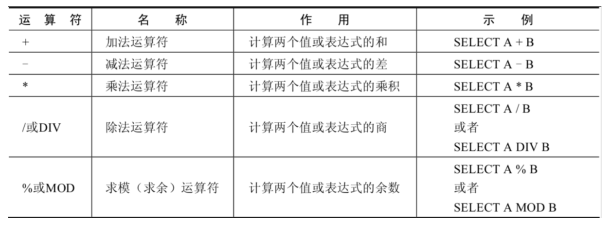
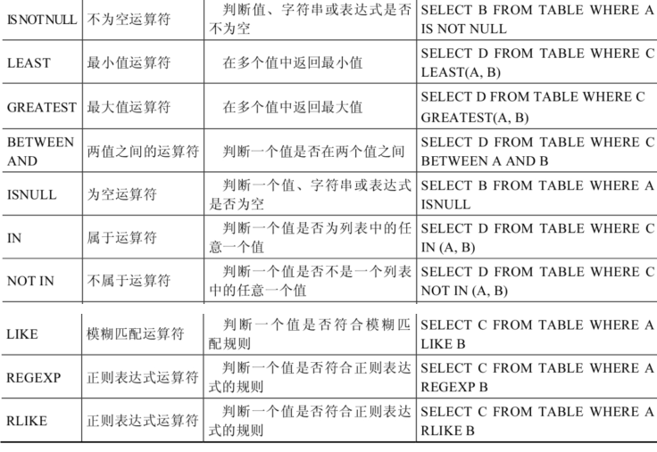
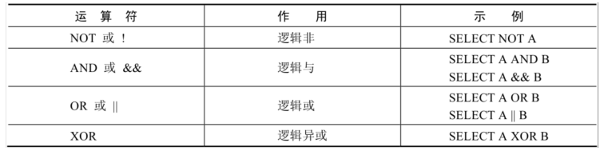
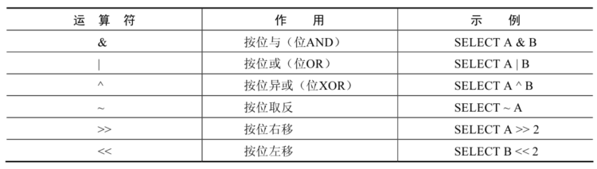
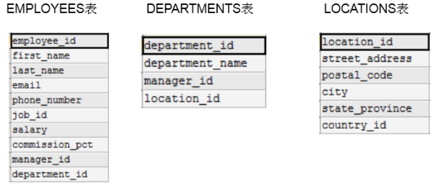
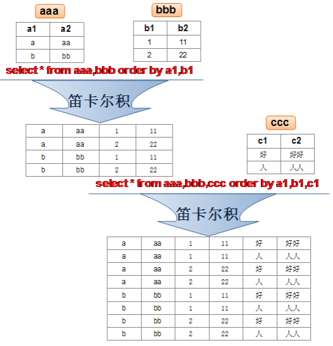
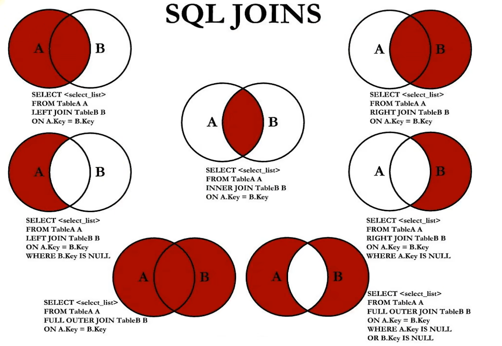

# 内容

- 基本的SELECT
- 运算符
- 排序与分页
- 多表查询
- 单行函数
- 聚合函数
- 子查询


# 数据导入指令source

```sh
mysql> source d:\mysqldb.sql
```


> 准备的数据：atguigudb.sql


# Select语句

## 语法

```sql
SELECT 标识选择哪些列
FROM 标识从哪个表中选择
```


## 列的重名

语法：

- 使用`AS`关键字，别名可以使用双引号（从而可以在别名中包含空格或特殊字符）
- AS关键字可省略，但不推荐


```sql
SELECT last_name AS name, commission_pct comm
FROM employees;
```


## 去除重复行 DISTINCT

```sql
SELECT DISTINCT department_id,salary
FROM employees;
```


注意：

- DISTINCT，是对被查询所有字段的组合、而言的去重


## NULL参与运算

- 所有与NULL进行的运算，结果都为NULL

```sql
SELECT employee_id,salary,commission_pct,
12 * salary * (1 + commission_pct) "annual_sal"
FROM employees;
```


# 运算符

[MySQL数据库教程天花板，mysql安装到mysql高级，强！硬！_哔哩哔哩_bilibili](https://www.bilibili.com/video/BV1iq4y1u7vj?p=18&vd_source=be746efb77e979ca275e4f65f2d8cda3)


## 算术运算符

算术运算符主要用于数学运算，其可以连接运算符前后的两个数值或表达式，对数值或表达式进行加（+）、减（-）、乘（*）、除（/）和取模（%）运算。  



```sql
mysql> SELECT 100, 100 + 0, 100 - 0, 100 + 50, 100 + 50 -30, 100 + 35.5, 100 - 35.5
FROM dual;
   100  100 + 0  100 - 0  100 + 50  100 + 50 -30  100 + 35.5  100 - 35.5  
------  -------  -------  --------  ------------  ----------  ------------
   100      100      100       150           120       135.5          64.5
```

> 非数字类型与数字类型进行数学运算时：
>
> - 先尝试转换为数值；若转换失败则按0算

；

## 比较运算符

比较运算符用来对表达式左边的操作数和右边的操作数进行比较，比较的结果为真则返回1，比较的结果为假则返回0，其他情况则返回NULL。  





## 逻辑运算符




## 位运算符




# 排序

## 排序规则

使用`ORDER BY`字句排序：

- ASC（ascend）：升序
- DESC（descend）：降序


## 单列排序

```sql
SELECT last_name, job_id, department_id, hire_date
FROM employees
ORDER BY hire_date ;
```


## 多列排序

```sql
SELECT last_name, department_id, salary
FROM employees
ORDER BY department_id, salary DESC;
```


# 分页

## 语法

- 使用`LIMIT`关键字：

  ```sql
  LIMIT [位置偏移量,] 行数
  ```


```sql
--前10条记录：
SELECT * FROM 表名 LIMIT 0,10;
或者
SELECT * FROM 表名 LIMIT 10;

--第11至20条记录：
SELECT * FROM 表名 LIMIT 10,10;

--第21至30条记录：
SELECT * FROM 表名 LIMIT 20,10;
```

>分页显式公式：（当前页数-1）*每页条数，每页条数
>
>```sql
>SELECT * FROM table
>LIMIT(PageNo - 1)*PageSize,PageSize;
>```


# 多表查询

- 多表查询，也称为关联查询，指两个或更多个表一起完成查询操作。

- 前提条件：这些一起查询的表之间是有关系的（一对一、一对多），它们之间一定是有关联字段，这个关联字段可能建立了外键，也可能没有建立外键。

  比如：员工表和部门表，这两个表依靠“部门编号”进行关联。  


## 一个案例引发的多表连接

### 案例说明




需求：查询员工所在的部门名：

```sql
SELECT last_name, department_name
FROM employees, departments
WHERE employees.department_id = departments.department_id;
```


### 笛卡尔积（或交叉连接）

- 笛卡尔乘积是一个数学运算。

- 假设我有两个集合 X 和 Y，那么 X 和 Y 的笛卡尔积就是 X 和 Y 的所有可能组合，也就是第一个对象来自于 X，第二个对象来自于 Y 的所有可能。
- 组合的个数即为两个集合中元素个数的乘积数。




- SQL92中，笛卡尔积也称为 交叉连接 ，英文是 CROSS JOIN 。
- 在 SQL99 中也是使用 CROSS JOIN表示交叉连接。

它的作用就是可以把任意表进行连接，即使这两张表不相关。


## 内连接 vs 外连接

- 内连接：

  合并具有同一列的两个以上的表的行, 结果集中不包含一个表与另一个表不匹配的行

- 外连接：

  两个表在连接过程中除了返回满足连接条件的行以外还返回左（或右）表中不满足条件的行 ，这种连接称为左（或右） 外连接。没有匹配的行时, 结果表中相应的列为空(NULL)  

  - 如果是左外连接，则连接条件中左边的表也称为 主表 ，右边的表称为 从表
  - 如果是右外连接，则连接条件中右边的表也称为 主表 ，左边的表称为 从表 


## SQL99实现多表查询

使用JOIN...ON子句创建连接的语法结构：

```sql
SELECT table1.column, table2.column,table3.column
FROM table1
	JOIN table2 ON table1 和 table2 的连接条件
		JOIN table3 ON table2 和 table3 的连接条件
```


语法说明：

- 可以使用 ON 子句指定连接条件。
- ON 子句使语句具有更高的易读性。
- 关键字 `JOIN`、`INNER JOIN`、`CROSS JOIN` 的含义是一样的，都表示**`内连接`**


### SQL99下的内连接

```sql
SELECT 字段列表
FROM A表 INNER JOIN B表
ON 关联条件
WHERE 等其他子句;
```


### SQL99下的外连接

- 左外连接：

  ```sql
  SELECT 字段列表
  FROM A表 LEFT JOIN B表
  ON 关联条件
  WHERE 等其他子句;
  ```

- 右外连接：

  ```sql
  FROM A表 RIGHT JOIN B表
  ON 关联条件
  WHERE 等其他子句;
  ```

  

### 满外连接

- 满外连接的结果 = 左右表匹配的数据 + 左表没有匹配到的数据 + 右表没有匹配到的数据。
- SQL99是支持满外连接的。使用FULL JOIN 或 FULL OUTER JOIN来实现。
- 需要注意的是，MySQL不支持FULL JOIN，但是可以用`LEFT JOIN UNION RIGHT join`代替。


## UNION关键字

- 作用：

  利用UNION关键字，可以给出多条SELECT语句，并将它们的结果组合成单个结果集。合并时，两个表对应的列数和数据类型必须相同，并且相互对应。各个SELECT语句之间使用UNION或UNION ALL关键字分隔。  

- 语法格式：

  ```sql
  SELECT column,... FROM table1
  UNION [ALL]
  SELECT column,... FROM table2
  ```


- UNION操作符：

  UNION 操作符返回两个查询的结果集的并集，**去除重复记录**。

- UNION ALL操作符：

  UNION ALL操作符返回两个查询的结果集的并集。对于两个结果集的重复部分，不去重。

  >注意：执行UNION ALL语句时所需要的资源比UNION语句少。
  >
  >如果明确知道合并数据后的结果数据不存在重复数据，或者不需要去除重复的数据，则尽量使用UNION ALL语句，以提高数据查询的效率。  


例如：查询部门编号>90或邮箱包含a的员工信息：

```sql
#方式1
SELECT * FROM employees WHERE email LIKE '%a%' OR department_id>90;
```

```sql
SELECT * FROM employees WHERE email LIKE '%a%'
UNION
SELECT * FROM employees WHERE department_id>90;
```


## 7种SQL JOINS及其实现



```sql
#中图：内连接 A∩B
SELECT employee_id,last_name,department_name
FROM employees e JOIN departments d
ON e.`department_id` = d.`department_id`;
```

```sql
#左上图：左外连接
SELECT employee_id,last_name,department_name
FROM employees e LEFT JOIN departments d
ON e.`department_id` = d.`department_id`;
```

```sql
#右上图：右外连接
SELECT employee_id,last_name,department_name
FROM employees e RIGHT JOIN departments d
ON e.`department_id` = d.`department_id`;
```

```sql
#左中图：A - A∩B
SELECT employee_id,last_name,department_name
FROM employees e LEFT JOIN departments d
ON e.`department_id` = d.`department_id`
WHERE d.`department_id` IS NULL
```

```sql
#右中图：B-A∩B
SELECT employee_id,last_name,department_name
FROM employees e RIGHT JOIN departments d
ON e.`department_id` = d.`department_id`
WHERE e.`department_id` IS NULL
```

```sql
# 左下图：满外连接
# 左中图 + 右上图 A∪B
SELECT employee_id,last_name,department_name
FROM employees e LEFT JOIN departments d
ON e.`department_id` = d.`department_id`
WHERE d.`department_id` IS NULL
UNION ALL #没有去重操作，效率高
SELECT employee_id,last_name,department_name
FROM employees e RIGHT JOIN departments d
ON e.`department_id` = d.`department_id`;
```

```sql
#右下图
#左中图 + 右中图 A ∪B- A∩B 或者 (A - A∩B) ∪ （B - A∩B）
SELECT employee_id,last_name,department_name
FROM employees e LEFT JOIN departments d
ON e.`department_id` = d.`department_id`
WHERE d.`department_id` IS NULL
UNION ALL
SELECT employee_id,last_name,department_name
FROM employees e RIGHT JOIN departments d
ON e.`department_id` = d.`department_id`
WHERE e.`department_id` IS NULL
```


## SQL99语法新特性

### 自然连接

- NATURAL JOIN 用来表示自然连接。

  可以把自然连接理解为 SQL92 中的等值连接。

  它会帮你自动查询两张连接表中 所有相同的字段 ，然后进行等值连接 。


例如：

- 在SQL92标准中：

  ```sql
  SELECT employee_id,last_name,department_name
  FROM employees e JOIN departments d
  ON e.`department_id` = d.`department_id`
  AND e.`manager_id` = d.`manager_id`;
  ```

- 在 SQL99 中你可以写成：

  ```sql
  SELECT employee_id,last_name,department_name
  FROM employees e NATURAL JOIN departments d;
  ```

  

### USING连接

当我们进行连接的时候，SQL99还支持使用 USING 指定数据表里的 同名字段 进行等值连接。但是只能配合JOIN一起使用。


比如 ：

- SQL92：

  ```sql
  SELECT employee_id,last_name,department_name
  FROM employees e ,departments d
  WHERE e.department_id = d.department_id;
  ```

- 相同结果的SQL99写法：

  ```sql
  SELECT employee_id,last_name,department_name
  FROM employees e JOIN departments d
  USING (department_id);
  ```


## 表连接约束条件总结

表连接的约束条件可以有三种方式：WHERE, ON, USING

- WHERE：适用于所有关联查询

- ON ：只能和JOIN一起使用，只能写关联条件

  > 虽然关联条件可以并到WHERE中和其他条件一起写，但分开写可读性更好

- USING：只能和JOIN一起使用，而且要求两个关联字段在关联表中名称一致，而且只能表示关联字段值相等  

```sql
#关联条件
#把关联条件写在where后面
SELECT last_name,department_name
FROM employees,departments
WHERE employees.department_id = departments.department_id;

#把关联条件写在on后面，只能和JOIN一起使用
SELECT last_name,department_name
FROM employees INNER JOIN departments
ON employees.department_id = departments.department_id;

SELECT last_name,department_name
FROM employees CROSS JOIN departments
ON employees.department_id = departments.department_id;

SELECT last_name,department_name
FROM employees JOIN departments
ON employees.department_id = departments.department_id;

#把关联字段写在using()中，只能和JOIN一起使用
#而且两个表中的关联字段必须名称相同，而且只能表示=
#查询员工姓名与基本工资
SELECT last_name,job_title
FROM employees INNER JOIN jobs USING(job_id);

#n张表关联，需要n-1个关联条件
#查询员工姓名，基本工资，部门名称
SELECT last_name,job_title,department_name FROM employees,departments,jobs
WHERE employees.department_id = departments.department_id
AND employees.job_id = jobs.job_id;

SELECT last_name,job_title,department_name
FROM employees INNER JOIN departments INNER JOIN jobs
ON employees.department_id = departments.department_id
AND employees.job_id = jobs.job_id;
```


# 单行函数

第7章
