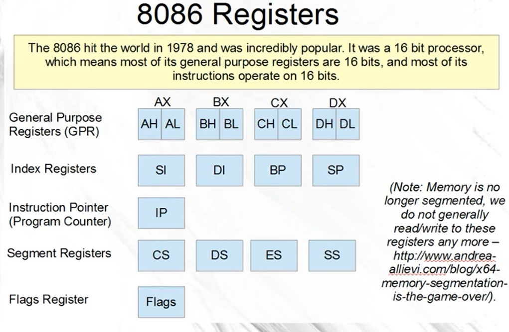

# 8086寄存器

- 寄存器16位宽

# 寄存器使用的潜在规则

- 通用寄存器：

  - AX、DX用于除法。

  - 在调用C++的function之前，把BX push出来，之后再pop回去。

  - CX一般用作counter。

- Index寄存器：

  - SI、DI可以用在通用，进行数学计算。

    > SI: source index; DI: destination index.

  - ==BP、SP不能用作通用==：

    > BP: base pointer，SP: stack pointer.

    关于SS、BP、SP的用法：[SS、SP、BP寄存器 - dzqabc - 博客园 (cnblogs.com)](https://www.cnblogs.com/dongzhiquan/p/4960602.html#:~:text=SP%3A堆栈寄存器SP (stack pointer)存放栈的偏移地址%3B,BP%3A 基数指针寄存器BP (base pointer)是一个寄存器，它的用途有点特殊，是和堆栈指针SP联合使用的，作为SP校准使用的，只有在寻找堆栈里的数据和使用个别的寻址方式时候才能用到)

- Segment寄存器：

  > 操作系统一般利用他们进行：Paging information、thread information

  