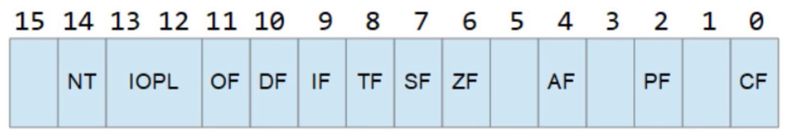

- CF(CY In VS): unsigned overflow
- PF(PE In Vs)：奇偶校验位。0表示odd奇数。

- AF(AC In VS)：辅助进位。

- ==ZF(ZR In Vs): 零标志位==。

  - 若先前结果为0，则ZR=1.
  - 否则，ZR=0.

  

- SF(PL In Vs)：符号标志位。

  - 1 if last result was Negative.
  - 0 if last result was Positive.

- DF(UP in VS)
  - 0 Reading Strings forwards
  - 1 Reading Strings backwards

- OF(OV In vs)：Sign overflow.

