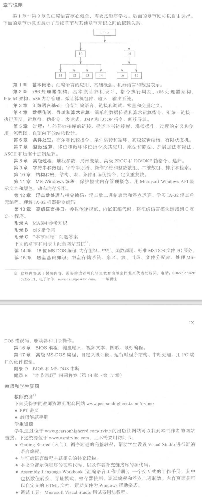

# 说明

- 下载资源：[Assembly Language for x86 Processors (asmirvine.com)](http://www.asmirvine.com/)

# MASM

MASM能创建哪些类型的程序：

- 32位保护模式：

  运行于32位和64位系统。

- 64位模式：

  运行于64位系统。

- 16位实地址模式：

  运行于32位系统和嵌入式系统。